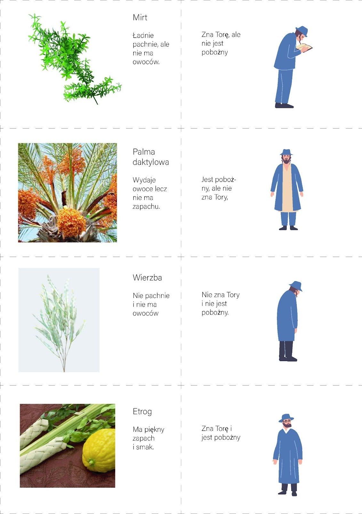

Spotkanie 2. - “Niech przyjdzie do Mnie”
****************************************

Wprowadzenie dla animatora
==========================

To spotkanie opiera się na dwóch ważnych elementach związanych ze świętowaniem Sukkotu - tradycji zapraszania gości do namiotu, oraz noszeniem wody z~sadzawki Siloe. Chcemy potraktować te zwyczaje jako punkt wyjścia do refleksji nad naszą własną wiarą i~jej trzema aspektami - gościnnością (wiara zapraszająca), trudem (wiara wymagająca) oraz wolnością (wiara uwalniająca). **W trakcie spotkania będziemy korzystać z~materiałów znajdujących się w~notatniku**, warto więc przed spotkaniem zadbać o~to, by uczestnicy mieli je ze sobą. Nie wszystkie pytania muszą paść, zależy nam jednak na tym, żeby wszystkie trzy aspekty wiary zostały poruszone. Nie proponujemy żadnej konkretnej modlitwy na początek i~koniec spotkania, pozostawiamy dowolność w~tej kwestii. Wierzymy, że każdy animator dopasuje treści tego spotkania do swojej grupy tak, by było ono jak najbardziej owocne ;)

Wprowadzenie
============

Jesteśmy po doświadczeniu budowania wspólnie namiotu i~rozmowie online z~gośćmi specjalnymi. Podzielmy się krótko naszymi wrażeniami:

- Czym było dla mnie budowanie namiotu? Co zabieram z~tego dla siebie?
- Co najbardziej zapamiętałem z~rozmowy prowadzonej z~naszym gościem?
- Gdybym mógł zaprosić jakąkolwiek osobę do naszego namiotu - kto by to był? Dlaczego akurat ta osoba?

Przyjrzyjmy się teraz jeszcze na chwilę bliżej samej tradycji zapraszania gości w~trakcie Sukkot.

Wiara zapraszająca
==================

W tradycji żydowskiej wierzono, że każdego dnia święta  Sukkot odwiedzają szałas duchowi przodkowie narodu żydowskiego, znani jako Ushpizin (z aramejskiego: „goście”).

Abraham na przykład opuścił dom swojego ojca i~udał się do obcej krainy na rozkaz Boga. Józef został sprzedany w~niewolę do Egiptu. A~Mojżesz uciekł z~Egiptu do Midianu, gdzie spotkał Boga w~płonącym krzewie. Tak jak Ushpizin porzucił to, co było znane i~wygodne, w~służbie nakazu Boga, tak my w~Sukkot opuszczamy bezpieczeństwo naszych domów na rzecz nietrwałego schronienia na polecenie Boga. Ta tradycja uczy nas, że prawdziwa wiara jest inkluzywna, otwarta na każdego. Święto Sukkot jest tak zaprojektowane, żeby każdy odnalazł w~nim siebie.

Wiara nie jest zamkniętym kręgiem przeznaczonym tylko dla wybranych – jest otwartym domem, w~którym każdy znajdzie miejsce. To nie my jesteśmy gospodarzami wiary, lecz ona nas przyjmuje, zaprasza i~daje nam przestrzeń do wzrostu. Niezależnie od naszej historii, słabości, wątpliwości czy upadków, wiara przyjmuje nas takimi, jakimi jesteśmy.

- Jak przyjmuje wiarę? Jak w~przestrzeni mojego życia odkrywam jej gościnność?
- W~jaki sposób mogę uczyć się  przyjmowania wiary jako daru, a~nie jako własności?

Święto Sukkot dla Żydów jest świętem radosnym. Świętowanie, radość z~prawdy objawionej. Źródło wiary samo w~sobie ma stanowić zaproszenie dla każdego, kto tej wiary wciąż poszukuje:

    Będziesz obchodził Święto Namiotów przez siedem dni po zebraniu plonów z~twego klepiska i~tłoczni.  W~to święto będziesz się radował ty, syn twój i~córka, sługa twój i~niewolnica, a~także lewita, przybysz, sierota i~wdowa, którzy są w~twoich bramach. Przez siedem dni będziesz świętować ku czci Pana, Boga swego, w~miejscu, które sobie obierze Pan, za to, że ci błogosławi Pan, Bóg twój, we wszystkich twoich zbiorach, w~każdej pracy twych rąk, abyś był pełen radości.

    -- Pwt 16,13-15

- Co jest dla mnie największym wyzwaniem, w~takiej formie zapraszania ludzi, którzy wciąż poszukują prawdy?
- Co mogę zrobić, aby zamienić moje przeżywanie wiary w~Święto Sukkot?

Jednym z~elementów święta Sukkot było “zgromadzenie” symbolicznych rekwizytów: owocu etrog, gałązki palmy daktylowej, mitru oraz wierzby:

    Tak więc piętnastego dnia siódmego miesiąca, kiedy zbierzecie plony ziemi, będziecie obchodzić święto Pana przez siedem dni. Pierwszego dnia jest uroczysty szabat. Ósmego dnia także uroczysty szabat. **Weźcie sobie pierwszego dnia owoce pięknych drzew, liście palmowe, gałązki gęstych drzew i~wierzb nadrzecznych**. Będziecie się weselić przed Panem, Bogiem waszym, przez siedem dni

    -- Kpł 23,39-40

Animator pokazuje przygotowane ilustracje rekwizytów podpisane ich cechami oraz ilustracje cech ludzi (np. Jest pobożny, ale nie zna Tory). Zadaniem uczestników jest dopasowanie rekwizytu do cechy opisującej człowieka.

Obrzęd zbierania czterech rekwizytów Sukkot uświadamia nam, że każdy z~nas, mimo unikalnych cech, doświadczeń i~tradycji, jest nieodłącznym elementem większej wspólnoty. Przypomina to, że różnorodność naszych przekonań i~sposobów życia wzbogaca całość, a~każdy z~nas wnosi istotny wkład w~budowanie harmonijnego i~spójnego świata.

- Jak odbieram wiarę, która przyjmuje nas wierzących jako swoich gości – zarówno tych głęboko oddanych, tych z~tradycji, wykształconych lecz niepraktykujących, jak i~tych, którzy czują się oddaleni od Boga?

Świętowanie ważnych i~radosnych momentów w~naszym życiu często sprawia, że chcemy je celebrować razem z~jak największą ilością osób. Dobrym tego przykładem może być wesele, na które najczęściej zapraszamy rodzinę bliższą i~dalszą oraz przyjaciół i~znajomych z~różnych środowisk. Wszyscy łączą się w~tym dniu razem z~młodą parą we wspólnej radości. Jak bardzo taka perspektywa w~wierze może zmienić patrzenie choćby na samą Eucharystię, która zdecydowanie bardziej niż zbiorem jakichś rytuałów znanych tylko dla wtajemniczonych, jest przede wszystkim ucztą, która gromadzi nas przy jednym stole.

Wiara wymagająca
================

.. note:: Ten punkt bazuje na rozdziale 9 Ewangelii Jana, który opowiada w~całości jedną historię. W~trakcie samego spotkania czytamy jedynie najbardziej kluczowe fragmenty, jednak zachęcamy prowadzących do przeczytania całości w~ramach przygotowania, pozwoli to na szersze złapanie kontekstu

Ważnym elementem przeżywania święta Sukkot jest również obrzęd wydobywania wody z~sadzawki Siloe. Kapłan przenosi napełniony dzban do świątyni, by tam polać ołtarz, prosząc przy tym o~deszcz i~urodzaj - obrzęd ten stawał się nie tylko prośbą o~otwarcie bram niebios i~zesłanie obfitych deszczów pory zimowej, ale z~czasem, kiedy wzmagały pragnienia zmiany sytuacji, gdy duchowy głód rósł wśród dzieci Izraela, stawał się wołaniem o~wylanie zdrojów zbawienia, Rucha ha-Kodesz, na spieczoną ziemię ludzkich serc, spraw i~losów. Droga jaką pokonuje kapłan nie jest łatwa i~przyjemna - trasa prowadziła pod górę i~nie była zbyt krótka.

Przyjrzyjmy się teraz historii z~Ewangelii, w~której pewna osoba miała do przejścia tę samą drogę:

    Gdy Jezus szedł, spostrzegł człowieka niewidomego od urodzenia. Uczniowie zapytali Go: „Rabbi, kto popełnił grzech, że człowiek ten urodził się niewidomy: on sam czy jego rodzice?”. Jezus im odpowiedział: „Ani on nie zgrzeszył, ani jego rodzice, lecz stało się tak, aby w~nim ukazały się dzieła Boże. Dopóki trwa dzień, konieczne jest, abyśmy spełniali dzieła Tego, który Mnie posłał. Nadchodzi bowiem noc i~wtedy nikt nie będzie mógł działać. Jak długo pozostaję na świecie, jestem światłością świata”. Po tych słowach Jezus splunął na ziemię, z~tego zrobił trochę błota, nałożył je na oczy niewidomego i~polecił mu: „Idź i~obmyj się w~sadzawce Siloe” – co znaczy: Posłany. On więc poszedł, obmył się i~wrócił, widząc

    -- J 9,1-7

Uzdrowienie osoby niewidomej od urodzenia jest uznawane przez Żydów za jeden z~najbardziej niezwykłych cudów, który wymaga szczególnej interwencji samego Boga. Jezus najpierw tworzy glinę i~nakłada ją na oczy chorego, następnie nakazuje mu obmyć się w~Sadzawce Siloe, symbolizującej Ducha Świętego, którego posłanie zapowiada. Jezus nie tyle dokonuje uzdrowienia, co stwarza tego człowieka na nowo, tak jak Bóg ulepił Adama z~prochu ziemi i~tchnął w~niego tchnienie życia. Uleczenie nie dokonało się od razu, niewidomy musiał najpierw pokonać drogę do sadzawki, by następnie wrócić odmienionym. Najpierw musiał doświadczyć słabości i~całkowitej zależności od innych, by móc przejrzeć. Wiara wymaga od nas konfrontacji z~własną grzesznością i~jest drogą do przejścia, która chociaż ekscytująca i~radosna, potrafi również być trudna i~wymagająca.

- W~jaki sposób ja opisałbym swój duchowy rozwój? Co było dla mnie najtrudniejsze na tej drodze?
- W~jakich przestrzeniach czuję się najbardziej zależny od innych?
- Co we mnie musi zostać stworzone na nowo?

Historia tego niewidomego opisana w~Ewangelii nie kończy się na samym uzdrowieniu. Ze względu na to, jak wielką wagę miało i~w to w~dodatku dokonane w~szabat,  wzbudza spore zainteresowanie wśród faryzeuszów, którzy wzywają tego człowieka oraz jego rodziców na przesłuchanie. Chcą podważyć wiarygodność i~zakwestionować zdolność Jezusa do dokonania tak wielkiego cudu, jednak przesłuchiwany oświadcza, że jego uzdrowiciel musi pochodzić od Boga, bo inaczej nie mógłby przywrócić mu wzroku. Skutkuje to ostatecznie wyrzuceniem go z~synagogi, a~co za tym idzie, wykluczeniem ze społeczności. Wcześniej wyobcowany ze względu na niepełnosprawność, teraz odrzucony ze względu na wiarę w~Jezusa, spotyka się z~nim ponownie - przeczytajmy:

    Jezus dowiedział się, że go wyrzucono. Gdy więc go spotkał, zapytał: „Czy wierzysz w~Syna Człowieczego?”.On zaś powiedział: „A kto to jest, Panie, abym w~Niego uwierzył?”. Wówczas Jezus oświadczył: „To jest Ten, którego zobaczyłeś i~który z~tobą rozmawia”. Na co on rzekł: „Wierzę, Panie”, po czym oddał Mu głęboki pokłon. A~Jezus powiedział: „Przyszedłem na ten świat, aby sądzić: Ci, którzy nie widzą, odzyskają wzrok, ci zaś, którzy widzą, staną się ślepcami”.

    -- J 9,35-39

Jest to jeden z~niewielu przypadków opisanych w~Ewangelii, kiedy Jezus ponownie spotyka osobę, którą uzdrowił. Syn Człowieczy nie jest już dla tego człowieka nieosiągalnym, anonimowym Mesjaszem, ale kimś, kogo poznał i~doświadczył Jego działania.Teraz, kiedy przejrzał, ma w~sobie gotowość, żeby zaryzykować i~postawić wszystko na Tego, który go uzdrowił.

- Kiedy Jezus stał się dla mnie tym, którego zobaczyłem?
- W~jakich kwestiach najtrudniej jest mi zaufać Bogu?
- Co dla mnie oznacza wierzyć?

Obrzęd noszenia wody z~sadzawki Siloe do świątyni jest powtarzany przez siedem dni z~rzędu. Mimo trudu jaki się z~nim wiąże, ma on niezwykle radosny charakter - rabini patrząc wstecz, powiadali, że kto nie widział ceremonii wydobywania wody, ten nie widział w~swoim życiu prawdziwej radości. Wiara wymaga ciągłego nawracania się, nieustannej pracy nad sobą i~jednocześnie całkowitego zawierzenia Bogu oraz świadomości, jak bardzo jesteśmy od Niego zależni. Jednak perspektywa ta ma w~sobie również coś wyzwalającego.

Wiara uwalniająca
=================

Szczególnym momentem podczas obchodów Sukkot był dzień siódmy - wielkie uwielbienie - Hosanna Raba, przeżywana w~dużej ekscytacji, będąca jednocześnie modlitwą o~zbawienie od grzechów i~przebaczenie. W~Ewangelii Jana mamy opisane wydarzenie, które odbywało się właśnie wtedy:

    W~ostatnim zaś, najbardziej uroczystym dniu święta, Jezus stojąc zawołał donośnym głosem: «Jeśli ktoś jest spragniony, a~wierzy we Mnie - niech przyjdzie do Mnie i~pije! Jak rzekło Pismo: Strumienie wody żywej popłyną z~jego wnętrza». A~powiedział to o~Duchu, którego mieli otrzymać wierzący w~Niego; Duch bowiem jeszcze nie był <dany>*, ponieważ Jezus nie został jeszcze uwielbiony.

    -- J 7,37-39

- Jak wiara w~Chrystusa uwalnia według tego fragmentu?

Jezus nie krytykuje samej praktyki, ale wskazuje, że tradycyjny rytuał jest tylko zapowiedzią tego, co ma nadejść w~pełni w~Jego osobie i~przez dar Ducha Świętego. Przez metaforę „wody żywej” Jezus pokazuje, że prawdziwe błogosławieństwo nie pochodzi z~zewnętrznych rytuałów, lecz z~głębokiej relacji z~Bogiem, która przemienia życie.

Ta reinterpretacja podkreśla, że wiara, która uwalnia, nie polega jedynie na przestrzeganiu rytuałów, lecz na otwarciu serca na działanie Ducha Świętego. To otwarcie przynosi wewnętrzną przemianę i~odnowienie, które przekraczają to, co dają tradycyjne obrzędy.

- Jakie dostrzegasz różnice między formalnym przestrzeganiem rytuałów a~autentycznym doświadczeniem przemiany serca? Jakie są Twoje refleksje na ten temat?
- W~jaki sposób dbając o~zachowywanie rytuałów mogę doświadczyć żywej wiary?
- Jak interpretujesz pojęcie „wody żywej” w~swoim życiu?

Podsumowanie i~zastosowanie
===========================

Przechodząc poprzez tradycje żydowskie spotkaliśmy się z~trzema aspektami naszej wiary: gościnnym, wymagającym oraz uwalniającym. Wiara jest darem, który otrzymaliśmy. Każdy z~nas przeżywa swoją wiarę w~inny sposób. Przygotowywując się do zbliżającej się konferencji zadajmy sobie pytania:

- Za który z~aspektów jestem Bogu najbardziej wdzięczny?
- Który aspekt mojej wiary wymaga ode mnie szczególnej pracy?
