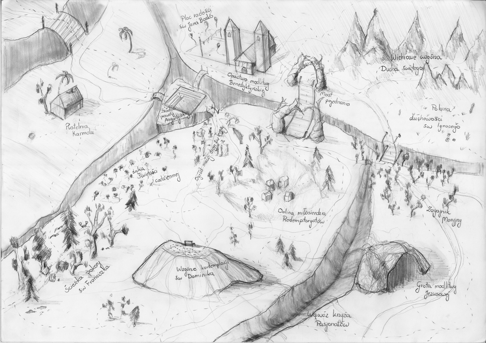

Spotkanie 3. - Pesach
*********************

Wprowadzenie dla animatora
==========================

Spotkanie dotyczy **obecności**. Główny temat podzielony jest na trzy części: pielgrzymowanie, rytuał przejścia i~obecność. Chcemy rozpocząć od tymczasowości i~pielgrzymowania, które doświadczyliśmy budując namioty. Dalej, każde zakończenie etapu i~rozpoczęcie nowego związane jest z~rytuałem przejścia. Potocznie mówimy “coś się kończy, a~coś zaczyna”. Chcemy o~tym porozmawiać. Na koniec chcemy uczestników osadzić w~sederze i~wskazać gdzie są obecnie.

Wprowadzenie
============

Zbliżamy się do punktu szczytowego rekolekcji, jakim będzie Seder przeżyty w~połączeniu z~Eucharystią. Rozpoczęliśmy rekolekcje od zgłębiania święta Sukkot, a~potem przed obiadem posłuchaliśmy konferencji o~Pesach. Nasze spotkanie będzie wspólnym zgłębieniem tego tematu.

- Co zabrałem dla siebie z~konferencji?
- Co do tej pory odkryłem na rekolekcjach?

Pielgrzymowanie
===============

Obecnie trudno nam myśleć o~tymczasowości w~kontekście zamieszkania. Nasza kultura i~obyczaje, a~także klimat warunkują, że nasze budynki są zbudowane na mocnych fundamentach z~ trwałych materiałów. Tworzymy miasta i~aglomeracje z~betonu, stali i~szkła.

Doświadczenie Sukkot - Święta Szałasów - pokazuje nam, że nie zawsze tak musi być. Namiot/szałas, w~swej konstrukcji, nie jest zbudowany z~trwałych materiałów. Doświadczyliśmy tego sami budując swój namiot z~drewna i~tkanin. Jego konstytucja przypomina Żydom  a~teraz i~nam o~tymczasowości.

.. note:: Niektórzy z~nas mieszkają na Śląsku - miejscu gdzie świadomość ulotności życia była obecna na co dzień. Większość społeczeństwa doskonale wiedziała, że dzisiejszy zjazd kogoś z~rodziny może być jego ostatnim. Podobne doświadczenie mają wszelcy ratownicy. To doświadczenie niegdyś powszechne obecnie staje się odleglejsze.

- Jakie są moje pierwsze skojarzenia z~tymczasowością?

Tymczasowość nie musi odnosić się do bylejakości czy produktu o~“gorszych” parametrach, ale może mówić o~drodze, etapach, możliwości szybkiej zmiany miejsca. Z~perspektywy wiary taka tymczasowość jest nam bliska - to **pielgrzymowanie**.

Przeczytajmy:

    Gdy Jezus zobaczył tłum dokoła siebie, kazał odpłynąć na drugą stronę. Wtem przystąpił pewien uczony w~Piśmie i~rzekł do Niego: «Nauczycielu, pójdę za Tobą, dokądkolwiek się udasz». Jezus mu odpowiedział: «Lisy mają nory i~ptaki powietrzne - gniazda, lecz Syn Człowieczy nie ma miejsca, gdzie by głowę mógł oprzeć». Ktoś inny spośród uczniów rzekł do Niego: «Panie, pozwól mi najpierw pójść i~pogrzebać mojego ojca!». Lecz Jezus mu odpowiedział: «Pójdź za Mną, a~zostaw umarłym grzebanie ich umarłych!»

    -- Mt 8,18-20

- Jak interpretuję fragment “Jezus mu odpowiedział: «Lisy mają nory i~ptaki powietrzne - gniazda, lecz Syn Człowieczy nie ma miejsca, gdzie by głowę mógł oprzeć».”

Pielgrzymowanie to cecha osoby wierzącej i~dotyczy zarówno sfery fizycznej, społecznej jak i~duchowej. Przyjmujemy zdanie o~byciu pielgrzymami zazwyczaj bez oporów. Często jest jednak tak, że chcemy pielgrzymować, czyli być w~ruchu, ale równocześnie chcielibyśmy, aby nic się nie zmieniało.

.. note:: Animatorze warto rozważyć czy nie masz tutaj do powiedzenia krótkiego przykładu ze swojego życia.

*Animator wyciąga karty postaci. Zapoznajemy się z~każdą postacią, po czym dla każdej z~nich zadajemy pytanie, nanosząc zmiany bezpośrednio na kartę za pomocą mazaka.*

.. list-table::
   :widths: 40 60
   :header-rows: 0

   * - .. figure:: persona1.png

       Jan Nowak
       
       **Wiek**: 15 lat
       **Motto**:„dużo rzeczy mnie ciekawi…”
       **Zainteresowania**: trochę piłka nożna i~siatkówka
       **Parafia**: od zeszłego roku lektor

     - ☑  Kanał modlitwa głębi

       ☐  „Po Słowie” kanał dla małżeństw

       ☐  Podróże ze Świętym Pawłem – listy jako drogowskaz

       ☐  Karmel i~Ty

       ☑   Opowiadania biblijne z~owieczką Anną

       ☐  Duchowość benedyktyńska dla świeckich

       ☑  Bierzmowani – kanał dominikański dla młodzieży

       ☐  Modlitwa ANIOŁ PAŃSKI live

       ☐  Słowo Boże na dziś

       ☐  Sw Szarbel_offical

.. list-table::
   :widths: 40 60
   :header-rows: 0

   * - .. figure:: persona2.png

       Elżbieta Wiśniewska

       **Wiek**: 64 lat
       **Motto**:„Jestem na emeryturze, babcia na pełen etat”
       **Zainteresowania**: ogródek
       **Parafia**: Apostolstwo Margaretka, Róża różańcowa,

     - ☑  Kanał modlitwa głębi

       ☑  „Po Słowie” kanał dla małżeństw

       ☑  Podróże ze Świętym Pawłem – listy jako drogowskaz

       ☑  Karmel i~Ty

       ☑   Opowiadania biblijne z~owieczką Anną

       ☑  Duchowość benedyktyńska dla świeckich

       ☑  Bierzmowani – kanał dominikański dla młodzieży

       ☑  Modlitwa ANIOŁ PAŃSKI live

       ☑  Słowo Boże na dziś

       ☑  Sw Szarbel_offical

.. list-table::
   :widths: 40 60
   :header-rows: 0

   * - .. figure:: persona3.png

       Mateusz Nowakowski

       **Wiek**: 31 lat
       **Motto**:„Korporacja to moja bajka”
       **Zainteresowania**: anime i~manga, planszówkowe RPG, filozoficzne nurty wschodnie
       **Parafia**: Tydzień temu pierwszy raz sam z~siebie od lat byłem w~spowiedzi

     - ☐  Kanał modlitwa głębi

       ☐  „Po Słowie” kanał dla małżeństw

       ☐  Podróże ze Świętym Pawłem – listy jako drogowskaz

       ☐  Karmel i~Ty

       ☐  Opowiadania biblijne z~owieczką Anną

       ☐  Duchowość benedyktyńska dla świeckich

       ☐  Bierzmowani – kanał dominikański dla młodzieży

       ☐  Modlitwa ANIOŁ PAŃSKI live

       ☐  Słowo Boże na dziś

       ☐  Sw Szarbel_offical

.. list-table::
   :widths: 40 60
   :header-rows: 0

   * - .. figure:: persona4.png

       Leon Jeziorański

       **Wiek**: 45 lat
       **Motto**:„Pracuje dla rodziny, mam żonę i~dwójkę dzieci”
       **Zainteresowania**: sportowe samochody
       **Parafia**: nadzwyczajny szafarz Komunii Św. od 10 lat

     - ☑  Kanał modlitwa głębi

       ☑  „Po Słowie” kanał dla małżeństw

       ☐  Podróże ze Świętym Pawłem – listy jako drogowskaz

       ☐  Karmel i~Ty

       ☐  Opowiadania biblijne z~owieczką Anną

       ☐  Duchowość benedyktyńska dla świeckich

       ☑  Bierzmowani – kanał dominikański dla młodzieży

       ☐  Modlitwa ANIOŁ PAŃSKI live

       ☑  Słowo Boże na dziś

       ☐  Sw Szarbel_offical

.. note:: To ćwiczenie zakłada uproszczenie złożoności dróg człowieka. Być może warto o~tym wspomnieć grupie jeśli animator uznaje, że nie wszyscy mogą to zrozumieć i~będzie obawa przed “zaszufladkowaniem” ludzi. Osoby w~ćwiczeniu są wymyślone.

- Gdyby ta osoba zapytała Cię jako mentora, to jakie zmiany subskrypcji doradzilibyście tej osobie? (Ważne: chcemy doradzić bezpośrednio danej osobie. Nie bierzemy pod uwagę innych członków rodziny)

Subskrypcje to ładny współczesny obraz drogi (choć często anty-drogi, bo subskrybujemy wiele, ale trudniej odsubskrybować). Może czas porzucić którąś z~Twoich subskrypcji/namiotów aby pójść dalej?… W~którym namiocie zasiedziałeś się za długo?…

- Co przychodzi Ci łatwiej w~życiu duchowym: wejście w~coś czy wyjście?
- Kiedy ostatni raz przejrzałeś swoje subskrypcje (dosłownie i~w przenośni)?
- Z~czego ostatnio zrezygnowałeś/aś w~życiu duchowym?
- Jak się z~tym czułeś/aś?

Pascha Jezusa Chrystusa to centralny moment naszej wiary. Naśladowanie Go nie może pomijać tego aspektu - musimy być “przechodzącymi”. Musi to być nam tak bliskie, aby nas określało/definiowało. Jako chrześcijanie stajemy się za życia Homo Paschalis.

Rytuał przejścia
================

Patrząc na osoby, którym zaproponowaliśmy zakończenie subskrypcji lub dodanie nowej, poprzez to działanie, zakończyli oni pewien etap w~ich życiu. Teraz za naszą sugestią będą mieli dostęp do innych treści. Odtąd rozpoczął się kolejny etap w~ich aktywności na YouTube, a~my byliśmy uczestnikami rytuału przejścia, w~którym samodzielnie zmodyfikowali listę kanałów, które subskrybują. Jest to pewnego rodzaju przejście - nowy etap.

W rdzennych plemionach pojęcie “rytuał przejścia” związany jest bardzo mocno z~etapowością, czyli z~uroczystym zakończeniem pewnego etapu i~rozpoczęciem nowego. W~naszej kulturze częściej korzystamy z~terminu “ceremonia”. Nie inaczej było z~Jezusem.

Przeczytajmy:

    Trzeciego dnia odbywało się wesele w~Kanie Galilejskiej i~była tam Matka Jezusa. Zaproszono na to wesele także Jezusa i~Jego uczniów. A~kiedy zabrakło wina, Matka Jezusa rzekła do Niego: «Nie mają wina». Jezus Jej odpowiedział: «Czyż to moja lub Twoja sprawa, Niewiasto? [Czy] jeszcze nie nadeszła godzina moja?» Wtedy Matka Jego powiedziała do sług: «Zróbcie wszystko, cokolwiek wam powie». Stało zaś tam sześć stągwi kamiennych przeznaczonych do żydowskich oczyszczeń, z~których każda mogła pomieścić dwie lub trzy miary. Jezus rzekł do sług: «Napełnijcie stągwie wodą». i~napełnili je aż po brzegi. Potem powiedział do nich: «Zaczerpnijcie teraz i~zanieście staroście weselnemu». Ci więc zanieśli. Gdy zaś starosta weselny skosztował wody, która stała się winem – a~nie wiedział, skąd ono pochodzi, ale słudzy, którzy czerpali wodę, wiedzieli – przywołał pana młodego i~powiedział do niego: «Każdy człowiek stawia najpierw dobre wino, a~gdy się napiją, wówczas gorsze. Ty zachowałeś dobre wino aż do tej pory». Taki to początek znaków uczynił Jezus w~Kanie Galilejskiej. Objawił swoją chwałę i~uwierzyli w~Niego Jego uczniowie.

    -- J 2,1-11

Jezus wprost nawiązuje do “godziny”, która jeszcze nie nadeszła - momentu wejścia na ścieżkę bycia rozpoznanym jako czyniący cuda, a~co za tym idzie, również gromadzący wokół siebie tłumy i~nauczający.

- Patrząc na grupę: Jakie etapy drogi życiowej prawdopodobnie mamy wspólne w~naszej grupie?

Ceremonie to nie jest dla nas czysta teoria. Doświadczamy ich. Jakie nasze ceremonie przychodzą nam do głowy jako pierwsze gdy o~tym myślimy? Podzielimy się tym.

- Jakie myśli towarzyszyły temu okresowi i~tej decyzji?

Jednak to nie wszystko. Stąd pytanie, na które odpowiedzmy sobie sami.

- Czy jest taki obrzęd/ceremonia, którą wykonuję, gdy jestem sam?

Pomysł ceremonii bez “widowni” na pierwszy rzut oka wydaje się nieintuicyjny - większość kanonicznych ceremonii to akt publiczny. Dlatego spróbujmy to pogłębić :

- Jaka to ceremonia? Jaki jest jej cel? Czy ma ona charakter religijny? Czy zbliża mnie do Boga, a~może ma tylko ludzki charakter i~sprawia, że czuję się lepiej?

Aby podsumować tę część i~wskazać, że oba zwyczaje są potrzebne przeczytajmy fragmenty:

    Przechodząc obok Jeziora Galilejskiego, ujrzał Szymona i~brata Szymonowego, Andrzeja, jak zarzucali sieć w~jezioro; byli bowiem rybakami. Jezus rzekł do nich: «Pójdźcie za Mną, a~sprawię, że się staniecie rybakami ludzi». I~natychmiast zostawili sieci i~poszli za Nim. Idąc dalej, ujrzał Jakuba, syna Zebedeusza, i~brata jego Jana, którzy też byli w~łodzi i~naprawiali sieci. Zaraz ich powołał, a~oni zostawili ojca swego, Zebedeusza, razem z~najemnikami w~łodzi i~poszli za Nim.

    -- Mk 1,16-20

oraz:

    Potem wyszedł na górę i~przywołał do siebie tych, których sam chciał, a~oni przyszli do Niego. I~ustanowił Dwunastu, aby Mu towarzyszyli, by mógł wysyłać ich na głoszenie nauki

    -- Mk 3,13-14

Przedstawione przykłady i~opis sceny biblijnej ukazują ceremonie jako zewnętrzny znak, akcentowany dla wspólnoty. Jednak dojrzały chrześcijanin nie korzysta tylko z~tego sposobu. Poprzez wykonywanie indywidualnych obrzędów/znaków i~gestów sam pobudza swoje serce. Obrzęd ceremonii zwraca nasz umysł/serce ku Bogu, a~to jest istotą.

.. note:: Gdyby konieczne było opuszczenie wybranej części poniższy fragment można pominąć.. Ten element ma charakter informacyjny (ułatwia zrozumienie części sederu) a~nie dzieleniowy

Rytuał przejścia będzie towarzyszył nam podczas uroczystej kolacji sederowej.
Z wielu obrzędów i~rytuałów chcielibyśmy wskazać na 4 kielichy, które będziemy wznosić.

Pierwszy kielich – Kiddusz
    | uroczyste błogosławieństwo nad świętem
    | „Wyprowadzę was” – odnosi się do wyjścia Izraelitów

Drugi kielich – Maggid
    | wypijany po opowiedzeniu historii wyjścia z~Egiptu.
    | „Uwolnię was” – symbolizuje wybawienie od niewolniczej pracy.

Trzeci kielich – Birkat ha-Mazon
    | po zakończeniu posiłku, przy modlitwie dziękczynnej.
    | „Wybawię was” – wskazuje na cudowne ocalenie narodu żydowskiego.

Czwarty kielich – Hallel
    | kończący seder, towarzyszą mu hymny i~modlitwy dziękczynne.
    | „Wezmę was” – podkreśla zawarcie przymierza między Bogiem a~Izraelem.

Rytuały przejścia pozwolą nam na nadanie właściwego akcentu i~**trwanie w~obecności - tu i~teraz.**

Obecność
========

Będziemy dzisiaj przeżywać pamiątkę Paschy. Dosłowne tłumaczenie to “przejść nad”. Sporo o~“przechodzeniu” już porozmawialiśmy. Żydzi jednak mają wspaniałą intuicję - święto “przechodzenia nad” celebrują…. siedząc przy stole - można by powiedzieć “bardzo statycznie” jak na “przechodzenie”. To nie brak spójności lub wygoda!

Etapowość nie jest “przykrą koniecznością”. Świadome wybranie, gdzie się jest teraz umożliwia nam poświęcenie temu swojego serca, czasu, umysłu. Możemy być obecni w~naszym przechodzeniu. Tym jest stół sederowy.

- Co porusza we mnie świadomość, że wiara jest bardzo konkretna, a~nie symboliczna: obok są bracia i~siostry, naprawdę jemy posiłek, czasami wino rozlewa się na obrus, z~macy lecą cząstki na talerz, a~chrzan wyciska łzy?
- W~jaki sposób możemy być lepiej obecni przy naszych stołach?

Sercem jesteśmy zbyt często gdzieś indziej niż jesteśmy ciałem. Konkretność stołu, jako miejsce przeżywania wiary czyni z~niego “szkołę nie-uciekania”. Miejsce, z~którego żadna część z~nas nie chce uciec w~inne, nazywa się “duchowym domem”.

.. note:: Animator rozdaje pionki małych domów/namiotów, a~następnie wyciąga na stół mapę. I~daje chwilę na zapoznanie się z~mapą

Przygotowaliśmy dla Was mapę krainy duchowości. Nie mamy aspiracji do uchwycenia tutaj wszystkich możliwych subtelności duchowości człowieka. Myślimy jednak, że część z~nas będzie w~stanie się już w~niej odnaleźć.

Zapytajmy:

- Gdzie obecnie jest “miejsce Twojego zamieszkiwania”? Postaw tam swój namiot

.. note:: Każde miejsce na mapie jest dobre - nie tylko “miejsca mocne”, które są podpisane.

*Gdy wszyscy wykonali ćwiczenia.*

- Jak się tu czujesz? Jak długo tu jesteś?

Jeżeli jesteśmy ludźmi pielgrzymującymi to sprawdźmy, czy od zawsze zamieszkujemy w~tym miejscu, czy kiedyś było inaczej.

- W~jakich miejscach kiedyś odnalazłeś/aś duchowy dom? Postaw tam swój namiot.

*Gdy wszyscy wykonali ćwiczenia.*

- Co Ci dało wykonanie tego ćwiczenia?
- Co widzisz patrząc na mapę?

Popatrzmy teraz na to, gdzie niegdyś mieliśmy swoje duchowe schronienia i~na to, gdzie teraz zamieszkujemy. Popatrzmy gdzie pozostali rozmieścili swoje domki/namioty. Ta droga i~różnorodność jest **darem wspólnoty**. Mając w~sobie wdzięczność za to i~biorąc ten fakt jako wyzwanie spróbujmy zmierzyć się z~pytaniem:

- W~jaki sposób możemy pomóc sobie przeżyć dobrze Seder i~Eucharystię będąc blisko siebie, obecni dla siebie?

.. centered:: **Pielgrzymowanie w~życiu duchowym nie oznacza braku domu czy miejsca zatrzymania. W~ujęciu, o~którym rozmawialiśmy, jest to głęboka obecność i~zakorzenienie w~miejscach, które nie są naszym celem ostatecznym.**

Haggada
=======

Będziemy dzisiaj przeżywać Seder. W~czasie Sederu Ariel - nasz gość z~Izraela - będzie opowiadał Haggadę - opowiadanie o~tym w~jakim sposób Bóg prowadzi nas przez historię. Jest to wypełnienie jednego z~najważniejszych zadań pobożnego wierzącego zgodnie z:

    W~tym dniu będziesz **opowiadał** synowi swemu: Dzieje się tak ze względu na to, co uczynił Pan dla mnie w~czasie wyjścia z~Egiptu.

    -- Wj 13,8

Opowiadać ma każdy wierzący. Chcemy się tego uczyć i~stać się tego częścią. Dlatego spotkamy się po Medytacji Słowa Bożego, aby jako grupa opowiedzieć Haggadę. Niech każdy z~nas wybierze albo swój ulubiony fragment Historii Zbawienia, albo jedną z~propozycji poniżej. Spróbujmy zrobić tak, aby każdy miał inną.

#. Stworzenie świata [Rdz 1]
#. Boża obietnica dla Abrama [Rdz 15]
#. Historia Noego [Rdz 6,9- 9,17]
#. Historia Mojżesza – pokarm i~woda na pustyni [Wj 15,22-17,7]
#. Daniel w~lwiej jamie [Dn 6,1-28]
#. Jezus znaleziony w~świątyni [Łk 2,41-52]
#. Uzdrowienie 10 trędowatych [Łk 17,11-19]
#. Jezus spotyka Zacheusza [Łk 19,1-10]
#. Cudowne uwolnienie Piotra z~więzienia [Dz 12,1-17]

- Co wybrałeś?

Ustalmy teraz kolejność osób, które będą opowiadały (zgodnie z~kolejnością występowania w~Piśmie Świętym).

Idziemy na Medytację Słowa Bożego z~tym wybranym fragmentem (każdy z~innym). Chcemy najpierw spotkać się ze Słowem swoim sercem. Nasza późniejsza Haggada dzięki temu nie będzie technicznym opowiadaniem, ale głoszeniem. Głoszeniem nie tego co Bóg uczynił kiedyś, ale tego co czyni dla nas.

Podsumowanie
============

Przeszliśmy dzisiaj przez 3 tematy w~naszym spotkaniu: Pielgrzymowanie, Rytuał oraz Obecność. Haggada jest najlepszym możliwym zastosowaniem tych treści. Jest ona:

#. Pokazywaniem innym etapów Historii Zbawienia (Pielgrzymowanie)
#. Opowiadanie nie jest “mimochodem”, ale ma oficjalny sposób (Rytuał)
#. Jest żywym spotkaniem i~znalezieniem dla siebie czasu (Obecność)

.. centered:: **Bądźmy opowiadającymi!**
