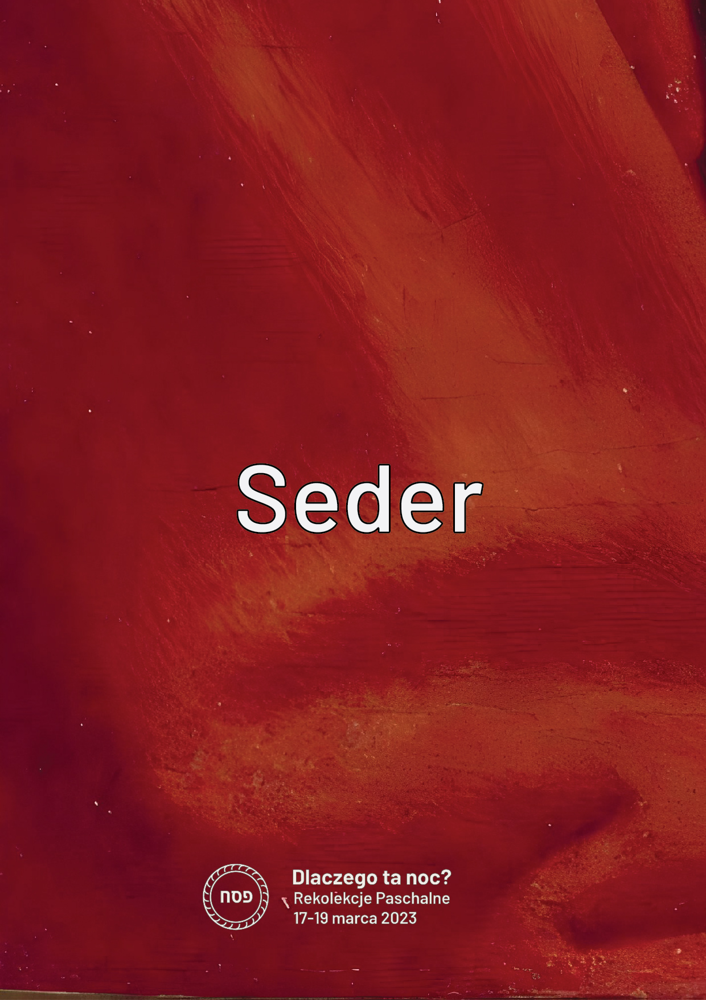
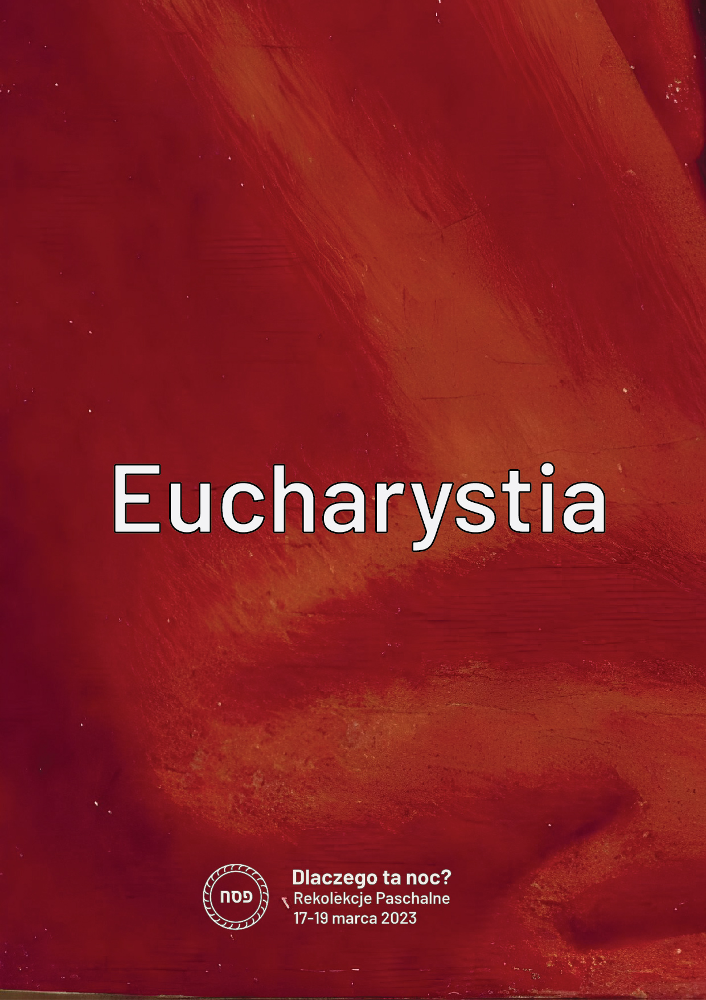
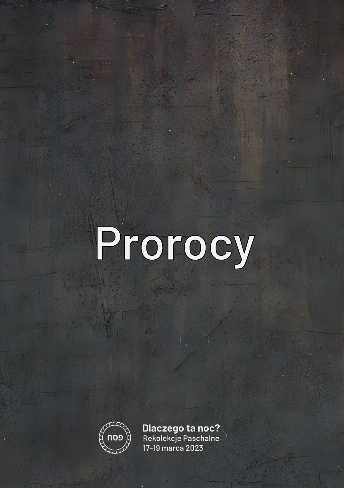
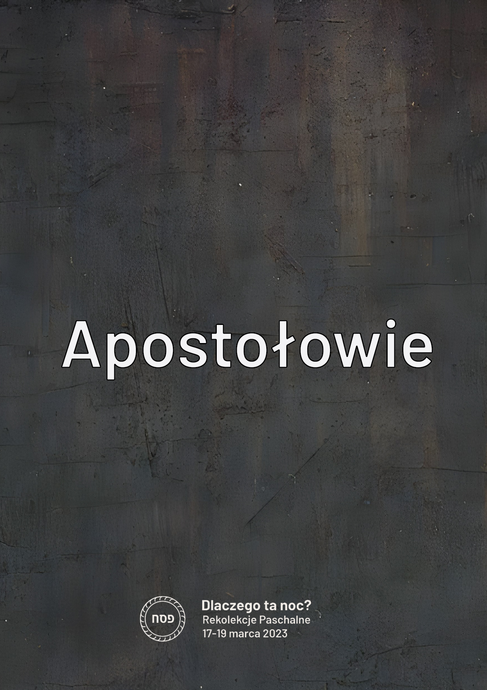
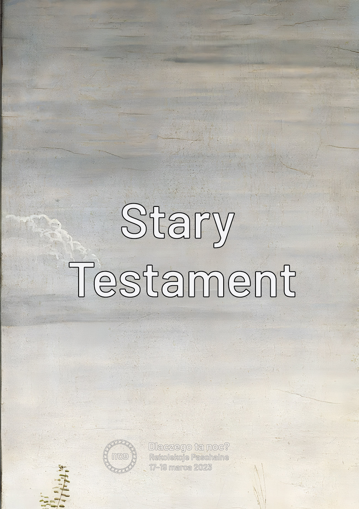
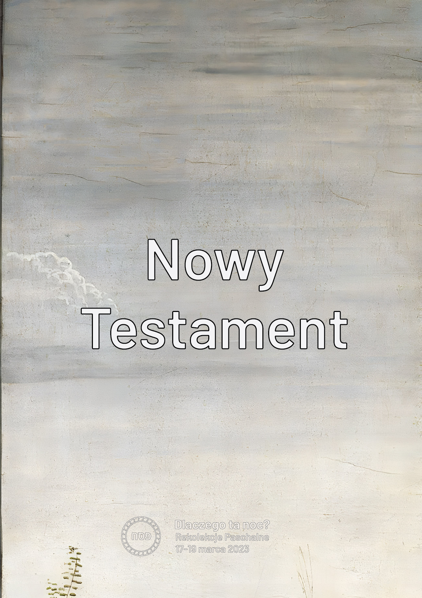
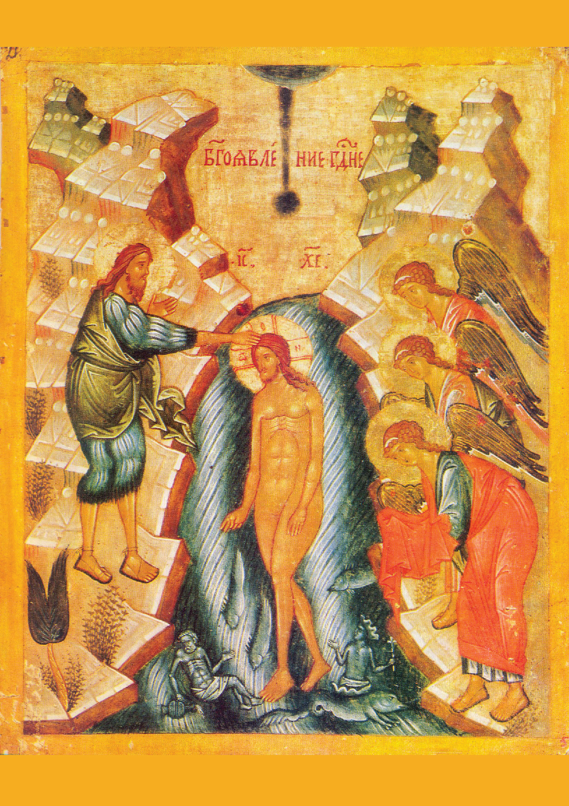

Spotkanie 4. - Stare-Nowe
*************************

Wprowadzenie dla animatora
==========================

Spotkanie czwarte jest jednym z~ostatnich punktów rekolekcji - stanowi zatem miejsce podsumowania. Obrazem, który chcemy, aby uczestnicy zabrali ze sobą ze spotkania, jest połączenie Starego i~Nowego, które dokonywane jest przez świadomych wierzących. Służy temu prosta dynamika [materiały poligraficzne i~“klipsy” będą dostarczone dla animatorów - na końcu konspektu znajdują się obrazy dla ustalenia kontekstu].

Wprowadzenie
============

Za nami wieczór sederowy - szczytowy punkt rekolekcji. Chcieliśmy przez kolację sederową doświadczyć głębokiej łączności Eucharystii i~Sederu. Nie było to jednak jedyne “połączenie”, które chcieliśmy przeżyć! Całe nasze rekolekcje orbitują wokół trzech przestrzeni.

.. note:: Animator wyciąga na stół kartki z~zapisanymi hasłami: Stary Testament, Nowy Testament, Seder, Eucharystia, Prorocy i~Apostołowie.

+------+------+
| |d1| | |d2| |
+------+------+
| |d3| | |d4| |
+------+------+
| |d5| | |d6| |
+------+------+

Weszliśmy w~te rekolekcje rozbudzając w~sobie uważność i~ciekawość. Spróbujmy zatem na tym spotkaniu “zbierać” to, co leży przed nami.  Pierwsza przestrzeń, którą chcemy rozpatrzyć, to Seder-Eucharystia.

- Co w~samym Sederze było dla mnie żywe?
- Jaka wartość płynie dla mnie z~połączenia Seder-Eucharystia?

Nie gorszy niż…
===============

Drugą przestrzenią, którą chcemy rozpatrzyć, są Prorocy-Apostołowie.

- [Pytanie do wszystkich] Gdzie ta przestrzeń była zauważalna na rekolekcjach?

To Haggada - wzajemnie opowiadaliśmy sobie o~wielkich dziełach naszego Boga! Tym właśnie jest przecież bycie Apostołem. Stanęliśmy wszyscy razem obok Izajasza, Jeremiasza, Ezechiela, Daniela, Ozeasza, Joela, Amosa, Abdiasza, Jonasza, Micheasza, Nahuma, Habakuka, Sofoniasza, Aggeusza, Zachariasza i~Malachiasza… obok Szymona Piotra, Andrzeja, Jakuba, Jana, Filipa, Bartłomieja, Tomasza, Mateusza, Szymona Gorliwego, Jakuba syna Alfeusza i~Judy… aby mówić, że Bóg jest dobry!

- Jak się czułem w~roli opowiadającego Historię Zbawienia?
- Czym się różni dla mnie sytuacja, że opowiadaliśmy swoimi słowami od czytania z~Pisma Świętego?

Otwórzcie notatnik na wstępie. Znajduje się tam deklaracja diakonii Ponad Murami, że tworzymy te rekolekcje z~głęboką nadzieją, że Dobry Bóg pozwoli nam tutaj połączyć zasłuchanie w~proroków i~apostołów, i~że tylko poprzez akt łączenia możemy przybliżyć się do Boga-Wspólnoty.

W ostatnim wierszu pierwszego akapitu brakuje kropki, prawda? To nasz celowy zabieg. Jeśli chcesz to dopisz tam po przecinku teraz swoje imię i/lubi zakończ kropką.

.. note:: Można nawiązać do zaproszeń na rekolekcje. Umieszczaliśmy cytaty, pytając, czy powiedział to ktoś z~diakonii czy ktoś “mądry i~sławny” (jak Benedykt XVI czy św. Teresa od Krzyża). Było to trudne doświadczenie dla wielu z~nas, aby “pozwolić sobie” nawet na możliwość pomyślenia, że ktoś może pomylić nasze słowa z~“kimś tak wielkim”.

- [dla tych, którzy wpisali] Jak się czujesz wpisując siebie w~takie grono?
- [dla tych, którzy nie wpisali] Co by się musiało wydarzyć, abyś umiała/umiał się tam wpisać?

Klej
====

Trzecią przestrzenią jest Stary Testament i~Nowy Testament. Medytowaliśmy dzisiaj obraz starca i~młodzieńca. Relacja Stary-Nowy jest dla nas bardzo ważna. Jest w~niej pokusa, aby odruchowo uznać, że “nowe jest lepsze! Po co zajmować się tym co stare?”

Przeczytajmy:

    Po części bowiem tylko poznajemy, po części prorokujemy. Gdy zaś przyjdzie to, co jest doskonałe, zniknie to, co jest tylko częściowe. Gdy byłem dzieckiem, mówiłem jak dziecko, czułem jak dziecko, myślałem jak dziecko. Kiedy zaś stałem się mężem, wyzbyłem się tego, co dziecięce. Teraz widzimy jakby w~zwierciadle, niejasno; wtedy zaś [zobaczymy] twarzą w~twarz: Teraz poznaję po części, wtedy zaś poznam tak, jak i~zostałem poznany. Tak więc trwają wiara, nadzieja, miłość - te trzy: z~nich zaś największa jest miłość.

    -- 1 Kor 13,9-13

- [Do wszystkich] Czy św. Paweł sugeruje, że będąc w~NT wszystko jest już odkryte?
- Co to mi mówi?

Stary Testament nie jest o~czymś zupełnie innym niż Nowy Testament. Podobnie życie na ziemi jako lud pielgrzymujący nie polega na czymś drastycznie innym niż bycie w~niebie! Są ważne różnice, z~których warto zdawać sobie sprawę - czy nie jest jednak tak, że jest znacznie więcej podobieństw, które nam “uciekają”? Widzimy i~oglądamy to samo - tylko stopień, w~jakim potrafimy to robić, jest inny (widzimy niejasno).

- Jakie znaczenie ma dla mnie ciągłość w~wierze?

Przeczytajmy:

    Przyszedł również do Nazaretu, gdzie się wychował. W~dzień szabatu udał się swoim zwyczajem do synagogi i~powstał, aby czytać. Podano Mu księgę proroka Izajasza. Rozwinąwszy księgę, natrafił na miejsce, gdzie było napisane: Duch Pański spoczywa na Mnie, ponieważ Mnie namaścił i~posłał Mnie, abym ubogim niósł dobrą nowinę, więźniom głosił wolność, a~niewidomym przejrzenie; abym uciśnionych odsyłał wolnymi, abym obwoływał rok łaski od Pana. Zwinąwszy księgę oddał słudze i~usiadł; a~oczy wszystkich w~synagodze były w~Nim utkwione. Począł więc mówić do nich: «Dziś spełniły się te słowa Pisma, któreście słyszeli».

    -- Łk 4,16-21

- Jak Jezus łączy i~zapewnia ciągłość?

.. note:: Animator wyciąga duży klips i~bierze 6 kartek ze stołu składając je parami razem tak, aby powstała “broszurka” składająca się z~6 kartek. Składamy razem po dwie kartki “napisami do siebie” - “Stary Testament” i~“Nowy Testament”, potem “Seder” i~“Eucharystia” i~na koniec “Prorocy” “Apostołowie”. Takie trzy pary układamy kolejno za sobą i~dużym klipsem [“Jezusem”] łączy je razem wzdłuż dłuższej krawędzi.

- Co w~mojej wierze “się rozdziela” i~chciałbym, aby zostało połączone przez Jezusa?

Przeczytajmy:

    Ponieważ Chrystus jest światłością narodów, obecny Sobór święty, w~Duchu Świętym zgromadzony, pragnie gorąco oświecić wszystkich ludzi blaskiem Jego jaśniejącym na obliczu Kościoła, głosząc Ewangelię wszelkiemu stworzeniu. A~że Kościół jest w~Chrystusie niejako sakramentem, czyli znakiem i~narzędziem wewnętrznego zjednoczenia z~Bogiem i~jedności całego rodzaju ludzkiego, przeto podejmując naukę poprzednich Soborów, pragnie on wyjaśnić dokładniej swoim wiernym i~całemu światu naturę swoją i~powszechne posłannictwo. Warunki naszej epoki nadają temu zadaniu kościoła szczególnie pilny charakter, chodzi o~to, aby wszyscy ludzie złączeni dziś ściślej więzami społecznymi, technicznymi, kulturalnymi, osiągnęli pełną jedność również w~Chrystusie.

    -- Lumen Gentium 1

.. note:: Animator wyciąga drugi duży klips [“Kościół”] i~dodatkowo wzmacnia łączenie.

- Gdzie widzę, że Kościół łączy te przestrzenie?

Kościół jest “cały utkany” z~łączenia! Na Mszy czytamy Stary i~Nowy Testament. Ustrój Kościoła jest równocześnie hierarchiczny i~synodalny. Kościół wzmacnia jednostkę i~mówi o~potrzebie osobistej relacji z~Bogiem, ale w~obrębie szerokiej wspólnoty itd.

.. note:: Animator wyciąga kilka małych klipsów i~rozdaje każdemu z~uczestników. Dodajemy je do dwóch istniejących.

- Jak ja łączę rzeczy w~duchowości?
- Jakie rzeczy chciałbym łączyć?

Zanurzyć się w~śmierci
======================

Łączenie jest trudne! Trudno jest pozbyć się oceniania, pokusy wybierania i~promowania. Ciężko mi widzieć siebie zarówno w~młodzieńcu, jak i~mędrcu **na raz**. Być może cały czas gdzieś czujemy imperatyw, aby “zająć stronę”. Co na to Jezus?

Przyjrzyjmy się ikonie:

- Co przedstawia ta ikona?
- Kim są osoby w~wodzie Jordanu?
- Do czego nawiązuje kształt wody?

Chrystus w~czasie chrztu w~Jordanie łączy dzieje potopu [woda zmazuje grzech] ze “źródłem wody żywej”. Jordan jest zarówno grobem, jak i~łonem. Łączy świat aniołów ze światem ludzi. Łączy początek swojej misji, ze śmiercią i~zmartwychwstaniem, które nadejdzie. Jezus łączy życie i~śmierć.

- Co to znaczy dla mnie zanurzyć się w~śmierci Jezusa?

Potrzebujemy tego zanurzenia. Tylko ono może dać nam szansę na “zobaczenie inaczej świata”. Oddali pokusę “urządzania świata od początku” i~może rozbudzić pragnienie zrozumienia czemu jest taki, a~nie inny. Musimy umierać i~powstawać do życia z~Chrystusem! "Zbudź się, o~śpiący, i~powstań z~martwych, a~zajaśnieje ci Chrystus" (Ef 5, 14). W~tym ubóstwie duchowym zdaje się, że jest umiejętność do łączenia.

Triduum
=======

Niedawno zmarł człowiek, który napisał ponad 60 książek, 3 encykliki i~4 adhortacje. Był czas gdy prawdopodobnie miał największą wiedzę teologiczną wśród żyjących na ziemi. Jego ostatnie słowa to:

    Kocham Cię Jezu!

    -- Benedykt XVI

Ta umiejętność upraszczania, wyciągania esencji jest dla nas niezbędna. Nie zależy nam, abyś z~tych rekolekcji wyjechał z~20 stronami notatek. Zależy nam, abyś zabrał jedno zdanie, ale takie, które usłyszałeś od Boga.

Przed nami Triduum Paschalne. Czas gdzie będzie niewyobrażalnie więcej treści niż w~czasie naszego spotkania.

- Czy Triduum jest jeszcze dla nas źródłem pytań?
- Na jakie moje pytanie odpowiedzią jest Triduum?
- Jak poprzez moje przeżywanie Triduum mogę mocniej kochać osobę obok mnie?

Zastosowaniem z~tego spotkania niech będzie zanotowane dzisiaj jedno zdanie w~notatniku. Autorem może być Izajasz, Jeremiasz, Jezus - jak najbardziej…. możesz też być to Ty. Nie podpisuj czyje to jest zdanie. To nie ma takiego znaczenia!

