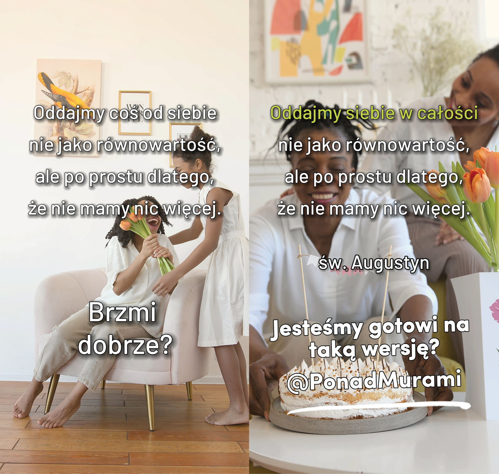
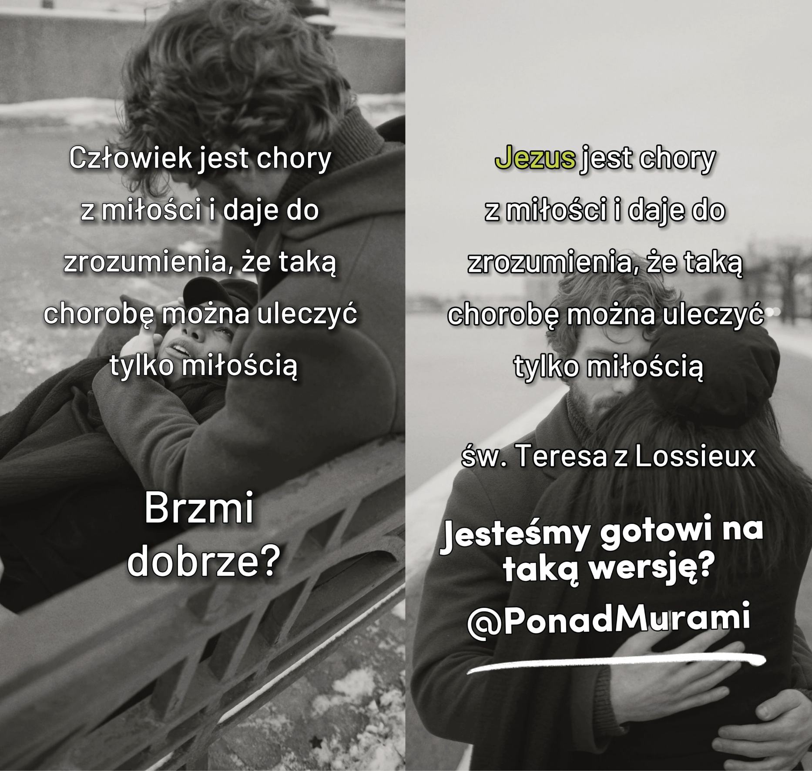
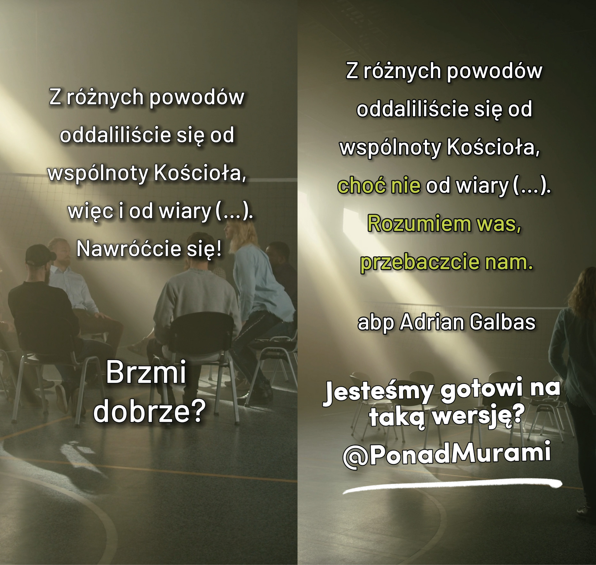
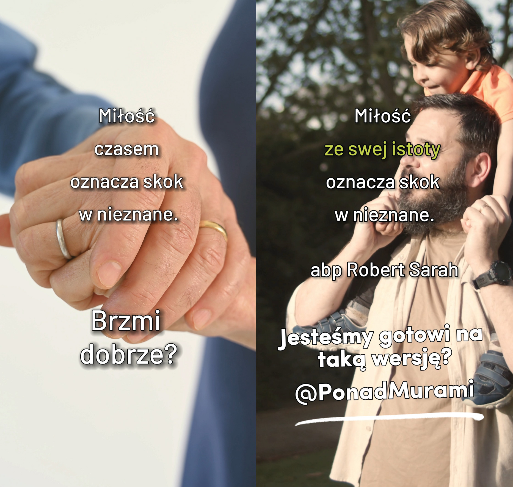
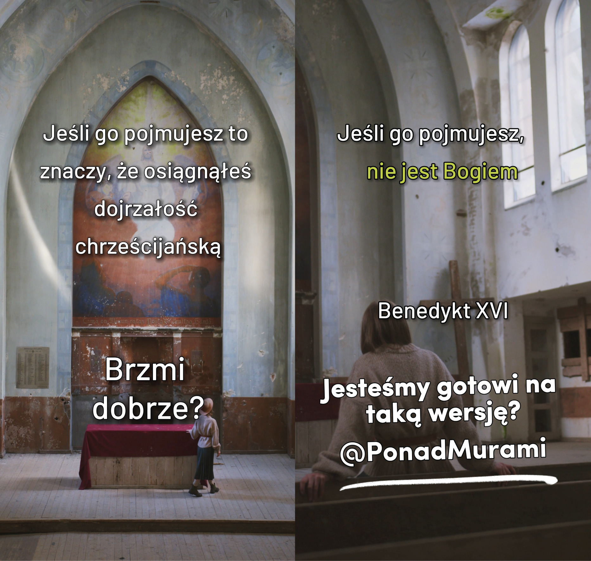

Spotkanie 3. - Doświadczający
*****************************

Wprowadzenie dla animatora
==========================

To ostatnie grupowe bezpośrednio przed sederem. Jego celem jest nas jak najlepiej przygotować do przeżycia go w~łączności z~Eucharystią. Nie chcemy przekazywać intelektualnej refleksji o~znaczeniu gestów i~słów - koncentrujemy się na uczestnictwie i~doświadczeniu. Seder i~co za tym idzie Eucharystia są angażujące - nasz czas, nasze ciało, nasze zmysły, nasze serce. Są osoby, które jedząc śniadanie czytają gazetę, odpowiadają na wiadomości i~wyskakują do pokoju obok wywiesić pranie - da się tak spożywać posiłki. Nie tak jednak spożywa się seder i~Eucharystię. Siedzenie przy stole może być angażujące, sprawia, że cały świat sprowadza się do tej przestrzeni tu i~teraz, czas płynie inaczej - o~to chodzi! Spotkanie zawiera aż trzy dynamiki. To po to, aby ćwiczyć, doświadczać bardziej niż się uczyć. Praktykujmy, dotykajmy, smakujmy. Nie na niby, nie w~formie syntetycznych warsztatów, ale realnie. Te dynamiki są treścią, a~nie przerywnikiem w~celu utrzymania koncentracji.

Odpowiedzialność
================

Jesteśmy po przeżyciu Effathy. Zacznijmy od podzielenia się refleksjami w~tym temacie:

* Jak przeżyłem nabożeństwo Effathy? Czym jest dla mnie nadprzyrodzona otwartość?

Jesteśmy świadkami ważnych zmian w~naszym Kościele. Papież Franciszek zwołał synod pod hasłem „Ku Kościołowi synodalnemu: komunia, uczestnictwo misja”. Papież stara się nam przekazać coś ważnego o~naszym rozumieniu swojej roli we wspólnocie. To co opowiada zdaje się czasami napotkać opór i~zamkniętość ze strony wierzących. Spróbujmy w~takim razie z~otwartością pochodzącą z~wysoka przeczytać w~jaki sposób papież nas na tę drogę zapraszał:

    My, pasterze, idziemy z~ludem, czasem na przedzie, czasem pośrodku, czasem z~tyłu. Dobry pasterz musi się poruszać w~ten właśnie sposób: z~przodu, aby prowadzić stado, w~środku, aby zachęcać do drogi i~nie zapomnieć zapachu stada, z~tyłu, bo lud też ma swój „dobry węch”.

    -- Papież Franciszek 18 września 2021

* Co w~praktyce taka wizja wspólnoty oznacza dla mnie?
* Jak się czuję z~taką wizją Kościoła?

Odwaga do rzeczy ważnych
========================

Dobrze jest być prowadzonym gdy ufa się temu kto prowadzi. Odkrywamy jednak, że nie to jest naszym wyłącznym powołaniem. Effatha “nie jest po to”, aby być bardziej otwartym na słuchanie poleceń. To my bierzemy odpowiedzialność za obieranie kierunku (synodalność)!

Zapraszając na rekolekcje opublikowaliśmy materiały przygotowane na zasadzie zestawienia dwóch tekstów - wersji zmienionej przez nas oraz tekstu oryginalnego. Chcieliśmy w~ten sposób uchwycić skoncentrowanie się na zmianie jaka może się dokonać z~odpowiednią otwartością serca. Wróćmy do kilku tych przykładów.

.. note:: Animator wyciąga karty i~rozkłada na stole.

.. |d2| image:: porownania-02.jpg
   :scale: 50%

+------+------+
| |d1| | |d2| |
+------+------+
| |d3| | |d4| |
+------+------+

+------+------+
| |d5| | |d6| |
+------+------+
| |d7| | |d8| |
+------+------+

* Jeśli miałbyś/miałabyś wybrać jedną kartę pokazującą zmianę, która jest dla Ciebie ważna to którą wybierzesz?

* Dlaczego to jest dla Ciebie ważne?

Moglibyśmy przed chwilą wyciągnąć 100 kart zamiast kilku albo wybrać 10 kart zamiast jednej. Nie zrobiliśmy tego. Jest w~tym jakieś uzasadnienie?

Co czasami się dzieje gdy wybieramy możliwości wyboru do 100?
Co może się stać gdy wybieramy 10 kart?

Nie chodzi o~to, że nie chcemy zająć się 10 rzeczami. Chodzi o~to że chcemy zająć się na pewno jedną zanim zajmiemy się dziesiątą. Trzeba odwagi, aby zdecydować co jest ważne i~zgodzić się, że będzie to krótka lista. Inaczej nastąpi **inflacja ważności** - gdy wszystko jest ważne nic nie jest. Jest ryzyko też w~drugą stronę **apatii** - nie wiem czy przeczytałem wszystkie karty z~miliona więc dopóki nie przeczytam wszystkich to nie zdecyduje się na żadną. Spróbujmy sobie na tym spotkaniu pomóc w~poszukiwaniu mądrej drogi.

Przeczytajmy:

    Święty Lud Boży ma udział także w~proroczej funkcji Chrystusa, szerząc żywe o~Nim świadectwo przede wszystkim przez życie wiary i~miłości i~składając Bogu ofiarę chwały, owoc warg wyznających imię Jego.

    -- Lumen Gentium 12

* W~jaki sposób mam udział w~czymś co jest dla mnie ważne w~duchowej sferze?
* Za co biorę odpowiedzialność?

Pod powierzchnią
================

Wybór przez każdego z~nas za co bierze odpowiedzialność i~co dla niego jest ważne jest kluczowe, aby być gotowym na zanurzenie się i~dotknięcie czegoś co jest głębiej. Przygotowujemy się dzisiaj przez cały dzień do tego.

Zróbmy jeszcze jedno ćwiczenie, a~niech wprowadzi nas do niego abp. Fulton Sheen:

    Nasz Pan miał boskie poczucie humoru, ponieważ objawił, że cały wszechświat jest sakramentalny. Sakrament, w~szerokim sensie tego słowa, łączy w~sobie dwa elementy: jeden widzialny, drugi niewidzialny; jeden, który można zobaczyć lub usłyszeć, którego można spróbować albo dotknąć; i~drugi - niewidzialny dla oczu. Jest jednak między tymi elementami pewien związek albo wspólna znaczeniowa przestrzeń, która je łączy. Słowo mówione jest rodzajem sakramentu, ponieważ jest w~nim zarówno coś materialnego, co da się wychwycić uchem, jak coś duchowego, czyli znaczenie słowa. Koń słyszy opowiedziany dowcip tak samo jak człowiek. Można nawet przyjąć, że słyszy wypowiadane słowa lepiej. Różnica polega na tym, że gdy człowiek usłyszy dowcip, najczęściej się roześmieje, a~gdy koń go usłyszy - nie wybuchnie końskim śmiechem. Jest tak dlatego, że koń słyszy tylko materialną część “sakramentu”, to znaczy dźwięk, podczas gdy człowiek odbiera również tę niewidzialną albo duchową, czyli sens słów.”

    -- abp Fulton J. Sheen “Sakramenty”

.. note:: Animator wyciąga karty dixit i~rozkłada na stole. Jest ich o~kilka więcej niż uczestników spotkania. Następnie opowiada zasady dixita: trzeba wybrać w~myśli swoją kartę i~wymyślić do niej takie skojarzenie które nie będzie nazbyt oczywiste by wszyscy nie zgadli, ale nie będzie też tak nietypowe, aby nikt nie odgadł.

Uczestnicy dzielą się skojarzeniem, a~reszta próbuje odgadnąć co to za karta.

* W~jaki sposób podawanie tego skojarzenia łączy się z~wprowadzeniem abp. Sheena i~naszym tematem?
* Czym w~życiu wspólnoty byłoby podanie zbyt prostego skojarzenia?
* Czym w~życiu wspólnoty byłoby podanie skojarzenia którego nikt nie odgadnie?

Podanie zbyt oczywistego skojarzenia to najprawdopodobniej minięcie się z~głębią, powiedzenie czegoś powierzchownego. Podanie skojarzenia którego nikt nie odgadnie nie buduje wspólnoty tak jak by mogło. Jako wspólnota wierzących jesteśmy nieustannie “rozpięci” pomiędzy tymi dwoma punktami starając się szukać naszego wspólnego wzrostu.

* W~jakich miejscach czuję, że dotykam czegoś co ważne i~głębokie? Kiedy odkryłem/odkryłam to miejsce?

Przełamanie się
===============

Piękny plan rysuje się nam na spotkaniu - mamy być otwarci na nowe spojrzenie, zasłuchani w~Papieża który zachęca nas do uczestnictwa, wybierający to co dla nas jest ważne i~głębokie! Czemu patrząc przez okno zdaje się że niewiele z~nas w~ten sposób żyje?

Przeczytajmy:

    Jako dobrzy szafarze różnorakiej łaski Bożej służcie sobie nawzajem tym darem, jaki każdy otrzymał. Jeżeli kto ma [dar] przemawiania, niech to będą jakby słowa Boże. Jeżeli kto pełni posługę, niech to czyni mocą, której Bóg udziela, aby we wszystkim był uwielbiony Bóg przez Jezusa Chrystusa. Jemu chwała i~moc na wieki wieków! Amen.

    -- 1 P 4,10-11

* Do kogo mówi św. Piotr?
* Do czego zachęca Cię ten fragment?

Jesteśmy powołani do wychodzenia na głębie i~do odważnego stawania się dla samych siebie drabiną do wzrostu. Wiara domaga się maksymalizmu, decyzji uczynienia jest czymś ważnym (tak naprawdę ważnym). To kwestia przełamania się (lub jak kto woli nawrócenia).

Przeczytajmy:

    “Jezus nie chce niczego od nas. On chce nas”

    -- ks. Franciszek Blachnicki

To dobre podsumowanie zmiany na którą Kościół (i Jezus) czeka.

To się może wydarzyć poprzez cud. Najczęściej się jednak nie wydarza w~ten sposób, ale to nic złego - można inaczej. Wychodzenie na głębie i~koncentrację na tym co ważne można ćwiczyć. Codziennie, konsekwentnie.

* Co by mi pomogło co mogliby zrobić inni, abym nie wpadał w~płytkość?
* Co możemy zrobić, aby dawać sobie nawzajem siłę nośną w~Kościele?

Doświadczanie
=============

Celem naszych rekolekcji jest przeżycie Eucharystii. Takiej “zwykłej”. To punkt szczytowy naszego spotkania. Chcemy jednak zrobić to z~jak największą otwartością, świadomością, aby było to dla nas realne doświadczenie, aby zejść pod powierzchnię o~centymetr dalej niż do tej pory.

    Kto odprawia Mszę Świętą, kto sprawuje Eucharystię? Odpowiedź wydaje się prosta: kapłan! W~naszych kościołach widzimy przecież kapłana stojącego przy ołtarzu. Wiele razy ktoś nas pyta: który ksiądz dzisiaj odprawiał? – i~odpowiadamy, podając jego imię czy nazwisko. Jednak szukając odpowiedzi na postawione pytanie, trzeba odwołać się do teologicznej refleksji nad liturgią. Katechizm Kościoła Katolickiego mówi, że liturgię celebruje cała wspólnota, Ciało Chrystusa zjednoczone ze swoją Głową, czyli Chrystusem. Odnosi się to również do Eucharystii. Celebracja Eucharystii jest także czynnością Chrystusa i~Kościoła, celebruje ją cała wspólnota.

    -- ks. Jan Miazek

* Na ile takie myślenie o~Eucharystii weszło także do mojego serca i~umysłu?

Przypomnijmy sobie cztery sposoby obecności Boga w~Eucharystii:

    | Aby urzeczywistnić tak wielkie dzieło, Chrystus jest obecny zawsze w~swoim Kościele, zwłaszcza w~czynnościach liturgicznych. Jest obecny w~ofierze Mszy świętej tak w~osobie celebrującego, gdyż "Ten sam, który kiedyś ofiarował siebie na krzyżu, obecnie ofiaruje się przez posługę kapłanów", jak zwłaszcza pod postaciami eucharystycznymi. Jest obecny swoją mocą w~sakramentach, tak że gdy ktoś chrzci, sam Chrystus chrzci. Jest obecny w~swoim słowie, bo gdy w~Kościele czyta się Pismo święte, On sam przemawia. Jest obecny, gdy Kościół modli się i~śpiewa psalmy, gdyż On sam obiecał: "Gdzie są dwaj albo trzej zebrani w~imię moje, tam jestem pośród nich" (Mt 18,20).
    | W~tak wielkim dziele, przez które Bóg otrzymuje doskonałą chwałę, a~ludzie doznają uświęcenia, Chrystus zawsze łączy z~sobą swoją umiłowaną Oblubienicę, Kościół, który wzywa swego Pana i~przez Niego oddaje cześć wiecznemu Ojcu.
    | Słusznie zatem uważa się liturgię za wypełnianie kapłańskiej funkcji Jezusa Chrystusa. W~niej przez znaki dostrzegalne wyraża się i~w sposób właściwy dla poszczególnych znaków dokonuje uświęcenie człowieka, a~Mistyczne Ciało Jezusa Chrystusa, to jest Głowa ze swymi członkami, sprawuje pełny kult publiczny.
    | Dlatego każda celebracja liturgiczna jako działanie Chrystusa-Kapłana i~Jego Ciała, czyli Kościoła, jest czynnością w~najwyższym stopniu świętą, której skuteczności z~tego samego tytułu i~w tym samym stopniu nie posiada żadna inna czynność Kościoła.

    -- Konstytucja o~Liturgii Świętej, pkt. 7

* W~jakich czterech przestrzeniach jest Obecny Chrystus w~czasie Eucharystii?
* W~których z~tych przestrzeni najrzadziej w~sposób naturalny dotykam czegoś duchowego?
* W~których z~tych przestrzeni najczęściej w~sposób naturalny dotykam czegoś duchowego?

Sensualność
===========

Cztery przestrzenie w~których znajdujemy realnie obecnego Chrystusa to coś więcej niż systematyzowanie wiedzy. To wskazówka dla nas, aby się nie “fiksować” na jednej przestrzeni. W~każdej z~nich jest Obecny Jezus - cały w~Pełni, jednak umiejętność doświadczania Go w~każdej z~przestrzeni równocześnie otwiera przed nami nowe możliwe połączenia, które wzbogacają się wzajemnie.

Wykonajmy teraz ćwiczenie z~tym związane.

.. note:: Animator wyciąga woreczki z~przedmiotem i~wręcza każdemu. Uczestnicy bez patrzenia sięgają do nich i~za pomocą dotyku próbują rozpoznać co to jest.

* Co znajduje się w~worku?

.. note:: Animator prosi uczestników o~zamknięcie oczu. Wyciąga olejek i~uwalnia jego zapach w~powietrzu.

* Co to za zapach?

.. note:: Animator puszcza dźwięk z~telefonu

* Czego to dźwięk?

.. note:: Animator prosi o~zamknięcie oczu i~rozdaje każdemu mały cukierek

* Jaki to smak?

Wyobraźmy sobie, że nigdy nie piliśmy herbaty. Ktoś nalewa ją nam do czarki, widzimy kolor płynu przelewający się do naczynia. Wzrok coś mówi nam o~herbacie. Bierzemy ją w~dłonie i~przybliżamy do siebie czując jej zapach - być może już umiemy rozpoznać z~czego je zrobiono. Gdy przyłożymy ją do ust doświadczenie się pogłębia.

Duchowość jest sensualna. Wiara jest sensualna. I~dosłownie - oddziaływuje na wszystkie zmysły i~w przenośni - jest wielowymiarowa i~odpowiedzi są na styku każdego z~wymiarów.

* Jakie znaczenie dla duchowości ma zmysł dotyku?
* Jakie znaczenie dla duchowości ma zmysł węchu?
* Jakie znaczenie dla duchowości ma zmysł słuchu?
* Jakie znaczenie dla duchowości ma zmysł smaku?

Pomóżmy sobie dzisiaj przeżyć Eucharystię tak, aby nie robił jej “ktoś inny dla nas”. Eucharystia zaprasza całych nas. Widać to będzie na sederze, który jest jej prawzorem. Eucharystia ma smak wina, dźwięk przełamywanej macy, wygląd migoczącego światła świecy na szatach celebransa, zapach kadzidła, dotyk ciepłej ręki znaku pokoju brata i~siostry i~żar czytanego Słowa. Jakie to wszystko w~najlepszym tego słowa znaczeniu zmysłowe, jakie bliskie! Bóg zrobił wszystko co mógł, abyśmy mogli “wejść cali bez reszty” w~Jego Tajemnicę.

    Człowiek, który chce zrozumieć siebie do końca — nie wedle jakichś tylko doraźnych, częściowych, czasem powierzchownych, a~nawet pozornych kryteriów i~miar swojej własnej istoty — musi ze swoim niepokojem, niepewnością, a~także słabością i~grzesznością, ze swoim życiem i~śmiercią, przybliżyć się do Chrystusa. Musi niejako w~Niego wejść z~sobą samym, musi sobie „przyswoić”, zasymilować całą rzeczywistość Wcielenia i~Odkupienia, aby siebie odnaleźć.

    -- Encyklika Redemptor Hominis, Jan Paweł II

* W~jakich gestach/znakach Eucharystii jest dla mnie najbardziej “naturalne” że mam uczestnictwo?
* Czym jest dla mnie zanurzenie w~śmierci i~zmartwychwstaniu Chrystusa?

Połączone światy
================

Przeczytajmy:

    Nie sądźcie, że przyszedłem znieść Prawo albo Proroków. Nie przyszedłem znieść, ale wypełnić.

    -- Mt 5,17

* Dlaczego współcześni Jezusowi mogli myśleć, że chcę coś znieść?
* Czy jest nam bliska ochota, aby chcieć zobaczyć rzeczy bez łączności z~tym, co było?

Nasza wiara nie spadła z~nieba. Eucharystia nie została objawiona na tablicy kamiennej. Jezus nie wymyślił macy oraz wina. Bóg wchodzi w~świat i~tworzy w~nim nowe połączenia. Bóg tylko tworzy, niczego nie niszczy to dla wielu z~nas jego podstawowa “tożsamość” - jest Stwórcą/Twórcą. Chcemy razem przeżyć dzisiaj seder, aby utworzyć nowe połączenie - w~sercach, duszy i~umyśle.

* Kto z~nas uczestniczył już w~sederze?
* Z~jaką nadzieją na niego idziemy?
* Co chcielibyśmy, aby zostało połączone?

Zjemy kolację. Będziemy nalewać wino i~przełamywać chleb. Będziemy rozmawiać i~żartować. Będzie prosto, ale nie prostacko. Będzie zwyczajnie, ale pięknie zwyczajnie. To cały czas jedna i~ta sama opowieść Boga względem nas: lekki powiew, a~nie gromy; stajenka, a~nie pałace; zwykły rybak, a~nie uczony; przykazanie miłości bardziej niż 500 zasad.

Jezus nam pokazał, że jedzenie z~kimś kolacji zmienia świat. Zjedzmy razem kolacje tak, aby wzajemnie pociągnąć się w~górę i~wpiszmy się w~tą opowieść Najwyższego.

Modlitwa
========

Zacznijmy modlitwę od:

    | Oto jak dobrze i~jak miło,
    | gdy bracia mieszkają razem;
    | jest to jak wyborny olejek na głowie,
    | który spływa na brodę,
    | <brodę Aarona, który spływa
    | na brzeg jego szaty>
    | jak rosa Hermonu, która spada
    | na górę Syjon:
    |  bo tam udziela
    | Pan błogosławieństwa,
    | życia na wieki.

    -- Ps 133

Niech słowa Psalmy zainspirują naszą modlitwę wstawienniczą.

