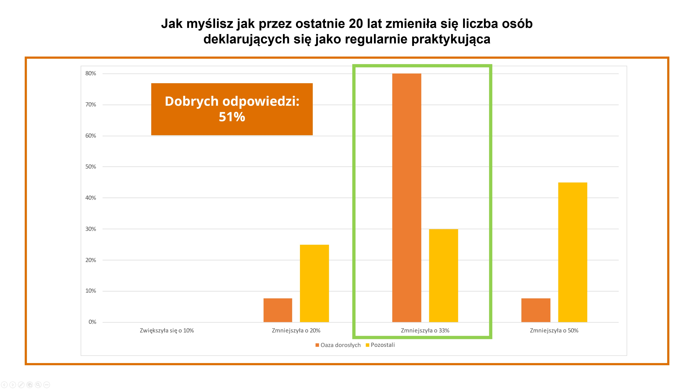
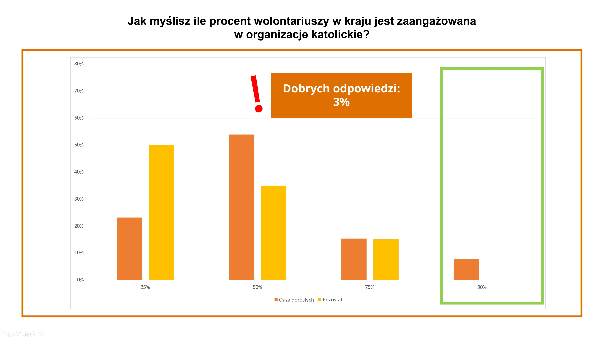
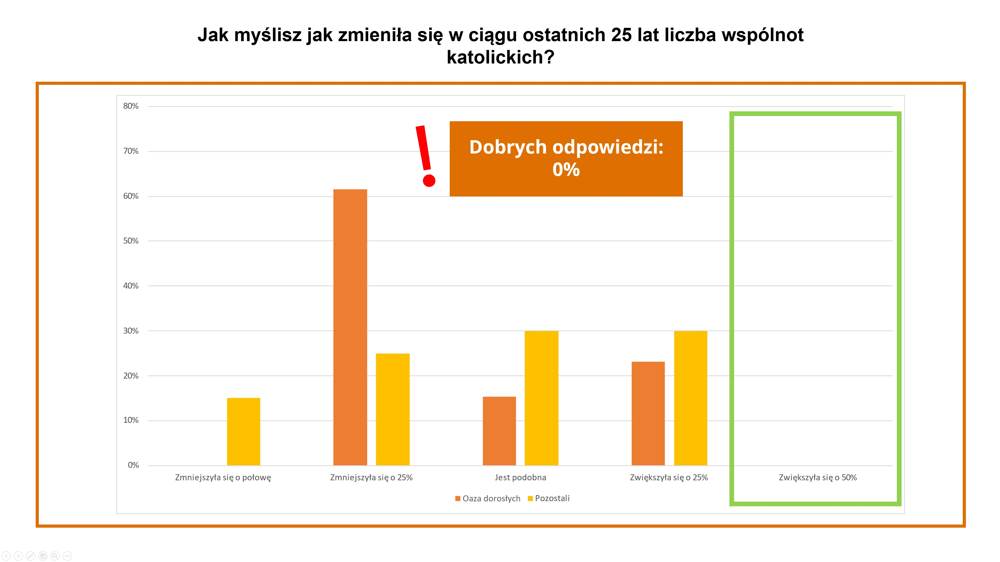

Spotkanie 2. - Nadprzyrodzona otwartość
***************************************

Wprowadzenie dla animatora
==========================

Na tym spotkaniu chcemy wejść głębiej w~temat otwartości. Pokazać dwa jej typy: otwartość humanistyczną oraz otwartość nadprzyrodzoną, która jest treścią nabożeństwa Effatha, które to przeżyjemy w~dniu dzisiejszym. Spotkanie ma przede wszystkim przygotować uczestników do zrozumienia i~przeżycia tego momentu rekolekcji. Na tym spotkaniu chcemy też zachęcić uczestników do zwrócenia uwagi, że otwartość humanistyczna dopełniona nadprzyrodzoną tworzą całość, dzięki której mamy zdolność do karmienia się tym, co już znamy, na wpatrywanie się głębiej i~dostrzeganie rzeczy z~inną jakością patrzenia.

Wprowadzenie
============

Za nami wiele ciekawych treści. Mówiliśmy o~rozszerzaniu serca, o~Bogu który inspiruje, o~otwartości Jezusa, byliśmy na modlitwie wieczornej, gdzie mogliśmy w~jakimś sensie wcielić się w~Nikodema, wysłuchaliśmy konferencji Ariela. Podzielmy się tym, co do tej pory:

* Jak wczorajsza modlitwa wpłynęła na moją duchowość?
* Co poruszyło mnie w~konferencji Ariela?
* Czym dla mnie jest nadprzyrodzona otwartość?

Mówiliśmy wczoraj sporo o~otwartości na świat, o~otwartości na siebie nawzajem, na Boga; o~ciekawości, jaką warto wzbudzać raz po raz na nowo. Dziś chcemy przyjrzeć się otwartości trochę głębiej.

.. note:: Chodzi nam tutaj o~otwartość ludzką, taką jak pojmujemy ją intuicyjnie, otwartość rozumową. W~następnej części konspektu omawiana jest otwartość nadprzyrodzona, taka która nie płynie z~człowieka i~jego woli posiadania postawy otwartości względem czegoś, ale od Boga, który otwiera nas w~sposób głębszy i~pełniejszy.

Dwie otwartości
===============

Pochylmy się nad otwartością jeszcze raz i~zobaczmy, że można ją podzielić (a właściwie rozszerzyć) na dwa zjawiska.  Pierwszym z~nich jest otwartość humanistyczna - przewinęła się ona wczoraj wiele razy. Wiemy, że jest postawą, którą należy pielęgnować i~o którą należy dbać.

.. note:: W~tym miejscu animator rozdaje uczestnikom ankietę (dołączoną do konspektu). Pytania z~ankiety pochodzą z~Raportu o~Kościele (który został opublikowany w~2023 roku). Pytania dotyczą różnych aspektów życia Kościoła, które często są obiektem przekłamań, niedomówień, czy wręcz kłamstw. Rzeczywistość czasami wygląda o~wiele bardziej pozytywnie, niż byśmy się tego spodziewali. Animator powinien zapoznać się z~pytaniami oraz odpowiedziami przed rozpoczęciem spotkania, aby wyniki ankiety nie były dla niego samego zaskoczeniem.  Po przeprowadzeniu ankiety animator pokazuje prawdziwe odpowiedzi (wykresy dołączone do konspektu), które najprawdopodobniej w~grupie dzieleniowej także będą dużym zaskoczeniem. Na wykresach ukazane są wyniki jednej ze wspólnot w~Knurowie, w~której ten sam warsztat został przeprowadzony kilka miesięcy temu, oraz oznaczenia, które odpowiedzi są prawidłowe. Celem tego ćwiczenia jest pokazanie, że chociaż jesteśmy członkami Kościoła, często wiemy o~nim bardzo niewiele, a~nasza wiedza w~wielu elementach nie jest pełna.

Jak myślisz, jak przez ostatnie 20 lat zmieniła się liczba osób deklarujących się jako regularnie praktykująca?
    1. Zwiększyła się o~10%
    2. Zmniejszyła się o~20%
    3. Zmniejszyła się o~33%
    4. Zmniejszyła się o~50%

Jak myślisz, jak zmieniła się w~ciągu ostatnich 25 lat liczba wspólnot katolickich w~Polsce?
    1. Jest podobna
    2. Zmniejszyła się o~25%
    3. Zmniejszyła się o~połowę
    4. Zwiększyła się o~50%

Jak myślisz,ile wolontariuszy w~kraju jest zaangażowana w~organizacje kościelne?
    1. 25%
    2. 50%
    3. 75%
    4. 90%

* Co zaskoczyło mnie w~tym ćwiczeniu?
* Jak patrzy mi się na Kościół, który wygląda w~rzeczywistości być może lepiej niż w~moich przekonaniach?
* Która przestrzeń mojego życia potrzebuje tego warsztatu obecnie?

**Otwartość humanistyczna**, ściśle wiąże się z~gotowością na rzeczy nowe, niezbadane. Człowiek otwarty jest przygotowany do ciągłego “testowania” swoich przekonań. Jak mogliśmy zauważyć w~ankiecie, aspekty naszego życia, które były dla nas naturalne, dobrze znane, nie zawsze są oczywiste, a~nasza wiedza z~czasem może się przedawnić i~potrzebować świeżego spojrzenia.

W ankiecie mogliśmy zauważyć zaledwie jeden z~rodzajów weryfikacji naszej wiedzy i~przekonań, a~mianowicie przekształcenie naszego pesymizmu i~braku pasji w~nowe, świeże spojrzenie na rzeczywistość. Kiedy odwrócimy sytuację podaną w~ankiecie zauważymy, że przesadny optymizm i~nadmierne oczekiwania (kiedy spodziewamy się fajerwerków) także mogą zostać zweryfikowane przez rzeczywistość w~dość wyraźny sposób.

Życie duchowe składa się z~obu tych aspektów, warto, aby ten warsztat pomógł nam to sobie przyswoić. Aby pokazać drugi aspekt weryfikacji naszych przekonań, zwróćmy uwagę na historię wodza Naamana:

Przeczytajmy:
    Naaman, wódz wojska króla Aramu, miał wielkie znaczenie u~swego pana i~doznawał względów, ponieważ przez niego Pan spowodował ocalenie Aramejczyków. Lecz ten człowiek - <dzielny wojownik> - był trędowaty. Kiedyś podczas napadu zgraje Aramejczyków zabrały z~ziemi Izraela młodą dziewczynę, którą przeznaczono do usług żonie Naamana. Ona rzekła do swojej pani: «O, gdyby pan mój udał się do proroka, który jest w~Samarii! Ten by go wtedy uwolnił od trądu».Naaman przyjechał więc swymi końmi i~swoim powozem, i~stanął przed drzwiami domu Elizeusza. Elizeusz zaś kazał mu przez posłańca powiedzieć: «Idź, obmyj się siedem razy w~Jordanie, a~ciało twoje będzie takie jak poprzednio i~staniesz się czysty!» Rozgniewał się Naaman i~odszedł ze słowami: «Przecież myślałem sobie: Na pewno wyjdzie, stanie, następnie wezwie imienia Pana, Boga swego, poruszywszy ręką nad miejscem [chorym] i~odejmie trąd. Czyż Abana i~Parpar, rzeki Damaszku, nie są lepsze od wszystkich wód Izraela? Czyż nie mogłem się w~nich wykąpać i~być oczyszczonym?» Pełen gniewu zawrócił, by odejść. Lecz słudzy jego przybliżyli się i~przemówili do niego tymi słowami: «Gdyby prorok kazał ci spełnić coś trudnego, czy byś nie wykonał? O~ileż więc bardziej, jeśli ci powiedział: Obmyj się, a~będziesz czysty?» Odszedł więc Naaman i~zanurzył się siedem razy w~Jordanie, według słowa męża Bożego, a~ciało jego na powrót stało się jak ciało małego dziecka i~został oczyszczony.

    -- 2 Krl 5,1-4.9-14

* Które przejawy łaski Boga są dla mnie “zbyt zwyczajne”? Gdzie zdarza mi się oczekiwać fajerwerków?
* Jak wygląda moja otwartość na rzeczy, które już duchowo znam?
* Jak wygląda moja otwartość względem Eucharystii / sakramentu pokuty i~pojednania?

.. note:: To jest dobry moment na świadectwo dotyczące obu aspektów otwartości na nową wiedzę. W~życiu duchowym każdego z~nas zdarzyły się sytuacje, kiedy nasze przekonania napotkały na nową wiedzę lub okoliczności, które nas wzbogaciły w~sposób, którego się nie spodziewaliśmy, lub który wydawał nam się zbyt normalny. Świadectwo będzie dobrym zakończeniem tego modułu i~przejściem do kolejnego.

Otwartość zaczyna się od stanięcia w~Prawdzie z~samym sobą i~zobaczenia, gdzie w~tym momencie się duchowo znajduję. Wymaga to spojrzenia w~siebie, jaki jest mój bagaż, który duchowo ze sobą niosę. Często zdarza się, że nasza tęsknota opiera się na wybranym aspekcie przeszłości, który z~czasem nabrał wyidealizowanej formy. Łatwo nam wtedy stracić z~oczu to, gdzie jesteśmy w~tej chwili i~zamknąć się na to, co tu i~teraz, na to co jest prawdziwe. Ta tęsknota dotyczy także naszej duchowej codzienności, ponieważ sakramenty także mogą paść ofiarą “spowszednienia”. Kiedy jednak otworzymy oczy i~pozwolimy ubogacić się codziennością, dostrzeżemy, że msza Święta prowadzona przez charyzmatycznego księdza z~drugiego końca świata, to sakrament, na którym łaska i~błogosławieństwo Boże rozlewa się w~dokładnie taki sam sposób, jak msza prowadzona przez księdza w~małym, wiejskim kościele.

Nadprzyrodzona otwartość
========================

Dzisiaj weźmiemy udział w~nabożeństwie Effatha, które skupione jest wokół zupełnie innego rodzaju otwartości, niż ta, o~której mówiliśmy przed chwilą. Nabożeństwo Effatha jest elementem przygotowania do chrztu przez katechumenów. Podczas tego obrzędu błogosławi się uszy (na znak dokładniejszego słuchania Słowa Bożego) i~usta  (na znak posłania głoszenia Ewangelii) katechumenów. Podczas tego obrzędu odczytujemy fragment z~Ewangelii wg św. Marka o~uzdrowieniu głuchoniemego.

Przeczytajmy:

    Znowu opuścił okolice Tyru i~przez Sydon przyszedł nad Jezioro Galilejskie, przemierzając posiadłości Dekapolu. Przyprowadzili Mu głuchoniemego i~prosili Go, żeby położył na niego rękę. On wziął go na bok, osobno od tłumu, włożył palce w~jego uszy i~śliną dotknął mu języka;a spojrzawszy w~niebo, westchnął i~rzekł do niego: «Effatha», to znaczy: Otwórz się! Zaraz otworzyły się jego uszy, więzy języka się rozwiązały i~mógł prawidłowo mówić. [Jezus] przykazał im, żeby nikomu nie mówili. Lecz im bardziej przykazywał, tym gorliwiej to rozgłaszali. I~pełni zdumienia mówili: «Dobrze uczynił wszystko. Nawet głuchym słuch przywraca i~niemym mowę».
    
    -- Mk 7,31-37

Jezus uzdrawia głuchoniemego. Mimo że we fragmencie pada wyrażenie “głuchym słuch **przywraca** i~niemym mowę”, to pamiętajmy, że tak naprawdę Jezus **wprowadza** uzdrowionego w~zupełnie inny świat.

Na dodatek robi to z~właściwą sobie delikatnością i~wyczuciem, używając takich wrażeń, które są codziennością głuchoniemego - dotyk, ciepło, spojrzenie, westchnienie. Co więcej, zabrał go “osobno od tłumu”, w~miejsce, które nie przytłoczy dźwiękami(!). Do tej pory nie istniała w~życiu uzdrowionego rzeczywistość dźwięków, co więcej, jeśli nie mógł słyszeć, to świat języka mówionego był mu zupełnie obcy. Za pewne porozumiewał się z~otoczeniem migowo, jednak był wykluczony ze znacznej części życia, które działo się niejako obok niego. Jezus nie “przywraca” temu człowiekowi słuchu, on wpuszcza w~jego życie i~nową rzeczywistość - nadaje mu słuch, wręcza go, uczy całe ciało, jak to jest słyszeć, wprowadza coś spoza dotychczasowego świata. Do tej pory rzeczy miały kolory, zapachy, smaki, teraz nabrały dźwięku. Zmysł słuchu daje nam orientację w~przestrzeni, słyszymy hałasy z~daleka, orientujemy się na odległość, że coś się dzieje, właśnie za pomocą słuchu. Jezus rozszerza postrzeganie uzdrowionego o~rzeczy niewyobrażalne, przekraczające jego doświadczenie. Jezus wchodzi tam, gdzie człowiek nie może się otworzyć bardziej - przecież głuchoniemy używał każdego innego zmysłu, żeby radzić sobie  w~świecie, robił co mógł, nic więcej sam nie mógł zrobić - nowy wymiar został mu dany.

Jednak, nie tylko o~tym mówi ten fragment.  Przeczytajmy komentarz:

    Ale wszyscy wiemy, że zamknięcie się człowieka, jego izolacja, nie zależy jedynie od narządów zmysłów. Istnieje zamknięcie wewnętrzne, które odnosi się do głębokiego centrum osoby, tego, co Biblia nazywa „sercem”. To jest to, co Jezus przyszedł „otworzyć”, wyzwolić, aby uzdolnić nas do przeżywania w~pełni więzi z~Bogiem i~innymi. Dlatego właśnie powiedziałem, że to małe słowo „effatha – otwórz się”, zawiera w~sobie całą misję Chrystusa. Stał się On człowiekiem, aby człowiek, który stał się wewnętrznie głuchy i~niemy z~powodu grzechu, był w~stanie usłyszeć głos Boga, głos Miłości, która przemawia do jego serca, i~aby nauczył się w~ten sposób mówić ze swojej strony językiem miłości, komunikowania się z~Bogiem i~z innymi. Z~tego powodu słowo i~gest „effatha” zostały włączone do obrzędu Chrztu świętego, jako jeden ze znaków, wyjaśniających jego znaczenie: kapłan, dotykając ust i~uszu osoby nowo ochrzczonej, mówi „Effatha”, modląc się, aby mogła ona zaraz słuchać Słowa Bożego i~wyznawać wiarę. Przez chrzest osoba ludzka zaczyna, jeśli można tak powiedzieć, „oddychać” Duchem Świętym, tym samym, którego Jezus wezwał od Ojca z~tym głębokim westchnieniem, aby uzdrowić głuchoniemego.

    -- Benedykt XVI, Rozważanie na Anioł Pański (z dnia 09.09.2012)

Spotkanie między Jezusem i~głuchoniemym dzieje się nieustannie. Możemy w~tej sytuacji zobaczyć nas - duchowo głuchych i~niemych z~powodu grzechu, możemy spotkać Jezusa, który bierze nas na bok, osobno od tłumu, odzywa się do nas najbliższym dla nas przekazem i~wprowadza nową przestrzeń, nową jakość, która dostępna jest w~sposób nadprzyrodzony, nadany przez Boga, który tego otwarcia dokonuje.

* Która przestrzeń mojego życia została otworzona przez Boga? Jak wyglądały pierwsze momenty nowej rzeczywistości?

Otwartość nadprzyrodzona dopełnia otwartość humanistyczną. Jest też czymś, co nas przekracza, i~czego jako ludzie nie jesteśmy w~stanie wykrzesać z~siebie sami.

Effatha jako pre-sakrament
==========================

Intuicją Kościoła jest, że otwartość dopełniona w~ten sposób powinna poprzedzić sakrament - ten pierwszy, ale i~każdy kolejny. Przyjrzyjmy się jak wygląda bezpośrednie przygotowanie do sakramentu chrztu osób dorosłych i~w jakim kontekście pojawia się obrzęd Effatha.

.. note:: Animator wyjmuje kartki z~nazwami trzech obrzędów - Nadania oraz oddania symbolu wiary, Effatha, Wybór chrześcijańskiego imienia, dodatkowo hasło “katechizacja” i~“chrzest”, jako początek i~koniec procesu. Powinny być one na osobnych rozciętych kartkach. Animator krótko tłumaczy na czym polega dany obrzęd (opisy załączone są do konspektu). Zadaniem uczestników jest ułożyć je w~kolejności, w~jakiej uważają, że występują po sobie te obrzędy.np. katechizacja -> effatha -> nadanie imienia -> oddanie symbolu wiary -> chrzest. Prawidłowa kolejność to: katechizacja -> oddanie symbolu wiary -> effatha -> nadanie imienia -> chrzest. Celem tego ćwiczenia jest pokazanie, że w~tym procesie najpierw dzieje się poznanie racjonalne, które wymaga ludzkiej otwartości - Katechumeni najpierw poznają Credo, uczą się go, w~sposób świadomy przepracowują w~głowie jego treść, wyznają je podczas obrzędu oddania symbolu wiary. Potem następuje Effatha i~dopełnienie otwartością nadprzyrodzoną, to z~kolei prowadzi do nadania imienia, a~więc zaznaczenia pewnej zmiany w~tożsamości człowieka, a~finalnie chrztu.

+------------------------------+
| OBRZĘD ODDANIA SYMBOLU WIARY |
+------------------------------+
| NADANIE IMIENIA              |
+------------------------------+
| EFFATHA                      |
+------------------------------+
| KATECHIZACJA                 |
+------------------------------+
| CHRZEST ŚWIĘTY               |
+------------------------------+

* Jakie myśli wzbudza we mnie taka kolejność tych obrzędów?

Im dłużej patrzysz, tym więcej widzisz - podsumowanie
=====================================================

Pełna otwartość (humanistyczna dopełniona nadprzyrodzoną) jest nam potrzebna, żeby stawać w~prawdzie ze światem i~przyjmować go w~pełni. Potrzebna jest nam także, aby umieć patrzeć niejednokrotnie w~to co, znane, osłuchane i~raz po raz widzieć coraz więcej. Potrzeba nam wyrwania się ze schematu, że inspirować nas mogą tylko rzeczy nowe. W~naszym sercu dokonywać się powinna Effatha za każdym razem kiedy przyjmujemy tak znane nam sakramenty. Nawet najbardziej odkrywcze kazanie nic nam nie da, jeśli nie mamy w~sobie otwartości na Bożą codzienność. To nie nowe musi inspirować, nie nowy serial, nowy produkt, czasem lepiej jest się wpatrywać, ale z~otwartością, która jest nam dana, bo im dłużej patrzymy, tym więcej widać.

Zakończenie - modlitwa
======================

Proponujemy na koniec pomodlić się modlitwą św. Teresy:

    | Niech nic cię nie smuci,
    | niech nic cię nie przeraża.
    | Wszystko mija,
    | lecz Bóg jest niezmienny.
    | Cierpliwością osiągniesz wszystko,
    | a~temu, kto posiadł Boga, niczego nie braknie.
    | Bóg sam wystarczy.

Modlitwa ta ma podkreślić wyraz tego, że chcemy poszukiwać w~głąb, w~tym co znane - Bóg sam wystarczy, Bóg jest niezmienny.
