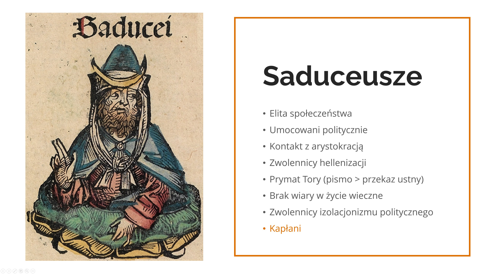
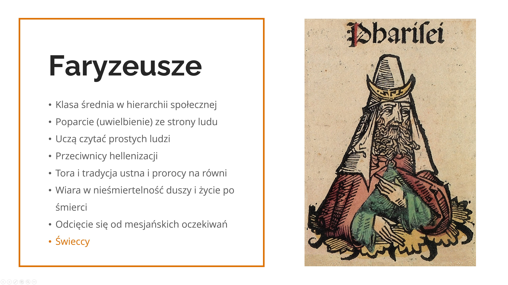
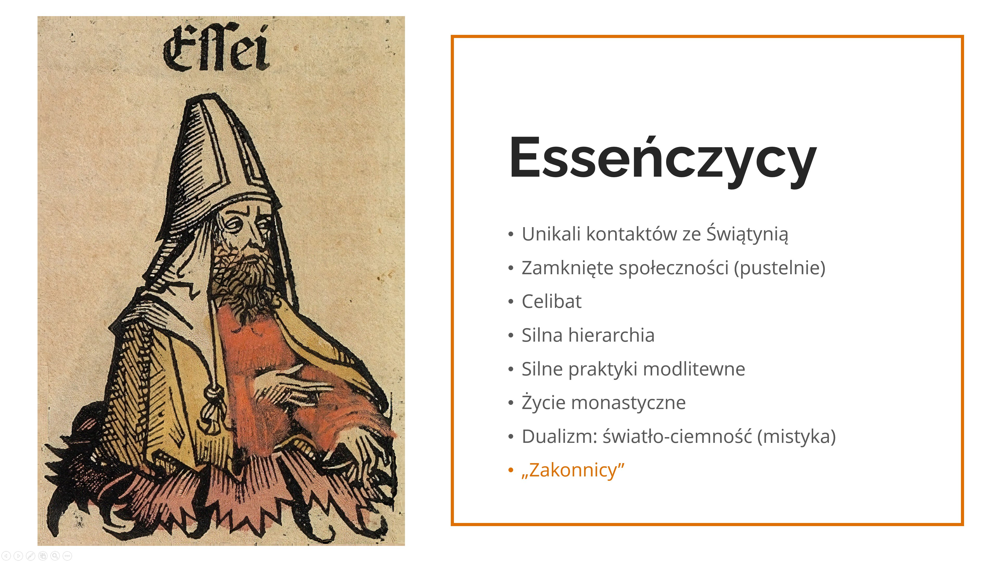
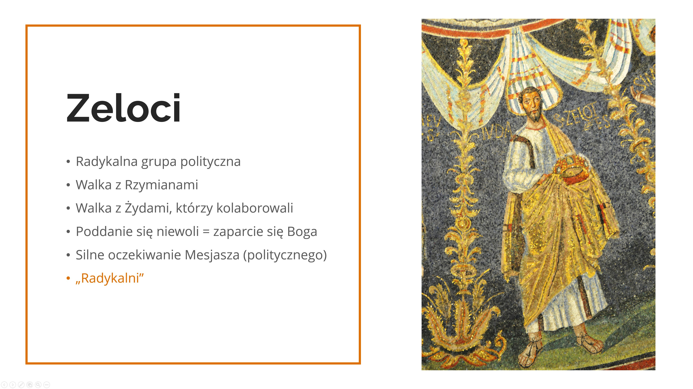

Spotkanie 1. - Tak, jak sam zostałem poznany
********************************************

Wprowadzenie dla animatora
==========================

Pierwsze spotkanie grupowe pełni funkcję zapoznawczą i~integrującą, jest łącznikiem pomiędzy pomiędzy pozostałymi punktami piątku - pogłębia treści z~konferencji i~podprowadza pod modlitwę wieczorną. Najważniejszym jego celem jest skonfrontowanie uczestników z~tym, co oznacza otwartość w~praktyce i~podzielenie się tym, jakie wyzwania wiążą się z~takim podejściem.

**Na końcu tego konspektu znajdują się materiały do wydrukowania, które będą potrzebne w~trakcie spotkania!**

Wprowadzenie
============

Zaczynamy od modlitwy - forma według uznania animatora, ze szczególnym akcentem położonym na prośbę o~otwartość na siebie nawzajem. Jeżeli jest potrzeba (uczestnicy którzy nie mają doświadczenia spotkań dzieleniowych w~małej grupie) animator pokrótce przedstawia zamysł spotkań grupowych i~omawia zasady. Zaczynamy od podzielenia się tym, co zrodziło się w~nas podczas słuchania konferencji, zaczynamy od razu od zanurkowania i~przeżywania treści rekolekcji. Otwartość wiąże się z~odsłonięciem się i~gotowością na bycie zranionym - w~przestrzeni małej grupy właśnie to się wydarza, nie znamy się jeszcze, nie wiemy nic o~sobie, ale chcemy wzbudzić w~sobie otwartość na siebie nawzajem. Przy odpowiadaniu na poniższe pytania prosimy, żeby dana osoba się przedstawiła, jeżeli ktoś nie chce odpowiadać, niech tylko się przedstawi.

* Jakie treści z~konferencji najbardziej rezonują z~tym, co dzieje się ostatnio w~moim życiu?
* Jaką perspektywę na przeżywanie tych rekolekcji nakreśliło mi to, co usłyszałem/łam?
* Czy mam w~sercu szczególne pragnienie dotyczące tych rekolekcji?

Otwarta wiara
=============

Maciej Biskup OP w~jednym z~wpisów wytłumaczył etymologię słowa “Kościół”:

    Kościół bez serca to Kościół-twierdza, zamek warowny. Dosłownie to w~języku polskim znaczy słowo „kościół”, które przyjęliśmy z~czeskiego (kostel), a~czeski od łacińskiego słowa castellum (twierdza). Tymczasem z~greckiego (ekklesia) Kościół oznacza zwołanie ludu, który nie zamyka się w~twierdzy, ale wychodzi do świata z~otwartym sercem, by dalej zwoływać, jak sam został zwołany.

    -- ”Kościół, który ma serce” z~24.06.2022

* Jakie jest moje doświadczenie Kościoła?
* Który obraz jest mi bliższy - Kościoła twierdzy czy Kościoła, który jest zwołaniem ludu wychodzącym do świata?

Kiedy Kościół został posłany przez Chrystusa na wszystkie strony świata, by zwoływać wszystkich do jego Imienia (Mk 16,15), zaczął się stykać z~nowymi zwyczajami, nowymi kulturami, nowymi prądami myślowymi, które wykraczały poza wewnętrzny świat ówczesnego judaizmu, w~którym zrodziło się chrześcijaństwo. Każde spotkanie było możliwością znalezienia punktów wspólnych, aby jak najprościej ukazać uniwersalność Jezusa wobec wszystkich (Wystąpienie Pawła na Areopagu - Dz 17,16-34). Środowisko nasiąkało nauką Apostołów, zaś nowi wyznawcy łączyli w~sobie swoje dziedzictwo wraz z~ dorobkiem Dobrej Nowiny. Widzimy w~naszych czasach, że inkulturacja, czyli wejście Ewangelii w~życie różnych ludów pozostawia dobre owoce, ale wymaga wytężonej pracy w~“łączeniu światów”. Za przykład możemy podać różne Kościoły, które stworzyły własne zwyczaje na przestrzeni wieków:

Japonia
    Ukryci chrześcijanie (Kakure-kirishitan) podczas dwóch wieków prześladowań (XVII-XVIIIw.), aby podtrzymać tradycję przeżywania Eucharystii, mimo braku prezbiterów, używali ryżu i~sake do odprawiania Dziękczynienia na wspólnie zorganizowanych liturgiach. Aktualnie księża zamiast całować ołtarz, kłaniają się przed nim w~wyrazie najwyższego szacunku.

Egipt
    Chrześcijanie od pierwszych wieków używają symbolu ankh jako znaku życia, zmartwychwstania. Współcześnie pojawia się on na stułach prezbiterów oraz rękach wytatuowanych chrześcijan.

Widząc piękno różnych Kościołów, możemy zadać sobie pytanie: gdzie był zalążek tego bogactwa? Jednym z~pierwszych protagonistów zdobywania ludzi dla Chrystusa był św. Paweł, nazywany Apostołem Narodów. Płynął wszędzie i~do wszystkich, aby zdobyć wielu dla Ewangelii. Przyznaje się on, żeby zdobyć ludzi “stawał się wszystkim dla wszystkich” (1 Kor 9, 20-22). Aby być jedno z~drugim, świadomie podejmował on wybór dostosowania się do drugiego, aby miał on poczucie bliskości i~tworzącej się więzi.

* Jak często staram się  wejść “w czyjeś buty” i~słuchać drugiej strony? Co jest w~tym dla mnie najtrudniejsze?
* Czy usłyszałeś w~swoim życiu, że potrafisz słuchać lub “kogoś usłyszałeś”?
* Kiedy ostatnio zostałeś z~kimś dłużej na przystanku autobusowym mimo, że tej osoby nie znasz tak dobrze? Kiedy zrobiłeś dla kogoś 2000 kroków zamiast 1000? (Mt 5,41)?

Jezus jako Ten, który jest otwarty
==================================

Jak widzimy, Kościół od początku był bardziej różnorodny, niż może nam się wydawać. Różne ruchy, wspólnoty, charyzmaty nadal przenikają się w~nim oraz uzupełniają. Nie jest to jednak cecha charakterystyczna tylko dla współczesnego Kościoła, ponieważ podobnie sprawa miała się już z~judaizmem w~czasie, kiedy Pan Jezus nauczał. Przyjrzyjmy się teraz pokrótce różnym stronnictwom żydowskim, które wtedy istniały.

.. note:: Animator wyciąga plansze na środek, tak żeby każdy uczestnik spotkania widział.

Po przeczytaniu każdego z~opisów animator zadaje pytania:

* Jakie refleksje zrodziły się we mnie po przeczytaniu opisów poszczególnych stronnictw?

* Co chrześcijaństwo przejęło od każdego z~nich?

Pierwsi chrześcijanie podobnie jak saduceusze sami sprawowali Eucharystię, wierzyli w~nieśmiertelność jak faryzeusze, tworzyli wspólnoty i~mistykę na wzór esseńczyków, oraz uznawali istotę wolności osobistej jak zeloci. Otwartość i~czerpanie od innych są wpisane w~naszą wiarę przez samego Jezusa Chrystusa. Przypuszcza się, że niektórzy apostołowie byli przedstawicielami poszczególnych stronnictw - Ewangelia podaje nam na przykład informację o~Szymonie, który miał przydomek “gorliwy” - po grecku zelotes, co może wskazywać na przynależność do zelotów, podobnie Judasz bywa zaliczany do tego grona. Jan Chrzciciel ze względu na pustelniczy sposób życia przez niektóre źródła uznawany jest za esseńczyka, tak samo jego uczniowie, którzy później poszli za Jezusem. Wiemy również, że Nikodem był faryzeuszem.

* Jakie widzę podobieństwa pomiędzy ówczesnymi stronnictwami, a~dzisiejszym Kościołem?

Mesjasz chciał mieć w~swoim najbliższym gronie przedstawicieli różnych poglądów! Jego otwartość na innych przejawiała się także w~czasie wielu spotkań opisanych na kartach Ewangelii.

Przeczytajmy teraz kilka przykładowych fragmentów.

.. note:: Uczestnicy spotkania dobierają się w~pary, każda dwójka dostaje jeden z~poniższych fragmentów i~zapoznaje się z~nim w~ciszy.

Pierwszy fragment:

    | Gdy Jezus dowiedział się, że do faryzeuszów dotarła wiadomość, iż gromadzi więcej uczniów i~częściej chrzci aniżeli Jan – chociaż nie On sam chrzcił, tylko Jego uczniowie – opuścił Judeę i~udał się znowu do Galilei. Musiał przejść przez Samarię. I~przybył do miejscowości samarytańskiej, zwanej Sychar, położonej niedaleko posiadłości, którą przekazał Jakub swemu synowi Józefowi. Tam znajdowała się studnia Jakuba. Jezus, zmęczony przebytą drogą, usiadł obok studni, a~było to około godziny szóstej.
    | Nadeszła wtedy kobieta – Samarytanka, aby zaczerpnąć wody. Jezus poprosił ją: „Daj Mi się napić”. Jego uczniowie natomiast poszli do miejscowości, aby kupić coś do jedzenia. Kobieta odparła jednak: „Jakże Ty, Żyd, możesz prosić mnie, kobietę samarytańską, o~wodę?”. Żydzi bowiem nie utrzymują kontaktu z~Samarytanami. Na jej słowa Jezus odpowiedział: „Gdybyś znała dar Boży, a~także wiedziała, kim jest Ten, kto ci rzekł: «Daj Mi się napić», to byś Go poprosiła, a~On dałby ci wody żywej”. Kobieta zawołała wtedy: „Panie, przecież Ty nie masz nawet czerpaka, a~studnia jest głęboka. Skąd więc weźmiesz wodę żywą? Czyżbyś był większy od naszego ojca Jakuba, który dał nam tę studnię? Zresztą on sam z~niej korzystał, jego synowie i~trzody”. Wówczas Jezus oznajmił jej: „Każdy, kto pije tę wodę, nadal będzie odczuwał pragnienie. Kto natomiast napije się wody, którą Ja mu dam, już nigdy więcej nie będzie odczuwał pragnienia, gdyż woda, którą mu dam, stanie się w~nim obfitym źródłem na życie wieczne”. Kobieta poprosiła więc: „Panie, daj mi takiej wody, abym już więcej nie odczuwała pragnienia i~nie musiała przychodzić tutaj i~czerpać”. Jezus więc polecił jej: „Idź, zawołaj swojego męża i~przyjdźcie tutaj”. Ona zaś odparła: „Nie mam męża”. Na co Jezus rzekł: „Słusznie powiedziałaś: «Nie mam męża». Miałaś ich bowiem pięciu, a~i ten, którego masz, nie jest twoim mężem. To powiedziałaś prawdziwie”. Wtedy kobieta zawołała: „Panie, widzę, że Ty jesteś prorokiem! Nasi przodkowie oddawali cześć Bogu na tej górze; wy zaś twierdzicie, że jedyne miejsce, gdzie należy Go czcić, znajduje się w~Jerozolimie”. Jezus jej odrzekł: „Wierz mi, kobieto. Oto nadchodzi czas, że ani na tej górze, ani też w~Jerozolimie nie będzie się już wielbiło Ojca. Wy czcicie to, czego nie znacie; my zaś oddajemy cześć Temu, kogo znamy. Zbawienie bowiem pochodzi od Żydów. Nadchodzi jednak godzina, a~właściwie już jest, kiedy prawdziwi czciciele będą wielbili Ojca w~Duchu i~w~prawdzie. Zresztą takich czcicieli pragnie sam Ojciec.Bóg jest duchem, stąd też ci, którzy Go wielbią, winni to czynić w~Duchu i~w~prawdzie”. Wtedy kobieta odparła: „Wiem, że ma nadejść Mesjasz, czyli Chrystus. I~gdy tylko On przybędzie, wszystko nam wyjaśni”. Jezus oznajmił jej wówczas: „To Ja nim jestem, Ja, który mówię do ciebie”.

    -- J 4,1-26

Drugi fragment:

    Potem przybył do Jerycha i~przechodził przez miasto. A~pewien bogaty człowiek, imieniem Zacheusz, który był przełożonym celników, chciał zobaczyć Jezusa, kto to jest. Nie mógł jednak z~powodu tłumu, gdyż był małego wzrostu. Pobiegł więc naprzód i~wszedł na sykomorę, żeby Go zobaczyć, gdyż tamtędy miał przechodzić. A~gdy Jezus przyszedł na to miejsce, spojrzał w~górę i~powiedział do niego: „Zacheuszu, zejdź! Pospiesz się, bo dziś muszę zatrzymać się w~twoim domu”.Zszedł więc szybko i~przyjął Go z~radością. A~wszyscy, widząc to, szemrali: „Poszedł w~gościnę do grzesznika”. Zacheusz zaś stanął i~powiedział do Pana: „Panie, połowę mego majątku daję ubogim, a~jeśli na kimś coś wymusiłem, oddaję poczwórnie”. Wtedy Jezus powiedział do niego: „Dziś zbawienie stało się udziałem tego domu, gdyż i~ten człowiek jest synem Abrahama. Syn Człowieczy przyszedł przecież szukać i~zbawić to, co zginęło”

    -- Łk 19,1-10

Trzeci fragment:

    Jezus odszedł stamtąd i~udał się w~okolice Tyru i~Sydonu. Pewna kobieta kananejska, która pochodziła z~tych stron, wyszła Mu naprzeciw i~głośno wołała: „Zmiłuj się nade mną, Panie, Synu Dawida! Zły duch bardzo dręczy moją córkę”. Ale On nie odezwał się do niej ani słowem. Uczniowie podeszli do Niego i~prosili: „Odpraw ją, bo krzyczy za nami”. On odpowiedział: „Przecież zostałem posłany tylko do owiec, które zginęły z~domu Izraela”. Ona jednak podeszła, pokłoniła się i~prosiła: „Panie! Pomóż mi!”. Lecz On odpowiedział: „Nie wypada zabierać chleba dzieciom i~rzucać go szczeniętom”. Ona zaś rzekła: „Tak, Panie! Ale i~szczenięta zjadają resztki, które spadają ze stołu ich panów”. Wtedy Jezus powiedział: „Kobieto! Wielka jest twoja wiara! Niech więc ci się stanie tak, jak chcesz”. I~w tej samej chwili jej córka została uzdrowiona.

    -- Mt 15,21-28

Po odczytaniu w~ciszy każda para krótko opowiada o~czym był jej fragment. Następnie animator zadaje pytania:

* Co łączy wszystkie te spotkania?
* W~czym przejawiała się otwartość Jezusa wobec tych osób?

W kontakcie z~innymi pochodzenie, profesja, czy płeć nie miały dla Jezusa żadnego znaczenia. Przede wszystkim dostrzegał człowieka, nie to, czym się zajmuje - bez względu na to, czy ktoś był rybakiem, celnikiem, setnikiem. Każdy miał w~sobie potencjał, każdy był dla Niego w~jakiś sposób interesujący, każdym był zaciekawiony.

Otwartość a~ciekawość
=====================

Ciekawość jest nierozerwalnie związana z~otwartością. Bóg nie tylko jest zafascynowany każdym z~nas, On sam jest Tym, który intryguje - ukazuje się w~płonącym krzewie, słupie ognia czy obłoku, Jezus swoją osobą budzi zainteresowanie i~zdziwienie.

* Co mnie osobiście najbardziej intryguje w~Bogu?
* Ile jest jeszcze we mnie ciekawości na temat tego, jaki On jest?
* Jakie jest moje doświadczenie tajemnicy, która pociąga?

Czasami przyjmujemy w~naszej wierze, że coś już jest na tyle oczywiste, osłuchane, że przestaje rodzić się w~nas potrzeba zadawania pytań. Podobnie z~nastawieniem względem ludzi wokół, znamy kogoś na wylot i~zakładamy, że niczym już nas nie zaskoczy, lub z~góry uznajemy, czego możemy się po kimś spodziewać. Kluczem do otwartości jest ciekawość drugiej osoby i~tego, co może sobą wnieść do naszego życia.

* Co mi pomaga w~byciu otwartym?
* Jak często okazuję innym swoje zainteresowanie?
* Co najczęściej fascynuje mnie w~innych ludziach?

Przeczytajmy na koniec:

    Ten fragment pochodzi z~końcówki Hymnu o~miłości św. Pawła - na ten moment nie jesteśmy w~stanie ani doskonale kochać, ani w~pełni poznać czy zrozumieć drugiego człowieka. Jednak nie oznacza to, że nie powinniśmy się starać. Za chwilę udamy się na modlitwę wieczorną - nie zakładajmy od razu, co chcemy, żeby się na niej zadziało, w~miarę możliwości postarajmy się wyzbyć oczekiwań i~po prostu mieć w~sobie otwartość na to, co Bóg chce nam przekazać. Zatrzymajmy się i~wzbudźmy w~sobie ciekawość skierowaną zarówno na Tego, przed Którym staniemy, jak i~na ludzi razem z~którymi będziemy się modlić. Dajmy się zaskoczyć.

    -- 1 Kor 13,12