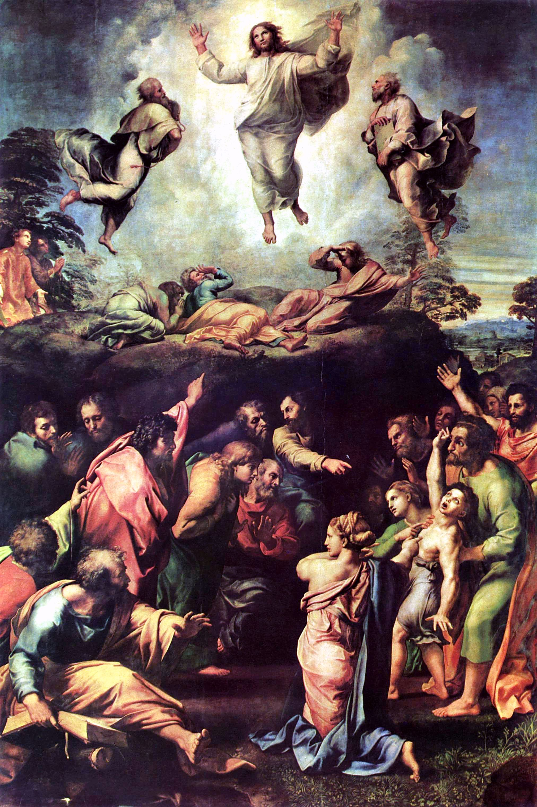

Spotkanie 2. - Czekanie, które jest odwagą
******************************************

Cel Spotkania
=============

Rewizja naszych wątpliwości - analiza ich struktury. Pokazanie, że odważne (nie przemyślane pod każdym kątem) decyzje są lepszą drogą nich paraliż związany z~brakiem decyzyjności. Wprowadzenie do tematu umiejętności czekania na owoce.

Wprowadzenie dla animatora
==========================

Spotkanie ma charakter silnie dzieleniowy. Należy bardzo świadomie kontrolować czas spotkania - **ważniejsze jest, aby ludzie się realnie podzieli swoim życiem niż realizacja nawet ½ tego konspektu**. Konspekt jest obszerny - posiada 39 pytań dzieleniowych (!), wybierz z~nich to, co dla Twojej grupy będzie największą wartością - nie próbuj zadawać ich wszystkich. Może się okazać, że część tych treści zostanie poruszona na konferencjach/świadectwach wcześniej - nie umiemy przewidzieć jak zawieje Duch Święty - ten konspekt jest buforem, który umożliwia dostosowanie lini programowej.

Modlitwa początkowa
===================

.. note:: ~5 minut

Modlitwa niech zmierza w~klimacie otwartości na Ducha Św., ale także otwartości na dzielenie się. Spotkanie ma zdecydowanie charakter dzieleniowy - bez stworzenia od samego początku atmosfery otwartości, zaufania, dotykania rzeczy ważnych to się nie uda. Modlitwa może znakomicie spełnić taką “funkcję”.

Dzielenie się Namiotem Spotkania
================================

.. note:: ~10 minut

* Co w~tym tekście było szczególnie dla Ciebie ważne?

* Jakie pytania zrodził w~Tobie ten tekst?

* Jak odczytujesz go w~swoim obecnym miejscu w~życiu?

* Co ma wspólnego ten tekst z~wątpliwościami?

Wprowadzenie do spotkania
=========================

.. note:: ~10 minut

Przeprowadźmy mały eksperyment: niech każdy napisze na trzech kartkach jakieś przestrzenie  życia w~której Waszym zdaniem często ludzie mają wątpliwości i~położy na środku stołu. Np.:

#. Przebieg meczu Polska-Niemcy

#. Wierność Basi wobec Karola

#. Ilość zwierząt na Arce Noego

#. Porównanie telefonu Nokia z~Samsungiem

Następnie niech każdy wybierze trzy kartki (nie swoje) i~odpowie do każdej na następujące pytania:

* Na czym może polegać wątpliwość w~tej przestrzeni?

* Czy jest to wątpliwość typu:

    * Niepewność przesłanek historycznych?

    * Niepewność rozeznania teraźniejszości?

    * Niepewność przyszłości?

* (opcjonalnie) Czy ta wątpliwość jest Ci bliska?

Podsumujmy:

* Którego rodzaju wątpliwości było najwięcej?

* Czy tak samo jest w~Twoim życiu? Jak jest?

* Czy ktoś był zaskoczony “podanym przykładem wątpliwości” do danej przestrzeni? O~czym to świadczy?

Moje wątpliwości, a~może po prostu brak decyzji?
================================================

.. note:: ~25 minut

Przeczytajmy wypowiedź:

    Paul Tilisch uważał, że najważniejsza granica nie przebiega między tymi, którzy mają się za wierzących, a~tymi, którzy uważają się za ateistów, lecz między grupą tych, którzy do pytań, jakie nasuwa wiara, odnoszą się obojętnie – czy chodzi o~konwencjonalnych ateistów, czy konwencjonalnych wierzących – a~tych, którzy te pytania poruszają – czy będą to wierzący, dla których wiara nie przestaje być "niezwykłą przygodą poszukiwania", czy ateiści, którzy w~ten czy inny sposób "mocują się z~Bogiem".

    -- ks.Tomasz Halik

* W~jakich sferach swojego życia przeżywasz obecnie jakieś wątpliwości?

* Co z~nimi robisz?

* Czy chcesz się ich pozbyć?

Wątpliwości nie są na pewno niczym komfortowym. Pokazują nam jednak, że dana rzecz jest dla nas wartościowa. Jeżeli coś mnie nie obchodzi to nie martwię się o~to.

Mamy jednak taką naturę, że czasami mówimy/myślimy, że na coś czekamy, ale tak naprawdę z~bardzo nikłą wiarą w~to, że w~końcu się doczekamy ;). Sprawdźmy jak to jest u~nas - za pomocą eksperymentu myślowego:

.. note::
    Dobrze oddaje to fragment poezji Jacka Kaczmarskiego - można przytoczyć:

    | W~niewoli - za wolnością płacze
    | Nie wierząc, by ją kiedyś zyskał,
    | Toteż gdy wolnym się zobaczy
    | Święconą wodą na nią pryska.
    | Bezpiecznie tylko chciał gardłować
    | I~romantycznie o~niej marzyć,
    | A~tu się ciałem stały słowa
    | I~Bóg wie co się może zdarzyć!

    “Według Gombrowicza narodu obrażanie”, 1993r.

* Załóżmy, że możesz zadać dwa pytania na które otrzymujesz pełną i~wyczerpująca odpowiedź na dowolny temat - jakie pytania zadajesz? Dlaczego?

.. note:: Pytanie nie jest trywialne. Pierwszą myślą moją było pytanie: “jak kochać prawdziwie?” - chwilę później było mi bardzo głupio, bo spojrzałem na ponad 1000 stronicową odpowiedź, która leży teraz na moim biurku w~chwili pisania tego konspektu i~do której często zerkam.

Uważajcie, aby ten fragment spotkania nie stał się grą w~“policję i~złodziei” - nie chcemy “chwycić” uczestników na niczym. Proponuje z~tego powodu, aby animator zaczął wyjątkowo jako pierwszy dzielić się swoją odpowiedzią. Dodatkowe założenie dla dociekliwych: zakładając, że odpowiedź będzie tak dostosowana i~przekazana, że ją w~100% zrozumiecie.

Wybory w~naszym życiu są czymś bardzo ważnym, ale czy nie paraliżują nas one? Czy nie mamy tak, że boimy się zdecydować z~powodu tego, że wyszukujemy tyle pytań, że wątpliwości biorą górę nad wszystkim?

* Co to znaczy dla Ciebie być pewnym swojego wyboru?

* Czy zawsze podejmujesz decyzję tylko wtedy gdy nie masz żadnych wątpliwości?

Zejdźmy na chwilę mocno na ziemię i~przypatrzmy się czemuś bardzo “zwykłemu”:
Jedną z~(ważnych) decyzji do podjęcia związaną z~naszym pobytem tutaj jest wybór jutrzejszego menu na niedzielne śniadanie! Lista możliwych wyborów zdaje się ogromna (choć znacząco ograniczona budżetem ;)). To powoduje, że możemy mieć wątpliwości: czy na pewno nasz wybór jest dobry? Ktoś mógłby się na tym tak zafiksować, że spędziłby 2 dni nad pytaniem: “lepsza jajecznica czy gotowana kiełbasa?”.

* Uważasz, że taka osoba się zachowuje odpowiedzialnie?

* Umiesz wskazać jakiś przykład u~siebie takiego zachowania?

* Co powinno się zrobić?

Zapisujemy gdzieś na kartce:

.. centered:: Wybrane = wartościowe

* Czy zgadzasz się z~tym równaniem?

Wysiłek związany z~podjęciem decyzji nadaje wartość wybranej drodze. To człowiek nadaje wartość swoim wyborom i~przestrzeniom z~którymi się styka - **każda sprawa/rzecz, która jest wybrana jest świadectwem wygranej walki z~wątpliwościami czyli samym sobą**. Choćby to jest wartością!

* Jakie rzeczy w~moim życiu, normalnie "zwykłe", stały się dla mnie bardzo wartościowe dzięki mojemu wyborowi?

Czekanie, które jest odwagą
===========================

.. note:: ~20 minut

Przeczytajmy:

    Królestwo niebieskie stanie się wtedy podobne do dziesięciu panien, które wzięły swoje lampy i~wyszły na spotkanie pana młodego. Z~nich pięć było głupich, pięć mądrych. Otóż głupie zabrały swoje lampy, ale nie wzięły ze sobą oliwy. Mądre natomiast wzięły w~naczyniach oliwę do swoich lamp. Gdy pan młody się spóźniał, wszystkie poczuły się senne i~na dobre się pospały. Nagle w~środku nocy wołanie się rozległo: "Oto pan młody, wychodźcie na spotkanie z~nim". Obudziły się wtedy wszystkie panny i~zaczęły szykować swoje lampy. Głupie powiedziały do mądrych: "Dajcie nam oliwy, bo nasze lampy gasną". Na to mądre odpowiedziały: "Jeszcze by nam i~wam zabrakło; lepiej idźcie do sprzedawców i~kupcie sobie". Gdy poszły kupować, przybył pan młody i~te gotowe weszły z~nim na wesele. Drzwi zostały zamknięte. Przyszły później także pozostałe panny i~wołały: "Panie, panie, otwórz nam!" Na to on odpowiedział: "Jakże to, pytam was: ja was nie znam". Czuwajcie zatem, bo nie znacie dnia ani godziny.

    -- Mt 25,1-13

* Jaką decyzję podejmują tutaj kobiety? (by wyjść na spotkanie pana młodego)

* Co następuje po decyzji? (czekanie)

* Jak się czujesz jak musisz na coś czekać?

Spróbujmy stworzyć listę rzeczy na które czekamy - wszystkie - świeckie, duchowe, osobiste, sercowe, itd. Każdą rzecz zapisujmy na kartce i~kładziemy/przypinamy w~widocznym dla wszystkich miejscu.

* Które “czekanie” najmniej lubicie?

* Które “czekanie”  uważacie za wartościowe, a~które nie? Dlaczego?

* Co myślisz o~stwierdzeniu: “człowiek, który musi czekać to człowiek słaby”? (Czekają w~kolejce do lekarza ci biedni - bogaci idą prywatnie. Czekają na lotnisku na odprawę mali - inni mają priorytetową odprawę. Czekają na przyjazd pkp ci, którzy nie mają swojego Lamborghini w~garażu itd.)

Jest obecna w~świecie tendencja, aby wyeliminować czekanie - aby wszystko było “instant”. Znamy to dobrze: Książki - tylko metodą szybkiego czytania. Zupka - proszek + wrzątek.  Można się uczyć 4h, ale można też mieć ściągę. I~tak dalej.

Popatrzcie co robi Kościół (animator wyciąga przygotowane kartki):

#. Wielki Post to **oczekiwanie** na Triduum

#. Okres Wielkanocny to **oczekiwanie** na Zesłanie Ducha Świętego

#. Adwent to **oczekiwanie** na Boże Narodzenie

#. Ze współżyciem mamy **czekać** aż do ślubu

#. Żyjąc tutaj na Ziemi **czekamy** na ponowne przyjście Jezusa

* Jak myślisz, dlaczego **czekanie** jest takie ważne?

Wakacyjny wyjazd w~góry z~przyjaciółmi, na który czekamy już od stycznia, bardzo często jest przygodą życia nawet jeśli przez 90% tego czasu padał deszcz.

Dopisujemy na kartce z~napisem “wybrane = wartościowe” nowy element:

.. centered:: wyczekane = wartościowe

* Czy zgadzasz się z~tym równaniem?

* Czy masz własne doświadczenie, że coś co było wyczekane smakowało lepiej?

To wszystko brzmi dość ładnie jako teoria, ale nie bójmy się jej skonfrontować z~naszym życiem:

* Na jakie rzeczy obecnie czekasz z~własnego wyboru, a~nie z~przymusu?

Przeskakiwanie etapów w~swoim życiu, których samemu się nie przeżyło jest oszustwem. Nie bójmy się tego powiedzieć. Nie da się nauczyć grać na gitarze w~dwa tygodnie. Podobnie jest z~życiem duchowym - jest w~nas duża pokusa, aby “pominąć” drogę i~oglądać od razu świat ze szczytu. Chcemy dotykać głębi, równocześnie nie ćwicząc się we wrażliwości na powiew wiatru, piękno, czy słowo. To niemożliwe.

.. warning:: Animatorze - to miejsce spotkania czeka na Twoje świadectwo. Odważne, otwarte, szczere świadectwo Twojej drogi. Nie powiem Ci o~czym masz mówić - mogę powiedzieć o~czym ja spróbuje powiedzieć: o~tym, że chciałem zacząć czytanie Pisma Świętego od Apokalipsy, bo wydawała mi się najbardziej “pro”. Opowiem o~tym, że próbowałem kochać innych omijając niewygodny temat kochania samego siebie. Opowiem, że prosiłem o~dary epifanijne równocześnie nigdy wcześniej nie modląc się regularnie codziennie wieczorem przez trzy tygodnie. Jestem przekonany, że dla każdego z~nas Adwent jest jakimś wyzwaniem.

Czekanie, które zmienia i~pozwala nam zmieniać
==============================================

.. note:: ~15 minut

Animator pokazuje obraz Rafaela “Przemienienie Pańskie”

* Czy domyślacie się co to za scena?

* Co się dzieje w~górnej części obrazu?

* Co odbywa się na dolnej?

Przeczytajmy fragment:

    Po sześciu dniach Jezus wziął z~sobą Piotra, Jakuba i~brata jego Jana i~zaprowadził ich na górę wysoką, osobno. Tam przemienił się wobec nich: twarz Jego zajaśniała jak słońce, odzienie zaś stało się białe jak światło. A~oto im się ukazali Mojżesz i~Eliasz, którzy rozmawiali z~Nim. Wtedy Piotr rzekł do Jezusa: «Panie, dobrze, że tu jesteśmy; jeśli chcesz, postawię tu trzy namioty: jeden dla Ciebie, jeden dla Mojżesza i~jeden dla Eliasza». Gdy on jeszcze mówił, oto obłok świetlany osłonił ich, a~z obłoku odezwał się głos: «To jest mój Syn umiłowany, w~którym mam upodobanie, Jego słuchajcie!» Uczniowie, słysząc to, upadli na twarz i~bardzo się zlękli. A~Jezus zbliżył się do nich, dotknął ich i~rzekł: «Wstańcie, nie lękajcie się!» wtedy podnieśli oczy, nikogo nie widzieli, tylko samego Jezusa.

    -- Mt 17,1-8

To opis górnej części obrazu - opis przemienienia Pańskiego. Zazwyczaj czytając go koncentrujemy się na nadzwyczajnych wydarzeniach, jakie miały tam miejsce - spójrzmy jednak dzisiaj trochę inaczej.

* Jak myślisz - jak czuło się pozostałych 9 apostołów, którzy nie poszli z~Jezusem?

* Jak myślicie ile całe wydarzenie trwało? (wiemy, że góra była wysoka ;))

* Co pozostało robić 9 apostołom w~tym czasie? (Czekać!)

Jezus “nie przejmuje się” tym, że uczniowie będą czekali. Jednak co się działo w~tym czasie? Możemy to wywnioskować czytając fragment:

    Gdy przyszli do tłumu, podszedł do Niego pewien człowiek i~padając przed Nim na kolana, prosił: «Panie, zlituj się nad moim synem! Jest epileptykiem i~bardzo cierpi; bo często wpada w~ogień, a~często w~wodę. Przyprowadziłem go do Twoich uczniów, lecz nie mogli go uzdrowić». Na to Jezus odrzekł: «O plemię niewierne i~przewrotne! Jak długo jeszcze mam być z~wami; jak długo mam was cierpieć? Przyprowadźcie Mi go tutaj!» Jezus rozkazał mu surowo, i~zły duch opuścił go. Od owej pory chłopiec odzyskał zdrowie. Wtedy uczniowie zbliżyli się do Jezusa na osobności i~pytali: «Dlaczego my nie mogliśmy go wypędzić?» On zaś im rzekł: «Z powodu małej wiary waszej. Bo zaprawdę, powiadam wam: Jeśli będziecie mieć wiarę jak ziarnko gorczycy, powiecie tej górze: "Przesuń się stąd tam!", a~przesunie się. I~nic niemożliwego nie będzie dla was. <Ten zaś rodzaj złych duchów wyrzuca się tylko modlitwą i~postem>».

    --  Mt 17,14-21

* Na podstawie opisu i~obrazu powiedz, czy apostołowie zwlekali z~działaniem, czy odważnie zdecydowali?

* Czy popełnili błąd? Czy Jezus krytykuje ich za decyzję?

* Jak Ty reagujesz, gdy po podjęciu decyzji sprawy nie toczą się według Twoich założeń?

Apostołowie odważnie zdecydowali (wybrane = wartościowe) i~dodatkowo mimo trudu, oraz niespodziewanego przebiegu sytuacji (wyrzucali już złe Duchy wcześniej!) potrafili czekać! Nie uciekli, nie próbowali zataić “niepowodzenia”, nie próbowali kombinować słowami typu: “tak naprawdę to się udało, ale zadziała dopiero jak Jezus przyjdzie”. Mimo, że być może dotknęło ich to, że nie byli wybrani, aby iść z~Jezusem na górę, to nie zablokowało ich to przed działaniem. Czekali z~wiarą i~doczekali się dobrego zakończenia (wyczekane = wartościowe). Przyjęli do wiadomości, że to jeszcze nie ich czas, że jeszcze czegoś nie wiedzą - Jezus daje im bardzo precyzyjne wskazówki na przyszłość: “Ten zaś rodzaj złych duchów wyrzuca się tylko modlitwą i~postem”. Zmienia zatem ich stan wiedzy, etap duchowy na którym się znajdują.

.. centered:: Zmienili się i~oni i~sytuacja w~jakiej byli

* Czy widzisz w~tym obrazie jakąś swoją sytuację z~życia?

Zastosowanie + modlitwa
=======================

.. note:: ~5 minut

Spróbujmy nazwać po imieniu trzy sprawy w~naszym życiu w~których próbujemy iść na skróty, w~których jesteśmy w~zły sposób niecierpliwi.

Jeżeli grupa jest na tyle dojrzała niech każdy poda intencje związaną z~“czekaniem”, a~następnie wszyscy odmówmy w~tej intencji np. Ojcze Nasz.
