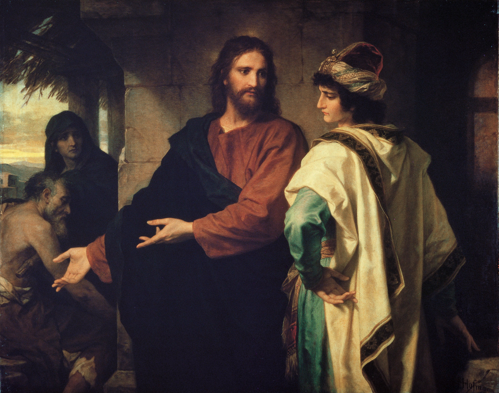

*******************************************
Spotkanie 2. - Sympatycy czy chrześcijanie?
*******************************************

=====================================
Cel Spotkania
=====================================

1. Na tym spotkaniu kluczowym jest podkreślenie kwestii **wierności**, tego, że dobre owoce przynosi tylko wytrwałe i~wierne zaangażowanie.
2. Uczestnicy powinni wyjść z przeświadczeniem, że nie da się być chrześcijaninem na pół gwizdka. Albo nim jesteś, albo nie.
3. Spotkanie podprowadza pod **modlitwę wieczorną** i~od niego zależy jak uczestnicy ją przeżyją.

==================================
Wprowadzenie dla animatora
==================================

Pewnie nie będzie to odkrycie, ale w~tym spotkaniu kluczowym momentem ma być świadectwo animatora. Życie rodzi się z życia, więc jeśli uczestnicy nie zobaczą przykładu kogoś, kto traktuje chrześcijaństwo na poważnie i~całkowicie się mu poświęca nie przekonają ich długie fragmenty z Pisma Świętego czy innych mądrych ksiąg.

    Chrzest daje pewną szansę, pewną możliwość, ale bez wysiłku człowieka może on pozostać w~człowieku martwy, nie objawić żadnych skutków.

    -- ks. Franciszek Blachnicki

==================================
Modlitwa początkowa
==================================

.. note:: ~5 minut

Modlitwa do Ducha Świętego o~pomoc w~dochowaniu wierności Bogu.

==================================
Wprowadzenie do spotkania
==================================

Jesteśmy po konferencji i~homilii, gdzie usłyszeliśmy, że wiara nie jest kwestią wychowania, że jest naszą decyzją, w~której trzeba trwać i~o którą trzeba walczyć. Co to jednak znaczy? W czym jest sens naszego “wierzenia” i~jak dbać o~ten dar, jakim jest wiara?

==========================================
Pasje
==========================================

.. note:: ~30 minut

Zacznijmy od zadania kilku pytań:

* Co to jest pasja?

* Czym charakteryzuje się człowiek z pasją?

* Jakie wy macie pasje? Czym się interesujecie? Co Wam sprawia największą radość i~satysfakcję?

Większość ludzi ma jakąś pasję. Coś, na czym mu zależy, na co poświęca wiele czasu, do czego z chęcią powraca.

* Po co? Dlaczego się męczyć? Po co poświęcać mnóstwo czasu na coś, z czego zazwyczaj nie ma żadnych korzyści?  Jakie są powody i~jaki jest cel?

* Czy wiara może być pasją?

Wśród ludzi  Piśmie Świętym spotykamy wielu ludzi, dla których wiara była ich największą pasją, dla której byli w~stanie wiele poświęcić.

Przeczytajmy:

    Noe, człowiek prawy, wyróżniał się nieskazitelnością wśród współczesnych sobie ludzi; w~przyjaźni z Bogiem żył Noe. A Noe był ojcem trzech synów: Sema, Chama i~Jafeta. Ziemia została skażona w~oczach Boga. Gdy Bóg widział, iż ziemia jest skażona, że wszyscy ludzie postępują na ziemi niegodziwie, rzekł do Noego: «Postanowiłem położyć kres istnieniu wszystkich ludzi, bo ziemia jest pełna wykroczeń przeciw mnie; zatem zniszczę ich wraz z ziemią. Ty zaś zbuduj sobie arkę z drzewa żywicznego, uczyń w~arce przegrody i~powlecz ją smołą wewnątrz i~zewnątrz. Ja zaś sprowadzę na ziemię potop, aby zniszczyć wszelką istotę pod niebem, w~której jest tchnienie życia; wszystko, co istnieje na ziemi, wyginie, ale z tobą zawrę przymierze. Wejdź przeto do arki z synami twymi, z żoną i~z żonami twych synów. Spośród wszystkich istot żyjących wprowadź do arki po parze, samca i~samicę, aby ocalały wraz z tobą od zagłady.Z każdego gatunku ptactwa, bydła i~zwierząt pełzających po ziemi po parze; niechaj wejdą do ciebie, aby nie wyginęły. A ty nabierz sobie wszelkiej żywności - wszystkiego, co nadaje się do jedzenia - i~zgromadź u siebie, aby była na pokarm dla ciebie i~na paszę dla zwierząt». I Noe wykonał wszystko tak, jak Bóg polecił mu uczynić.

    -- Rdz 6,9-14.17-22

* Co kierowało Noem?

* Dlaczego to zrobił?

* Jakie mogły być reakcje jego otoczenia na to, że budował ogromny statek na suchej ziemi? (śmiech, niezrozumienie, odrzucenie?)

Często spotykamy się z tym, że nasze pasje (zarówno zainteresowania, jak i~wiara) są niezrozumiane przez nasze otoczenie. Ludzie nie widzą sensu tego, co robimy, próbują nas odciągnąć od tego, czasem wyśmiewają.

* Jak zachowuję się w~takiej sytuacji? (tutaj powinna pojawić się jakaś wzmianka o~trudnościach i~zniechęceniu)

* Co jestem w~stanie poświęcić dla tego, co dla mnie ważne? Jakie pamiętam przykłady trudnych wyborów z mojego życia, gdy trzeba było z czegoś zrezygnować (‘teoretyczne’ priorytety życiowe vs. faktyczne zaangażowanie, poświęcony czas i~energia)?

Spójrzmy na inne postaci, które były w~stanie wiele poświęcić dla tego, w~co wierzyły.

Praca indywidualna: uczestnicy otrzymują kartki z fragmentem biblijnym/krótkim opisem postaci oraz pytaniami do tekstu. Każdy (również animator) zastanawia się nad podaną osobą, po czym na forum prezentujemy swoje przemyślenia i~szukamy cech wspólnych. Przykłady są 4, więc będą się powtarzać. Pamiętajcie o~tym, by wydrukować teksty dla wszystkich.

Piotr i~Jan (Dz 4,13-21)
    Przełożeni i~starsi, i~uczeni widząc odwagę Piotra i~Jana, a~dowiedziawszy się, że są oni ludźmi nieuczonymi i~prostymi, dziwili się. Rozpoznawali w~nich też towarzyszy Jezusa. A widząc nadto, że stoi z nimi uzdrowiony człowiek, nie znajdowali odpowiedzi. Kazali więc im wyjść z sali Rady i~naradzili się: Co mamy zrobić z tymi ludźmi? - mówili jeden do drugiego - bo dokonali jawnego znaku, oczywistego dla wszystkich mieszkańców Jerozolimy. Przecież temu nie możemy zaprzeczyć. Aby jednak nie rozpowszechniało się to wśród ludu, zabrońmy im surowo przemawiać do kogokolwiek w~to imię. Przywołali ich potem i~zakazali im w~ogóle przemawiać, i~nauczać w~imię Jezusa. Lecz Piotr i~Jan odpowiedzieli: Rozsądźcie, czy słuszne jest w~oczach Bożych bardziej słuchać was niż Boga? Bo my nie możemy nie mówić tego, cośmy widzieli i~słyszeli. Oni zaś ponowili groźby, a~nie znajdując żadnej podstawy do wymierzenia im kary, wypuścili ich ze względu na lud, bo wszyscy wielbili Boga z powodu tego, co się stało.

Mojżesz (fragment z krzewem gorejącym)
    Gdy Mojżesz pasał owce swego teścia, Jetry, kapłana Madianitów, zaprowadził [pewnego razu] owce w~głąb pustyni i~przyszedł do góry Bożej Horeb. Wtedy ukazał mu się Anioł Pański w~płomieniu ognia, ze środka krzewu. [Mojżesz] widział, jak krzew płonął ogniem, a~nie spłonął od niego. Wtedy Mojżesz powiedział do siebie: «Podejdę, żeby się przyjrzeć temu niezwykłemu zjawisku. Dlaczego krzew się nie spala?» Gdy zaś Pan ujrzał, że [Mojżesz] podchodził, żeby się przyjrzeć, zawołał <Bóg do> niego ze środka krzewu: «Mojżeszu, Mojżeszu!» On zaś odpowiedział: «Oto jestem». Rzekł mu [Bóg]: «Nie zbliżaj się tu! Zdejm sandały z nóg, gdyż miejsce, na którym stoisz, jest ziemią świętą». Idź przeto teraz, oto posyłam cię do faraona, i~wyprowadź mój lud, Izraelitów, z Egiptu». A Mojżesz odrzekł Bogu: «Kimże jestem, bym miał iść do faraona i~wyprowadzić Izraelitów z Egiptu?» A On powiedział: «Ja będę z tobą. Znakiem zaś dla ciebie, że Ja cię posłałem, będzie to, że po wyprowadzeniu tego ludu z Egiptu oddacie cześć Bogu na tej górze». Mojżesz zaś rzekł Bogu: «Oto pójdę do Izraelitów i~powiem im: Bóg ojców naszych posłał mię do was. Lecz gdy oni mnie zapytają, jakie jest Jego imię, to cóż im mam powiedzieć?» A jeśli nie uwierzą i~nie usłuchają słów moich, mówiąc, że Pan nie ukazał mi się wcale?» Wówczas Pan zapytał go: «Co masz w~ręku?» Odpowiedział: «Laskę». Wtedy rozkazał: «Rzuć ją na ziemię». A on rzucił ją na ziemię, i~zamieniła się w~węża. I rzekł Mojżesz do Pana: «Wybacz, Panie, ale ja nie jestem wymowny, od wczoraj i~przedwczoraj, a~nawet od czasu, gdy przemawiasz do Twego sługi. Ociężały usta moje i~język mój zesztywniał». Pan zaś odrzekł: «Kto dał człowiekowi usta? Kto czyni go niemym albo głuchym, widzącym albo niewidomym, czyż nie Ja, Pan? Przeto idź, a~Ja będę przy ustach twoich i~pouczę cię, co masz mówić». Lecz Mojżesz rzekł: «Wybacz, Panie, ale poślij kogo innego». I rozgniewał się Pan na Mojżesza, mówiąc: «Czyż nie masz brata twego Aarona, lewity? Wiem, że on ma łatwość przemawiania. Oto teraz wyszedł ci na spotkanie, a~gdy cię ujrzy, szczerze się ucieszy. Ty będziesz mówił do niego i~przekażesz te słowa w~jego usta. Ja zaś będę przy ustach twoich i~jego, i~pouczę was, co winniście czynić. Zamiast ciebie on będzie mówić do ludu, on będzie dla ciebie ustami, a~ty będziesz dla niego jakby Bogiem. A laskę tę weź do ręki, bo nią masz dokonać znaków».

św. Teresa Benedykta od Krzyża (Edyta Stein)
    Edyta Stein urodziła się w~wielodzietnej, ale zamożnej rodzinie żydowskiej we Wrocławiu. Była najmłodszym z jedenaściorga dzieci. Ojciec zmarł, kiedy miała tylko dwa lata, od tego czasu matka zajmowała się zarówno dziećmi, jak i~firmą swego zmarłego męża. Pomimo żywej wiary całej rodziny, a~zwłaszcza matki, w~14 roku życia Edyta zadeklarowała, iż jest ateistką. Studiowała na Uniwersytecie Wrocławskim germanistykę, historię. Od 1913 roku studiowała w~Getyndze pod kierunkiem Edmunda Husserla. Napisała i~obroniła u niego rozprawę doktorską O zagadnieniu wczucia. Za sprawą jednego ze swoich znajomych zetknęła się bliżej z katolicyzmem. Po śmierci swojego dobrego znajomego miała wpaść w~apatię i~rozdarcie duchowe. Pod wpływem wdowy po swoim przyjacielu, ewangeliczki, zaczęła przeżywać nawrócenie, co ostatecznie dokonało się, gdy przeczytała życiorys św. Teresy z Avili. 1 stycznia 1922 przyjęła chrzest w~Kościele katolickim, przyjmując imię Teresa. Jej wiara zostaje pogłębiona podczas studiowania m.in. prac świętego Tomasza z Akwinu. 13 października 1933 roku pożegnała się z rodziną (jej matka nigdy nie pogodziła się z decyzjami tak Edyty, jak i~innych dzieci). Następnego dnia wstąpiła do Karmelu w~Kolonii i~przyjęła imię Teresa Benedykta od Krzyża. Na duchowych opiekunów wybrała św. Teresę z Avili i~św. Jana od Krzyża. W obliczu narastających prześladowań Żydów 31 grudnia 1938 została przeniesiona do karmelu w~Echt w~Holandii. Cztery lata później 2 sierpnia 1942 aresztowało ją Gestapo, wraz z innymi katolikami pochodzenia żydowskiego, w~tym osobami konsekrowanymi. W czasie aresztowania miała powiedzieć swojej siostrze, Róży: Chodź, idziemy cierpieć za swój lud. Aresztantów osadzono najpierw w~przejściowym obozie Westerbork w~północnej Holandii. Ostatni raz widziano ją 7 sierpnia na dworcu głównym we Wrocławiu podczas postoju pociągu wiozącego ją wraz z innymi Żydami do obozu w~Oświęcimiu. Prawdopodobnie 9 sierpnia została zagazowana w~niemieckim obozie zagłady KL Auschwitz II-Birkenau.

św. Franciszek
    Franciszek przyszedł na świat w~rodzinie zamożnego kupca. Pierwsze lata swego życia spędził w~Asyżu. Uczęszczał do parafialnej szkoły przy kościele św. Jerzego, gdzie zdobył podstawowe wykształcenie. Mając 21 lat, wziął udział w~wojnie pomiędzy Asyżem a~Perugią. Na przełomie 1202 i~1203 roku, w~wyniku zdrady towarzysza, został uwięziony w~Perugii. Uwolniony w~1204, ze względu na ciężką chorobę powrócił do Asyżu. Rok 1205 jest początkiem powolnego procesu nawrócenia Franciszka. W czasie wyprawy wojennej do Apulii, w~Spoleto miał wizję, która zadecydowała o~kolejach jego życia. Ze względu na nawrót choroby ponownie wrócił do Asyżu, gdzie hojnie obdarował spotkanego po drodze trędowatego i~dał mu pocałunek pokoju. W asyskim kościele San Damiano jesienią tego samego roku usłyszał głos Chrystusa, przemawiającego z ikony krzyża, który kazał mu iść i~odbudować kościół. Remontując kościół sprzedał konia i~zabrał ze sklepu ojca kilka beli sukna, przez co popadł w~konflikt z nim. Ojciec najpierw uwięził go, a~potem, w~1206 roku, zaprowadził przed sąd biskupi (na życzenie Franciszka, który uważał, że żaden inny trybunał nie jest dla niego miarodajny). Biskup orzekł, że Franciszek powinien zwrócić ojcu koszty, na co Franciszek oświadczył, iż nie ma ojca – zdjął odzienie, zostając w~samej włosiennicy, złożył je i~razem z pieniędzmi oddał ojcu. Rozpoczął życie pokuty, m.in. asystując w~leprozorium. Wiosną 1209 roku Franciszek poprosił w~Rzymie o~zatwierdzenie napisanej przez siebie reguły zakonnej. W 1224 roku otrzymał święte stygmaty. Przeszył go straszny ból, a~gdy ocknął się, ujrzał, że stopy i~nadgarstki ma przebite gwoździami, bok zaś otwarty. W 1225 roku Franciszek zaczął coraz bardziej odczuwać dolegliwości związane z chorobą oczu. Za namową brata Eliasza poddał się bezskutecznym zabiegom lekarskim. Ostatnie miesiące swego życia spędził podróżując od miasta do miasta. Pod koniec pory letniej 1226 powrócił do Asyżu. Umarł, położony na własne życzenie bez ubrań na gołej ziemi, w~sobotę 3 października 1226 roku.

Pytania:

* Czym zajmowała się ta osoba? W czym przejawiała się jej pasja?

* Czy napotkała jakieś trudności? Jakie?

* Jak się zachowała w~tej sytuacji?

================================================
W czym jest problem?
================================================

.. note:: ~10 minut

Każda z tych osób napotkała na swojej drodze jakieś przeciwności, lecz zawsze udało się w~jakiś sposób je pokonać. Historia jest pełna takich ludzi, dla których wiara była najważniejszą wartością w~życiu i~którzy byli w~stanie poświecić dla niej wszystko. Nie są to jednak super herosi, ludzie bez żadnych wad, którzy nigdy nie zwątpili i~nigdy nie ponieśli porażki. Mówi o~tym 11. rozdział Listu Do Hebrajczyków.

.. note:: W tym momencie radzę dać uczestnikom z minutę, żeby przejrzeli sobie ten rozdział, zobaczyli o~co chodzi, przeczytali kilka losowych wersów, żeby zyskać ogólny obraz. Nie polecam czytać go na głos, niech zrobią to jako zastosowanie ze spotkania. Ważny jest komentarz i~interpretacja animatora, na przykład na podstawie tekstu poniżej. Animator oczywiście powinien przeczytać cały ten fragment przed spotkaniem.

Jak pisze abp Fulton Sheen:

    Gdy ogarnia nas pokusa popadnięcia w~rozpacz, warto zajrzeć do 11. rozdziału Listu do Hebrajczyków, który jest katalogiem starotestamentowych świętych. Warto od czasu do czasu przejrzeć ów katalog. A potem poczytajmy o~życiu tych starotestamentowych mężczyzn i~kobiet. Wszyscy oni byli niczym głownie wyciągnięte z pożogi. Noe: upił się po potopie. Abraham: Bóg kazał mu opuścić kraj wraz z jego żoną Sarą, a~on zabrał swojego bratanka i~jego żonę, o~których zabraniu Bóg nie wspominał, i~narobili mu kłopotów. Następnie udał się do Egiptu w~czasie głodu, zamiast zaufać Bogu, potem zgrzeszył z Hagar i~z tego związku narodził się Izmael. Mimo to Abraham w~samym tylko jednym rozdziale listu do Hebrajczyków aż jedenaście razy chwalony jest za swą wiarę. Mojżesz zabił człowieka. Samson, cudzołożnik, złamał swoje śluby nazirejczyka. Barak, generał, nie chciał iść na wojnę, chyba że dołączyłaby do niego kobieta, Debora, tak aby mógł oprzeć się na jej wojskowym osądzie. I tak dalej, i~tak dalej. W Starym Testamencie wydawali się oni zupełnie innymi ludźmi. Bóg wybrał ich nie kierując się tym, jacy byli, lecz tym, jacy mogli się stać. To dlatego wybrał nas: jesteśmy Jego narzędziami. Moc Boża objawia się w~tym, co może On zrobić z kruchą trzciną.

.. centered:: **Bóg nie powołuje uzdolnionych, lecz uzdalnia powołanych!**

Proponuję zapisać to zdanie na dużej kartce i~poprosić uczestników o~wypowiedzi na temat tego fragmentu spotkania.

* Czy zgadzasz się z tym?

* Czy masz podobne doświadczenia? Jakie?

==========================================
Co chcę zmienić? Kim chcę być?
==========================================

.. note:: ~5 minut

My też napotykamy na swojej drodze różne trudności. Każdy ma swój sposób na radzenie sobie z nimi. Nie można jednak poddawać się i~uznać “jestem beznadziejny, nic mi nie wychodzi, do niczego się nie nadaję”, lecz znaleźć przyczynę tego, ze nie wychodzi, że jest źle.

Czasem szukamy przyczyny naszych niepowodzeń w~zupełnie niewłaściwym miejscu. Zawsze chciałam grać na skrzypcach, nie wychodzi mi, dlaczego? Nie dlatego, że mam krzywe palce, ale może za mało ćwiczę, za szybko się zniechęcam, nie mam ochoty ćwiczyć gam, tylko od razu chciałabym grać Vivaldiego? A być może mam dobre palce i~nawet dużo ćwiczę tylko problem tkwi w~tym, że staram się grać partie przeznaczone na trąbkę?

Zastanówmy się (bez dzielenia się):

* Z czym miałem ostatnio problem? Co mi nie wyszło? Dlaczego się zniechęciłem?

* Co mogło być tego przyczyną?

* Czy widzę więcej takich sytuacji w~swoim życiu?

===============================================
Wierność
===============================================

.. note:: ~10 minut

.. note:: Ta część spotkania ma charakter opowiadania przez animatora. Warto zrobić ją w~formie rozmowy.

Jednym z podstawowych warunków osiągnięcia sukcesu i~satysfakcji jest wierność temu, co się robi. Tak jak nie nauczę się grać na skrzypcach bez żmudnego ćwiczenia nudnych gam, tak nie nauczę się modlić Namiotem Spotkania bez wielu godzin nad Pismem Świętym, gdy wydaje mi się, że nie ma to sensu.

Wierność nie jest łatwa. Zawsze łatwiej zrezygnować z czegoś, co jest dla nas trudne, niż wytrwać w~swojej decyzji. To jest miejsce na świadectwo o~wierności. Wierności drugiej osobie, wierności swoim decyzjom, wierności swoim zainteresowaniom, wierności tajemnicy, wierności modlitwie, w~końcu wierności samemu Bogu.

Brak wierności i~wytrwałości prowadzi do rozmiękczenia. Zaczynamy “skakać z kwiatka na kwiatek”, nic nam się nie podoba, w~nic się nie angażujemy na 100%, wszystko wydaje się szare i~nudne. Nasze życie powoli staje się miałkie i~traci sens.

.. warning:: Trudny moment, ale bardzo ważny. Nie pomijajcie tego ze względu na kilka trudnych słów i~pojęć. Zamiast tego upewnijcie się, że uczestnicy, szczególnie ci najmłodsi zrozumieli o~co chodzi. Nie obniżajmy poprzeczki. Wyjaśnijmy wszystkim co to jest relatywizm moralny i~prawda obiektywna, to niesamowicie ważne w~życiu każdego człowieka. I proszę nie czytać tych elaboratów uczestnikom, tylko ładnie się przygotować i~powiedzieć od serca ;).

W dzisiejszych czasach propaguje się poglądy, że nie istnieje prawda obiektywna, że życie to skala szarości, a~nie czarno-białe wybory. Króluje relatywizm moralny i~pogląd, że “każdy ma własną prawdę”. Wypacza się pojęcia tolerancji i~wolności słowa, gdy w~ramach tych koncepcji narusza się godność drugiego człowieka. Nie pozwólmy sobie wmówić, że nie ma dobra ani zła, a~prawda leży pośrodku.

    Według mnie, właśnie relatywizm moralny jest dziś największym zagrożeniem dla ludzi młodych. Bardzo często słyszymy, że każdy ma prawo do własnego zdania. Owszem, ma prawo, ale pod warunkiem, że nie opiera się ono na fałszu. Jeżeli osoba "A" twierdzi, że suknie czerwone są ładniejsze od niebieskich, a~osoba "B", że jest odwrotnie, to wszystko jest w~porządku. Natomiast jeżeli osoba "A" twierdzi, że 2+2=5, a~osoba "B", że 2+2=4 to znaczy, że osoba "B" ma rację, zaś osoba "A" myli się. Prawda nie leży pośrodku, osoba "A" nie ma prawa do własnego zdania. To, że 2+2=4, jest po prostu obiektywną prawdą. Podobnie jest z wartościami moralnymi. Coś jest albo dobre, albo złe. Radykalizm ewangeliczny polega na jasnym rozróżnieniu jednego od drugiego, innymi słowy na nie oszukiwaniu samego siebie.

    -- Bartek Szaraniec (http://szara.jezuici.pl/)

Przeczytajmy:

    Patrz! Kładę dziś przed tobą życie i~szczęście, śmierć i~nieszczęście. Ja dziś nakazuję ci miłować Pana, Boga twego, i~chodzić Jego drogami, pełniąc Jego polecenia, prawa i~nakazy, abyś żył i~mnożył się, a~Pan, Bóg twój, będzie ci błogosławił w~kraju, który idziesz posiąść. Ale jeśli swe serce odwrócisz, nie usłuchasz, zbłądzisz i~będziesz oddawał pokłon obcym bogom, służąc im - oświadczam wam dzisiaj, że na pewno zginiecie, niedługo zabawicie na ziemi, którą idziecie posiąść, po przejściu Jordanu. Biorę dziś przeciwko wam na świadków niebo i~ziemię, kładąc przed wami życie i~śmierć, błogosławieństwo i~przekleństwo. Wybierajcie więc życie, abyście żyli wy i~wasze potomstwo, miłując Pana, Boga swego, słuchając Jego głosu, lgnąc do Niego; bo tu jest twoje życie i~długie trwanie twego pobytu na ziemi, którą Pan poprzysiągł dać przodkom twoim: Abrahamowi, Izaakowi i~Jakubowi.

    -- Pwt 30,15-20

Sam Bóg sam mówi, że wybór jest tylko pomiędzy dobrem, a~złem, że nie ma rzeczy pośrednich, czegoś takiego jak “trochę śmierć” lub “lekkie przekleństwo”.

.. note:: Można dodać jeszcze Mt 5,37: Niech wasza mowa będzie: Tak, tak; nie, nie. A co nadto jest, od Złego pochodzi.

==========================================
Sympatycy czy chrześcijanie?
==========================================

.. note:: ~20 minut

W Ewangelii wg św. Marka czytamy historie kogoś, kto stanął przed podobnym wyborem:

    Gdy wybierał się w~drogę, przybiegł pewien człowiek i~upadłszy przed Nim na kolana, pytał Go: «Nauczycielu dobry, co mam czynić, aby osiągnąć życie wieczne?» Jezus mu rzekł: «Czemu nazywasz Mnie dobrym? Nikt nie jest dobry, tylko sam Bóg. Znasz przykazania: Nie zabijaj, nie cudzołóż, nie kradnij, nie zeznawaj fałszywie, nie oszukuj, czcij swego ojca i~matkę». On Mu rzekł: «Nauczycielu, wszystkiego tego przestrzegałem od mojej młodości». Wtedy Jezus spojrzał z miłością na niego i~rzekł mu: «Jednego ci brakuje. Idź, sprzedaj wszystko, co masz, i~rozdaj ubogim, a~będziesz miał skarb w~niebie. Potem przyjdź i~chodź za Mną!» Lecz on spochmurniał na te słowa i~odszedł zasmucony, miał bowiem wiele posiadłości.

    -- Mk 10,17-22

Zinterpretujmy ten fragment wspomagając się obrazem namalowanym przez Heinricha Hoffmanna.

* Jak zachowuje się młodzieniec?

* Jak zachowuje się Jezus?

* Co dzieje się w~tle?

Młodzieniec nie potrafił opowiedzieć się po żadnej ze stron. jest dobry, zachowuje przykazania, lecz brak mu gorliwości, nie potrafi się poświęcić i~zaangażować w~pełni.

* Jak jest z nami?

* Co potrafimy poświęcić dla naszej wiary?

* Czy angażujemy się w~wiarę w~pełni, czy wybieramy sobie tylko dogodne nam elementy?

Nie można być “wierzącym-niepraktykującym” “trochę chrześcijaninem” albo “katolikiem, ale bez przesady”. Albo jestem chrześcijaninem, albo nie. Nie możemy być “sympatykami”, którzy wiarę traktują luźno i~niezobowiązująco. Możliwe cele są tylko dwa: 0% lub 100%.
(Oczywiście nie jesteśmy idealni i~w~danym momencie naszego życia może być nas stać tylko na 75%, ale naszym celem zawsze powinno być 100%. Nie możemy ustawić sobie celu na 60% i~zastanawiać się dlaczego idzie źle, jest szaro i~nijako).

==========================================
Tylko na całego
==========================================

.. note:: ~5 minut

Jeżeli chrześcijaństwo, to na całego  - tylko takie ma sens

* Co to znaczy “na całego”? Jakie są wyznaczniki?

Prezczytajmy:

    | «Błogosławieni ubodzy w~duchu, albowiem do nich należy królestwo niebieskie.
    | Błogosławieni, którzy się smucą, albowiem oni będą pocieszeni.
    | Błogosławieni cisi, albowiem oni na własność posiądą ziemię.
    | Błogosławieni, którzy łakną i~pragną sprawiedliwości, albowiem oni będą nasyceni.
    | Błogosławieni miłosierni, albowiem oni miłosierdzia dostąpią.
    | Błogosławieni czystego serca, albowiem oni Boga oglądać będą.
    | Błogosławieni, którzy wprowadzają pokój, albowiem oni będą nazwani synami Bożymi.
    | Błogosławieni, którzy cierpią prześladowanie dla sprawiedliwości, albowiem do nich należy królestwo niebieskie.
    | Błogosławieni jesteście, gdy [ludzie] wam urągają i~prześladują was, i~gdy z mego powodu mówią kłamliwie wszystko złe na was. Cieszcie się i~radujcie, albowiem wasza nagroda wielka jest w~niebie. Tak bowiem prześladowali proroków, którzy byli przed wami.

    -- Mt 5,3-11

Jeśli przystępujesz do jakiegoś klubu, przyjmujesz wszystkie jego zasady, a~nie wybierasz sobie tylko te, które najbardziej Ci pasują (nie kafeteria religijna).
Na dzisiejszej modlitwie wieczornej będziemy prosić o~łaskę, żeby to, o~czym rozmawialiśmy na spotkaniu udało się nam wcielić w~życie. Najbardziej podstawowym wyznacznikiem radykalnego zaangażowania na serio w~wiarę jest 10 przykazań. Dzisiejsza modlitwa będzie oddaniem Bogu naszego postanowienia o~podjęciu radykalnego życia Ewangelią.

.. note:: To jest dobry moment na wręczenie uczestnikom kartek na modlitwę wieczorną

Treść kartek:

.. image:: kartka.*
   :align: center

==========================================
Zastosowanie
==========================================

.. note:: ~1 minuta

* Przeczytam Hbr 11 i~poznam historię jednej osoby tam wymienionej, której nie znam (o ile taka jest)

* Wypiszę w~notatniku rzeczy, które w~życiu robię na 100% i~te, w~które nie chcę lub nie potrafię zaangażować się w~pełni.

==========================================
Modlitwa na zakończenie spotkania
==========================================

.. note:: ~4 minuty

Modlitwa zawierzenia Bogu naszego chrześcijaństwa, prośba o~to, by uzdolnił nas do bycia chrześcijanami na serio, do budowania Jego Królestwa wszędzie tam, dokąd nas pośle. Propozycją zakończenia tej modlitwy jest fragment Psalmu 51:

    | Stwórz, o~Boże, we mnie serce czyste
    | i~odnów w~mojej piersi ducha niezwyciężonego!
    | Nie odrzucaj mnie od swego oblicza
    | i~nie odbieraj mi świętego ducha swego!
    | Przywróć mi radość z Twojego zbawienia
    | i~wzmocnij mnie duchem ochoczym!
    | Chcę nieprawych nauczyć dróg Twoich
    | i~nawrócą się do Ciebie grzesznicy.
    | Od krwi uwolnij mnie, Boże, mój Zbawco:
    | niech mój język sławi Twoją sprawiedliwość!
    | Otwórz moje wargi, Panie,
    | a~usta moje będą głosić Twoją chwałę

    -- Ps 51,12-17
