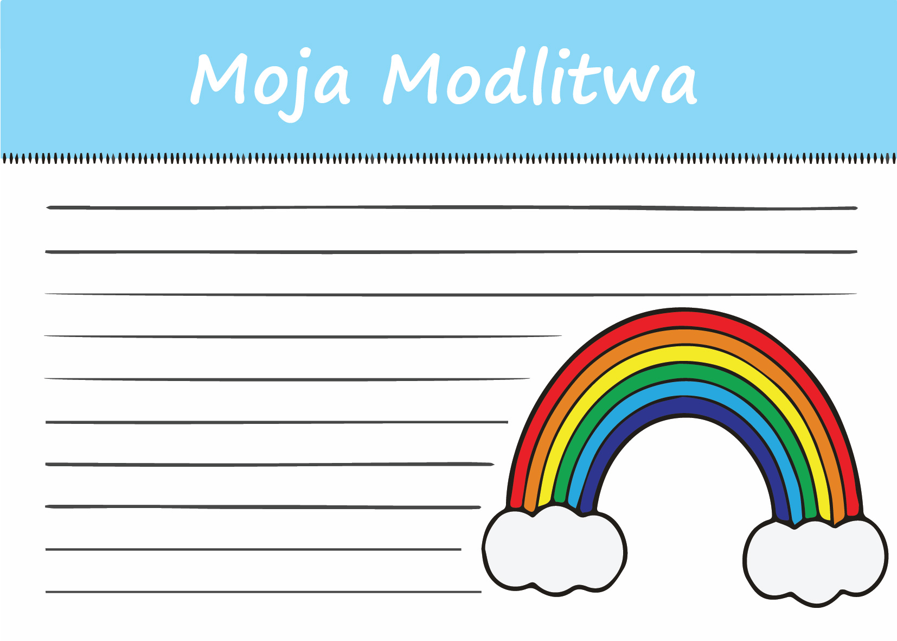

Spotkanie 4. - Moja Haggada
***************************

Wprowadzenie dla animatora
==========================

To ostatnie spotkanie w~grupach. Będzie to czas swoistego podsumowania drogi małej grupy. Celem tego spotkanie jest po pierwsze refleksja nad “moją haggadą” - co jest tym, co w~moim doświadczeniu Boga jest unikatowego. Kluczowe pytania spotkania: **“Co chciałbym opowiedzieć swoim życiem? Co chciałbym, aby inni we mnie przeczytali?”** Po drugie chcemy zainspirować uczestników do świadomego przekazywania opowieści dalej.

Wprowadzenie
============

Wczoraj w~trakcie pieśni Dayenu mówiliśmy wielokrotnie, że “już by wystarczyło”. Ta postawa wdzięczności i~wrażliwości na dobro urzeka u~żydów. Nasze rekolekcje jeszcze się nie skończyły, ale może nie przeszkadza nam to zauważyć już jakiegoś elementu, o~którym moglibyśmy powiedzieć podobnie?

- Co odkryliśmy w~trakcie Namiotu Spotkania?
- Jaki moment naszych spotkań lub rekolekcji do tej pory chciałbym wyróżnić? Dlaczego?

Tajemnica Tej Samej Nocy
========================

W czasie wczorajszego wieczoru sederowego we wprowadzeniu usłyszeliśmy:

    W~pewnym sensie, dzisiejszej nocy odbędziemy podróż w~czasie. Żydowska tradycja uczy, że **każdy musi spojrzeć na siebie, jakby był uczestnikiem wyjścia z~niewoli egipskiej**.

To nie jest proste! Pewne rzeczy w~wierze łatwo przyjąć jakby poprzez szklaną szybę - intelektualnie rozumieć koncepty, ale oglądać jako obserwator z~zewnątrz - bez własnego uczestnictwa.

- Które elementy wiary najłatwiej przychodzi mi odnosić do mojego doświadczenia?
- Który moment Triduum Paschalnego, na chwilę obecną, wydaje mi się najbliższy mojej duchowości?

Autor listu do Hebrajczyków powie: “Żywe bowiem jest słowo Boże, skuteczne i~ostrzejsze niż wszelki miecz obosieczny, przenikające aż do rozdzielenia duszy i~ducha, stawów i~szpiku, zdolne osądzić pragnienia i~myśli serca”. Słowo Boże na pewno takie jest, ale my nie zawsze jesteśmy tak na nie nastawieni. W~wierze czymś normalnym jest dla nas funkcjonowanie bez takiej pełnej świadomości - raczej do niej aspirujemy, staramy się o~to.

    Czymże jest czas? Jeśli nikt mnie o~to nie pyta, wiem. Jeśli pytającemu usiłuję wytłumaczyć, nie wiem.

    -- św. Augustyn

- Czy mam doświadczenie “uciekania odpowiedzi” gdy próbuję tłumaczyć? Jaką rolę w~mojej duchowości odgrywa intuicja?
- Jak wygląda moja zgoda na istnienie ważnych rzeczy, które “wiem, ale jak zapytają to nie wiem”?

Więc z~jednej strony chodzi o~“podróż w~czasie” i~przeżyliśmy to wczoraj podczas wieczoru sederowego, ale równocześnie jednak nawet sam św. Augustyn dostrzega problem w~rozumieniu pojęcia czasu jako człowiek wierzący. Otwarcie się na te tajemnice zdaje się, że wymagają od nas wejścia w~przestrzeń intuicji, serca, głębi.

W Wielki Czwartek dodaje się Anaforę do Modlitwy Eucharystycznej:

    On to w~dzień przed męką * za zbawienie nasze i~całego świata, **to jest dzisiaj**, wziął chleb w~swoje święte i~czcigodne ręce, podniósł oczy ku niebu, * do Ciebie, Boga, swojego Ojca wszechmogącego, * i~dzięki Tobie składając, błogosławił,* łamał i~rozdawał swoim uczniom, mówiąc…

Łatwo przeoczyć te trzy krótkie wyrazy, a~jak ważną rzecz nam przypominają.

- Czy zwróciliśmy kiedyś uwagę na tę anaforę?
- Co może zmienić w~przeżywaniu naszej wiary taka “dosłowna” interpretacja słów “To jest Ta Sama Noc” z~Exsultetu?

“Teraz”
=======

.. note:: Apoftegmat (gr. apóphthegma, ~matos – sentencja, wypowiedź) – krótki utwór literacki, wierszowany lub prozatorski, prezentujący dowcipną, błyskotliwą, trafną wypowiedź wybitnej postaci (np. władcy).

Jest taka pouczająca opowieść pochodząca z~apoftegmatów Ojców Pustyni:

    | Otóż jednego z~ojców pustyni zapytali jego uczniowie: – Abba, dlaczego wciąż jesteś taki pogodny, radosny i~wolny?
    | Na co usłyszeli następująca odpowiedź: – Bo żyję chwilą obecną. A~to pozwala mi czerpać z~życia pełnymi garściami, nie martwiąc się o~przeszłość i~przyszłość.
    | Wtedy uczniowie zapytali go: – Abba, a~jak to robisz?
    | Odpowiedział: – Gdy jem, to jem, gdy się modlę, to się modlę, gdy pracuję, to pracuję, a~gdy odpoczywam, to odpoczywam – odpowiedział mnich.
    | – To tak samo jak my – odrzekli uczniowie.
    | – Nie! – odpowiedział pustelnik – Wy, gdy się modlicie, myślicie o~jedzeniu, gdy jecie, to myślicie o~pracy, gdy pracujecie, to myślicie o~odpoczynku, gdy odpoczywacie, to myślicie o~pracy. Nie żyć chwilą obecną, lecz ciągle rozpamiętywać przeszłość lub myśleć o~przyszłości to najlepsza recepta na to, aby życie przeciekało nam między palcami.

- Jak wygląda moja umiejętność życia w~“teraz”?
- W~jaki sposób możemy pomóc samym sobie za trzy tygodnie (a może lepiej dzisiaj?) być w~stanie być obecnymi uczestnikami tajemnic wiary?

Ta wrażliwość na “teraz” to jedna z~najważniejszych lekcji z~jaką przychodzi do nas Zbawiciel. Zbawiciel o~imieniu Jehoszua (Jezus), które samo w~sobie oznacza “Jahwe jest zbawieniem” - ani nie “był zbawieniem”, ani “będzie zbawieniem”.

Przeczytajmy

    Albowiem On jest naszym Bogiem, a~my ludem Jego pastwiska i~owcami w~Jego ręku. Obyście usłyszeli dzisiaj głos Jego: Nie zatwardzajcie serc waszych jak w~Meriba, jak na pustyni w~dniu Massa

    -- Ps 95,7-8

Zobaczmy jaki komentarz do tego pisze Katechizm Kościoła Katolickiego:

    W~niektórych chwilach uczymy się modlić, słuchając słowa Pana i~uczestnicząc w~Jego Misterium Paschalnym, ale w~każdym czasie w~wydarzeniach codzienności otrzymujemy Jego Ducha jako źródło naszej modlitwy. Nauczanie Jezusa o~modlitwie do naszego Ojca ma ten sam kontekst co nauczanie o~Opatrzności: czas jest w~rękach Ojca; spotykamy Go w~teraźniejszości, nie wczoraj ani jutro, ale dzisiaj: "Obyście usłyszeli dzisiaj głos Jego: «Nie zatwardzajcie serc waszych»" (Ps 95, 7-8).

    -- KKK 2659

- Co Bóg mówi teraz do naszego Kościoła? Jaki głos słyszymy?
- Co Bóg mówi teraz do mnie?
- Jakimi 5 słowami określiłbym moje “dzisiaj”?

.. note:: Animator wyciąga schemat świątyni i~plan domu z~wczoraj. Poszczególne “strefy” zaznaczone pojedynczym kolorem są na nim “splecione” za pomocą sznurków (najlepiej tych samych kolorów co każda ze stref) - przebite przez papier i~dosłownie zszywające dwie kartki ze sobą . Kładzie je na stole. Jest to zakończenie pewnego leitmotivu - Mamy dom (profanum) i~mamy sacrum (świątynia). W~jednym i~drugim mamy różne “strefy” odpowiadające naszym potrzebom. To tylko pozornie różne przestrzenie - są ze sobą splecione i~bez siebie nie funkcjonują. (Proszę o~wrażliwość animatorów - domy ateistów oczywiście mogą funkcjonować bardzo dobrze. Mówimy o~domach osób wierzących.)

Odwołajmy się jeszcze raz do słów św. Augustyna i~oddajmy mu komentarz do tego co widzimy:

    Pamiętaj o~tym, że twoje swobodne i~wolne od zajęć chwile obciążone są największymi zadaniami i~odpowiedzialnością.

    -– św. Augustyn

- Jak odnosisz to zdanie i~ten obraz (zszytych kartek) do swojego życia? Jak się z~tym czujesz?
- Co tracimy dzieląc świat na sacrum i~profanum?
- Co mogę zrobić, aby zmniejszyć ten podział w~moim życiu?

Moja Haggada
============

Przeczytajmy:

    **W tym dniu będziesz opowiadał synowi swemu**: Dzieje się tak ze względu na to, **co uczynił Pan dla mnie w~czasie wyjścia z~Egiptu**. Będzie to dla ciebie znakiem na ręce i~przypomnieniem między oczami, aby prawo Pana było w~ustach twoich, gdyż ręką potężną wywiódł cię Pan z~Egiptu. I~będziesz zachowywał to postanowienie w~oznaczonym czasie rok w~rok,

    -- Wj 13,8-10

Bóg polecił, aby przekazywać co dla nas uczynił. To odwołanie się do tego mistycznego “teraz”.

- “Co Bóg uczynił dla Ciebie w~czasie Twojego wychodzenia z~Egiptu?” - jak się czujesz z~takim pytaniem? Jak na nie odpowiesz?
- W~jaki sposób w~naszym doświadczeniu duchowym mieścimy wszystkie wydarzenia historii zbawienia?
- Co taka perspektywa zmienia?

Wydarzenia z~wczorajszej haggady nie były w~przeszłości - jesteśmy ich “naocznymi świadkami”, więc możemy je opowiadać. Dokonuje się to w~mocy Ducha Świętego, ale także w~takim wymiarze bardzo praktycznym - czy nie mieliśmy nigdy poczucia zniewolenia, z~którego musimy uciec? Czy nigdy nie zapomnieliśmy o~Bogu tak, że gdy odezwała się w~nas tęsknota za Nim to nasza modlitwa była niczym Psalmy lamentacyjne?

Przeczytajmy:

    Chwalcie Pana, bo dobry,bo na wieki Jego łaskawość. **Któż opowie dzieła potęgi Pana,ogłosi wszystkie Jego pochwały?**

    -- Ps 106,1-2

Odnajdywanie fragmentów, które są nam bliskie, w~Biblii to tylko pierwszy etap. Bóg w~Księdze Wyjścia wprost powiedział “będziesz opowiadał”. Psalmista zadaje to pytanie, które brzmi w~powietrzu niczym wyrzut - Kto odpowie na wezwanie Pana?

- **Co chciałbym opowiedzieć swoim życiem? Co chciałbym, aby inni we mnie “przeczytali”?**

To nie jest tylko kwestia naszej decyzji. Tak naprawdę “czy chcę czy nie chcę opowiadam”. Nawet gdy w~jakiejś sytuacji zachowujemy milczenie to jest to “milczenie znaczące”. Także w~naszej małej grupie funkcjonujemy razem od 48h - to wystarczająco długo, aby każdy z~nas był opowieścią, którą pozostali członkowie grupy mogą odczytać i~odnieść do siebie.

- Co my sobie opowiedzieliśmy od piątku? Jaka myśl kogoś z~grupy, czy kogoś z~diakonii była dla mnie ożywczą opowieścią o~“potędzę Pana, jego pochwałą”?

Źródło, które jest ratunkiem
============================

Znać wartość opowieści. Umieć budować relacje intymne, w~których się słuchamy. Nieustannie interpretować, ale nie chcieć nigdy zinterpretować. Nie dzielić świata na sacrum i~profanum. Nie ulegać “pokusie profesjonalizacji”. Opowiedzieć komuś Ewangelię jako naoczny świadek działania Chrystusa - to zebranie myśli z~naszych ostatnich spotkań w~grupie. Dużo tego, prawda? Może człowiek się złapać za głowę i~ugiąć pod wagą tego do czego nas Jezus zaprasza.

- Co w~tych tematach, które razem poruszyliśmy wydaje mi się dla mnie osobiście największym wyzwaniem?

Przeczytajmy:

    Lecz najpierw musi być głoszona Ewangelia wszystkim narodom. A~gdy was poprowadzą, żeby was wydać, nie martwcie się przedtem, co macie mówić; ale mówcie to, co wam w~owej chwili będzie dane. Bo nie wy będziecie mówić, ale Duch Święty.

    -- Mk 13,10-11

I zaraz potem:

    Każdy człowiek świecki winien być wobec świata świadkiem zmartwychwstania i~życia Pana Jezusa i~znakiem Boga żywego. Wszyscy razem i~każdy z~osobna winni żywić świat owocami duchowymi i~napełniać go takim duchem, jakim ożywieni są owi ubodzy, łagodni i~pokój czyniący, których Pan nazwał w~Ewangelii błogosławionymi. Słowem „czym dusza jest w~ciele, tym niechaj będą w~świecie chrześcijanie”

    -- Konstytucja dogmatyczna o~Kościele „Lumen Gentium”, KK 38

- Co jest źródłem umożliwiającym nam prowadzić opowieść, która nas przerasta?
- “mówcie to, co wam w~owej chwili będzie dane” - co to dla nas oznacza?
- W~jaki sposób w~opowieści opierać się na Łasce?

Nie próbujmy być chrześcijanami, którzy podejmują się dorastania do wymagań Ewangelii bez polegania na Bożym błogosławieństwie. Zadanie, które przed nami jest wielkie, ale pamiętajmy, że jeśli jest to wola Jezusa to On sam zadba o~skuteczność.

Przeczytajmy:

    Na początku było Słowo, a~Słowo było u~Boga, i~Bogiem było Słowo. Ono było na początku u~Boga. Wszystko przez Nie się stało, a~bez Niego nic się nie stało, co się stało. W~Nim było życie, a~życie było światłością ludzi, a~światłość w~ciemności świeci i~ciemność jej nie ogarnęła.

    -- J 1,1-5

Nie ma lepszego narratora na ziemi niż On, Słowo! Jezus chce być naszym narratorem.

Wyjście
=======

Wróćmy do parafii i~opowiedzmy tam co tu przeżyliśmy. Przed nami Triduum Paschalne. Nasze przeżycie rekolekcji z~kontekstem żydowskim wkłada nam w~serce jakąś wartość, którą możemy przekazać dalej.

.. note:: Animator rozdaje uczestnikom małe kartki

+---------+---------+
| |kudo1| | |kudo2| |
+---------+---------+
| |kudo3| | |kudo4| |
+---------+---------+

To prosta forma. Może nawet w~jakiś sposób niepoważna. Ale skoro możemy trzymać bez oporów np. w~Piśmie Świętym obrazki z~ułożonymi modlitwami to dlaczego nie napisać samemu jednego takiego obrazka? Samemu opowiedzieć jakąś, krótką historię - postawić się po stronie tworzącego, a~nie odbiorcy?

- Którą kartkę byłoby Ci najłatwiej uzupełnić i~włożyć do swojego Pisma Świętego? Jak myślisz dlaczego?
- Którą kartkę byłoby Ci najłatwiej uzupełnić i~podarować komuś? Dlaczego? Komu byś ją przekazał/przekazała?

Weźmy jedną kartkę i~spróbujmy wypełnić ją w~trakcie tego spotkania

.. note:: Animator daje czas, aby każdy wybrał kartkę i~ją wypełnił (ok 5 minut)

- Co dało Ci to doświadczenie? Co powiedziało Ci o~Tobie samym/samej?

Zastosowaniem z~tego spotkania niech będzie wypełnienie wszystkich kartek do Triduum Paschalnego i~decyzja, które przekażemy/pokażemy innym, a~które zachowamy tylko dla siebie.

.. centered:: **Niech opowieść trwa!**
