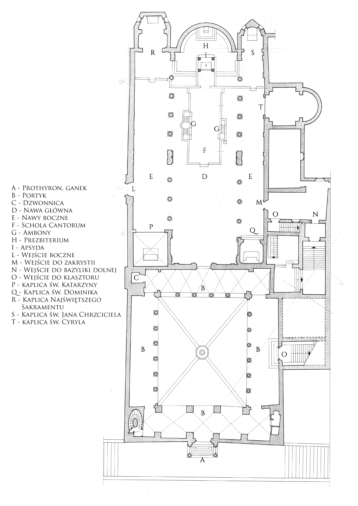
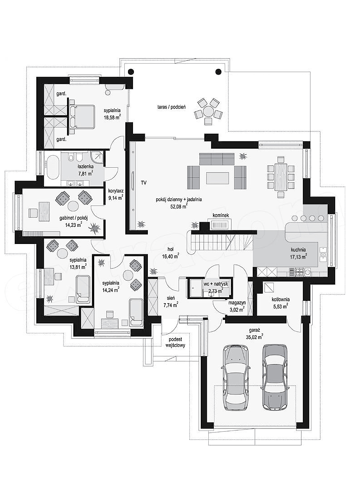

Spotkanie 3. - Wiara zadomowiona
********************************

Wprowadzenie dla animatora
==========================

Trzecie spotkanie w~grupach na rekolekcjach “Ta Sama Noc” jest najdłuższe. Czas ten chcemy wykorzystać do zbudowania atmosfery dzielenia i~otwartości. To ostatni moment spotkania się razem grupy przed przeżyciem punktu kulminacyjnego rekolekcji.

Celem tego spotkania jest przygotowanie do przyjęcia sederu jako przestrzeni domowej. Jeśli seder będzie tylko kolejnym “nabożeństwem” odprawianym dla nas przez “mistrza ceremonii" nic nie zrozumiemy z~żydowskiego (a więc i~chrześcijańskiego) pojęcia wiary. Kluczowe jest by nie ulec “pokusie profesjonalizacji” w~duchowości.

Wprowadzenie
============

Jesteśmy w~połowie naszych rekolekcji. Co się u~nas dzieje? Co Bóg w~nas teraz porusza?

- Co odkryliśmy w~trakcie Namiotu Spotkania nad Exsultetem?
- Co wyciągamy dla siebie z~“Drogi Opowieści”?

Rola zdziwienia
===============

Od wczoraj rozmawiamy o~roli opowieści i~o tym jak ona jest ważna. Pozwólmy sobie zacząć to nasze spotkanie od przeczytania fragmentu, który jest niejako podsumowaniem tego, co za nami:

    Wobec ponowoczesnej alergii na „wielkie narracje” teologia – sama z~istoty swej będąca taką opowieścią – stanowić może proroczy znak tego, że ludzkość bez wielkich opowieści sobie nie radzi zbyt dobrze. A~jeśli zabraknie opowieści prawdziwie wielkich, ich miejsce w~ludzkim imaginarium chętnie zajmą narracje karłowate, populistyczne, ideologizujące.

    -- ks. Grzegorz Strzelczyk

Można odczuwać pewną niemoc wobec obecnego dystansu do wielkich opowieści. Jak wskrzesić wielkie opowieści do życia w~przestrzeni pomiędzy nami? Gdzie każda z~nich ma swój początek?

Przeczytajmy:

    Pan skierował do mnie te słowa: «Synu człowieczy, zadaj zagadkę i~opowiedz przypowieść domowi izraelskiemu. Powiesz: Tak mówi Pan Bóg: Orzeł wielki, o~skrzydłach rozłożystych i~długich piórach, pokryty pstrym pierzem, przyleciał nad Liban i~zabrał wierzchołek cedru. Ułamał koniec jego pędów, zaniósł do kraju kupieckiego i~złożył go w~mieście handlowym. Następnie wziął szczep z~tego kraju i~zasadził na roli urodzajnej, i~umieścił go nad obfitymi wodami, i~zasadził jak wierzbę, by rósł i~stał się bujną winoroślą - choć niskiego wzrostu - którego pędy zwracały się ku niemu, którego korzenie miały być pod nim. I~stał się on krzewem winnym, wytworzył gałązki i~wypuścił listowie. Ale był inny wielki orzeł, o~wielkich skrzydłach i~bogatym upierzeniu. A~oto ów krzew z~ziemi, gdzie był zasadzony, ku niemu zwrócił swe korzenie, ku niemu zwrócił swe gałązki, aby on je nawadniał. A~przecież na roli urodzajnej, nad ściekiem wód obfitych był zasadzony, gdzie mógł puszczać gałązki i~wydawać owoc, i~stać się wspaniałą winoroślą. Powiedz: Tak mówi Pan Bóg: Czy to się uda? Czy nie wyrwie on jego korzeni? Czy nie oberwie jego owoców? I~czy nie uschną wszystkie jego świeże pędy, które puści? A~nie potrzeba mu ani mocnego ramienia, ani licznego ludu, aby go wyrwać z~korzeniami. Oto go zasadzono. - Czy mu się poszczęści? Czy nie uschnie, gdy wschodni wiatr powieje? Uschnie na roli, na której wypuszczał swe pędy».

    -- Ez 17,1-10

Czemu Bóg chce dawać zagadki? Zagadka intryguje, zaskakuje, porusza. Bóg nie chce nam tylko przekazać informacji, powiedzieć jak świat wygląda - On stara się o~wciągnięcie nas w~aktywne odkrywanie świata. Zagadka buduje między nami relacje - prowadzi do dialogu.

- Jakie pytanie mi zadano, o~którym pamiętam do tej pory i~nie chcę o~nim zapomnieć?
- O~co chciałbym być zapytany przez bliskie mi osoby? Jakich pytań mi brakuje?
- Jaką rolę dla naszych relacji mają pytania?

Przeczytajmy fragment opowieści o~wieczorze sederowym rabina Dawida Szychowskiego:

    "Celowo wchodzimy [w czasie sederu] w~sytuację moczenia karpasu w~wodzie i~konieczności obmycia rąk, aby wywołać zdziwienie. Ponieważ zdziwienie jest postawą sederu pesachowego. Pytanie umożliwia odpowiedź, a~więc przekazanie tradycji. Bez pytania, bez zaciekawienia, jest szalenie trudno przekazać jakąkolwiek wiedzę."

- Czym jestem zdziwiony w~duchowości, w~wierze?
- W~jaki sposób staram się, aby inni wokół mnie byli “pobudzeni” do stawiania sobie pytań i~do poszukiwania?

Umiejętność bycia “zdziwionym” z~upływem czasu przestaje być czymś oczywistym. Z~czasem możemy ją stopniowo tracić. Nasze życie staje się uporządkowane - wiadomo gdzie coś leży, wiadomo jak wygląda, wiemy do czego służy. Nie próbujemy zmieniać świata codziennie pod wpływem nowego zaskakującego odkrycia. Czy to coś złego? Samo w~sobie nie - to pójście w~kierunku dojrzałości. Można jednak wpaść w~błędne przekonanie, że "zadziwienie" jest po drugiej stronie osi względem "porządku".

Słowo “seder” dosłownie oznacza właśnie “porządek”. Uczy nas, że uporządkowanie nie wyklucza się ze zdziwieniem. Mamy jasno określony ryt spożywania kolacji, gdzie każdy szczegół jest zaplanowany, ale równocześnie jest w~nim (i musi w~nim być!) przestrzeń na zdziwienie, pytania, zachwyty i~dociekanie. To nadzieja dla nas - można być dojrzałym, a~równocześnie być jak dziecko w~otwartości do świata.

Przestrzenie dedykowane
=======================

Żydzi połączyli zatem uporządkowany rytuał spożywania posiłku sederowego z~opowieścią, która ma budzić zdziwienie. Spróbujmy przypatrzeć się temu pomysłowi z~naszej perspektywy i~zobaczyć czy rezonuje z~tym, jak żyjemy.

.. note:: Animator wyciąga planszę ze schematem Bazyliki św. Klemensa na dużej kartce. św. Klemensa staje się pewnego rodzaju leitmotivem spotkań grupowych. Pierwszy raz pojawi się w~konferencji w~sobotę rano. Potem na spotkaniu grupowym. Teraz pojawia się na tym spotkaniu w~odniesieniu do domu. Ostatni raz pojawi się na spotkaniu grupowym w~niedzielę. Materiał podglądowy: https://ta-sama-noc.ponadmurami.pl/symbol/

Mamy przed sobą schemat Bazyliki, ale nie jest dla nas tak istotne czy to ta konkretna Bazylika w~Rzymie - niech będzie dla nas znakiem każdego naszego kościoła parafialnego. Trzymając się pewnej alegorii i~starając się nie traktować pytań wyłącznie literalnie, spróbujmy razem odpowiedzieć sobie na pytania:

.. note:: Animator w~czasie, gdy grupa odpowiada, zaznacza obszary na planie bazyliki zakreślaczem - każde pytanie odrębnym kolorem. Należy zapamiętać jaki kolor używamy do każdego z~pytań np. poprzez zrobienie kolorowej kropki przy pytaniu w~konspekcie. Należy podejść do tego ćwiczenia kreatywnie np. zaznaczamy obszar przy ścianie zakładając że w~kościołach często stoją tam konfesjonały (mimo, że na planie ich nie ma). Celem jest zauważenie że np w~kościele mamy przestrzeń ambony wspierająca opowiadanie. Mamy przestrzeń kaplic bocznych wspierające rozmyślania. Mamy przestrzeń konfesjonałów gdzie się otwieram. Mamy tylną ławkę w~lewej nawie gdzie idę jak jestem zmęczony i~nie chce żeby ktoś mnie widział. Mamy chór gdzie idę aby mój głos był słyszalny itd. Kościół nie jest jednolitą salą konferencyjną gdzie każdy 1m2 może być wszystkim w~zależności od potrzeb. To przestrzeń uporządkowana - postrefowana.

- Gdzie opowiadam lub słucham opowieści?
- Gdzie rozmyślam?
- Gdzie idę jak jestem zmęczony?
- Gdzie się otwieram?
- Gdzie szukam “świętego spokoju”?
- Gdzie płaczę?
- Gdzie szukam pocieszenia?

**Uporządkowanie** nie musi wykluczać się ze **zdziwieniem**. Widać to na naszym planie Kościoła, który choć ma wyraźne “”strefy” to w~każdej z~nich możliwe jest życiodajne spotkanie, które może (powinno!) nas zaskakiwać.

- Która przestrzeń w~naszej bazylice jest mi obecnie najbliższa?
- O~którą przestrzeń obecnie najbardziej się troszczę?

Czy nie na tym także polega nasza Eucharystia? Z~jednej strony jasno zdefiniowana, o~ustalonym porządku, częściach, formularzu - z~drugiej będąca dynamicznym dialogiem, zaskakująca, prowokująca w~nas pytania?

Pokusa pełnej profesjonalizacji
===============================

Dobrze, że widzimy analogię - nie byłoby jednak dobrze, abyśmy z~góry założyli, że nasza wiara w~pełni czerpie z~tego doświadczenia łączenia uporządkowania z~zadziwieniem.

Posłuchajmy trzech opowieści:

Opowieść I~(Marek Ewangelista)
    Oto siewca wyszedł siać. A~gdy siał, jedno [ziarno] padło na drogę; i~przyleciały ptaki, i~wydziobały je. Inne padło na miejsce skaliste, gdzie nie miało wiele ziemi, i~wnet wzeszło, bo nie było głęboko w~glebie. Lecz po wschodzie słońca przypaliło się i~nie mając korzenia, uschło. Inne znów padło między ciernie, a~ciernie wybujały i~zagłuszyły je, tak że nie wydało owocu.Inne w~końcu padły na ziemię żyzną, wzeszły, wyrosły i~wydały plon: trzydziestokrotny, sześćdziesięciokrotny i~stokrotny».

Opowieść II (Alina, lat 11)
    Rolnik poszedł zasiać ziarna. Jedno spadło na drogę, a~ptaki zjadły je, inne spadło na skały, a~słońce spaliło je, inne spadło w~krzaki, które wybujały je i~nie urosło. Inne w~końcu spadły na ziemię i~wyrosły.

Opowieść III (Ewa, joginka, wyznająca humanizm, od roku usiłująca grać na ukulele.)
    | Było w~klasie 3 dzieci. Z~podobnych rodzin, żyjących w~podobnych warunkach. Cała trójka tak samo żywa, miła i~wesoła. Wspólnie chodziły do szkoły i~wspólnie z~niej wracały. I~choć każde z~nich tak samo siedziało na lekcjach to tylko jedno miało dobre stopnie. Dlaczego zapytasz drogi czytelniku? Może nauczyciel faworyzował jedno z~nich. Może i~tak było, ale nie w~tej historii. Nauczyciel traktował je równie sprawiedliwie. Jedno nie miało warunków do nauki i~dużo obowiązków po lekcjach? To także prawdopodobne, ale nie zdarzyło się w~tej opowieści. Dlaczego zatem? - zapytasz.
    | Pierwsze dziecko siedziało na lekcjach - a~jakże - rysując na ostatniej stronie zeszytu postaci z~bajek i~filmów. Bujało w~obłokach wyobrażało sobie historie w~których jego rysunkowe postaci ożywały. Bohaterowie z~zeszytu kratkę toczyli walki, pokonywali kratkowanych wrogów, ratowali świat.  Nie miało dobrych stopni - bo nie uważało na lekcjach, dlatego trudno było mu odpowiadać na pytania wywołane do tablicy. Wiele lat później dziecko to zostało twórcą popularnych komiksów, nie mniej nie zyskało tego dzięki nauce w~szkole. A~swoją drogą to całkiem inna historia.
    | Drugie dziecko było najpopularniejsze w~klasie. Wszyscy je lubili. Każde dziecko na osiedlu wiedziało, że to fajnie być w~jego paczce. To właśnie to dziecko decydowało, że ktoś jest fajny a~ktoś nie, że z~kimś warto trzymać a~z kimś nie powinno się pokazywać. To co dziecko wiedziało na pewno to, że z~kujonami nie ma co się zadawać a~każdy, koło kogo chociażby usiądzie kujon jest spalony. I~choć dziecko to było bardzo mądre, to skupiało się głownie na tym jak zaimponować kolegom, żeby być jeszcze popularniejszym.  I~tak płynęły kolejne lata. Szkoła podstawowa, zamieniła się w~gimnazjum. Gimnazjum przeszło w~szkołę średnią. Dzień, w~którym dziecko ostatni raz usłyszało dzwonek szkolny był ostatnim dniem jego popularności. Koleżankom przestały już imponować wygłupy. Koledzy rozjechali się do różnych miast, a~dziecko zostało samo. Kontakty się urwały. Czasem ktoś wspominał o~nim swoim nowym dorosłym znajomym. Zwykle te opowiadania zaczynały się od słów „Jeden koleś z~mojej klasy to dopiero odstawił akcje…”. Dziecko nie było już dzieckiem i~zaczynało rozumieć że mimo iż było całkiem mądre i~bystre to zmarnowało swoją szanse i~nie będzie już więcej opowieści, w~której będzie się pojawiać.
    | Trzecie dziecko bardzo polubiło szkołę. Słuchało na lekcjach, odrabiało zadania. Szybko zainteresowało się matematyką i~fizyką. Po lekcjach robiło zadania z~gwiazdką, należało do kółka naukowego i~z wypiekami śledziło wszystkie odkrycia w~interesujących go dziedzinach. Wewnętrznie wiedziało, że szkoła jest doskonała okazją do tego, żeby dowiedzieć się więcej o~interesujących go tematach, by zbudować dobry fundament. Oczywistym jest, że na słabym fundamencie nie zbuduje się mocnego domu, a~dziecko przecież było mądre i~wiedziało takie rzeczy.  Wiedziało też to, że podstawowa wiedza, którą zdobywa w~szkole przyda mu się po to by spełnić swoje życiowe marzenie i~zostać naukowcem w~CERN. I~zgadnijcie co? Dziecko ukończyło szkołę podstawową, gimnazjum, liceum i~studia. Ciągle było głodne wiedzy, ciągle czuło, że przecież jeszcze tyle nie wie, więc dalej się uczyło. I~tak to już jest, że wszechświat sprzyja tym którzy czegoś bardzo chcą i~jeszcze pomagają mu swoją ciężką pracą. Dziecko dziś nie jest już dzieckiem. Mieszka ze swoimi dziećmi pod Genewą i~pewnie czytałeś o~nim w~gazetach. Mówi się, że to będzie pierwszy nobel z~fizyki przed trzydziestką.
    | I~choć każde z~tych dzieci było prawie takie same to różnie postanowiły wykorzystać swój czas na naukę. Odpowiedź na pytanie, dlaczego jedno dziecko miało dobre stopnie jest więc prosta - bo chciało. Ziarno padając na żyzny grunt wyda plon.

- Co łączy każdą z~tych opowieści?
- Co doceniamy unikatowego w~każdej z~nich?
- Jak się czujemy czytając “nieortodoksyjne” wersji opowieści?

Szukając uporządkowania, a~więc i~profesjonalizacji oddajemy sukcesywnie poszczególne przestrzenie życia (i wiary) specjalistom. Ewangeliści są specjalistami od opowiadania o~Jezusie. Księża stali się (?) specjalistami od tłumaczenia wiary. Zakonnicy stali się profesjonalistami od modlitwy. Stało się to dla nas tak oczywiste, że prawdopodobnie większość z~nas gdy usłyszy, że ktoś w~jakiejś parafii prowadzi krąg biblijny raczej domyślnie założy, że spotkania prowadzi ksiądz, prawda?

.. note:: Dobre miejsce do rozważenia dla animatora na osobiste świadectwo przeżywania wiary zintegrowanej

Tylko zdaje się, że nie taki był “zamysł” Boga wobec Kościoła. Katechizm uczy nas, że Chrzest Święty włącza każdego ucznia Jezusa w~Jego potrójną misję: kapłańską, królewską i~prorocką. Jako prorocy chwalimy Boga słowem i~przede wszystkim naszym życiem (por. Mt 5,16). Jako kapłani czcimy Go, czyniąc z~naszego życia liturgię (por. 1 Kor 10, 31). Misja królewska (i tu jest wielki paradoks Ewangelii) oznacza służbę (Mt 20, 26-28).

    Ochrzczeni stali się "żywymi kamieniami", "budowani jako duchowa świątynia, by stanowić święte kapłaństwo" (1 P 2, 5). **Przez chrzest uczestniczą oni w~kapłaństwie Chrystusa, w~Jego misji prorockiej i~królewskiej**; są plemieniem, królewskim kapłaństwem, narodem świętym, ludem Bogu na własność przeznaczonym", aby ogłaszać "dzieła potęgi Tego, który (ich) wezwał z~ciemności do przedziwnego swojego światła" (1 P 2, 9). Chrzest daje udział w~kapłaństwie wspólnym wiernych.

    -- KKK 1268

A to oznacza, że każda z~tych przeczytanych opowieści ma rację bytu! Każdej warto stworzyć przestrzeń, aby wybrzmiała. W~każdą warto się wsłuchać. To oznacza, że my sami moglibyśmy (**i powinniśmy**) dodać do nich czwartą, piątą, szóstą wersję - tak jak siedzimy - tu i~teraz. Bo wszyscy uczestniczymy w~misji prorockiej.

- Jakich rzeczy nauczyliśmy się nie od "profesjonalisty", ale od “szarego człowieka”?
- W~jakich przestrzeniach mam największą pokusę ustąpienia miejsca i~delegowania odpowiedzialności na osoby z~zewnątrz?

Liturgia Domowa
===============

Centrum życia religijnego żydów była nie świątynia, lecz dom - stół, świece, rodzina zgromadzona wokół. To rodzice przekazywali wiarę tak jak potrafili. Odpowiadali na pytania, wprowadzali w~modlitwy. Ta rola domu znalazła swoje miejsce w~Piśmie Świętym.

Przeczytajmy:

    Zwierzchnicy niech powiedzą następnie narodowi: «Kto z~was zbudował nowy dom, a~jeszcze go nie poświęcił, niech idzie i~wraca do swego domu, bo mógłby zginąć na wojnie, i~kto inny by go poświęcił. Kto z~was zasadził winnicę, a~nie zebrał jej owoców, niech wraca do domu, bo mógłby zginąć na wojnie, a~kto inny by zebrał jej owoce. Kto żonę poślubił, a~jeszcze jej nie sprowadził do siebie, niech wraca do domu, bo mógłby zginąć na wojnie, a~kto inny by ją sprowadził do siebie».

    --Pwt 20,5-7

Oraz:

    Potem Juda ustanowił dowódców nad ludem: tysiączników, setników, pięćdziesiątników i~dziesiętników. Powiedział też, żeby zgodnie z~Prawem wrócili do domu ci, którzy budowali dom, ożenili się [właśnie], założyli winnicę lub byli bojaźliwi. Wtedy wojsko wyruszyło w~drogę i~na południe od Emmaus rozłożyło się obozem.

    -- 1 Mch 3,55-57

- Co nam mówi to, że dom był ważniejszy od obrony państwa?
- Co jest Twoim domem, o~który masz się zatroszczyć i~możesz go stawiać aż tak wysoko?

.. note:: Warto dodać, że jest to mówione po dołączeniu do wojska, już po info, że to dzisiaj będzie walka, po mowie, że mają się nie bać, bo Bóg będzie z~nimi i~komuś nagle jakby się przypomina, że ważniejsze od tego jest poświęcenie domu.

W Mezuzach żydzi umieszczali modlitwę, która brzmi:

    „Niech się święci twój dom! Niech twój dom nie będzie tylko dachem, ani też twoim znakiem: niech będzie twoją świątynią!”

.. note:: Mezuza – zwitek pergaminu w~pojemniku zawieszany, na zewnętrznej prawej framudze drzwi.

Zgodnie z~tradycją pielęgnowaną w~wielu żydowskich domach, osoba przekraczająca drzwi wejściowe powinna dotknąć mezuzy dłonią. Praktykowane bywa także składanie pocałunku na tej dłoni, którą dotknęło się mezuzy lub całowanie palców, którymi dopiero ma się jej dotknąć.

Animator rozdaje uczestnikom kartki z~planem domu. Nie jest to plan naszych domów czy mieszkań. Mieszkamy prawdopodobnie jednak dość podobnie - niech ten plan będzie symbolem naszych domów. Dajmy sobie kilka minut, aby zastanowić się nad pytaniami:

- Gdzie opowiadam lub słucham opowieści?
- Gdzie rozmyślam?
- Gdzie idę jak jestem zmęczony?
- Gdzie się otwieram?
- Gdzie szukam “świętego spokoju”?
- Gdzie płaczę?
- Gdzie szukam pocieszenia?

Zaznaczmy w~swoich odpowiedziach jakie to są miejsca.

.. note:: Po upływie odpowiedniego czasu na pracę indywidualną animator wyciąga drugą dużą kartkę z~planem domu. Przechodząc przez każde z~pytań zbiera odpowiedzi grupy i~zaznacza na planie takim samym kolorem jak robił to na schemacie Bazyliki.

- Jakie rytuały panują w~moim domu? Na ile świadomie je wybrałem?
- Jakie historie sobie opowiadamy?

.. note:: Animatorze garść inspiracji: Wieniec adwentowy, Wspólne chodzenie na roraty, Kalendarz adwentowy, Czytanie Ewangelii przed Wigilią, Śniadanie wielkanocne, Przygotowywanie koszyczka wielkanocnego, Zbieranie ziół na 15 sierpnia, Robienie krzyżyka na czole dzieci, Wspólny spacer niedzielny, wspólny obiad, kawa o~17, książka w~ulubionym fotelu, niedziela u~babci

Samodzielność
=============

.. note:: Zaczynamy ten punkt z~leżącym schematem bazyliki i~planem domu obok siebie z~tymi samymi kolorystycznymi oznaczeniami. To wyraźny przekaz. Kładziemy je równo obok siebie, aby uwidocznić analogię.

Przeczytajmy:

    Kiedy wypełnią się twoje dni i~będziesz musiał odejść do twoich przodków, wzbudzę twojego potomka po tobie, którym będzie jeden z~twoich synów, i~utwierdzę jego królowanie. **On zbuduje Mi dom**, a~Ja utwierdzę tron jego na wieki.

    -- 1 Krn 17,11-12

Oraz:

    Poszedł więc król Dawid i~usiadłszy przed Panem, mówił: «Kimże ja jestem, o~Panie, Boże, i~czym mój ród, że doprowadziłeś mnie aż dotąd? Tyś bowiem, Boże mój, **objawił swemu słudze, że zbudujesz mu dom, stąd to sługa twój tak ośmiela się modlić przed Twoim obliczem**. A~teraz, Panie, Ty sam jesteś Bogiem. Skoro obiecałeś swojemu słudze to szczęście, racz teraz pobłogosławić dom swego sługi, aby trwał przed Tobą na wieki, bo co Ty, Panie pobłogosławisz, będzie błogosławione na wieki.

    -- 1 Krn 17,16.25-27

- Kto zbudował dom dla Pana?
- Kto zbudował dom dla Dawida?

.. note:: Słowo “dom” można rozumieć tutaj jako “ród”. Nie jest to jednak informacja dyskredytująca zabieg w~konspekcie a~raczej go pogłębiająca - właśnie o~takie szerokie rozumienie domu nam chodzi, a~praca z~planem pokoi jest tylko kanwą do tego prowadzącą.

Nasze domy są wzajemnie dla siebie uczynione! Znamy Dom Pana, bo sami stawialiśmy jego ściany (“On zbuduje Mi dom”). Znamy także swój dom, bo mieszkając w~nim rozpoznajemy każdy jego fragment i~wiemy jakie ma cechy.

Dom jest miejscem naszego uświęcenia. Naszego - wszystkich mieszkańców. To my jesteśmy odpowiedzialni za to, aby każda z~jego zaznaczonych funkcji była życiodajna. Nie powinienem czekać na profesjonalistę, który mnie wyręczy. Bóg błogosławi mój dom i~jego domowników!

- Jaka opowieść z~Pisma Świętego jest mi najbliższa i~mogę ją komuś opowiedzieć sercem i~z pamięci (a nie przeczytać)?
- Jak odnajduję się jako osoba, która może tak jak umie przekazać modlitwę, wiedzę i~służbę bez odwoływania się do zewnętrznego (nawet najlepszego) profesjonalisty?
- Jak możemy wokół siebie wspierać opowieści (nie tylko ortodoksyjnego św. Marka), aby uzdalniać w~ten sposób cały Lud Boży do wielbienia Najwyższego?

Powszedniość
============

Przeczytajmy:

    Słuchaj, Izraelu, Pan jest naszym Bogiem - Panem jedynym. Będziesz miłował Pana, Boga twojego, z~całego swego serca, z~całej duszy swojej, ze wszystkich swych sił. Niech pozostaną w~twym sercu te słowa, które ja ci dziś nakazuję. Wpoisz je twoim synom, będziesz o~nich mówił przebywając w~domu, w~czasie podróży, kładąc się spać i~wstając ze snu. Przywiążesz je do twojej ręki jako znak. Niech one ci będą ozdobą przed oczami. Wypisz je na odrzwiach swojego domu i~na twoich bramach*

    -- Pwt 6,4-9

- Kto otrzymał ten nakaz?
- Gdzie jest przestrzeń, w~której ma się dokonywać ten przekaz?
- Co to mi mówi?

Zobaczyć samego siebie w~miejscu Kapłana w~czasie Mszy Świętej jest ciężko - mocno podkreślamy znaczenie Sakramentu Kapłaństwa w~naszej religii. Kapłan wydaje się kimś wyjątkowym - dedykowanym. Żyje inaczej niż my. Jest po wieloletniej profesjonalnej formacji. Jest inaczej ubrany. Nie ma obok siebie żony.

Wieczorowi sederowemu przewodzą rodzice danego domu. Tacy, którzy wrócili z~pracy, otoczeni dziećmi, którzy przed chwilą czytali gazetę albo gotowali warzywa. Żydzi nie wybierali spośród siebie najlepszych - gotowych do bycia świadkami dzieł Boga. Każdy opowiadał Hagadę, każdy prowadził seder. Nikt ich nie pytał czy są gotowi - to było naturalne.

To wszystko o~czym dzisiaj mówiliśmy to spojrzenie na Kościół w~szeroki sposób. To Kościół, w~którym każdy z~nas jest gotowy do opowiadania Hagady - bo to Bóg błogosławi nasz trud czyniąc go skutecznym. Są pewne sprawy, o~których należy mówić szepcząc - zakończmy zatem spotkanie takim właśnie słowem, które należy powiedzieć na głos, ale nie nazbyt głośno:

    Chrześcijanin przyszłości albo będzie mistykiem, albo go w~ogóle nie będzie

    -- Karl Rahner SJ

Spróbujmy zastosować treści tego spotkania w~życiu już od teraz - w~trakcie wieczoru sederowego przypominajmy sobie co kilka minut, że nasze zadanie to nie tylko posłusznie słuchać, ale być dla innych drogą do Boga.

Modlitwa na koniec w~oparciu o~fragment:

    A~więc nie jesteście już obcymi i~przychodniami, ale jesteście współobywatelami świętych i~domownikami Boga – zbudowani na fundamencie apostołów i~proroków, gdzie kamieniem węgielnym jest sam Chrystus Jezus. W~Nim zespalana cała budowla rośnie na świętą w~Panu świątynię, w~Nim i~wy także wznosicie się we wspólnym budowaniu, by stanowić mieszkanie Boga przez Ducha.

    -- Ef 2,19-22
