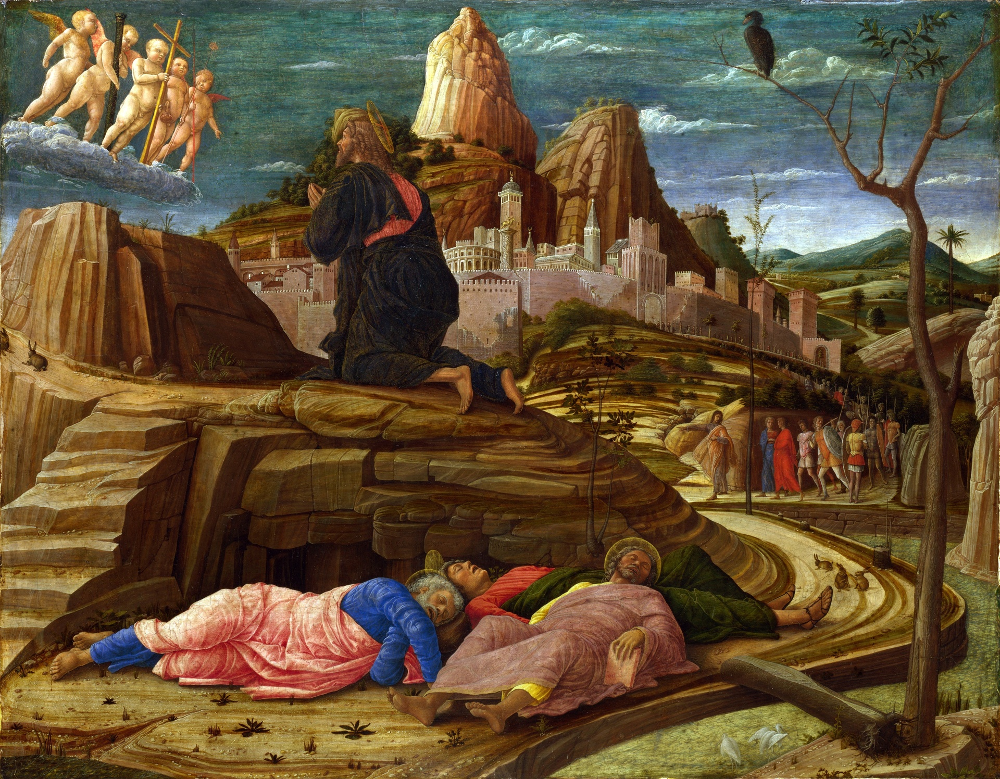

Meeting 3 — "I Want, But I Cannot"
************************************

.. tags:: content|prayer|Prayer, content|truth|Truth, content|maturity|Maturity, content|cross|Cross, method|text-work|Text work, method|image-work|Image work, type|biblical|Biblical

Credo
=====

We meditated today on the Creed. A fundamental text for our faith, but at the same time probably treated by us as "obvious," for how else can we justify that we do not commonly encounter an explanation of its meaning during formation?

- What questions does the Creed pose to me?
- What did I discover during today's meditation?

After the experience of the Last Supper, which one could say was a place of "learning," we move with St. Peter to the Garden of Gethsemane and to the house of the high priest. This is a place of "practice" where St. Peter faces the application of the Word he heard in life.

Forewarning — He Knows
=======================

Let us read:

    "Simon, Simon, behold, Satan demanded to have you, that he might sift you like wheat, but I have prayed for you that your faith may not fail; and when you have turned again, strengthen your brethren." And he said to him, "Lord, I am ready to go with you to prison and to death." He said, "I tell you, Peter, the cock will not crow this day, until you three times deny that you know me."

    -- Lk 22:31-34

The time of embodying light in life by St. Peter begins with the experience of disarming honesty of Jesus toward us. Jesus knows that love surpasses us and will surpass us. God knows that we will deny him, and at the same time gives us tasks of strengthening the faith of our brothers.

- What elements of spiritual life can this passage purify from erroneous understanding?
- To what extent in matters of faith do I have within myself consent to "not measure up" to love?

The Garden
==========

.. note:: During this point of the meeting, let us have before our eyes the image from the conference.

.. image:: Andrea_Mantegna2.jpg
   :align: center

Let us read:

    And they went to a place which was called Gethsemane; and he said to his disciples, "Sit here, while I pray." And he took with him Peter and James and John, and began to be greatly distressed and troubled. And he said to them, "My soul is very sorrowful, even to death; remain here, and watch." And going a little farther, he fell on the ground and prayed that, if it were possible, the hour might pass from him. And he said, "Abba, Father, all things are possible to thee; remove this cup from me; yet not what I will, but what thou wilt." And he came and found them sleeping, and he said to Peter, "Simon, are you asleep? Could you not watch one hour? Watch and pray that you may not enter into temptation; the spirit indeed is willing, but the flesh is weak." And again he went away and prayed, saying the same words. And again he came and found them sleeping, for their eyes were very heavy; and they did not know what to answer him. And he came the third time, and said to them, "Are you still sleeping and taking your rest? It is enough; the hour has come; the Son of man is betrayed into the hands of sinners. Rise, let us be going; see, my betrayer is at hand."

    -- Mk 14:32-42

- What in this image currently resonates most with my life?

Very often the above passage is interpreted in terms of perseverance in prayer. Let us try, however, to look at it through the prism of relationship with Jesus. We know that Jesus felt enormous distress in Gethsemane. This means that the disciples completely "failed to sense" the tension of Jesus, with whom they had shared most moments of their life and whom they sincerely loved!

- How often do I feel "alone among those close to me"?

The Sword
=========

Let us read:

    So Judas, procuring a band of soldiers and some officers from the chief priests and the Pharisees, went there with lanterns and torches and weapons. Then Jesus, knowing all that was to befall him, came forward and said to them, "Whom do you seek?" They answered him, "Jesus of Nazareth." Jesus said to them, "I am he." Judas, who betrayed him, was standing with them. When he said to them, "I am he," they drew back and fell to the ground. Again he asked them, "Whom do you seek?" And they said, "Jesus of Nazareth." Jesus answered, "I told you that I am he; so, if you seek me, let these men go." This was to fulfill the word which he had spoken, "Of those whom thou gavest me I lost none." Then Simon Peter, having a sword, drew it and struck the high priest's slave and cut off his right ear. The slave's name was Malchus. Jesus said to Peter, "Put your sword into its sheath; shall I not drink the cup which the Father has given me?"

    -- Jn 18:3-11

While a moment ago St. Peter committed a "sin of omission" through lack of activity, now he falls into the other extreme—activity that is too violent and disordered. St. Peter clearly wants to fill the space that the events of salvation history create for him, but he keeps "applying the chisel in the wrong place."

- What ideas for my activity in life have I rightly extinguished because I recognized that this is not my path?
- What would I like to do in the Church now so that it would be in accordance with me?
- How can we help each other assess whether my choice is not too violent (sword) nor too passive ("staying with Jesus as sleeping")?

The Fire
========

Let us read:

    Then they seized him and led him away, bringing him into the high priest's house. Peter followed at a distance; and when they had kindled a fire in the middle of the courtyard and sat down together, Peter sat among them. Then a maid, seeing him as he sat in the light and gazing at him, said, "This man also was with him." But he denied it, saying, "Woman, I do not know him." And a little later some one else saw him and said, "You also are one of them." But Peter said, "Man, I am not." And after an interval of about an hour still another insisted, saying, "Certainly this man also was with him; for he is a Galilean." But Peter said, "Man, I do not know what you are saying." And immediately, while he was still speaking, the cock crowed. And the Lord turned and looked at Peter. And Peter remembered the word of the Lord, how he had said to him, "Before the cock crows today, you will deny me three times." And he went out and wept bitterly.

    -- Lk 22:54-62

- What am I afraid of in belonging to the community of believers?

St. Peter once again "wants to love, but cannot." This time he does not err "a little" by choosing the wrong method, but directly denies everything in which he believed. We watch the whole scene with sorrow, because it is almost visible that St. Peter "has no chance" and in a moment will be overwhelmed. Everything falls apart.

St. Peter is alone. Separated from the Master, separated from the disciples. In the night. Do I have an expectation at the level of emotions that "my first pope" would prove to be a hero even in such conditions? I do. However, a "miracle of faith" does not happen, but rather a "consequence of the situation" happens. God does not give a Fiery Angel who disperses the darkness around St. Peter giving him superhuman faith. There is logic, consequence, there is life.

- In what way concretely can we help each other so that we do not often find ourselves in such a difficult situation as St. Peter?
- Whose faith, love, and light in life do I surround with my care? (this does not mean that I take responsibility for it!)

Let us notice St. Peter's deepening straying:

1. He fell asleep instead of watching
2. He wanted to fight instead of forgive
3. He wanted to be a believer, and at the same time he lied

If, as we said at the beginning, the Upper Room was a place of "learning" and the Garden of Gethsemane and the house of the high priest a place of "practical exam," then St. Peter did not pass this exam. This experience of one's inadequacy, the shattering of one's image of oneself, is a key experience in faith.

The Empty Tomb
===============

Let us read:

    Now on the first day of the week Mary Magdalene came to the tomb early, while it was still dark, and saw that the stone had been taken away from the tomb. So she ran, and went to Simon Peter and the other disciple, the one whom Jesus loved, and said to them, "They have taken the Lord out of the tomb, and we do not know where they have laid him." Peter then came out with the other disciple, and they went toward the tomb. They both ran, but the other disciple outran Peter and reached the tomb first; and stooping to look in, he saw the linen cloths lying there, but he did not go in. Then Simon Peter came, following him, and went into the tomb; he saw the linen cloths lying, and the napkin, which had been on his head, not lying with the linen cloths but rolled up in a place by itself. Then the other disciple, who reached the tomb first, also went in, and he saw and believed; for as yet they did not know the scripture, that he must rise from the dead. Then the disciples went back to their homes.

    -- Jn 20:1-10

We are not believers because we passed God's exam with distinction. Christianity is an encounter with the Risen One.

- What in faith recently surprised me, exceeded the horizon of my imagination?

The empty tomb is confrontational, but in such a way that it forces St. Peter to connect everything he heard from Jesus into a whole. This is an opening to faith that turns upside down the previous way of thinking, and through this changes the heart.

- What experience in my spirituality could be the equivalent of the "empty tomb"?

This evening we will share the experience of encountering the Risen One. By definition, we will therefore try to tell about something that is hard to grasp and that exceeds our imagination.

- Why do we share faith in Jesus Christ with each other? What does this give?

Application
===========

We do not want to impose an application from this meeting on participants. **However, this time we have a request that during today's telling about the encounter with Jesus Christ by each of us, we treat this time as a time of Proclamation, and thus a spiritual/prayer time. This means, for example, that while we listen to someone who is telling, we are simultaneously kind to them and entrust them to the Most High**.

The author of the outline simultaneously notes significant benefits from seeking an application achievable within the next 48h.
