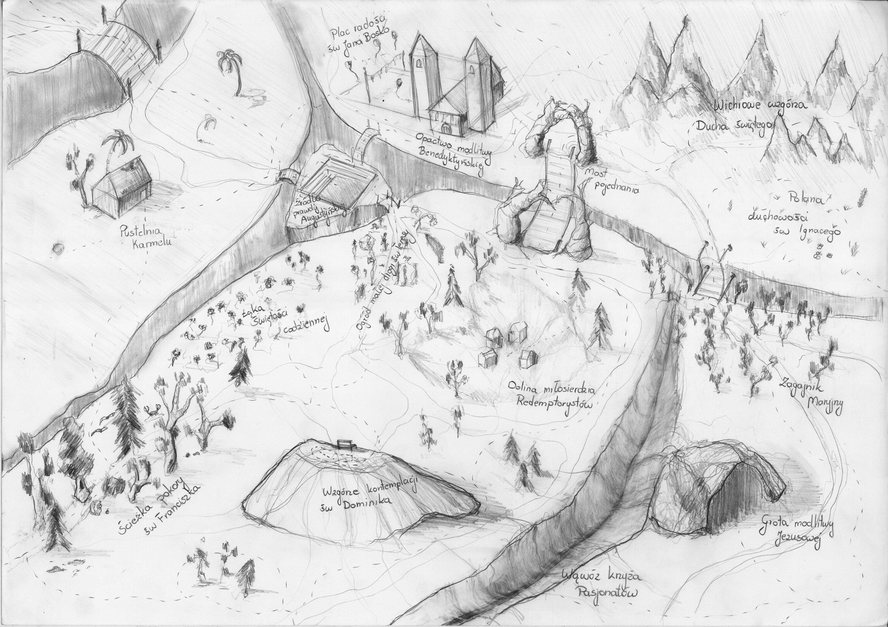

Meeting 3 — Passover
********************

.. tags:: content|eucharist|Eucharist, content|time|Time, content|gods-will|God's will, content|jewish-traditions|Jewish traditions, method|text-work|Text work, method|image-work|Image work, method|group-work|Group work, type|mystagogical|Mystagogical

Introduction for the facilitator
================================

The meeting concerns **presence**. The main topic is divided into three parts: pilgrimage, rite of passage and presence. We want to start with temporariness and pilgrimage, which we experienced building tents. Further, every end of a stage and beginning of a new one is connected with a rite of passage. Colloquially we say "something ends, and something begins". We want to talk about this. At the end we want to set participants in the seder and indicate where they are currently.

Introduction
============

We are approaching the peak point of the retreat, which will be the Seder experienced in connection with the Eucharist. We started the retreat by exploring the Sukkot holiday, and then before lunch we listened to a conference about Passover. Our meeting will be a joint exploration of this topic.

- What did I take for myself from the conference?
- What have I discovered at the retreat so far?

Pilgrimage
==========

Currently it is difficult for us to think about temporariness in the context of dwelling. Our culture and customs, as well as climate condition that our buildings are built on strong foundations from durable materials. We create cities and agglomerations from concrete, steel and glass.

The experience of Sukkot - Feast of Tabernacles - shows us that it does not always have to be so. A tent/hut, in its construction, is not built from durable materials. We experienced this ourselves building our tent from wood and fabrics. Its constitution reminds Jews and now us of temporariness.

.. note:: Some of us live in Silesia - a place where awareness of the fleetingness of life was present every day. Most of the society knew perfectly well that today's descent of someone from the family may be their last. All rescuers have similar experience. This experience once common currently becomes more distant.

- What are my first associations with temporariness?

Temporariness does not have to refer to mediocrity or a product of "worse" parameters, but can speak of the way, stages, possibility of quick change of place. From the perspective of faith such temporariness is close to us - it is **pilgrimage**.

Let us read:

    Now when Jesus saw great crowds around him, he gave orders to go over to the other side. And a scribe came up and said to him, “Teacher, I will follow you wherever you go.” And Jesus said to him, “Foxes have holes, and birds of the air have nests; but the Son of man has nowhere to lay his head.” Another of the disciples said to him, “Lord, let me first go and bury my father.” But Jesus said to him, “Follow me, and leave the dead to bury their own dead.”

    -- Mt 8:18-22

- How do I interpret the fragment “Jesus said to him, ‘Foxes have holes, and birds of the air have nests; but the Son of man has nowhere to lay his head.’”

Pilgrimage is a feature of a believing person and concerns both the physical, social and spiritual sphere. We accept the sentence about being pilgrims usually without resistance. Often however it is so that we want to pilgrimage, meaning be in motion, but at the same time we would like nothing to change.

.. note:: Animator, it is worth considering whether you do not have a short example from your life to tell here.

*The animator takes out character cards. We get to know each character, after which for each of them we ask a question, applying changes directly to the card using a marker.*

.. list-table::
   :widths: 40 60
   :header-rows: 0

   * - .. figure:: persona1.png

       Jan Nowak

       **Age**: 15 years
       **Motto**: “a lot of things interest me…”
       **Interests**: a bit of football and volleyball
       **Parish**: since last year lector

     - ☑  Channel deep prayer

       ☐  “After the Word” channel for married couples

       ☐  Travels with Saint Paul – letters as a signpost

       ☐  Carmel and You

       ☑   Biblical stories with Anna the sheep

       ☐  Benedictine spirituality for lay people

       ☑  Confirmed – Dominican channel for youth

       ☐  Prayer ANGELUS live

       ☐  Word of God for today

       ☐  St Charbel_offical

.. list-table::
   :widths: 40 60
   :header-rows: 0

   * - .. figure:: persona2.png

       Elżbieta Wiśniewska

       **Age**: 64 years
       **Motto**: “I am retired, full-time grandma”
       **Interests**: garden
       **Parish**: Margaretka Apostolate, Rosary Rose,

     - ☑  Channel deep prayer

       ☑  “After the Word” channel for married couples

       ☑  Travels with Saint Paul – letters as a signpost

       ☑  Carmel and You

       ☑   Biblical stories with Anna the sheep

       ☑  Benedictine spirituality for lay people

       ☑  Confirmed – Dominican channel for youth

       ☑  Prayer ANGELUS live

       ☑  Word of God for today

       ☑  St Charbel_offical

.. list-table::
   :widths: 40 60
   :header-rows: 0

   * - .. figure:: persona3.png

       Mateusz Nowakowski

       **Age**: 31 years
       **Motto**: “Corporate is my fairy tale”
       **Interests**: anime and manga, board RPGs, philosophical eastern currents
       **Parish**: A week ago for the first time on my own for years I was in confession

     - ☐  Channel deep prayer

       ☐  “After the Word” channel for married couples

       ☐  Travels with Saint Paul – letters as a signpost

       ☐  Carmel and You

       ☐  Biblical stories with Anna the sheep

       ☐  Benedictine spirituality for lay people

       ☐  Confirmed – Dominican channel for youth

       ☐  Prayer ANGELUS live

       ☐  Word of God for today

       ☐  St Charbel_offical

.. list-table::
   :widths: 40 60
   :header-rows: 0

   * - .. figure:: persona4.png

       Leon Jeziorański

       **Age**: 45 years
       **Motto**: “I work for the family, have a wife and two children”
       **Interests**: sports cars
       **Parish**: extraordinary minister of Holy Communion for 10 years

     - ☑  Channel deep prayer

       ☑  “After the Word” channel for married couples

       ☐  Travels with Saint Paul – letters as a signpost

       ☐  Carmel and You

       ☐  Biblical stories with Anna the sheep

       ☐  Benedictine spirituality for lay people

       ☐  Confirmed – Dominican channel for youth

       ☐  Prayer ANGELUS live

       ☑  Word of God for today

       ☐  St Charbel_offical

.. note:: This exercise assumes simplification of the complexity of human paths. Perhaps it is worth mentioning this to the group if the animator considers that not everyone might understand this and there will be fear of "labeling" people. Persons in the exercise are invented.

- If this person asked You as a mentor, what subscription changes would you advise this person? (Important: we want to advise directly the given person. We do not take into account other family members)

Subscriptions are a nice modern image of the way (although often anti-way, because we subscribe to a lot, but it is harder to unsubscribe). Maybe it is time to abandon one of Your subscriptions/tents to go further?... In which tent have you sat too long?...

- What comes easier to You in spiritual life: entering something or exiting?
- When was the last time you reviewed your subscriptions (literally and figuratively)?
- What have you recently given up in spiritual life?
- How did you feel about it?

Passover of Jesus Christ is the central moment of our faith. Imitating Him cannot ignore this aspect - we must be "passing through". It must be so close to us as to define us. As Christians we become in life Homo Paschalis.

Rite of passage
===============

Looking at the people to whom we proposed ending a subscription or adding a new one, through this action, they finished a certain stage in their life. Now at our suggestion they will have access to other content. From now on began another stage in their activity on YouTube, and we were participants of the rite of passage, in which they independently modified the list of channels they subscribe to. It is a kind of passage - a new stage.

In indigenous tribes the concept of "rite of passage" is very strongly connected with staging, i.e. with ceremonial ending of a certain stage and beginning of a new one. In our culture we more often use the term "ceremony". It was no different with Jesus.

Let us read:

    On the third day there was a marriage at Cana in Galilee, and the mother of Jesus was there; Jesus also was invited to the marriage, with his disciples. When the wine failed, the mother of Jesus said to him, “They have no wine.” And Jesus said to her, “O woman, what have you to do with me? My hour has not yet come.” His mother said to the servants, “Do whatever he tells you.” Now six stone jars were standing there, for the Jewish rites of purification, each holding twenty or thirty gallons. Jesus said to them, “Fill the jars with water.” And they filled them up to the brim. He said to them, “Now draw some out, and take it to the steward of the feast.” So they took it. When the steward of the feast tasted the water now become wine, and did not know where it came from (though the servants who had drawn the water knew), the steward of the feast called the bridegroom and said to him, “Every man serves the good wine first; and when men have drunk freely, then the poor wine; but you have kept the good wine until now.” This, the first of his signs, Jesus did at Cana in Galilee, and manifested his glory; and his disciples believed in him.

    -- Jn 2:1-11

Jesus directly refers to the "hour" which has not yet come - the moment of entering the path of being recognized as performing miracles, and thus, also gathering crowds around himself and teaching.

- Looking at the group: What stages of life path do we probably have in common in our group?

Ceremonies are not pure theory for us. We experience them. What our ceremonies come to mind first when we think about it? Let's share this.

- What thoughts accompanied this period and this decision?

However, that is not all. Hence the question to which let's answer ourselves.

- Is there such a rite/ceremony that I perform when I am alone?

The idea of a ceremony without an "audience" at first glance seems unintuitive - most canonical ceremonies are a public act. Therefore let's try to deepen it:

- What ceremony is it? What is its purpose? Does it have a religious character? Does it bring me closer to God, or maybe it has only a human character and makes me feel better?

To summarize this part and indicate that both customs are needed let's read fragments:

    And passing along by the Sea of Galilee, he saw Simon and Andrew the brother of Simon casting a net in the sea; for they were fishermen. And Jesus said to them, “Follow me and I will make you become fishers of men.” And immediately they left their nets and followed him. And going on a little farther, he saw James the son of Zebedee and John his brother, who were in their boat mending the nets. And immediately he called them; and they left their father Zebedee in the boat with the hired servants, and followed him.

    -- Mk 1:16-20

and:

    And he went up on the mountain, and called to him those whom he desired; and they came to him. And he appointed twelve, to be with him, and to be sent out to preach

    -- Mk 3:13-14

The presented examples and description of the biblical scene show ceremonies as an external sign, accented for the community. However, a mature Christian does not use only this way. By performing individual rites/signs and gestures they themselves stimulate their heart. The rite of ceremony turns our mind/heart towards God, and this is the essence.

.. note:: If it was necessary to skip a selected part the fragment below can be omitted. This element has an informative character (facilitates understanding part of the seder) and not sharing.

The rite of passage will accompany us during the solemn seder supper.
Of many rites and rituals we would like to point to 4 cups that we will raise.

First cup – Kiddush
    | solemn blessing over the holiday
    | “I will bring you out” – refers to the exit of Israelites

Second cup – Maggid
    | drunk after telling the story of the exodus from Egypt.
    | “I will deliver you” – symbolizes deliverance from slave labor.

Third cup – Birkat Hamazon
    | after finishing the meal, at the thanksgiving prayer.
    | “I will redeem you” – points to the miraculous rescue of the Jewish nation.

Fourth cup – Hallel
    | ending the seder, accompanied by hymns and thanksgiving prayers.
    | “I will take you” – emphasizes making a covenant between God and Israel.

Rites of passage will allow us to give the proper accent and **persist in presence - here and now.**

Presence
========

Today we will experience the memorial of Passover. The literal translation is "to pass over". We have already talked a lot about "passing". Jews however have a wonderful intuition - the feast of "passing over" they celebrate... sitting at the table - one could say "very statically" as for "passing". This is not lack of consistency or comfort!

Staging is not an "unpleasant necessity". Conscious choice of where one is now enables us to dedicate our heart, time, mind to it. We can be present in our passing. This is what the seder table is.

- What moves in me the awareness that faith is very concrete, and not symbolic: brothers and sisters are next to me, we really eat a meal, sometimes wine spills on the tablecloth, particles from matzah fly onto the plate, and horseradish squeezes out tears?
- In what way can we be better present at our tables?

With our heart we are too often somewhere else than we are with our body. The concreteness of the table, as a place of experiencing faith makes it a "school of not-running-away". A place from which no part of us wants to run away to another is called a "spiritual home".

.. note:: The animator distributes pawns of small houses/tents, and then pulls out a map on the table. And gives a moment to get acquainted with the map.

We have prepared for You a map of the land of spirituality. We do not aspire to capture here all possible subtleties of human spirituality. We think however that some of us will be able to find themselves in it already.

Let's ask:

- Where is currently the "place of Your dwelling"? Put your tent there

.. note:: Every place on the map is good - not only "strong places", which are signed.

*When everyone has done the exercises.*

- How do you feel here? How long have you been here?

If we are pilgrim people then let's check if we have always lived in this place, or if it was different once.

- In what places did you once find a spiritual home? Put your tent there.

*When everyone has done the exercises.*

- What did doing this exercise give You?
- What do you see looking at the map?

Let's look now at where we once had our spiritual shelters and where we live now. Let's look where the others placed their houses/tents. This path and diversity is a **gift of community**. Having gratitude in oneself for this and taking this fact as a challenge let's try to face the question:

- In what way can we help each other experience Seder and Eucharist well being close to each other, present for each other?

.. centered:: **Pilgrimage in spiritual life does not mean lack of home or place of stopping. In the approach we talked about, it is deep presence and rootedness in places that are not our ultimate goal.**

Haggadah
========

Today we will experience Seder. During Seder Ariel - our guest from Israel - will tell the Haggadah - a story about how God leads us through history. This is the fulfillment of one of the most important tasks of a pious believer according to:

    And you shall **tell** your son on that day, ‘It is because of what the Lord did for me when I came out of Egypt.’

    -- Ex 13:8

Every believer is to tell. We want to learn this and become part of it. Therefore we will meet after the Meditation of the Word of God to tell the Haggadah as a group. Let each of us choose either their favorite fragment of the History of Salvation, or one of the proposals below. Let's try to make it so that everyone has a different one.

#. Creation of the world [Gen 1]
#. God's promise to Abram [Gen 15]
#. Story of Noah [Gen 6:9-9:17]
#. Story of Moses – food and water in the desert [Ex 15:22-17:7]
#. Daniel in the lions' den [Dan 6:1-28]
#. Jesus found in the temple [Lk 2:41-52]
#. Healing of 10 lepers [Lk 17:11-19]
#. Jesus meets Zacchaeus [Lk 19:1-10]
#. Miraculous release of Peter from prison [Acts 12:1-17]

- What did you choose?

Let's establish now the order of people who will tell (according to the order of appearance in the Holy Scripture).

We go to the Meditation of the Word of God with this selected fragment (everyone with a different one). We want to first meet with the Word with our heart. Our later Haggadah thanks to this will not be technical storytelling, but proclamation. Proclamation not of what God did once, but of what He does for us.

Summary
=======

We went through 3 topics in our meeting today: Pilgrimage, Ritual and Presence. Haggadah is the best possible application of these contents. It is:

#. Showing others stages of the History of Salvation (Pilgrimage)
#. Telling is not "casual", but has an official way (Ritual)
#. It is a living meeting and finding time for oneself (Presence)

.. centered:: **Let us be storytellers!**
