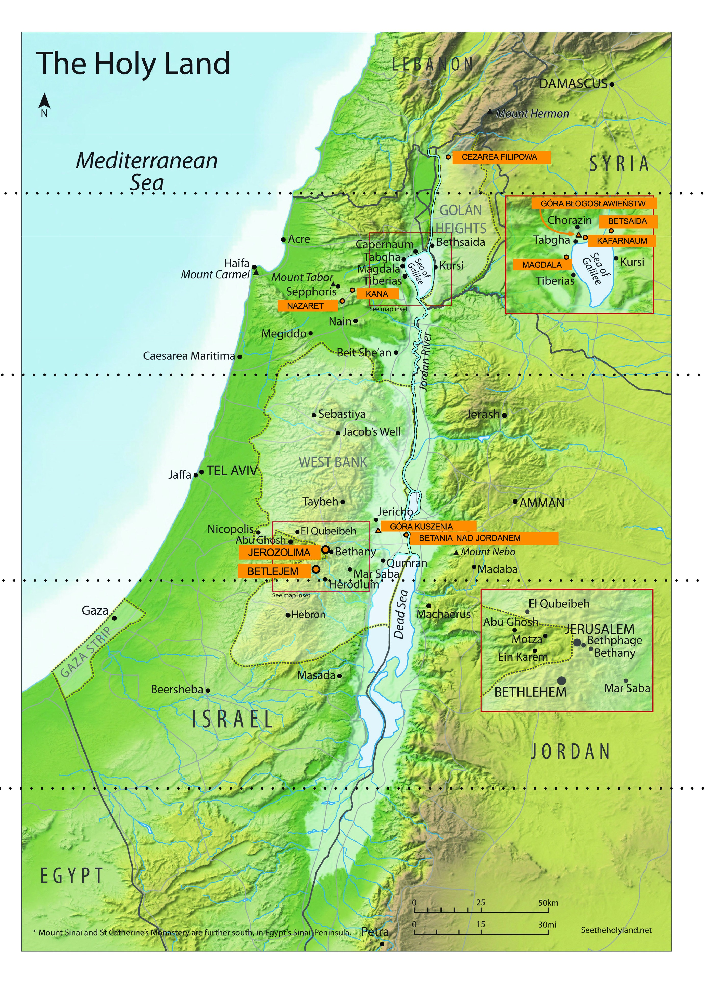

Meeting 4 — Shavuot
*******************

.. tags:: content|mission|Mission, content|word-of-god|Word of God, content|resurrection|Resurrection, content|jewish-traditions|Jewish traditions, method|music-work|Music work, method|group-work|Group work, method|text-work|Text work, type|biblical|Biblical

Introduction for the facilitator
================================

This meeting is the last group meeting of the retreat. Its main goal is to present the idea of "spiritual sight" and show participants that in the Church there is no place for division into audience and artists, that the message of faith, reflections, sharing how God works in us is not reserved for a narrow group of people, but we are all called, as St. Peter writes:

    But you are a chosen race, a royal priesthood, a holy nation, God’s own people, that you may declare the wonderful deeds of him who called you out of darkness into his marvelous light.

    -- 1 Pet 2:9

Moreover, it is exactly **proclaiming** God's works that is life-giving for those to whom we speak, but also for ourselves - responsibility and independence of a Christian is connected with this. Deepening faith, changing the way of thinking in the world, constant metanoia should flow from each of us. With this idea we want to end the group meetings.

Sharing
=======

We are at the moment of the retreat where elements begin to come together into a whole. The conference showed us that three holidays, despite separate subject matter, time, rituals, meaning, can be connected with each other. During the tent of meeting we could try in practice to connect not only holidays, but key moments of the history of the Church.

- Where in my life do I perceive certain connections? /spiritual life
- What seems to me at the moment as an element that gave me the most?

Spiritual sight
===============

During our retreat we are looking for Christian roots. We did it together, which is always a wonderful adventure. The retreat will end today therefore we want to talk now about a certain skill that will help us independently search for depth and roots. Therefore let's start with a certain experience.

.. note:: The animator divides the group into pairs, but maximally into 4 groups (if there are more than 8 people let some groups be three-person).

In a moment each of us will get their text, with places to fill in and a covered fragment. Before working on it we will listen together to a musical fragment. When each group finishes their task they put sheets in the middle with a short discussion of what fragment they got and what information they filled in.

.. note:: We have 4 musical fragments. The first three are single subsequent voices of the same piece "Ubi Caritas" by Ola Gjeilo. Fragment 4 shows how they all sound simultaneously. This illustrates the qualitative change of seeing connected things. Cut the tables horizontally into 8 pairs of fragments, and cover the fragments on the right side with post-it notes so that they are not visible to participants during the first part of the task. Tear off the notes at the moment indicated in the outline.

.. important:: we base on Dan Stevers “True and better”

.. list-table::
   :widths: 50 50
   :header-rows: 0

   * - Now the serpent was more subtle than any other wild creature that the Lord God had made. He said to the woman, “Did God say, ‘You shall not eat of any tree of the garden’?” And the woman said to the serpent, “We may eat of the fruit of the trees of the garden; but God said, ‘You shall not eat of the fruit of the tree which is in the midst of the garden, neither shall you touch it, lest you die.’” But the serpent said to the woman, “You will not die. For God knows that when you eat of it your eyes will be opened, and you will be like God, knowing good and evil.” So when the woman saw that the tree was good for food, and that it was a delight to the eyes, and that the tree was to be desired to make one wise, she took of its fruit and ate; and she also gave some to her husband, and he ate.

       -- Gen 3:1-6

       **In what place does the action take place?**

       ...

       **What was the attitude of Eve and Adam?**

       ...

     - And he withdrew from them about a stone’s throw, and knelt down and prayed, “Father, if thou art willing, remove this cup from me; nevertheless not my will, but thine, be done.” And there appeared to him an angel from heaven, strengthening him.

       -- Lk 22:41-43

       **In what place does the action take place?**

       Garden

       **What was the attitude of Jesus?**

       Obedience

.. list-table::
   :widths: 50 50
   :header-rows: 0

   * - And he said to them, “Take me up and throw me into the sea; then the sea will quiet down for you; for I know it is because of me that this great tempest has come upon you.” Nevertheless the men rowed hard to bring the ship back to land, but they could not, for the sea grew more and more tempestuous against them. Therefore they cried to the Lord, “We beseech thee, O Lord, let us not perish for this man’s life, and lay not on us innocent blood; for thou, O Lord, hast done as it pleased thee.” So they took up Jonah and threw him into the sea; and the sea ceased from its raging. Then the men feared the Lord exceedingly, and they offered a sacrifice to the Lord and made vows.

       -- Jon 1:12-16

       And the Lord appointed a great fish to swallow up Jonah; and Jonah was in the belly of the fish three days and three nights. Then Jonah prayed to the Lord his God from the belly of the fish.

       -- Jon 2:1-2

       **Why was Jonah thrown into the sea?**

       ...

       **How many days did Jonah spend in the fish?**

       ...

     - You know what happened throughout all Judea, beginning from Galilee after the baptism which John preached: how God anointed Jesus of Nazareth with the Holy Spirit and with power; how he went about doing good and healing all that were oppressed by the devil, for God was with him. And we are witnesses to all that he did both in the country of the Jews and in Jerusalem. They put him to death by hanging him on a tree; but God raised him on the third day and made him manifest; not to all the people but to us who were chosen by God as witnesses, who ate and drank with him after he rose from the dead.

       -- Acts 10:37-41

       **Why was Jesus laid in the tomb?**

       To save us

       **How many days did Jesus spend in the tomb?**

       3 days

.. list-table::
   :widths: 50 50
   :header-rows: 0

   * - Isaac said to his father Abraham, “My father!” And he said, “Here am I, my son.” He said, “Behold, the fire and the wood; but where is the lamb for a burnt offering?” Abraham said, “God will provide himself the lamb for a burnt offering, my son.” So they went both of them together. When they came to the place of which God had told him, Abraham built an altar there, and laid the wood in order, and bound Isaac his son, and laid him on the altar, upon the wood. Then Abraham put forth his hand, and took the knife to slay his son. But the angel of the Lord called to him from heaven, and said, “Abraham, Abraham!” And he said, “Here am I.” He said, “Do not lay your hand on the lad or do anything to him; for now I know that you fear God, seeing you have not withheld your son, your only son, from me.” And Abraham lifted up his eyes and looked, and behold, behind him was a ram, caught in a thicket by his horns; and Abraham went and took the ram, and offered him up as a burnt offering instead of his son.

       -- Gen 22:7-13

       **Who in this scene was to be the victim and offered by whom?**

       ...

     - My little children, I am writing this to you so that you may not sin; but if any one does sin, we have an advocate with the Father, Jesus Christ the righteous; and he is the expiation for our sins, and not for ours only but also for the sins of the whole world.

       -- 1 Jn 2:1-2

       In this the love of God was made manifest among us, that God sent his only Son into the world, so that we might live through him. In this is love, not that we loved God but that he loved us and sent his Son to be the expiation for our sins.

       -- 1 Jn 4:9-10

       **Who in this scene was to be the victim and offered by whom?**

       Son offered as a sacrifice by the Father.

.. list-table::
   :widths: 50 50
   :header-rows: 0

   * - Now when all the people perceived the thunderings and the lightnings and the sound of the trumpet and the mountain smoking, the people were afraid and trembled; and they stood afar off, and said to Moses, “You speak to us, and we will hear; but let not God speak to us, lest we die.” And Moses said to the people, “Do not fear; for God has come to prove you, and that the fear of him may be before your eyes, that you may not sin.” And the people stood afar off, while Moses drew near to the thick darkness where God was.

       -- Ex 20:18-21

       The Lord spoke with you face to face at the mountain, out of the midst of the fire, while I stood between the Lord and you at that time, to declare to you the word of the Lord; for you were afraid because of the fire and you did not go up into the mountain.

       -- Deut 5:4-5

       **Who was Moses for the people in this scene?**

       ...

     - But when Christ appeared as a high priest of the good things that have come, then through the greater and more perfect tent (not made with hands, that is, not of this creation) he entered once for all into the Holy Place, taking not the blood of goats and calves but his own blood, thus securing an eternal redemption. For if the sprinkling of defiled persons with the blood of goats and bulls and with the ashes of a heifer sanctifies for the purification of the flesh, how much more shall the blood of Christ, who through the eternal Spirit offered himself without blemish to God, purify your conscience from dead works to serve the living God. Therefore he is the mediator of a new covenant, so that those who are called may receive the promised eternal inheritance, since a death has occurred which redeems them from the transgressions under the first covenant.

       -- Heb 9:11-15

       **Who was Jesus for the people in this scene?**

       Mediator between God and the Father.

.. list-table::
   :widths: 50 50
   :header-rows: 0

   * - Tell all the congregation of Israel that on the tenth day of this month they shall take every man a lamb according to their fathers’ houses, a lamb for a household; and if the household is too small for a lamb, then a man and his neighbor next to his house shall take according to the number of persons; according to what each can eat you shall make your count for the lamb. Your lamb shall be without blemish, a male a year old; you may take it from the sheep or from the goats; and you shall keep it until the fourteenth day of this month, when the whole assembly of the congregation of Israel shall kill their lambs in the evening. Then they shall take some of the blood, and put it on the two doorposts and the lintel of the houses in which they eat them. [...] For I will pass through the land of Egypt that night, and I will smite all the first-born in the land of Egypt, both man and beast; and on all the gods of Egypt I will execute judgments: I am the Lord. The blood shall be a sign for you, upon the houses where you are; and when I see the blood, I will pass over you, and no plague shall fall upon you to destroy you, when I smite the land of Egypt.

       -- Ex 12:3-7.12-13

       **What for were the Israelites to kill the lamb?**

       ...

       **What did washing the doorposts with lamb's blood result in?**

       ...

     - And if you invoke as Father him who judges each one impartially according to his deeds, conduct yourselves with fear throughout the time of your exile. You know that you were ransomed from the futile ways inherited from your fathers, not with perishable things such as silver or gold, but with the precious blood of Christ, like that of a lamb without blemish or spot. He was destined before the foundation of the world but was made manifest at the end of the times for your sake. Through him you have confidence in God, who raised him from the dead and gave him glory, so that your faith and hope are in God.

       -- 1 Pet 1:17-21

       **What for was Jesus killed?**

       To save people.

       **What does washing in the Blood of Jesus result in?**

       Eternal life

.. list-table::
   :widths: 50 50
   :header-rows: 0

   * - Now the Lord said to Abram, “Go from your country and your kindred and your father’s house to the land that I will show you. And I will make of you a great nation, and I will bless you, and make your name great, so that you will be a blessing. I will bless those who bless you, and him who curses you I will curse; and by you all the families of the earth shall bless themselves.” So Abram went, as the Lord had told him; and Lot went with him. Abram was seventy-five years old when he departed from Haran. And Abram took Sarai his wife, and Lot his brother’s son, and all their possessions which they had gathered, and the persons that they had gotten in Haran; and they set forth to go to the land of Canaan.

       -- Gen 12:1-5

       **How did Abraham fulfill God's command?**

       ...

     - And the Word became flesh and dwelt among us, full of grace and truth; we have beheld his glory, glory as of the only Son from the Father.

       -- Jn 1:14

       Have this mind among yourselves, which is yours in Christ Jesus, who, though he was in the form of God, did not count equality with God a thing to be grasped, but emptied himself, taking the form of a servant, being born in the likeness of men. And being found in human form he humbled himself and became obedient unto death, even death on a cross.

       -- Phil 2:1-8

       **How did Jesus fulfill God's command?**

       Becoming obedient and founding the New People of God.

.. list-table::
   :widths: 50 50
   :header-rows: 0

   * - “All the king’s servants and the people of the king’s provinces know that if any man or woman goes to the king inside the inner court without being called, there is but one law; all alike are to be put to death, except the one to whom the king holds out the golden scepter that he may live. And I have not been called to come in to the king these thirty days.” And they told Mordecai what Esther had said. Then Mordecai told them to return answer to Esther, “Think not that in the king’s palace you will escape any more than all the other Jews. For if you keep silence at such a time as this, relief and deliverance will rise for the Jews from another quarter, but you and your father’s house will perish. And who knows whether you have not come to the kingdom for such a time as this?” Then Esther told them to reply to Mordecai, “Go, gather all the Jews to be found in Susa, and hold a fast on my behalf, and neither eat nor drink for three days, night or day. I and my maids will also fast as you do. Then I will go to the king, though it is against the law; and if I perish, I perish.”

       -- Est 4:11-16

       **What does Esther risk?**

       ...

       **What for does Esther risk?**

       ...

     - I am the good shepherd. The good shepherd lays down his life for the sheep.

       -- Jn 10:11

       For God so loved the world that he gave his only Son, that whoever believes in him should not perish but have eternal life.

       -- Jn 3:16

       **What does Jesus risk?**

       His life

       **What for does Jesus risk?**

       To save his people

| *The animator plays the 1st musical fragment and distributes the first worksheets.*
| `👉 Listen <https://konspekty.ponadmurami.pl/_static/chleb_wino_miod_1.mp3>`__

| *We put the cards in the middle. The animator plays the 2nd musical fragment and distributes the second worksheets.*
| `👉 Listen <https://konspekty.ponadmurami.pl/_static/chleb_wino_miod_2.mp3>`__

| *The animator plays the 3rd musical fragment and we move to questions.*
| `👉 Listen <https://konspekty.ponadmurami.pl/_static/chleb_wino_miod_3.mp3>`__

Let's leave the cards we prepared for now.

- Which of the Pilgrimage Festivals is intuitively close to me? What does it tell me about my spirituality?
- How do I prefer to read the Holy Scripture, rather whole chapters or single pericopes?

| *The animator plays the 4th musical fragment. We tear off the post-it notes covering fragments on worksheets.*
| `👉 Listen <https://konspekty.ponadmurami.pl/_static/chleb_wino_miod_4.mp3>`__

After a moment of spontaneous reading of what we revealed on the cards we move immediately to reading:

    That very day two of them were going to a village named Emmaus, about seven miles from Jerusalem, and talking with each other about all these things that had happened. While they were talking and discussing together, Jesus himself drew near and went with them. But their eyes were kept from recognizing him. And he said to them, “What is this conversation which you are holding with each other as you walk?” And they stood still, looking sad. Then one of them, named Cleopas, answered him, “Are you the only visitor to Jerusalem who does not know the things that have happened there in these days?” And he said to them, “What things?” And they said to him, “Concerning Jesus of Nazareth, who was a prophet mighty in deed and word before God and all the people, and how our chief priests and rulers delivered him up to be condemned to death, and crucified him. But we had hoped that he was the one to redeem Israel. Yes, and besides all this, it is now the third day since this happened. Moreover, some women of our company amazed us. They were at the tomb early in the morning and did not find his body; and they came back saying that they had even seen a vision of angels, who said that he was alive. Some of those who were with us went to the tomb, and found it just as the women had said; but him they did not see.” And he said to them, “O foolish men, and slow of heart to believe all that the prophets have spoken! Was it not necessary that the Christ should suffer these things and enter into his glory?” And beginning with Moses and all the prophets, he interpreted to them in all the scriptures the things concerning himself. So they drew near to the village to which they were going. He appeared to be going further, but they constrained him, saying, “Stay with us, for it is toward evening and the day is now far spent.” So he went in to stay with them. When he was at table with them, he took the bread and blessed, and broke it, and gave it to them. And their eyes were opened and they recognized him; and he vanished out of their sight. They said to each other, “Did not our hearts burn within us while he talked to us on the road, while he opened to us the scriptures?” And they rose that same hour and returned to Jerusalem; and they found the eleven gathered together and those who were with them, who said, “The Lord has risen indeed, and has appeared to Simon!” Then they told what had happened on the road, and how he was known to them in the breaking of the bread.

    -- Lk 24:13-35

- What does such a combination of musical examples, worksheets and the Gospel about disciples from Emmaus mean for me?
- When and where was my Emmaus, the moment of "opening of eyes" when certain things connected together?
- What is difficult in seeing things connected?

In Hamlet William Shakespeare shows a scene in which the main character confides in Horatio that he sees the ghost of his dead father. To the question "Where?" he answers: **"In my mind's eye"**. To perceive reality hidden in the depth spiritual sight is needed. This is a key intuition in spirituality. This poet's intuition although spoken in a completely different context refers to our faith:

    When we do this in celebrating the Eucharist, we have before our eyes the paschal mystery.

    -- Ecclesia de Eucharistia

- What is spiritual sight for me?
- In what way do I care for my spiritual sight?

Let us read:

    Then the disciples came and said to him, “Why do you speak to them in parables?” And he answered them, “To you it has been given to know the secrets of the kingdom of heaven, but to them it has not been given. For to him who has will more be given, and he will have abundance; but from him who has not, even what he has will be taken away. This is why I speak to them in parables, because seeing they do not see, and hearing they do not hear, nor do they understand. With them indeed is fulfilled the prophecy of Isaiah which says: ‘You shall indeed hear but never understand, and you shall indeed see but never perceive.’”

    -- Mt 13:10-14

Sometimes we might want to scream "why did no one ever explain the connection of these holidays to us?" or "why did no one show me right away what it's about?".

The Christian mystery does not consist in the fact that there is a guarded book whose content is known only to few (and therefore it is a mystery). The Christian mystery consists in the fact that everything "is on the table" and is public, but few understand it. Jesus himself saw it this way. To reach the mystery one must have spiritual sight, one must care for it, one must train it.

- How can we help each other train our spiritual sight?
- What is the biggest challenge for me in training spiritual sight?

It would be easier if "some someone" came and explained everything to us, and we would "consume" it and enjoy it. It seems however that this is not the intention of the Highest.

There is no audience and artist
===============================

Let us read:

    Simeon Peter, a servant and apostle of Jesus Christ, To those who have obtained a faith of equal standing with ours in the righteousness of our God and Savior Jesus Christ: May grace and peace be multiplied to you in the knowledge of God and of Jesus our Lord. His divine power has granted to us all things that pertain to life and godliness, through the knowledge of him who called us to his own glory and excellence, by which he has granted to us his precious and very great promises, that through these you may escape from the corruption that is in the world because of passion, and become partakers of the divine nature. For this very reason make every effort to supplement your faith with virtue, and virtue with knowledge, and knowledge with self-control, and self-control with steadfastness, and steadfastness with godliness, and godliness with brotherly affection, and brotherly affection with love. For if these things are yours and abound, they keep you from being ineffective or unfruitful in the knowledge of our Lord Jesus Christ. For whoever lacks these things is blind and shortsighted and has forgotten that he was cleansed from his old sins. Therefore, brethren, be the more zealous to confirm your call and election, for if you do this you will never fall; so there will be richly provided for you an entrance into the eternal kingdom of our Lord and Savior Jesus Christ.

    -- 2 Pet 1:1-11

Let's start with two quick questions:

- To whom does St. Peter write these words?
- What does he emphasize talking about the recipient group?

He writes to all who obtained "faith of equal standing with ours". St. Peter, the first pope, bishop does not put any wall between his faith and everyone who believed.

.. note:: The fragment below can be omitted if it is included in the form of animator's testimony

Sometimes it seems to us that to give something to the Church one must be someone special. It seems to us that in faith there is a division into "artists" on stage who can speak, be leaders, change the world, set new directions, influence reality and the so-called "rest", who sits in the audience and can only declare for or against some ideas. In faith vocation is directed to all, there is no stage and audience, we are all sent to develop our relationship with God, contemplate, discern, discuss, and pass on the fruits of these processes. We do not need to have a mandate to turn on spiritual sight and start connecting dots. Moreover, it happens not only in situations such as Meditation of the Word of God, where we did exactly that, but simply in every sphere of life. Each of us has potential to go deep, look between lines, look for meaning and share what they discover. We are sent to be the salt of the earth, and thus also those who will provoke these trips into depth.

- What feelings does the image that there is no opposition audience-artist arouse in me?
- What can we do to break the feeling present in us that the presbytery is a stage, and the nave is an audience?
- Who took responsibility for me to see the whole, and not just parts of faith?
- For whom do I take responsibility to see the whole, and not just parts of faith?

Two seas of Israel
==================

.. note:: We take out the map presenting the course of Jordan along with two seas: Sea (Lake) of Galilee and Dead Sea. Cut it into strips designated by dotted lines (the map should be prepared and cut before the meeting). Then together with participants arrange the map starting from the top (sources of Jordan) paying attention to characteristic points described in orange. The point is for participants to see places known to them from various fragments of the Gospel.

The animator should recall the following places and fragments before the meeting:

Caesarea Philippi
    Jesus takes disciples to Caesarea Philippi (Mt 16:13-20)
Capernaum
    Healing of the centurion's servant in Capernaum (Mt 8:5-13), Bread of Life Discourse (Jn 6:22-71)
Nazareth
    Jesus' hometown
Bethsaida
    healing of the blind man (Mk 8:22-26) + from Bethsaida Jesus took disciples to Caesarea Philippi, let's notice what distance it is.
Sea of Galilee
    multiplication of bread (Jn 6:1-15)
Magdala
    place of origin of Mary Magdalene
Mount of Beatitudes
    Eight Beatitudes (Mt 5:1-12)
Cana
    miracle at the wedding, beginning of Jesus' public ministry (Jn 2:1-12)
Mount of Temptation
    place of Jesus' forty-day fast (Lk 4:1-13)
Bethany beyond the Jordan
    place of Jesus' baptism (Mt 3:13-17)
Bethlehem
    place of Jesus' birth (Lk 2:4-7)
Jerusalem
    see e.g. fragments Mt 21, teaching in the temple

We do not want to spend a lot of time here, rather quickly remind that these places are known to us. It is key rather to see the course of the Jordan, which flows through the Sea (Lake) of Galilee, and then falls into the Dead Sea.

After arranging the map, having already the image of the whole let us read the fragment:

    There are two seas in Israel: Galilee (Kinneret) and Dead. They are as different as one can imagine. The Sea of Galilee is full of life, and the Dead Sea, as the name itself suggests, has no life at all. It is strange that both seas are fed by the same river – Jordan. What is the difference between these two seas? The answer is that the Sea of Galilee receives water, but also gives it back at the other end, while the Dead Sea receives water, but does not give it back.

    -- fragment - Rabbi Lord Jonathan Sacks: To heal a fractured world, Conference Sinai Indaba 2015.

We have already drawn attention to the fact that we are all called to fruitful faith, so that fruits flow from our spiritual life, which are worth sharing with others. Two seas are an image that it is receiving and passing on faith that is alive and building, when however we only receive, and nothing flows from us further, we can fall into stagnation.

- In what way can I realistically take care to be rather like the Sea of Galilee?
- What in my spiritual life fell into the Dead Sea?

Ending and application
======================

We convinced ourselves at this meeting that we can practice our spiritual sight, learning to perceive deeper meaning of events and not obvious connections in the world. Let's also remember that it is worth passing on what we discover further.

Let us read:

    For this reason, because I have heard of your faith in the Lord Jesus and your love toward all the saints, I do not cease to give thanks for you, remembering you in my prayers, that the God of our Lord Jesus Christ, the Father of glory, may give you a spirit of wisdom and of revelation in the knowledge of him, having the eyes of your hearts enlightened, that you may know what is the hope to which he has called you, what are the riches of his glorious inheritance in the saints.

    -- Eph 1:15-18

- With what hope do I return from this retreat?

As application from this meeting let's return to the question: **In what way can I realistically take care to be rather like the Sea of Galilee?** and our answers. If we don't have them yet, let's return to this question in free time and plan real steps that we will take in the near future.
