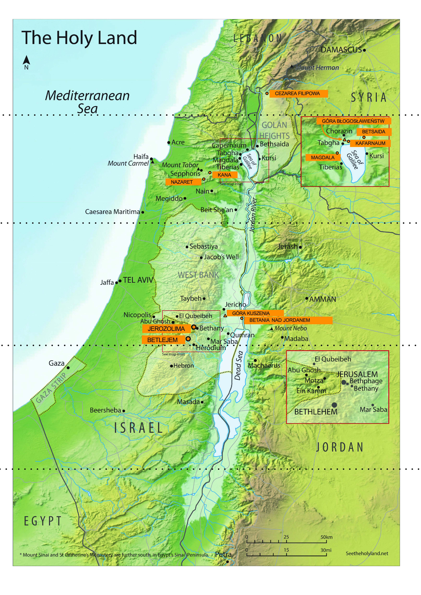

Spotkanie 4. - Szawuot
**********************

.. tags:: content|mission|Mission, content|word-of-god|Word of God, content|resurrection|Resurrection, content|jewish-traditions|Jewish traditions, method|music-work|Music work, method|group-work|Group work, method|text-work|Text work, type|biblical|Biblical

Wprowadzenie dla animatora
==========================

To spotkanie jest ostatnim spotkaniem grupowym rekolekcji. Jego głównym celem jest przedstawienie idei “duchowego wzroku” oraz pokazanie uczestnikom, że w~Kościele nie ma miejsca na podział na widownię i~artystów, że przekaz wiary, rozważań, dzielenie się tym, jak działa w~nas Bóg nie jest zarezerwowany dla wąskiej grupy osób, ale wszyscy jesteśmy powołani, jak pisze św. Piotr:

    Wy zaś jesteście wybranym plemieniem, królewskim kapłaństwem, narodem świętym, ludem [Bogu] na własność przeznaczonym, abyście ogłaszali dzieła* potęgi Tego, który was wezwał z~ciemności do przedziwnego swojego światła

    -- 1 P 2,9

Ponadto, to właśnie **głoszenie** dzieł Boga jest życiodajne dla tych, do których mówimy, ale też dla nas samych - z~tym wiąże się odpowiedzialność i~samodzielność chrześcijanina. Pogłębianie wiary, zmiany sposobu myślenia w~świecie, nieustanna metanoia powinny wypływać od każdego z~nas. Z~tą ideą chcemy zakończyć spotkania grupowe.

Dzielenie
=========

Jesteśmy w~momencie rekolekcji, w~którym elementy zaczynają składać się w~całość. Konferencja pokazała nam, że trzy święta, mimo odrębnej tematyki, czasu, rytuałów, sensu, dają się ze sobą połączyć. Podczas namiotu spotkania mogliśmy spróbować w~praktyce łączyć też nie tylko święta, ale kluczowe momenty historii Kościoła.

- Gdzie w~moim życiu dostrzegam pewne połączenia? /życiu duchowym
- Co wydaje mi się na chwilę obecną jako element, który dał mi najwięcej?

Duchowy wzrok
=============

W trakcie naszych rekolekcji szukamy korzeni chrześcijańskich. Robiliśmy to razem, co jest zawsze wspaniałą przygodą. Rekolekcje się dzisiaj skończą dlatego chcemy porozmawiać teraz o~pewnej umiejętności, która pomoże nam samodzielnie poszukiwać głębi i~korzeni. Dlatego zacznijmy od pewnego doświadczenia.

.. note:: Animator dzieli grupę na pary, ale maksymalnie na 4 grupy (jak jest więcej niż 8 osób to niech będą niektóre grupy trzyosobowe).

Za chwilę każdy z~nas dostanie swój tekst, z~miejscami do uzupełnienia oraz zakrytym fragmentem. Przed pracą nad nim posłuchamy razem fragmentu muzycznego. Gdy każda grupa skończy swoje zadanie kładzie kartki na środek z~krótkim omówieniem jaki fragment dostała i~jakie informacje uzupełniła.

.. note:: Mamy 4 fragmenty muzyczne. Pierwsze trzy to pojedyncze kolejne głosy tego samego utworu “Ubi Caritas” autorstwa Ola Gjeilo. Fragment 4 pokazuje jak one wszystkie brzmią równocześnie. Obrazuje to jakościową zmianę widzenia rzeczy połączonych. Tabele potnij poziomo na 8 par fragmentów, a~fragmenty po prawej stronie zaklej karteczkami post-it, tak żeby nie były widoczne dla uczestników podczas pierwszej części zadania. Karteczki oderwij we wskazanym w~konspekcie momencie.

.. important:: bazujemy na Dan Stevers “True and better”

.. list-table::
   :widths: 50 50
   :header-rows: 0

   * - A~wąż był bardziej przebiegły niż wszystkie zwierzęta lądowe, które Pan Bóg stworzył. On to rzekł do niewiasty: «Czy rzeczywiście Bóg powiedział: Nie jedzcie owoców ze wszystkich drzew tego ogrodu?» Niewiasta odpowiedziała wężowi: «Owoce z~drzew tego ogrodu jeść możemy, tylko o~owocach z~drzewa, które jest w~środku ogrodu, Bóg powiedział: Nie wolno wam jeść z~niego, a~nawet go dotykać, abyście nie pomarli». Wtedy rzekł wąż do niewiasty: «Na pewno nie umrzecie! Ale wie Bóg, że gdy spożyjecie owoc z~tego drzewa, otworzą się wam oczy i~tak jak Bóg będziecie znali dobro i~zło». Wtedy niewiasta spostrzegła, że drzewo to ma owoce dobre do jedzenia, że jest ono rozkoszą dla oczu i~że owoce tego drzewa nadają się do zdobycia wiedzy. Zerwała zatem z~niego owoc, skosztowała i~dała swemu mężowi, który był z~nią: a~on zjadł.

       -- Rdz 3, 1-6

       **W jakim miejscu rozgrywa się akcja?**

       ...

       **Jaka była postawa Ewy i~Adama?**

       ...

     - A~sam oddalił się od nich na odległość jakby rzutu kamieniem, upadł na kolana i~modlił się tymi słowami: «Ojcze, jeśli chcesz, zabierz ode Mnie ten kielich! Jednak nie moja wola, lecz Twoja niech się stanie!» Wtedy ukazał Mu się anioł z~nieba i~umacniał Go.

       -- Łk 22,41-43

       **W jakim miejscu rozgrywa się akcja?**

       Ogrodzie

       **Jaka była postawa Jezusa?**

       Posłuszeństwo

.. list-table::
   :widths: 50 50
   :header-rows: 0

   * - Odpowiedział im: «Weźcie mnie i~rzućcie w~morze, a~przestaną się burzyć wody przeciw wam, ponieważ wiem, że z~mojego powodu tak wielka burza powstała przeciw wam». Ludzie ci starali się, wiosłując, zawrócić ku lądowi, ale nie mogli, bo morze coraz silniej burzyło się przeciw nim. Wołali więc do Pana i~mówili*: «O Panie, prosimy, nie dozwól nam zginąć ze względu na życie tego człowieka i~nie obciążaj nas odpowiedzialnością za krew niewinną, albowiem Ty jesteś Pan, jak Ci się podoba, tak czynisz». I~wzięli Jonasza, i~wrzucili go w~morze, a~ono przestało się srożyć. Ogarnęła wtedy tych ludzi bojaźń przed Panem. Złożyli Panu ofiarę i~uczynili śluby.

       -- Jon 1,12-16

       Pan zesłał wielką rybę, aby połknęła Jonasza. I~był Jonasz we wnętrznościach ryby trzy dni i~trzy noce. Z~wnętrzności ryby modlił się Jonasz do swego Pana Boga.

       -- Jon 2,1-2

       **Czemu Jonasz został wyrzucony w~morze?**

       ...

       **Ile dni Jonasz spędził w~rybie?**

       ...

     - Wiecie, co się działo w~całej Judei, począwszy od Galilei, po chrzcie, który głosił Jan. Znacie sprawę Jezusa z~Nazaretu, którego Bóg namaścił Duchem Świętym i~mocą. Dlatego że Bóg był z~Nim, przeszedł On dobrze czyniąc i~uzdrawiając wszystkich, którzy byli pod władzą diabła. A~my jesteśmy świadkami wszystkiego, co zdziałał w~ziemi żydowskiej i~w Jerozolimie. Jego to zabili, zawiesiwszy na drzewie*. Bóg wskrzesił Go trzeciego dnia i~pozwolił Mu ukazać się nie całemu ludowi, ale nam, wybranym uprzednio przez Boga na świadków, którzyśmy z~Nim jedli i~pili po Jego zmartwychwstaniu.

       -- Dz 10, 37-41

       **Czemu Jezus został złożony w~grobie?**

       Aby nas uratować

       **Ile dni Jezus spędził w~grobie?**

       3 dni

.. list-table::
   :widths: 50 50
   :header-rows: 0

   * - Izaak odezwał się do swego ojca Abrahama: «Ojcze mój!» A~gdy ten rzekł: «Oto jestem, mój synu» - zapytał: «Oto ogień i~drwa, a~gdzież jest jagnię na całopalenie?» Abraham odpowiedział: «Bóg upatrzy sobie jagnię na całopalenie, synu mój». I~szli obydwaj dalej. A~gdy przyszli na to miejsce, które Bóg wskazał, Abraham zbudował tam ołtarz, ułożył na nim drwa i~związawszy syna swego Izaaka położył go na tych drwach na ołtarzu. Potem Abraham sięgnął ręką po nóż, aby zabić swego syna. Ale wtedy Anioł Pański* zawołał na niego z~nieba i~rzekł: «Abrahamie, Abrahamie!» A~on rzekł: «Oto jestem». [Anioł] powiedział mu: «Nie podnoś ręki na chłopca i~nie czyń mu nic złego! Teraz poznałem, że boisz się Boga, bo nie odmówiłeś Mi nawet twego jedynego syna». Abraham, obejrzawszy się poza siebie, spostrzegł barana uwikłanego rogami w~zaroślach. Poszedł więc, wziął barana i~złożył w~ofierze całopalnej zamiast swego syna.

       -- Rdz 22,7-13

       **Kto w~tej scenie miał być ofiarą i~przez kogo złożoną?**

       ...

     - Dzieci moje, piszę wam to dlatego, żebyście nie grzeszyli. Jeśliby nawet kto zgrzeszył, mamy Rzecznika wobec Ojca - Jezusa Chrystusa sprawiedliwego. On bowiem jest ofiarą przebłagalną za nasze grzechy, i~nie tylko nasze, lecz również za grzechy całego świata.

       -- 1 J 2,1-2

       W~tym objawiła się miłość Boga ku nam, że zesłał Syna swego Jednorodzonego na świat*, abyśmy życie mieli dzięki Niemu. W~tym przejawia się miłość, że nie my umiłowaliśmy Boga, ale że On sam nas umiłował i~posłał Syna swojego jako ofiarę przebłagalną za nasze grzechy*.

       -- 1 J 4,9-10

       **Kto w~tej scenie miał był ofiarą i~przez kogo złożoną?**

       Syn złożony w~ofierze przez Ojca.

.. list-table::
   :widths: 50 50
   :header-rows: 0

   * - Wtedy cały lud, słysząc grzmoty i~błyskawice oraz głos trąby i~widząc górę dymiącą, przeląkł się i~drżał, i~stał z~daleka. I~mówili do Mojżesza: Mów ty z~nami, a~my będziemy cię słuchać! Ale Bóg niech nie przemawia do nas, abyśmy nie pomarli! Mojżesz rzekł do ludu: «Nie bójcie się! Bóg przybył po to, aby was doświadczyć i~pobudzić do bojaźni przed sobą, żebyście nie grzeszyli». Lud stał ciągle z~daleka, a~Mojżesz zbliżył się do ciemnego obłoku, w~którym był Bóg.

       -- Wj 20,18-21

       Spośród ognia na Górze mówił Pan z~wami twarzą w~twarz. W~tym czasie ja stałem między Panem a~wami, aby wam oznajmić słowa Pana, gdyście się bali ognia i~nie weszli na górę.

       -- Pwt 5,4-5

       **Kim był Mojżesz dla ludu w~tej scenie?**

       ...

     - Ale Chrystus, zjawiwszy się jako arcykapłan dóbr przyszłych, przez wyższy i~doskonalszy, i~nie ręką - to jest nie na tym świecie - uczyniony przybytek*, ani nie przez krew kozłów i~cielców, lecz przez własną krew wszedł raz na zawsze do Miejsca Świętego, zdobywszy wieczne odkupienie. Jeśli bowiem krew kozłów i~cielców oraz popiół z~krowy, którymi skrapia się zanieczyszczonych*, sprawiają oczyszczenie ciała, to o~ile bardziej krew Chrystusa, który przez Ducha wiecznego* złożył Bogu samego siebie jako nieskalaną ofiarę, oczyści wasze sumienia z~martwych uczynków, abyście służyć mogli Bogu żywemu. I~dlatego jest pośrednikiem Nowego Przymierza, ażeby przez śmierć, poniesioną dla odkupienia przestępstw, popełnionych za pierwszego przymierza, ci, którzy są wezwani do wiecznego dziedzictwa, dostąpili spełnienia obietnicy.

       -- Hbr 9,11-15

       **Kim był Jezus dla ludu w~tej scenie?**

       Pośrednikiem między Bogiem, a~Ojcem.

.. list-table::
   :widths: 50 50
   :header-rows: 0

   * - Powiedzcie całemu zgromadzeniu Izraela tak: Dziesiątego dnia tego miesiąca niech się każdy postara o~baranka dla rodziny, o~baranka dla domu. Jeśliby zaś rodzina była za mała do spożycia baranka, to niech się postara o~niego razem ze swym sąsiadem, który mieszka najbliżej jego domu, aby była odpowiednia liczba osób. Liczyć je zaś będziecie dla spożycia baranka według tego, co każdy może spożyć. Baranek będzie bez skazy, samiec, jednoroczny; wziąć możecie jagnię albo koźlę. Będziecie go strzec aż do czternastego dnia tego miesiąca, a~wtedy zabije go całe zgromadzenie Izraela o~zmierzchu*. I~wezmą krew baranka, i~pokropią nią odrzwia i~progi domu, w~którym będą go spożywać. [...] Tej nocy przejdę przez Egipt, zabiję wszystko pierworodne w~ziemi egipskiej od człowieka aż do bydła i~odbędę sąd nad wszystkimi bogami Egiptu* - Ja, Pan. Krew będzie wam służyła do oznaczenia domów, w~których będziecie przebywać. Gdy ujrzę krew, przejdę obok i~nie będzie pośród was plagi niszczycielskiej, gdy będę karał ziemię egipską.

       -- Wj 12,3-7.12-13

       **Po co Izraelici mieli zabić baranka?**

       ...

       **Czym skutkowało obmycie odrzwi krwią baranka?**

       ...

     - Jeżeli bowiem Ojcem nazywacie Tego, który bez względu na osoby sądzi według uczynków każdego, to w~bojaźni spędzajcie czas swojego pobytu na obczyźnie. Wiecie bowiem, że z~waszego, odziedziczonego po przodkach, złego postępowania zostali wykupieni nie czymś przemijającym, srebrem lub złotem, ale drogocenną krwią Chrystusa, jako baranka niepokalanego i~bez zmazy. On był wprawdzie przewidziany przed stworzeniem świata, dopiero jednak w~ostatnich czasach się objawił ze względu na was. Wyście przez Niego uwierzyli w~Boga, który wzbudził Go z~martwych i~udzielił Mu chwały, tak że wiara wasza i~nadzieja są skierowane ku Bogu.

       -- 1 P 1,17-21

       **Po co Jezus został zabity?**

       Aby ocalić ludzi.

       **Czym skutkuje obmycie w~Krwi Jezusa?**

       Życiem wiecznym

.. list-table::
   :widths: 50 50
   :header-rows: 0

   * - Pan rzekł do Abrama: «Wyjdź z~twojej ziemi rodzinnej i~z domu twego ojca do kraju, który ci ukażę. Uczynię bowiem z~ciebie wielki naród, będę ci błogosławił i~twoje imię rozsławię: staniesz się błogosławieństwem*. Będę błogosławił tym, którzy ciebie błogosławić będą, a~tym, którzy tobie będą złorzeczyli, i~ja będę złorzeczył. Przez ciebie będą otrzymywały błogosławieństwo* ludy całej ziemi». Abram udał się w~drogę, jak mu Pan rozkazał, a~z nim poszedł i~Lot. Abram miał siedemdziesiąt pięć lat, gdy wyszedł z~Charanu. I~zabrał Abram z~sobą swoją żonę Saraj, swego bratanka Lota i~cały dobytek, jaki obaj posiadali, oraz służbę, którą nabyli w~Charanie, i~wyruszyli, aby się udać do Kanaanu.

       -- Rdz 12,1-5

       **Jak Abraham spełnił polecenie Boga?**

       ...

     - A~Słowo stało się ciałem* i~zamieszkało wśród nas. I~oglądaliśmy Jego chwałę, chwałę, jaką Jednorodzony otrzymuje od Ojca, pełen łaski i~prawdy.

       -- J 1, 14

       To dążenie niech was ożywia; ono też było w~Chrystusie Jezusie. On, istniejąc w~postaci* Bożej, nie skorzystał ze sposobności*, aby na równi* być z~Bogiem, lecz ogołocił* samego siebie, przyjąwszy postać sługi*, stawszy się podobnym do ludzi. A~w zewnętrznym przejawie, uznany za człowieka, uniżył samego siebie, stawszy się posłusznym aż do śmierci - i~to śmierci krzyżowej.

       -- Flp 2,1-8

       **Jak Jezus spełnił polecenie Boga?**

       Stawszy się posłusznym i~zakładając Nowy Lud Boży.

.. list-table::
   :widths: 50 50
   :header-rows: 0

   * - «Wszyscy słudzy króla i~ludność państw królewskich wiedzą, że jedno dla nich jest prawo, dla każdego mężczyzny i~każdej kobiety, którzy udają się do króla na dziedziniec wewnętrzny, a~którzy nie otrzymali wezwania: mają być zabici, chyba że król wyciągnie nad nimi złote berło, to wtedy pozostaną przy życiu. A~mnie nie zawołano, abym poszła do króla, już od dni trzydziestu». I~powiedziano Mardocheuszowi słowa Estery. Wtedy Mardocheusz rzekł, aby odpowiedzieli Esterze: «Nie myśl sobie w~sercu, że uratujesz się w~domu króla, jedyna ze wszystkich Żydów, bo jeśli ty zachowasz milczenie w~tym czasie, uwolnienie i~ratunek dla Żydów przyjdzie z~innego miejsca*, a~ty i~dom ojca twojego zginiecie. A~kto wie, czy nie ze względu na tę właśnie chwilę dostąpiłaś godności królowej?» I~rzekła Estera, aby odpowiedziano Mardocheuszowi: «Idź, zgromadź wszystkich Żydów, którzy znajdują się w~Suzie. Pośćcie za mnie, nie jedząc i~nie pijąc trzy dni, nocą i~dniem. Ja też i~dziewczęta moje będziemy pościły podobnie. Potem pójdę do króla, choć to niezgodne z~prawem, a~jeśli zginę, to zginę».

       -- Est 4,11-16

       **Co ryzykuje Estera?**

       ...

       **Po co ryzykuje Estera?**

       ...

     - Ja jestem dobrym pasterzem. Dobry pasterz daje życie za owce.

       -- J 10,11

       Tak bowiem Bóg umiłował świat, że Syna swego Jednorodzonego dał, aby każdy, kto w~Niego wierzy, nie zginął, ale miał życie wieczne.

       -- J 3,16

       **Co ryzykuje Jezus?**

       Swoje życie

       **Po co ryzykuje Jezus?**

       Aby ocalić swój lud

| *Animator odtwarza 1. fragment muzyczny i~rozdaje pierwsze karty pracy.*
| `👉 Posłuchaj <https://konspekty.ponadmurami.pl/_static/chleb_wino_miod_1.mp3>`_

| *Kładziemy karty na środek. Animator odtwarza 2. fragment muzyczny i~rozdaje drugie karty pracy.*
| `👉 Posłuchaj <https://konspekty.ponadmurami.pl/_static/chleb_wino_miod_2.mp3>`_

| *Animator odtwarza 3. fragment muzyczny i~przechodzimy do pytań.*
| `👉 Posłuchaj <https://konspekty.ponadmurami.pl/_static/chleb_wino_miod_3.mp3>`_

Zostawmy na razie kartki, które przygotowaliśmy.

- Które ze Świąt Pielgrzymich jest intuicyjnie mi bliskie? Co to mi mówi o~mojej duchowości?
- Jak wolę czytać Pismo Święte raczej całymi rozdziałami czy pojedynczymi perykopami?

| *Animator odtwarza 4. fragment muzyczny. Odrywamy kartki post it zasłaniające fragmenty na kartach pracy.*
| `👉 Posłuchaj <https://konspekty.ponadmurami.pl/_static/chleb_wino_miod_4.mp3>`_

Po chwili spontanicznego przeczytania co odsłoniliśmy na kartach przechodzimy od razu do przeczytania:

    Tego samego dnia dwaj z~nich byli w~drodze do wsi, zwanej Emaus, oddalonej sześćdziesiąt stadiów* od Jerozolimy. Rozmawiali oni z~sobą o~tym wszystkim, co się wydarzyło. Gdy tak rozmawiali i~rozprawiali z~sobą, sam Jezus przybliżył się i~szedł z~nimi. Lecz oczy ich były niejako na uwięzi, tak że Go nie poznali. On zaś ich zapytał: «Cóż to za rozmowy prowadzicie z~sobą w~drodze?» Zatrzymali się smutni. A~jeden z~nich, imieniem Kleofas, odpowiedział Mu: «Ty jesteś chyba jedynym z~przebywających w~Jerozolimie, który nie wie, co się tam w~tych dniach stało». Zapytał ich: «Cóż takiego?» Odpowiedzieli Mu: «To, co się stało z~Jezusem Nazarejczykiem, który był prorokiem potężnym w~czynie i~słowie wobec Boga i~całego ludu; jak arcykapłani i~nasi przywódcy wydali Go na śmierć i~ukrzyżowali. A~myśmy się spodziewali, że On właśnie miał wyzwolić Izraela. Tak, a~po tym wszystkim dziś już trzeci dzień, jak się to stało. Nadto jeszcze niektóre z~naszych kobiet przeraziły nas: były rano u~grobu, a~nie znalazłszy Jego ciała, wróciły i~opowiedziały, że miały widzenie aniołów, którzy zapewniają, iż On żyje. Poszli niektórzy z~naszych do grobu i~zastali wszystko tak, jak kobiety opowiadały, ale Jego nie widzieli». Na to On rzekł do nich: «O nierozumni, jak nieskore są wasze serca do wierzenia we wszystko, co powiedzieli prorocy! Czyż Mesjasz nie miał tego cierpieć, aby wejść do swej chwały?» I~zaczynając od Mojżesza poprzez wszystkich proroków wykładał im, co we wszystkich Pismach odnosiło się do Niego. Tak przybliżyli się do wsi, do której zdążali, a~On okazywał, jakoby miał iść dalej. Lecz przymusili Go, mówiąc: «Zostań z~nami, gdyż ma się ku wieczorowi i~dzień się już nachylił». Wszedł więc, aby zostać z~nimi. Gdy zajął z~nimi miejsce u~stołu, wziął chleb, odmówił błogosławieństwo, połamał go i~dawał im. Wtedy oczy im się otworzyły i~poznali Go, lecz On zniknął im z~oczu. I~mówili nawzajem do siebie: «Czy serce nie pałało w~nas, kiedy rozmawiał z~nami w~drodze i~Pisma nam wyjaśniał?» W~tej samej godzinie wybrali się i~wrócili do Jerozolimy. Tam zastali zebranych Jedenastu i~innych z~nimi, którzy im oznajmili: «Pan rzeczywiście zmartwychwstał i~ukazał się Szymonowi». Oni również opowiadali, co ich spotkało w~drodze, i~jak Go poznali przy łamaniu chleba

    -- Łk 24, 13-35

- Co dla mnie oznacza takie połączenie przykładów muzycznych, kart pracy i~Ewangelii o~uczniach z~Emaus?
- Kiedy i~gdzie był mój Emaus, moment “otwarcia się oczu” gdy pewne rzeczy się połączyły razem?
- Co jest trudne w~widzeniu rzeczy połączonymi?

W Hamlecie William Shakespeare ukazuje scenę, w~której główny bohater zwierza się Horacemu, że widuje ducha swojego zmarłego ojca. Na pytanie „Gdzie?” odpowiada: **„Przed oczyma duszy mojej”**. Do dostrzeżenia rzeczywistości ukrytej w~głębi potrzebny jest duchowy wzrok. To kluczowa intuicja w~duchowości. Ta intuicja poety choć wypowiedziana w~zupełnie innym kontekście odnosi się do naszej wiary:

    Gdy to czynimy podczas sprawowania Eucharystii, mamy przed oczyma duszy misterium paschalne.

    -- Ecclesia de Eucharistia

- Czym jest dla mnie duchowy wzrok?
- W~jaki sposób dbam o~swój duchowy wzrok?

Przeczytajmy:

    Przystąpili do Niego uczniowie i~zapytali: «Dlaczego w~przypowieściach mówisz do nich?»* On im odpowiedział: «Wam dano poznać tajemnice królestwa niebieskiego, im zaś nie dano*. * Bo kto ma, temu będzie dodane, i~nadmiar mieć będzie; kto zaś nie ma, temu zabiorą również to, co ma. Dlatego mówię do nich w~przypowieściach, że otwartymi oczami nie widzą i~otwartymi uszami nie słyszą ani nie rozumieją. Tak spełnia się na nich przepowiednia Izajasza*: Słuchać będziecie, a~nie zrozumiecie, patrzeć będziecie, a~nie zobaczycie.

    -- Mt 13,10-14

Czasami możemy chcieć krzyknąć “dlaczego nam nikt nie wyjaśnił nigdy połączenia tych świąt?” albo “czemu nikt mi nie pokazał od razu o~co chodzi?”.

Tajemnica chrześcijańska nie polega na tym, że istnieje strzeżona książka, której treść znają tylko nieliczni (i dlatego to tajemnica). Tajemnica chrześcijańska polega na tym, że wszystko “jest na stole” i~jest jawne, ale rozumieją ją nieliczni. Sam Jezus to tak widział. Żeby dotrzeć do tajemnicy trzeba mieć duchowy wzrok, trzeba o~niego się troszczyć, trzeba go trenować.

- Jak możemy sobie wzajemnie pomóc ćwiczyć swój duchowy wzrok?
- Co jest dla mnie największym wyzwaniem w~trenowaniu duchowego wzroku?

Łatwiej by było gdyby “jakiś ktoś” przyszedł i~wyjaśnił nam wszystko, a~my to “skonsumujemy” i~będziemy się tym cieszyć. Zdaje się jednak, że nie taki jest zamysł Najwyższego.

Nie ma widowni i~artysty
========================

Przeczytajmy:

    Szymon Piotr, sługa i~apostoł Jezusa Chrystusa, do tych, którzy dzięki sprawiedliwości Boga naszego i~Zbawiciela, Jezusa Chrystusa, otrzymali wiarę równie godną czci jak i~nasza: Łaska wam i~pokój niech będą udzielone obficie przez poznanie Boga i~Jezusa, Pana naszego! Tak samo Boska Jego wszechmoc udzieliła nam tego wszystkiego, co się odnosi do życia i~pobożności, przez poznanie Tego, który powołał nas swoją chwałą i~doskonałością. Przez nie zostały nam udzielone drogocenne i~największe obietnice, abyście się przez nie stali uczestnikami Boskiej natury*, gdy już wyrwaliście się z~zepsucia [wywołanego] żądzą na świecie. Dlatego też właśnie wkładając całą gorliwość, dodajcie do wiary waszej cnotę, do cnoty poznanie, do poznania powściągliwość, do powściągliwości cierpliwość, do cierpliwości pobożność, do pobożności przyjaźń braterską, do przyjaźni braterskiej zaś miłość. Gdy bowiem będziecie je mieli i~to w~obfitości, nie uczynią was one bezczynnymi ani bezowocnymi przy poznawaniu Pana naszego Jezusa Chrystusa. Komu bowiem ich brak, jest ślepym - krótkowidzem i~zapomniał o~oczyszczeniu z~dawnych swoich grzechów. Dlatego bardziej jeszcze, bracia, starajcie się* umocnić wasze powołanie i~wybór! To bowiem czyniąc nie upadniecie nigdy. W~ten sposób szeroko będzie wam otworzone wejście do wiecznego królestwa Pana naszego i~Zbawcy, Jezusa Chrystusa.

    -- 2 P 1,1-11

Zacznijmy od dwóch szybkich pytań:

- Do kogo św. Piotr pisze te słowa?
- Co podkreśla mówiąc o~grupie odbiorczej?

Pisze do wszystkich którzy otrzymali “wiarę równie godną czci jak i~nasza”. Św. Piotr, pierwszy papież, biskup nie stawia żadnego muru pomiędzy swoją wiarą a~każdego kto uwierzył.

.. note:: Poniższy fragment można opuścić jeśli ujmie się go w~formę świadectwa animatora

Czasem wydaje nam się, że aby dać coś Kościołowi trzeba być kimś specjalnym. Wydaje nam się, że w~wierze istnieje podział na “artystów” na scenie, którzy mogą mówić, być liderami, zmieniać świat, wyznaczać nowe kierunki, wpływać na rzeczywistość i~na tzw. “resztę”, która siedzi na widowni i~może jedynie opowiedzieć się za lub przeciw jakimś pomysłom. W~wierze powołanie kierowane jest do wszystkich, nie ma sceny i~widowni, wszyscy jesteśmy posłani, aby rozwijać swoją relację z~Bogiem, kontemplować, rozeznawać, dyskutować, a~owoce tych procesów przekazywać dalej. Nie musimy mieć mandatu, żeby włączyć duchowy wzrok i~zacząć łączyć kropki. Co więcej, dzieje się to nie tylko w~sytuacjach takich, jak Medytacja Słowa Bożego, na którym dokładnie to robiliśmy, ale po prostu w~każdej sferze życia. Każdy z~nas ma potencjał, aby iść w~głąb, patrzeć między wierszami, szukać sensu i~dzielić się tym, co odkryje. Jesteśmy posłani by być solą ziemi, a~więc także tymi, którzy będą te wycieczki w~głąb prowokować].

- Jakie uczucia budzi we mnie obraz tego, że nie ma opozycji widownia-artysta?
- Co możemy zrobić, aby przełamać obecne w~nas poczucie, że prezbiterium to scena, a~nawy to widownia?
- Kto wziął odpowiedzialność za to, abym ja widział całość, a~nie tylko części wiary?
- Za kogo ja biorę odpowiedzialność, aby widział całość, a~nie tylko części wiary?

Dwa morza Izraela
=================

.. note:: Wyjmujemy mapę przedstawiająca przebieg Jordanu wraz z~dwoma morzami: Morzem (jeziorem) Galilejskim i~Morzem Martwym. Potnij ją w~paski wyznaczone kropkowanymi liniami (mapa powinna być przygotowana i~pocięta przed spotkaniem). Następnie razem z~uczestnikami ułóżcie mapę zaczynając od góry (źródeł Jordanu) zwracając uwagę na charakterystyczne punkty opisane na pomarańczowo. Chodzi o~to, żeby uczestnicy zobaczyli znajome im z~różnych fragmentów Ewangelii miejsca.

Animator powinien przypomnieć sobie następujące miejsca i~fragmenty przed spotkaniem:

Cezarea Filipowa
    Jezus zabiera uczniów do Cezarei Filipowej (Mt 16, 13-20)
Kafarnaum
    Uzdrowienie sługi setnika z~Kafarnaum (Mt 8, 5-13), Mowa Eucharystyczna (J 6, 22-71)
Nazaret
    rodzinne miasto Jezusa
Betsaida
    uzdrowienie niewidomego (Mk 8, 22-26) + z~Betsaidy Jezus zabrał uczniów do Cezarei Filipowej, zauważmy jaki to dystans.
Jezioro Galilejskie
    rozmnożenie chleba (J 6, 1-15)
Magdala
    miejsce pochodzenia Marii Magdaleny
Góra Błogosławieństw
    Osiem Błogosławieństw (Mt 5, 1-12)
Kana
    cud na weselu, początek publicznej działalności Jezusa (J 2, 1-12)
Góra kuszenia
    miejsce czterdziestodniowego postu Jezusa (Łk 4, 1-13)
Betania nad Jordanem
    miejsce chrztu Jezusa (Mt 3, 13-17)
Betlejem
    miejsce narodzin Jezusa (Łk 2, 4-7)
Jerozolima
    zob. np. fragmenty Mt 21, nauczanie w~świątyni

Nie chcemy tu poświęcić wiele czasu, raczej szybko przypomnieć, że te miejsca są nam znane. Kluczowym jest raczej zobaczyć przebieg Jordanu, który przepływa przez Morze (jezioro) Galilejskie, potem zaś wpada do Morza Martwego.

Po ułożeniu mapy, mając już obraz całości przeczytajmy fragment:

    W~Izraelu są dwa morza: Galilejskie (Kinneret) i~Martwe. Są one tak różne, jak tylko można sobie wyobrazić. Morze Galilejskie jest pełne życia, a~Morze Martwe, jak sama nazwa wskazuje, nie ma życia wcale. Dziwne jest to, że oba morza zasilane są tą samą rzeką – Jordan. Jaka jest różnica między tymi dwoma morzami? Odpowiedź jest taka, że Morze Galilejskie przyjmuje wodę, ale również ją oddaje na drugim końcu, podczas gdy Morze Martwe przyjmuje wodę, ale jej nie oddaje.

    -- fragment - Rabbi Lord Jonathan Sacks: To heal a~fractured world, Konferencja Sinai Indaba 2015.

Zwróciliśmy już uwagę na to, że wszyscy jesteśmy powołani do owocnej wiary, do tego, aby z~naszego życia duchowego wypływały owoce, którymi warto dzielić się z~innymi. Dwa morza są obrazem tego, że to właśnie wiara przyjmująca i~przekazująca dalej jest żywa i~budująca, gdy jednak tylko przyjmujemy, a~nic nie wypływa z~nas dalej, możemy wpaść w~stagnację.

- W~jaki sposób mogę realnie zadbać o~to, żeby być raczej jak Morze Galilejskie?
- Co w~moim życiu duchowym wpadło do Morza Martwego?

Zakończenie i~zastosowanie
==========================

Przekonaliśmy się na tym spotkaniu, że możemy ćwiczyć nasz duchowy wzrok, ucząc się dostrzegać głębszy sens wydarzeń oraz nieoczywiste połączenia w~świecie. Pamiętajmy też o~tym, że warto przekazywać to, co odkrywamy dalej.

Przeczytajmy:

    Przeto i~ja, usłyszawszy o~waszej wierze w~Pana Jezusa i~o miłości względem wszystkich świętych, nie zaprzestaję dziękczynienia, wspominając was w~moich modlitwach. [Proszę w~nich], aby Bóg Pana naszego Jezusa Chrystusa, Ojciec chwały, dał wam ducha mądrości i~objawienia* w~głębszym poznaniu Jego samego. [Niech da] wam światłe oczy serca tak, byście wiedzieli, czym jest nadzieja waszego powołania, czym bogactwo chwały Jego dziedzictwa wśród świętych.

    -- Ef 1,15-18

- Z~jaką nadzieją wracam z~tych rekolekcji?

Jako zastosowanie z~tego spotkania wróćmy do pytania: **W jaki sposób mogę realnie zadbać o~to, żeby być raczej jak Morze Galilejskie?** i~naszych odpowiedzi. Jeśli jeszcze ich nie mamy, wróćmy do tego pytania w~wolnym czasie i~zaplanujmy realne kroki, które zrobimy w~najbliższym czasie.
