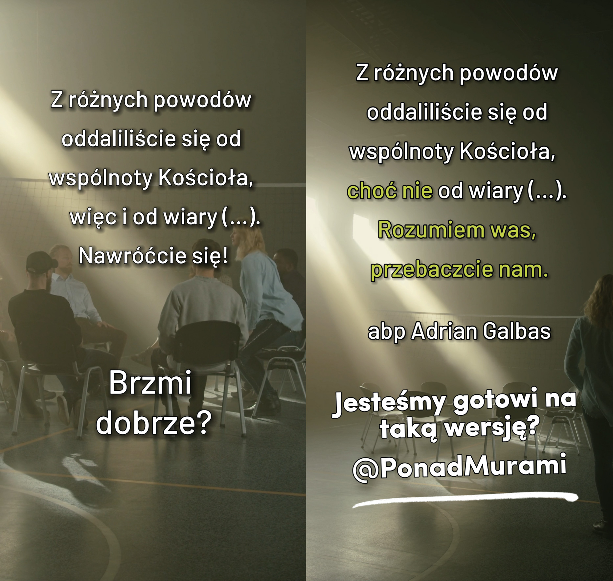

Meeting 3 — Experiencing
************************

.. tags:: content|openness|Openness, content|responsibility|Responsibility, content|church|Church, content|eucharist|Eucharist, content|jewish-traditions|Jewish traditions, method|image-work|Image work, method|group-work|Group work, type|workshop|Workshop

Introduction for the facilitator
================================

This is the last group meeting immediately before the seder. Its goal is to prepare us as best as possible to experience it in connection with the Eucharist. We do not want to convey intellectual reflection on the meaning of gestures and words - we concentrate on participation and experience. Seder and consequently Eucharist are engaging - our time, our body, our senses, our heart. There are people who, while eating breakfast, read a newspaper, reply to messages and jump to the room next door to hang laundry - one can consume meals like this. However, this is not how one consumes seder and Eucharist. Sitting at the table can be engaging, makes the whole world come down to this space here and now, time flows differently - that's the point! The meeting contains as many as three dynamics. It is to practice, experience more than learn. Let's practice, touch, taste. Not pretend, not in the form of synthetic workshops, but really. These dynamics are content, and not a break to maintain concentration.

Responsibility
==============

We are after experiencing Effatha. Let's start by sharing reflections on this topic:

* How did I experience the Effatha service? What is supernatural openness for me?

We are witnessing important changes in our Church. Pope Francis convened a synod under the slogan "For a Synodal Church: communion, participation and mission”. The Pope tries to convey something important to us about our understanding of our role in the community. What he says seems sometimes to encounter resistance and closedness on the part of believers. Let's try then with openness coming from above to read in what way the pope invited us on this path:

    We, the shepherds, walk with the people, sometimes in front, sometimes in the middle, sometimes behind. A good shepherd must move in this way: in front to lead the flock, in the middle to encourage on the way and not forget the smell of the flock, behind because the people also have their own "good sense of smell”.

    -- Pope Francis September 18, 2021

* What does such a vision of community mean for me in practice?
* How do I feel with such a vision of the Church?

Courage for important things
============================

It is good to be led when one trusts the one who leads. However, we discover that this is not our exclusive vocation. Effatha "is not for" being more open to listening to commands. It is us who take responsibility for choosing the direction (synodality)!

Inviting to the retreat we published materials prepared on the principle of juxtaposing two texts - a version changed by us and the original text. We wanted in this way to capture focusing on the change that can take place with appropriate openness of heart. Let's go back to a few of these examples.

.. note:: The animator takes out cards and spreads them on the table.

.. |d1| image:: porownania-01.jpg
   :scale: 50%
.. |d2| image:: porownania-02.jpg
   :scale: 50%
.. |d3| image:: porownania-03.jpg
   :scale: 50%
.. |d4| image:: porownania-04.jpg
   :scale: 50%
.. |d5| image:: porownania-05.jpg
   :scale: 50%

.. |d7| image:: porownania-07.jpg
   :scale: 50%
.. |d8| image:: porownania-08.jpg
   :scale: 50%

+------+------+
| |d1| | |d2| |
+------+------+
| |d3| | |d4| |
+------+------+

+------+------+
| |d5| | |d6| |
+------+------+
| |d7| | |d8| |
+------+------+

* If you had to choose one card showing a change that is important to You, which one would you choose?

* Why is this important to You?

We could have pulled out 100 cards a moment ago instead of a few or chosen 10 cards instead of one. We didn't do that. Is there any justification in this?

What sometimes happens when we increase the choices to 100?
What can happen when we choose 10 cards?

It's not that we don't want to deal with 10 things. It's about wanting to deal with one for sure before we deal with the tenth. It takes courage to decide what is important and agree that it will be a short list. Otherwise **inflation of importance** will occur - when everything is important nothing is. There is also a risk in the other direction of **apathy** - I don't know if I read all cards out of a million so until I read them all, I won't decide on any. Let's try at this meeting to help ourselves in searching for a wise path.

Let us read:

    The holy people of God shares also in Christ's prophetic office; it spreads abroad a living witness to Him, especially by means of a life of faith and charity and by offering to God a sacrifice of praise, the tribute of lips which give praise to His name.

    -- Lumen Gentium 12

* In what way do I share in something that is important to me in the spiritual sphere?
* What do I take responsibility for?

Below the surface
=================

Choosing by each of us what they take responsibility for and what is important for them is key to being ready to immerse and touch something that is deeper. We are preparing for this all day today.

Let's do one more exercise, and let Archbishop Fulton Sheen introduce us to it:

    Our Lord had a divine sense of humor, because he revealed that the whole universe is sacramental. A sacrament, in the broad sense of the word, combines two elements: one visible, the other invisible; one that can be seen or heard, tasted or touched; and the other - invisible to the eyes. There is however between these elements a certain connection or common meaningful space that connects them. Spoken word is a kind of sacrament, because there is in it both something material that can be caught by the ear, and something spiritual, i.e. the meaning of the word. A horse hears a told joke just like a human. One can even assume that it hears the spoken words better. The difference is that when a human hears a joke, they will most often laugh, and when a horse hears it - it will not burst out with horse laughter. This is because the horse hears only the material part of the "sacrament", that is the sound, while the human receives also the invisible or spiritual part, i.e. the meaning of the words.

    -- Abp Fulton J. Sheen “Sacraments”

.. note:: The animator takes out dixit cards and spreads them on the table. There are a few more of them than participants of the meeting. Then tells the rules of dixit: one has to choose in thought their card and come up with such an association for it that will not be too obvious so that everyone guesses, but will also not be so unusual that no one guesses.

Participants share the association, and the rest tries to guess what card it is.

* In what way does giving this association connect with Archbishop Sheen's introduction and our topic?
* What in the life of the community would be giving too simple an association?
* What in the life of the community would be giving an association that no one will guess?

Giving too obvious an association is most likely missing the depth, saying something superficial. Giving an association that no one will guess does not build the community as it could. As a community of believers we are constantly "stretched" between these two points trying to seek our common growth.

* In what places do I feel that I touch something that is important and deep? When did I discover this place?

Breaking through
================

A beautiful plan is drawn for us at the meeting - we are to be open to a new look, listening to the Pope who encourages us to participate, choosing what is important and deep for us! Why, looking through the window, does it seem that few of us live this way?

Let us read:

    As each has received a gift, employ it for one another, as good stewards of God’s varied grace: whoever speaks, as one who utters oracles of God; whoever renders service, as one who renders it by the strength which God supplies; in order that in everything God may be glorified through Jesus Christ. To him belong glory and dominion for ever and ever. Amen.

    -- 1 Pet 4:10-11

* To whom does St. Peter speak?
* To what does this fragment encourage You?

We are called to go out into the deep and to courageously become a ladder for growth for ourselves. Faith demands maximalism, decision to make it something important (really important). It's a matter of breaking through (or if you prefer conversion).

Let us read:

    “Jesus wants nothing from us. He wants us”

    -- Fr. Franciszek Blachnicki

This is a good summary of the change for which the Church (and Jesus) is waiting.

This can happen through a miracle. Most often however it does not happen this way, but there's nothing wrong with that - one can do it differently. Going out into the deep and concentration on what is important can be practiced. Daily, consistently.

* What would help me, what could others do, so that I do not fall into shallowness?
* What can we do to give each other lifting force in the Church?

Experiencing
============

The goal of our retreat is to experience the Eucharist. Such "ordinary" one. This is the peak point of our meeting. However, we want to do it with the greatest possible openness, awareness, so that it is a real experience for us, to go under the surface a centimeter further than before.

    Who celebrates the Holy Mass, who celebrates the Eucharist? The answer seems simple: the priest! In our churches we see after all the priest standing at the altar. Many times someone asks us: which priest celebrated today? – and we answer, giving his name or surname. However seeking an answer to the posed question, one must refer to theological reflection on liturgy. The Catechism of the Catholic Church says that liturgy is celebrated by the whole community, the Body of Christ united with its Head, that is Christ. This applies also to the Eucharist. Celebration of the Eucharist is also an action of Christ and the Church, the whole community celebrates it.

    -- Fr. Jan Miazek

* To what extent has such thinking about the Eucharist also entered my heart and mind?

Let's recall four ways of God's presence in the Eucharist:

    | To accomplish so great a work, Christ is always present in His Church, especially in her liturgical celebrations. He is present in the sacrifice of the Mass, not only in the person of His minister, "the same now offering, through the ministry of priests, who formerly offered himself on the cross", but especially under the Eucharistic species. By His power He is present in the sacraments, so that when a man baptizes it is really Christ Himself who baptizes. He is present in His word, since it is He Himself who speaks when the holy scriptures are read in the Church. He is present, lastly, when the Church prays and sings, for He promised: "Where two or three are gathered together in my name, there am I in the midst of them" (Matt. 18:20).
    | Christ indeed always associates the Church with Himself in this great work wherein God is perfectly glorified and men are sanctified. The Church is His beloved Bride who calls to her Lord, and through Him offers worship to the Eternal Father.
    | Rightly, then, the liturgy is considered as an exercise of the priestly office of Jesus Christ. In the liturgy the sanctification of the man is signified by signs perceptible to the senses, and is effected in a way which corresponds with each of these signs; in the liturgy the whole public worship is performed by the Mystical Body of Jesus Christ, that is, by the Head and His members.
    | From this it follows that every liturgical celebration, because it is an action of Christ the priest and of His Body which is the Church, is a sacred action surpassing all others; no other action of the Church can equal its efficacy by the same title and to the same degree.

    -- Constitution on the Sacred Liturgy, pt. 7

* In which four spaces is Christ Present during the Eucharist?
* In which of these spaces do I most rarely naturally touch something spiritual?
* In which of these spaces do I most often naturally touch something spiritual?

Sensuality
==========

Four spaces in which we find the really present Christ are something more than systematizing knowledge. It is a tip for us not to "fixate" on one space. In each of them Jesus is Present - whole in Fullness, however the ability to experience Him in each of the spaces simultaneously opens before us new possible connections that enrich each other.

Let's do an exercise related to this now.

.. note:: The animator takes out bags with an object and hands one to everyone. Participants without looking reach into them and using touch try to recognize what it is.

* What is in the bag?

.. note:: The animator asks participants to close their eyes. Takes out oil and releases its scent in the air.

* What is this scent?

.. note:: The animator plays a sound from the phone

* What sound is this?

.. note:: The animator asks to close eyes and distributes a small candy to everyone

* What taste is this?

Let's imagine that we have never drunk tea. Someone pours it for us into a cup, we see the color of the liquid pouring into the vessel. Sight tells us something about tea. We take it in our hands and bring it closer to ourselves feeling its scent - perhaps we already know how to recognize what it was made of. When we put it to our lips the experience deepens.

Spirituality is sensual. Faith is sensual. And literally - affects all senses and figuratively - is multidimensional and answers are at the junction of each of the dimensions.

* What significance for spirituality has the sense of touch?
* What significance for spirituality has the sense of smell?
* What significance for spirituality has the sense of hearing?
* What significance for spirituality has the sense of taste?

Let's help ourselves today experience the Eucharist so that "someone else" does not do it "for us". Eucharist invites all of us. This will be visible at the seder, which is its prototype. Eucharist has the taste of wine, sound of broken matzah, look of flickering candle light on the celebrant's vestments, scent of incense, touch of warm hand of the sign of peace of brother and sister and heat of the read Word. How sensual all this is in the best sense of the word, how close! God did everything he could so that we could "enter whole without remainder" into His Mystery.

    The man who wishes to understand himself thoroughly — and not just in accordance with immediate, partial, often superficial, and even illusory standards and measures of his being — must with his unrest, uncertainty and even his weakness and sinfulness, with his life and death, draw near to Christ. He must, so to speak, enter into him with all his own self, he must “appropriate” and assimilate the whole of the reality of the Incarnation and Redemption in order to find himself.

    -- Encyclical Redemptor Hominis, John Paul II

* In what gestures/signs of the Eucharist is it most "natural" for me that I participate?
* What is immersion in the death and resurrection of Christ for me?

Connected worlds
================

Let us read:

    Think not that I have come to abolish the law and the prophets; I have come not to abolish them but to fulfil them.

    -- Mt 5:17

* Why could Jesus' contemporaries think that I want to abolish something?
* Is the desire close to us to want to see things without connection with what was?

Our faith did not fall from the sky. Eucharist was not revealed on a stone tablet. Jesus did not invent matzah and wine. God enters the world and creates new connections in it. God only creates, destroys nothing, this is for many of us his basic "identity" - He is the Creator. We want to experience seder together today to create a new connection - in hearts, soul and mind.

* Who of us has already participated in a seder?
* With what hope do we go to it?
* What would we like to be connected?

We will eat supper. We will pour wine and break bread. We will talk and joke. It will be simple, but not crude. It will be ordinary, but beautifully ordinary. It is all the time one and the same story of God towards us: a light breeze, not thunder; a stable, not palaces; an ordinary fisherman, not a scholar; commandment of love more than 500 rules.

Jesus showed us that eating supper with someone changes the world. Let's eat supper together so as to mutually pull ourselves up and inscribe ourselves into this story of the Highest.

Prayer
======

Let's start prayer from:

    | Behold, how good and pleasant it is
    | when brothers dwell in unity!
    | It is like the precious oil upon the head,
    | running down upon the beard,
    | upon the beard of Aaron,
    | running down on the collar of his robes!
    | It is like the dew of Hermon,
    | which falls on the mountains of Zion!
    | For there the Lord has commanded the blessing,
    | life for evermore.
    |
    | -- Ps 133

Let the words of the Psalm inspire our intercessory prayer.
