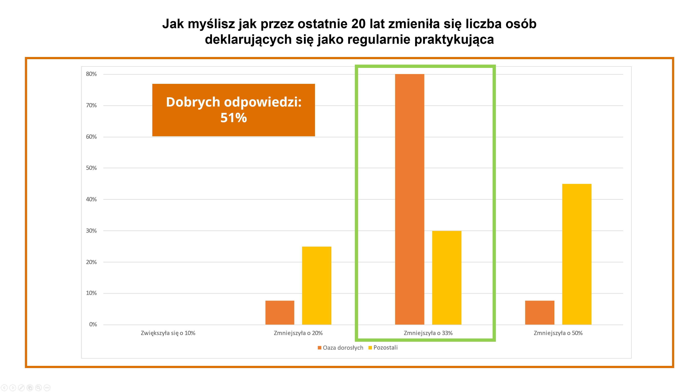

Meeting 2 — Supernatural Openness
***********************************

.. tags:: content|openness|Openness, content|church|Church, content|truth|Truth, content|eucharist|Eucharist, content|conversion|Conversion, method|image-work|Image work, method|text-work|Text work, type|workshop|Workshop

Introduction for the facilitator
================================

At this meeting we want to go deeper into the topic of openness. Show two of its types: humanistic openness and supernatural openness, which is the content of the Effatha service, which we will experience today. The meeting is primarily to prepare participants to understand and experience this moment of the retreat. At this meeting we also want to encourage participants to pay attention that humanistic openness complemented by supernatural creates a whole, thanks to which we have the ability to feed on what we already know, to gaze deeper and perceive things with a different quality of looking.

Introduction
============

Behind us are many interesting contents. We talked about expanding the heart, about God who inspires, about Jesus' openness, we were at evening prayer, where we could in some sense embody Nicodemus, we listened to Ariel's conference. Let's share what has resonated so far:

* How did yesterday's prayer affect my spirituality?
* What moved me in Ariel's conference?
* What is supernatural openness for me?

We talked a lot yesterday about openness to the world, about openness to each other, to God; about curiosity, which is worth awakening time and again anew. Today we want to look at openness a little deeper.

.. note:: We mean here human openness, such as we understand it intuitively, rational openness. In the next part of the outline supernatural openness is discussed, one that does not flow from man and his will to possess an attitude of openness towards something, but from God who opens us in a deeper and fuller way.

Two opennesses
==============

Let's lean over openness once again and see that it can be divided (or actually expanded) into two phenomena. The first of them is humanistic openness - it appeared yesterday many times. We know that it is an attitude that should be nurtured and cared for.

.. note:: In this place the animator distributes a survey to participants (attached to the outline). The questions from the survey come from the Report on the Church (which was published in 2023). The questions concern various aspects of Church life, which are often the object of distortions, understatements, or even lies. Reality sometimes looks much more positive than we would expect. The animator should familiarize themselves with the questions and answers before starting the meeting so that the survey results are not a surprise for themselves. After conducting the survey, the animator shows the real answers (charts attached to the outline), which most likely will also be a big surprise in the sharing group. The charts show the results of one of the communities in Knurów, in which the same workshop was conducted a few months ago, and markings which answers are correct. The goal of this exercise is to show that although we are members of the Church, we often know very little about it, and our knowledge in many elements is not complete.

How do you think the number of people declaring themselves as regularly practicing has changed over the last 20 years?
    1. Increased by 10%
    2. Decreased by 20%
    3. Decreased by 33%
    4. Decreased by 50%

How do you think the number of Catholic communities in Poland has changed over the last 25 years?
    1. Is similar
    2. Decreased by 25%
    3. Decreased by half
    4. Increased by 50%

How many volunteers in the country do you think are involved in church organizations?
    1. 25%
    2. 50%
    3. 75%
    4. 90%

.. image:: wolontariusze.jpg
   :align: center

.. image:: zmiana_wspolnot.jpg
   :align: center

* What surprised me in this exercise?
* How do I look at the Church, which looks in reality perhaps better than in my beliefs?
* Which space of my life needs this workshop currently?

**Humanistic openness** is closely connected with readiness for new, unexplored things. An open person is prepared for continuous "testing" of their beliefs. As we could notice in the survey, aspects of our life that were natural for us, well known, are not always obvious, and our knowledge over time can become outdated and need a fresh look.

In the survey we could notice barely one of the types of verification of our knowledge and beliefs, namely transforming our pessimism and lack of passion into a new, fresh look at reality. When we reverse the situation given in the survey we will notice that excessive optimism and excessive expectations (when we expect fireworks) can also be verified by reality in quite a clear way.

Spiritual life consists of both these aspects, it is worth that this workshop helps us assimilate this. To show the second aspect of verification of our beliefs, let's pay attention to the story of the commander Naaman:

Let us read:
    Naaman, commander of the army of the king of Syria, was a great man with his master and in high favor, because by him the Lord had given victory to Syria. He was a mighty man of valor, but he was a leper. Now the Syrians on one of their raids had carried off a little maid from the land of Israel, and she waited on Naaman’s wife. She said to her mistress, “Would that my lord were with the prophet who is in Samaria! He would cure him of his leprosy.” So Naaman came with his horses and chariots, and halted at the door of Elisha’s house. And Elisha sent a messenger to him, saying, “Go and wash in the Jordan seven times, and your flesh shall be restored, and you shall be clean.” But Naaman became angry, and went away, saying, “Behold, I thought that he would surely come out to me, and stand, and call on the name of the Lord his God, and wave his hand over the place, and cure the leper. Are not Abana and Pharpar, the rivers of Damascus, better than all the waters of Israel? Could I not wash in them, and be clean?” So he turned and went away in a rage. But his servants came near and said to him, “My father, if the prophet had commanded you to do some great thing, would you not have done it? How much rather, then, when he says to you, ‘Wash, and be clean’?” So he went down and dipped himself seven times in the Jordan, according to the word of the man of God; and his flesh was restored like the flesh of a little child, and he was clean.

    -- 2 Kgs 5:1-4.9-14

* Which manifestations of God's grace are "too ordinary" for me? Where do I happen to expect fireworks?
* What does my openness to things I already know spiritually look like?
* What does my openness regarding the Eucharist / sacrament of penance and reconciliation look like?

.. note:: This is a good moment for testimony regarding both aspects of openness to new knowledge. In the spiritual life of each of us situations happened when our beliefs encountered new knowledge or circumstances that enriched us in a way we did not expect, or which seemed too normal to us. Testimony will be a good ending of this module and transition to the next.

Openness starts from standing in Truth with oneself and seeing where I am spiritually at this moment. It requires looking into oneself, what is my baggage that I carry spiritually with me. It often happens that our longing is based on a selected aspect of the past, which over time has acquired an idealized form. It is easy for us then to lose sight of where we are at this moment and close ourselves to what is here and now, to what is true. This longing concerns also our spiritual everyday life, because sacraments can also fall victim to "becoming commonplace". However, when we open our eyes and allow ourselves to be enriched by everyday life, we will notice that the Holy Mass led by a charismatic priest from the other end of the world is a sacrament on which God's grace and blessing pours out in exactly the same way as mass led by a priest in a small, rural church.

Supernatural openness
=====================

Today we will take part in the Effatha service, which is focused around a completely different kind of openness than the one we talked about a moment ago. The Effatha service is an element of preparation for baptism by catechumens. During this rite ears (as a sign of more accurate listening to the Word of God) and mouth (as a sign of sending to preach the Gospel) of catechumens are blessed. During this rite we read a fragment from the Gospel according to St. Mark about the healing of a deaf-mute.

Let us read:

    Then he returned from the region of Tyre, and went through Sidon to the Sea of Galilee, through the region of the Decapolis. And they brought to him a man who was deaf and had an impediment in his speech; and they besought him to lay his hand upon him. And taking him aside from the multitude privately, he put his fingers into his ears, and he spat and touched his tongue; and looking up to heaven, he sighed, and said to him, “Ephphatha,” that is, “Be opened.” And his ears were opened, his tongue was released, and he spoke plainly. And he charged them to tell no one; but the more he charged them, the more zealously they proclaimed it. And they were astonished beyond measure, saying, “He has done all things well; he even makes the deaf hear and the dumb speak.”

    -- Mk 7:31-37

Jesus heals a deaf-mute. Although in the fragment the expression appears "makes the deaf **hear** and the dumb speak", let's remember that in reality Jesus **introduces** the healed one into a completely different world.

In addition, he does it with characteristic delicacy and sensitivity, using such impressions that are everyday life for a deaf-mute - touch, warmth, look, sigh. Moreover, he took him "aside from the multitude", to a place that will not overwhelm with sounds(!). Until now, the reality of sounds did not exist in the life of the healed one, moreover, if he could not hear, then the world of spoken language was completely alien to him. Probably he communicated with the environment using sign language, however he was excluded from a significant part of life that happened as if next to him. Jesus does not "restore" hearing to this man, he lets into his life a new reality - gives him hearing, hands it, teaches the whole body what it is like to hear, introduces something from beyond the current world. Until now things had colors, smells, tastes, now they acquired sound. The sense of hearing gives us orientation in space, we hear noises from afar, we orient ourselves at a distance that something is happening, exactly using hearing. Jesus expands the perception of the healed one by unimaginable things, exceeding his experience. Jesus enters where man cannot open himself more - after all the deaf-mute used every other sense to cope in the world, did what he could, he could not do anything more himself - a new dimension was given to him.

However, this fragment speaks not only about this. Let's read the commentary:

    But we all know that man's closure, his isolation, does not depend only on the sense organs. There is an internal closure, which refers to the deep center of the person, what the Bible calls "heart". This is what Jesus came to "open", to liberate, to enable us to live fully the relationship with God and others. That is why I said that this small word "effatha – be opened", contains in itself the entire mission of Christ. He became man so that man, who became internally deaf and dumb due to sin, would be able to hear the voice of God, the voice of Love that speaks to his heart, and so that he would learn in this way to speak on his part the language of love, communication with God and with others. For this reason the word and gesture "effatha" were included in the rite of Holy Baptism, as one of the signs explaining its meaning: the priest, touching the mouth and ears of the newly baptized person, says "Effatha", praying that she may immediately listen to the Word of God and profess faith. Through baptism the human person begins, if one can say so, to "breathe" the Holy Spirit, the same whom Jesus called from the Father with this deep sigh to heal the deaf-mute.

    -- Benedict XVI, Angelus Reflection (from 09.09.2012)

The meeting between Jesus and the deaf-mute happens constantly. We can see us in this situation - spiritually deaf and dumb due to sin, we can meet Jesus who takes us aside, separately from the crowd, speaks to us with the closest message for us and introduces a new space, new quality, which is available in a supernatural way, given by God who performs this opening.

* Which space of my life has been opened by God? What did the first moments of the new reality look like?

Supernatural openness complements humanistic openness. It is also something that exceeds us, and what as people we are not able to kindle from ourselves alone.

Effatha as a pre-sacrament
==========================

The intuition of the Church is that openness complemented in this way should precede the sacrament - the first one, but also every subsequent one. Let's look at what direct preparation for the sacrament of baptism of adults looks like and in what context the Effatha rite appears.

.. note:: The animator takes out cards with the names of three rites - Presentation and Handing Over of the Creed, Effatha, Choice of a Christian Name, additionally the slogan "catechesis" and "baptism", as the beginning and end of the process. They should be on separate cut cards. The animator briefly explains what a given rite consists of (descriptions are attached to the outline). The participants' task is to arrange them in the order in which they think these rites occur one after another. e.g. catechesis -> effatha -> naming -> handing over the creed -> baptism. The correct order is: catechesis -> handing over the creed -> effatha -> naming -> baptism. The goal of this exercise is to show that in this process rational cognition happens first, which requires human openness - Catechumens first learn the Creed, learn it, consciously work through its content in their head, profess it during the rite of handing over the creed. Then Effatha occurs and complementation with supernatural openness, this in turn leads to naming, so marking a certain change in human identity, and finally baptism.

+------------------------------+
| RITE OF HANDING OVER CREED   |
+------------------------------+
| NAMING                       |
+------------------------------+
| EFFATHA                      |
+------------------------------+
| CATECHESIS                   |
+------------------------------+
| HOLY BAPTISM                 |
+------------------------------+

* What thoughts does such an order of these rites arouse in me?

The longer you look, the more you see - summary
===============================================

Full openness (humanistic complemented by supernatural) is needed for us to stand in truth with the world and accept it fully. It is also needed for us to be able to look repeatedly at what is known, familiar and time and again see more and more. We need to break out of the scheme that only new things can inspire us. Effatha should happen in our heart every time we receive sacraments so known to us. Even the most revealing sermon will give us nothing if we do not have openness to God's everyday life in us. It is not the new that must inspire, not a new series, new product, sometimes it is better to gaze, but with openness that is given to us, because the longer we look, the more is visible.

Ending - prayer
===============

We propose to pray at the end with the prayer of St. Teresa:

    | Let nothing disturb you,
    | Let nothing frighten you,
    | All things are passing away:
    | God never changes.
    | Patience obtains all things
    | Whoever has God lacks nothing;
    | God alone suffices.

This prayer is to emphasize the expression that we want to search into depth, in what is known - God alone suffices, God is unchanging.
