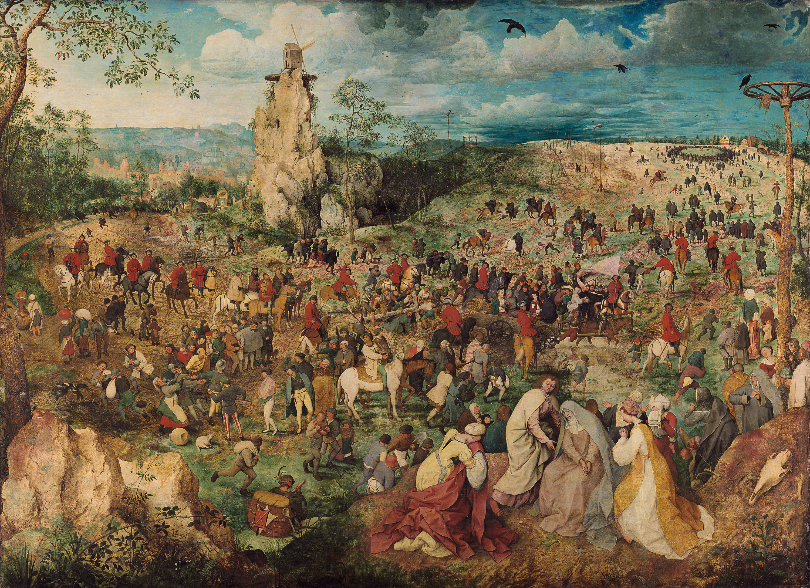

Meeting 2 — He saw and believed
*******************************

.. tags:: content|time|Time, content|hope|Hope, content|old-testament|Old Testament, content|word-of-god|Word of God, content|truth|Truth, method|text-work|Text work, type|biblical|Biblical

Goals of the meeting + introduction for the facilitator
=======================================================

Part of the content of this meeting will probably overlap with the Homily delivered by the Bishop. This is intentional. Let's listen to the Homily and refer to it during this meeting strengthening in this way the assimilation of content. Even if part of the questions is directly addressed by the Bishop, let's not be afraid to raise them again at the meeting, creating a space for creative sharing of a personal view.

Goals of the meeting:
    - Showing maturing in faith as not so much searching for new content as listening with one's life to truths already known.
    - Attempt to create a habit to find short moments in religious life to remind oneself why we do something.

God is among people...
======================

At the morning conference we talked about knowing and discovering. Sometimes it is so that we have an intuition that something exists, that "something is there", although we cannot name, define, define it. Some of us have such feelings in relationships with others: "There is something between us. Something sparked. I don't know exactly what it will be yet, but I feel that something important".

This is how one of the most beautiful stories in the history of mankind begins.

Let's read:

    Then Moses said to God, “If I come to the people of Israel and say to them, ‘The God of your fathers has sent me to you,’ and they ask me, ‘What is his name?’ what shall I say to them?” God said to Moses, “I AM WHO I AM.” And he said, “Say this to the people of Israel, ‘I AM has sent me to you.’”

    -- Ex 3:13-14

* What is the first thing that believing Israelites learned about God? Why so little?

* How would You introduce yourself to God if He asked You who you are?

In man this thought is somehow written in the heart - an intuition that there exists a God who is not detached and distant, but is someone who watches and cares. Someone who is.

Let's read

    And they took him and brought him to the Areopagus, saying, “May we know what this new teaching is which you present? For you bring some strange things to our ears; we wish to know therefore what these things mean.” Now all the Athenians and the foreigners who lived there spent their time in nothing except telling or hearing something new. So Paul, standing in the middle of the Areopagus, said: “Men of Athens, I perceive that in every way you are very religious. For as I passed along, and observed the objects of your worship, I found also an altar with this inscription, **‘To an unknown god.’ What therefore you worship as unknown, this I proclaim to you**.

    -- Acts 17:19-23

* In what are Athenians similar to Israelites?

* What in my life caused me to recognize that there is a God?

* What in my life caused me to recognize that there is a God among us?

In every age, place and time God searches for man and the way to his heart. God is present in our history, enters our space, culture, desires. God arouses in hearts the desire to meet with him. Regardless of whether we speak of the times of Moses 13th c. BC, or the times of St. Paul 1st c. AD or modern times 2000 years after the Resurrection of Jesus - all the time the same search for man takes place, so that he may be saved. God was, is and will be.

...unnoticed
============

Let's read:

    And they asked him, “What then? Are you Elijah?” He said, “I am not.” “Are you the prophet?” And he answered, “No.” They said to him then, “Who are you? Let us have an answer for those who sent us. What do you say about yourself?” He said, “I am the voice of one crying in the wilderness, ‘Make straight the way of the Lord,’ as the prophet Isaiah said.” **Now they had been sent from the Pharisees.** They asked him, “Then why are you baptizing, if you are neither the Christ, nor Elijah, nor the prophet?” John answered them, “I baptize with water; **but among you stands one whom you do not know**, even he who comes after me, the thong of whose sandal I am not worthy to untie.”

    -- Jn 1:21-27

* What does "whom you do not know" mean?

* Why was Jesus not recognized by the people of his times?

* Who were the messengers?

Currently Pharisees associate for us mainly with something negative. As in every community, also among Pharisees there was no shortage of hypocritical, untrue people. It is worth, however, for us to reflect for a moment who the Pharisees were.

.. note:: This is such a moment of the meeting that can "hit" strongly established ways of thinking. I recommend that we as animators face this ourselves and read before we approach the meeting.

Let's read:

    The Pharisees were **experts in understanding and interpreting the Holy Scripture**. They were basically a faction of lay people, unlike the priestly aristocracy of Sadducees, however they tried in their conduct to observe temple rules of purity. The Pharisees came from the poorer strata of Jewish society and represented Jewish folk religiosity. **They established schools and synagogues everywhere**. They also instructed fathers of families to make efforts so that their **sons received education in the Law**. Also daily recitation of "Hear, O Israel" and other parts of synagogue divine service are the merit of Pharisees. They believed in the coming of the Messiah. **Messianic hopes – unlike the views of Sadducees, to whom they were foreign – were the most important part of their teaching**, visible in all parts of synagogue liturgy. This meant expecting the kingdom of God. The Pharisaic movement developed from the end of the 3rd century BC.

    (based on "Josephus Flavius: Antiquities of the Jews". Zygmunt Kubiak, Jan Radożycki)

Who was then better prepared intellectually and spiritually on earth to recognize the Messiah than the Pharisees? For over 200 years several generations read the Scripture to prepare for His coming. They did it zealously - spreading teaching among ordinary people with conviction and devotion. They were experts.

* How could the Pharisees feel hearing from St. John the announcement that they did not know the Messiah who not so much is coming as is already among them?

* Why is Jesus not recognized by people contemporary to us?

* What does the example described in the Gospel mean for us today?

One can found a Movement that will last 200 years and build hundreds of schools. One can daily express hope for the coming of the Messiah in prayers. One can observe many rules. One can do all this and miss Jesus...

Spiritual tuning
================

Some, however, recognized Jesus.

* Why do you think St. John recognized Jesus? What did he have in him?

* To what spiritual things are you sensitive?

* What spiritual matters "pass you by"?

There are people who have in them a readiness of heart to accept His person and teaching. Crucial is a certain kind of sensitivity and openness. Sometimes we say that with someone we "broadcast on the same waves", right? Meeting with God requires such "spiritual tuning". St. John had this in him - he was sensitive to God's voice.

Before the retreat we placed on our profile various announcements of the Messiah from the Old Testament.

.. important:: Due to time saving I propose that the animator read them from the outline or give someone to read - navigation in OT can take us a lot of time.

Among others such:

    Judah, your brothers shall praise you; your hand shall be on the neck of your enemies; your father’s sons shall bow down before you. Judah is a lion’s whelp; from the prey, my son, you have gone up. He stooped down, he couched as a lion, and as a lioness; who dares rouse him up? The scepter shall not depart from Judah, nor the ruler’s staff from between his feet, until **he comes to whom it belongs; and to him shall be the obedience of the peoples.**

    -- Gen 49:8-10

    But you, O Bethlehem Ephrathah, who are little to be among the clans of Judah, from you shall come forth for me one who **is to be ruler in Israel**, whose origin is from of old, from ancient days.

    -- Mic 5:2

    Rejoice greatly, O daughter of Zion! Shout aloud, O daughter of Jerusalem! Lo, **your king comes to you; triumphant and victorious is he**, humble and riding on an ass, on a colt the foal of an ass.

    -- Zech 9:9

    Behold, the days are coming, says the Lord, when I will fulfill the promise I made to the house of Israel and the house of Judah. In those days and at that time I will cause a righteous Branch to spring forth for David; and **he shall execute justice and righteousness in the land**.

    -- Jer 33:14-15

    Behold, I send my messenger to prepare the way before me, and **the Lord whom you seek will suddenly come to his temple**; the messenger of the covenant in whom you delight, behold, he is coming, says the Lord of hosts.

    -- Mal 3:1

* What Messiah could the Israelites expect based on these fragments? Who is he?

* Which of these announcements turned out to be untrue?

All are true! But how much Jesus surprised everyone. He came like a King and truly reigned - from the Cross and washing the apostles' feet. The first Christians had in them a readiness to change their way of thinking - to **tune in** to what the Messiah spoke about. Listening to Jesus' teachings they tried to understand them with a fresh look. They were ready to change the understanding of what it means to be a king.

* What Messiah are you waiting for? With which one do you want to meet today at evening prayer?

Mindfulness
===========

At our retreat we want to try together to enter such readiness and openness to God. We want to **await** Jesus such as he wants to come to us. We see on the example of the Pharisees how crucial a matter this is. For this to succeed, we must not lose this awareness. We must be **mindful**.

* What is mindfulness for You? When is it easy for You to be mindful?

* What vision is closer to You: of spiritual development as systematic passing from room to room or looking around a great cathedral standing in its center?

.. note:: Both answers are good!

We are entering a difficult space of faith where naming things is strongly dependent on our sensitivity and previous experiences. Spiritual development is described depending on the perspective by both these images.

From the perspective of a person, in the process of development we often feel as if we were passing from room to room discovering new Mysteries, aspects, connections. We read the books of the Old Testament and suddenly the typicality of Moses relative to Jesus, Eve relative to Mary is revealed to us. It is like descending to subsequent circles of initiation, and every passage expands our heart and causes greater gratitude towards the Plan of Salvation through which the Good God leads us.

On the other hand, all this takes place with our full access to the Mystery. We stand immediately in the center of the cathedral and can see and know everything. No, we do not form Christians such that before they come to Holy Mass, we require them to pass through 50 rooms and understand fully what is happening in them. We have access "immediately" to the "Summit and source". There is no "Advent for beginners" and "Advent for mystics" - there is Advent.

Mass, Advent, Holy Scripture does not change. However, we have a feeling that we "move on" - why? Something in us changes. It is our mindfulness to the Mystery that changes. We enter it, we sail out into the deep.

* To what elements in prayer are you now particularly sensitive?

Pieter Bruegel captured this topic wonderfully in his paintings. We would like to see one of them now:

* What does this painting depict?

.. note:: Only after looking closely can one notice New Testament scenes. In the central part, right above the rider on a white horse, one can notice the fall of Christ under the weight of the cross. His tormentors are arguing whether to lift him up or leave him on the ground. Their indecision is related to the second scene taking place simultaneously slightly lower on the left side. From a group of peasants returning home, a man is pulled out. His wife holds her husband not wanting to let him go. A soldier on a horse clears a place among the onlookers and looking back urges him to approach the cross and the fallen Jesus. The man resisting the tormentors is Simon of Cyrene. (Wikipedia)

Let's ask:

* What do you think the artist wants to convey to us in this way?

We could be one of the many characters in the painting who do not notice how important a moment in history is just taking place. We can, however, look at the functioning of the painting itself - Breugel created a work that itself became what it describes - we could also be one of the many people passing by the canvas not devoting too much attention to it and not wondering about what it depicts. The story of the Pharisees repeats like an echo over the centuries.

* **What can we do to be more mindful?**

* What actions of God do I see in my everyday life?

* What does my searching for God look like? Do I see God in my "today" or do I wait for the great coming at the end of time?

.. note:: The first question depends very strongly on the age group. It is worth thinking about it oneself. It needs to be concretes. For some a cross on the wall in the room helps (it feels silly to sin near a cross... maybe it is not a mastery of motivation, but it works for some [for older ones: such a barrier of mindfulness for fiancés is often constituted by a cross worn under clothes - restores vigilance in critical moments]), and for others a notification set on the phone that it is time to pray.

God sometimes comes spectacularly. Part of us likes it very much - angels, trumpets, a star in the sky. It seems that the whole universe then calls to us "look! Something important is happening". But this is not the only way… It is probably a rare way.

He saw and believed
===================

We base the entire retreat on a fragment from the 1st letter of St. John:

    So we know and believe the love God has for us.

    -- 1 Jn 4:16a

St. John directs his letters and Gospel to Christians who already have established faith. In place of descriptions of Jesus' birth in St. Luke we will find therefore the Johannine prologue. How very differently evangelists begin their works! St. John not so much wants to fascinate us with the figure of Jesus as direct us towards a deeper understanding of Him. Knowing the Johannine writings the above fragment awakens certain associations.

Let's read several fragments:

    So we **know and believe** the love God has for us.

    -- 1 Jn 4:16a

    Then the other disciple, who reached the tomb first, also went in, and he **saw and believed**.

    -- Jn 20:8

    The father **knew** that was the hour when Jesus had said to him, “Your son will live”; **and he himself believed**, and all his household.

    -- Jn 4:53

    Jesus said to the twelve, “Do you also wish to go away?” Simon Peter answered him, “Lord, to whom shall we go? You have the words of eternal life; and we have **believed, and have come to know**, that you are the Holy One of God.”

    -- Jn 6:67-69

    For I have given them the words which thou gavest me, and they have received them and **know in truth** that I came from thee; and they have **believed** that thou didst send me.

    -- Jn 17:8

    but if I do them, even though you do not believe me, **believe the works, that you may know and understand** that the Father is in me and I am in the Father.”

    -- Jn 10:38

Let's look now at these 6 fragments and see what they have in common.

* Why are knowing and faith so closely related?

* What would faith be without knowing?

* What is the God whom I have known like?

.. centered:: Christ wants us to be believers, but not gullible and naive! God wants to be known.

Holy Spirit
===========

A lot of content for an hour-long meeting, right? All this seems to be too big and too difficult for man. And so it is. God knows about this so he comes with help. There is a fragment that many of us may have already heard, but how differently it is read at this moment in which we are now!

Let's read:

    no one can say “Jesus is Lord” except by the Holy Spirit.

    -- 1 Cor 12:3

Before we said "Jesus is my Lord" for the first time in life, the Holy Spirit was already working in us. It is He who enables us to pray and believe.

* How often do you start Holy Mass with a prayer to the Holy Spirit?

* How often do you start any prayer with a prayer to the Holy Spirit?

Cooperation with grace is crucial for spiritual growth. It is a skill like any other - one must train it so that it grows. At the beginning we will maintain mindfulness, concentration for 10 seconds during Mass when we think to ourselves "what are You thinking about? It is the consecration!". Then it will be a minute, then two… And then?

Let's read:

    It is no longer I who live, but Christ who lives in me; and the life I now live in the flesh I live by faith in the Son of God

    -- Gal 2:20

This is a real perspective. Not only saints testify to this, but many believing Christians. Then you feel at home. You feel that you **knew** faith as your home and **believed**.

Application
===========

We will try to leave this meeting with a resolution to make a step forward. It doesn't have to be a big thing. The most valuable are things that we decide in our heart ourselves. For inspiration we give several possibilities:

- Before every reading at today's evening prayer sigh in the heart for a blessing for the reader, so that they perform the ministry well (mindfulness training)
- A moment before the evening prayer be in the hall and ask yourself questions:
    - Why are we praying together?
    - What will happen here?
- During prayer:
    - In what way is this prayer continuous? Does this prayer end?
    - For the ambitious: Asking yourself these questions before every Eucharist, until Christmas.

However, we want to ask directly for two things: please write down your resolution in a notebook, talk about it with one person (from the retreat or outside) by the end of Sunday.
