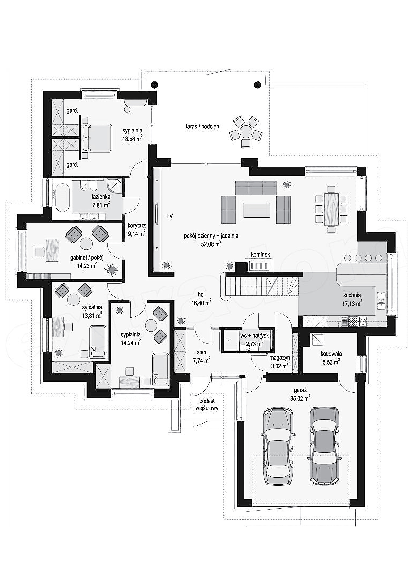

Meeting 3 - Faith at Home
*************************

.. tags:: content|church|Church, content|community|Community, content|word-of-god|Word of God, content|seeking|Seeking, content|jewish-traditions|Jewish traditions, method|symbols-work|Symbols work, method|text-work|Text work, method|discussion|Discussion, type|mystagogical|Mystagogical

Introduction for the Animator
=============================

The third meeting in groups at the "The Same Night" retreat is the longest. We want to use this time to build an atmosphere of sharing and openness. This is the last moment of the group meeting together before experiencing the climax of the retreat.

The goal of this meeting is to prepare for accepting the Seder as a home space. If the Seder is just another "service" celebrated for us by a "master of ceremonies", we will understand nothing of the Jewish (and thus Christian) concept of faith. It is crucial not to succumb to the "temptation of professionalization" in spirituality.

Introduction
============

We are halfway through our retreat. What is happening with us? What is God moving in us now?

- What did we discover during the Tent of Meeting over the Exsultet?
- What do we take for ourselves from the "Path of the Story"?

The Role of Astonishment
========================

Since yesterday we have been talking about the role of the story and how important it is. Let's allow ourselves to start this meeting by reading a fragment that is a kind of summary of what is behind us:

   In the face of postmodern allergy to "grand narratives", theology – itself being such a story by its nature – can constitute a prophetic sign that humanity does not cope too well without great stories. And if truly great stories are missing, their place in the human imaginary will willingly be taken by dwarf, populist, ideologizing narratives.

   -- Fr. Grzegorz Strzelczyk

One can feel a certain powerlessness towards the current distance to great stories. How to resurrect great stories to life in the space between us? Where does each of them have its beginning?

Let's read:

   The word of the Lord came to me: "Son of man, propound a riddle, and speak a parable to the house of Israel; say, Thus says the Lord God: A great eagle with great wings and long pinions, rich in plumage of many colors, came to Lebanon and took the top of the cedar. He broke off the topmost of its young twigs and carried it to a land of trade and set it in a city of merchants. Then he took of the seed of the land and planted it in fertile soil. He placed it beside abundant waters. He set it like a willow twig, and it sprouted and became a low spreading vine, and its branches turned toward him, and its roots remained where it stood. So it became a vine and produced branches and put out boughs. And there was another great eagle with great wings and much plumage, and behold, this vine bent its roots toward him and shot forth its branches toward him from the bed where it was planted, that he might water it. It had been planted on good soil by abundant waters, that it might produce branches and bear fruit and become a noble vine. Say, Thus says the Lord God: Will it thrive? Will he not pull up its roots and cut off its fruit, so that it withers, so that all its fresh sprouting leaves wither? It will not require a strong arm or many people to pull it up by its roots. Behold, it is planted; will it thrive? Will it not utterly wither when the east wind strikes it? Wither away on the bed where it sprouted?"

   -- Ezek 17:1-10

Why does God want to give riddles? A riddle intrigues, surprises, moves. God does not want only to pass information to us, to say what the world looks like - He tries to involve us in active discovery of the world. A riddle builds relationships between us - leads to dialogue.

- What question was asked to me that I remember to this day and do not want to forget?
- What would I like to be asked by people close to me? What questions am I missing?
- What role do questions have for our relationships?

Let's read a fragment of the story about the Seder evening by Rabbi Dawid Szychowski:

   "We deliberately enter [during the Seder] into the situation of dipping karpas in water and the necessity of washing hands to evoke astonishment. Because astonishment is the attitude of the Passover Seder. A question enables an answer, and thus the transmission of tradition. Without a question, without curiosity, it is extremely difficult to convey any knowledge."

- What am I surprised by in spirituality, in faith?
- In what way do I try so that others around me are "stimulated" to ask themselves questions and to search?

The ability to be "astonished" ceases to be something obvious over time. Over time, we can gradually lose it. Our life becomes ordered - it is known where something lies, it is known what it looks like, we know what it is for. We do not try to change the world every day under the influence of a new surprising discovery. Is this something bad? In itself no - it is going towards maturity. However, one can fall into the erroneous belief that "astonishment" is on the other side of the axis relative to "order".

The word "seder" literally means "order". It teaches us that ordering does not exclude itself with astonishment. We have a clearly defined ritual of eating dinner, where every detail is planned, but at the same time there is (and must be!) space in it for astonishment, questions, delights and inquiry. This is hope for us - one can be mature, and at the same time be like a child in openness to the world.

Dedicated Spaces
================

Jews therefore combined the orderly ritual of eating the Seder meal with a story that is to arouse astonishment. Let's try to look at this idea from our perspective and see if it resonates with how we live.

.. note:: The animator takes out a board with the scheme of the Basilica of St. Clement on a large sheet of paper. St. Clement becomes a kind of leitmotif of group meetings. First time it will appear in the conference on Saturday morning. Then at the group meeting. Now it appears at this meeting in relation to the house. Last time it will appear at the group meeting on Sunday. Preview material: https://ta-sama-noc.ponadmurami.pl/symbol/

.. image:: bazylika_dom-01.jpg
   :align: center

We have a scheme of the Basilica before us, but it is not so important for us whether it is this specific Basilica in Rome - let it be for us a sign of each of our parish churches. Sticking to a certain allegory and trying not to treat questions exclusively literally, let's try together to answer the questions:

.. note:: While the group answers, the animator marks areas on the basilica plan with a highlighter - each question with a separate color. Remember what color we use for each question e.g. by making a colored dot next to the question in the outline. You should approach this exercise creatively e.g. we mark the area by the wall assuming that confessionals often stand there in churches (even though they are not on the plan). The goal is to notice that e.g. in the church we have a pulpit space supporting storytelling. We have a space of side chapels supporting meditations. We have a space of confessionals where I open up. We have a back bench in the left nave where I go when I am tired and do not want anyone to see me. We have a choir where I go so that my voice is audible etc. The church is not a uniform conference room where every 1m2 can be everything depending on needs. It is an ordered space - zoned.

- Where do I tell or listen to stories?
- Where do I meditate?
- Where do I go when I am tired?
- Where do I open up?
- Where do I look for "peace and quiet"?
- Where do I cry?
- Where do I look for comfort?

**Order** does not have to exclude **astonishment**. This can be seen on our Church plan, which although has clear "zones", a life-giving meeting is possible in each of them, which can (should!) surprise us.

- Which space in our basilica is currently closest to me?
- Which space do I currently care for the most?

Isn't this also what our Eucharist is about? On the one hand clearly defined, with an established order, parts, form - on the other hand being a dynamic dialogue, surprising, provoking questions in us?

Temptation of Full Professionalization
======================================

It is good that we see the analogy - however, it would not be good for us to assume in advance that our faith fully draws from this experience of combining order with astonishment.

Let's listen to three stories:

Story I (Mark the Evangelist)
   Listen! Behold, a sower went out to sow. And as he sowed, some seed fell along the path, and the birds came and devoured it. Other seed fell on rocky ground, where it did not have much soil, and immediately it sprang up, since it had no depth of soil. And when the sun rose, it was scorched, and since it had no root, it withered away. Other seed fell among thorns, and the thorns grew up and choked it, and it yielded no grain. And other seeds fell into good soil and produced grain, growing up and increasing and yielding thirtyfold and sixtyfold and a hundredfold."

Story II (Alina, age 11)
   A farmer went to sow seeds. One fell on the road, and birds ate it, another fell on rocks, and the sun burned it, another fell into bushes, which outgrew it and it didn't grow. Others finally fell on the ground and grew.

Story III (Ewa, yogi, professing humanism, trying to play the ukulele for a year.)
   | There were 3 children in the class. From similar families, living in similar conditions. All three equally lively, nice and cheerful. They went to school together and returned from it together. And although each of them sat in lessons the same way, only one had good grades. Why will you ask, dear reader? Maybe the teacher favored one of them. Maybe it was so, but not in this story. The teacher treated them equally fairly. One did not have conditions for studying and a lot of duties after lessons? That is also probable, but it did not happen in this story. Why then? - you will ask.
   | The first child sat in lessons - oh yes - drawing characters from fairy tales and movies on the last page of the notebook. Head in the clouds imagining stories in which his cartoon characters came to life. The heroes from the grid notebook fought battles, defeated grid enemies, saved the world. It didn't have good grades - because it didn't pay attention in lessons, so it was difficult for it to answer questions when called to the board. Many years later, this child became a creator of popular comics, nevertheless, it did not gain this thanks to studying at school. And by the way, that's a completely different story.
   | The second child was the most popular in the class. Everyone liked it. Every child in the neighborhood knew that it was cool to be in its pack. It was this child who decided that someone is cool and someone is not, that it is worth sticking with someone and one should not show up with someone. What the child knew for sure was that there is no point in hanging out with nerds and anyone next to whom a nerd even sits is burnt. And although this child was very smart, it focused mainly on how to impress friends to be even more popular. And so the years passed. Primary school turned into junior high school. Junior high school turned into high school. The day the child heard the school bell for the last time was the last day of its popularity. Pranks stopped impressing friends. Friends scattered to different cities, and the child was left alone. Contacts broke off. Sometimes someone mentioned him to their new adult friends. Usually these stories began with the words "One guy from my class pulled off such stunts...". The child was no longer a child and began to understand that although it was quite smart and clever, it wasted its chance and there will be no more stories in which it will appear.
   | The third child liked school very much. It listened in lessons, did homework. Quickly became interested in mathematics and physics. After lessons, it did tasks with an asterisk, belonged to a science club and followed all discoveries in interesting fields with flushed face. Internally, it knew that school is an excellent opportunity to learn more about topics interesting to it, to build a good foundation. It is obvious that one cannot build a strong house on a weak foundation, and the child was smart and knew such things. It also knew that the basic knowledge it acquires at school will be useful to fulfill its life dream and become a scientist at CERN. And guess what? The child finished primary school, junior high school, high school and studies. It was constantly hungry for knowledge, constantly felt that after all it still doesn't know so much, so it continued to learn. And so it is that the universe favors those who want something very much and also help it with their hard work. The child today is no longer a child. It lives with its children near Geneva and you probably read about it in newspapers. It is said that it will be the first Nobel Prize in physics before thirty.
   | And although each of these children was almost the same, they decided to use their time for learning differently. The answer to the question why one child had good grades is therefore simple - because it wanted to. The seed falling on fertile ground will yield a crop.

- What connects each of these stories?
- What unique thing do we appreciate in each of them?
- How do we feel reading "unorthodox" versions of the story?

Looking for order, and thus professionalization, we successively give away individual spaces of life (and faith) to specialists. Evangelists are specialists in telling about Jesus. Priests became (?) specialists in explaining faith. Religious became professionals in prayer. It has become so obvious to us that probably most of us when hearing that someone runs a biblical circle in some parish rather by default assumes that the meetings are led by a priest, right?

.. note:: A good place to consider for the animator for a personal testimony of experiencing integrated faith

Only it seems that this was not God's "design" for the Church. The Catechism teaches us that Holy Baptism incorporates every disciple of Jesus into His triple mission: priestly, royal and prophetic. As prophets, we praise God with words and above all with our lives (cf. Mt 5:16). As priests, we worship Him, making our life a liturgy (cf. 1 Cor 10: 31). The royal mission (and here is the great paradox of the Gospel) means service (Mt 20, 26-28).

   The baptized have become "living stones" to be "built into a spiritual house, to be a holy priesthood" (1 Pet 2:5). **By Baptism they share in the priesthood of Christ, in his prophetic and royal mission**. They are "a chosen race, a royal priesthood, a holy nation, God's own people, that [they] may declare the wonderful deeds of him who called [them] out of darkness into his marvelous light" (1 Pet 2:9). Baptism gives a share in the common priesthood of all believers.

   -- CCC 1268

And this means that each of these read stories has a raison d'être! It is worth creating a space for each to resound. It is worth listening to each one. This means that we ourselves could (**and should**) add a fourth, fifth, sixth version to them - as we sit - here and now. Because we all participate in the prophetic mission.

- What things did we learn not from a "professional", but from an "ordinary person"?
- In what spaces do I have the greatest temptation to give way and delegate responsibility to people from outside?

Home Liturgy
============

The center of Jewish religious life was not the temple, but the home - table, candles, family gathered around. It was the parents who passed on the faith as best they could. They answered questions, introduced to prayers. This role of the home found its place in the Holy Scripture.

Let's read:

   Then the officers shall speak to the people, saying, 'Is there any man who has built a new house and has not dedicated it? Let him go back to his house, lest he die in the battle and another man dedicate it. And is there any man who has planted a vineyard and has not enjoyed its fruit? Let him go back to his house, lest he die in the battle and another man enjoy its fruit. And is there any man who has betrothed a wife and has not taken her? Let him go back to his house, lest he die in the battle and another man take her.'

   -- Deut 20:5-7

And:

   Then Judas organized the army in regiments of thousands, hundreds, fifties, and tens. He commanded that every man who had just built a house or planted a vineyard or become engaged or was afraid should return home, as the Law commanded. Then the army marched out and camped to the south of Emmaus.

   -- 1 Macc 3:55-57

- What does it tell us that the home was more important than the defense of the state?
- What is Your home, which you have to take care of and can put it so high?

.. note:: It is worth adding that this is said after joining the army, already after the info that the fight will be today, after the speech that they are not to be afraid because God will be with them and suddenly someone seems to remember that dedicating the house is more important than that.

In Mezuzahs, Jews placed a prayer that sounds:

   "May your house be holy! Let your house not be just a roof, nor just your sign: let it be your temple!"

.. note:: Mezuzah – a scroll of parchment in a container hung on the outer right door frame.

According to the tradition cultivated in many Jewish homes, a person crossing the entrance door should touch the mezuzah with their hand. It is also practiced to kiss the hand that touched the mezuzah or to kiss the fingers that are only about to touch it.

The animator hands out cards with a house plan to the participants. It is not a plan of our houses or apartments. However, we probably live quite similarly - let this plan be a symbol of our houses. Let's give ourselves a few minutes to think about the questions:

- Where do I tell or listen to stories?
- Where do I meditate?
- Where do I go when I am tired?
- Where do I open up?
- Where do I look for "peace and quiet"?
- Where do I cry?
- Where do I look for comfort?

Let's mark in our answers what places these are.

.. note:: After the appropriate time for individual work has passed, the animator takes out a second large sheet of paper with a house plan. Going through each of the questions, they collect the group's answers and mark on the plan with the same color as they did on the Basilica scheme.

- What rituals prevail in my home? To what extent did I consciously choose them?
- What stories do we tell each other?

.. note:: Animator, a handful of inspirations: Advent wreath, Going to Rorate masses together, Advent calendar, Reading the Gospel before Christmas Eve, Easter breakfast, Preparing the Easter basket, Collecting herbs on August 15, Making a sign of the cross on children's foreheads, Joint Sunday walk, joint dinner, coffee at 5 pm, book in a favorite armchair, Sunday at grandma's

Independence
============

.. note:: We start this point with the basilica scheme and the house plan lying next to each other with the same color markings. This is a clear message. We put them evenly next to each other to visualize the analogy.

Let's read:

   When your days are fulfilled to go to be with your fathers, I will raise up your offspring after you, one of your own sons, and I will establish his kingdom. **He shall build a house for me**, and I will establish his throne forever.

   -- 1 Chr 17:11-12

And:

   Then King David went in and sat before the Lord and said, "Who am I, O Lord God, and what is my house, that you have brought me thus far? For you, my God, **have revealed to your servant that you will build a house for him. Therefore your servant has found courage to pray before you**. And now, O Lord, you are God, and you have promised this good thing to your servant. Now you have been pleased to bless the house of your servant, that it may continue forever before you, for it is you, O Lord, who have blessed, and it is blessed forever."

   -- 1 Chr 17:16.25-27

- Who built a house for the Lord?
- Who built a house for David?

.. note:: The word "house" can be understood here as "lineage". However, this is not information discrediting the procedure in the outline but rather deepening it - this is precisely the broad understanding of the house we mean, and working with the room plan is only a canvas leading to it.

Our homes are made for each other! We know the House of the Lord, because we built its walls ourselves ("He shall build a house for me"). We also know our house, because living in it we recognize every fragment of it and know what features it has.

The home is the place of our sanctification. Ours - all inhabitants. It is we who are responsible for making each of its marked functions life-giving. I should not wait for a professional to relieve me. God blesses my home and its household members!

- What story from the Holy Scripture is closest to me and I can tell it to someone with my heart and from memory (and not read)?
- How do I find myself as a person who can pass on prayer, knowledge and service as best they can without referring to an external (even the best) professional?
- How can we support stories around us (not only the orthodox St. Mark) to enable the entire People of God to worship the Most High in this way?

Commonness
==========

Let's read:

   Hear, O Israel: The Lord our God, the Lord is one. You shall love the Lord your God with all your heart and with all your soul and with all your might. And these words that I command you today shall be on your heart. You shall teach them diligently to your children, and shall talk of them when you sit in your house, and when you walk by the way, and when you lie down, and when you rise. You shall bind them as a sign on your hand, and they shall be as frontlets between your eyes. You shall write them on the doorposts of your house and on your gates.

   -- Deut 6:4-9

- Who received this order?
- Where is the space in which this transmission is to take place?
- What does this tell me?

It is hard to see oneself in the place of a Priest during the Holy Mass - we strongly emphasize the importance of the Sacrament of Priesthood in our religion. The priest seems to be someone exceptional - dedicated. He lives differently than we do. He is after many years of professional formation. He is dressed differently. He does not have a wife next to him.

The Seder evening is led by the parents of a given house. Those who returned from work, surrounded by children, who a moment ago were reading a newspaper or cooking vegetables. Jews did not choose the best among themselves - ready to be witnesses of God's works. Everyone told the Haggadah, everyone led the Seder. No one asked them if they were ready - it was natural.

Everything we talked about today is a look at the Church in a broad way. It is a Church in which each of us is ready to tell the Haggadah - because it is God who blesses our effort making it effective. There are certain matters that should be spoken about in a whisper - so let's end the meeting with such a word that should be said out loud, but not too loud:

   The Christian of the future will be a mystic or he will not exist at all.

   -- Karl Rahner SJ

Let's try to apply the content of this meeting in life from now on - during the Seder evening let's remind ourselves every few minutes that our task is not only to listen obediently, but to be a way to God for others.

Prayer at the end based on the fragment:

   So then you are no longer strangers and aliens, but you are fellow citizens with the saints and members of the household of God, built on the foundation of the apostles and prophets, Christ Jesus himself being the cornerstone, in whom the whole structure, being joined together, grows into a holy temple in the Lord. In him you also are being built together into a dwelling place for God by the Spirit.

   -- Eph 2:19-22
