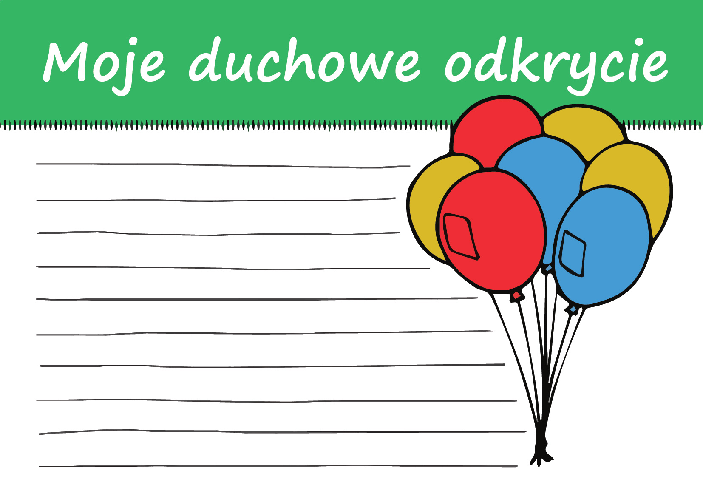
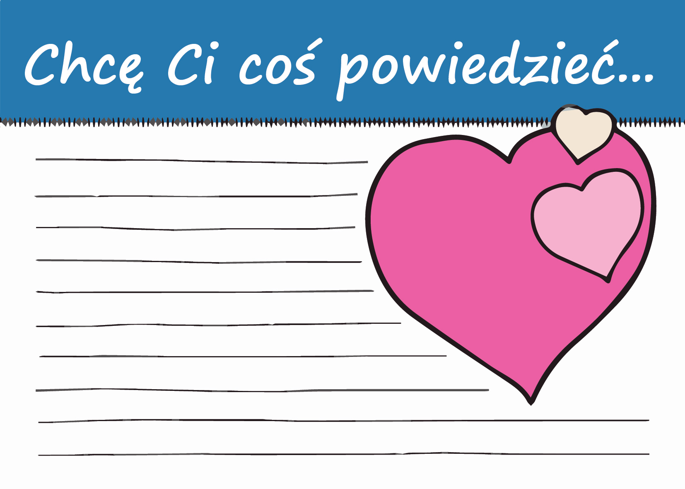

Meeting 4 - My Haggadah
***********************

.. tags:: content|resurrection|Resurrection, content|mission|Mission, content|word-of-god|Word of God, content|jewish-traditions|Jewish traditions, method|text-work|Text work, method|sharing-questions|Sharing questions, method|art-activity|Art activity, type|mystagogical|Mystagogical

Introduction for the Animator
=============================

This is the last meeting in groups. It will be a time of a kind of summary of the small group's path. The goal of this meeting is firstly reflection on "my haggadah" - what is unique in my experience of God. Key questions of the meeting: **"What would I like to tell with my life? What would I like others to read in me?"** Secondly, we want to inspire participants to consciously pass the story on.

Introduction
============

Yesterday during the Dayenu song we said many times that "it would have been enough". This attitude of gratitude and sensitivity to good captivates in Jews. Our retreat has not ended yet, but maybe it does not prevent us from noticing some element about which we could say similarly?

- What did we discover during the Tent of Meeting?
- What moment of our meetings or retreat so far would I like to distinguish? Why?

The Mystery of The Same Night
=============================

During yesterday's Seder evening in the introduction we heard:

   In a sense, tonight we will travel back in time. Jewish tradition teaches that **everyone must look at themselves as if they were a participant in the exodus from Egyptian slavery**.

This is not simple! Certain things in faith are easy to accept as if through a glass pane - intellectually understand concepts, but watch as an observer from the outside - without own participation.

- Which elements of faith come easiest to me to relate to my experience?
- Which moment of the Paschal Triduum, at the moment, seems closest to my spirituality?

The author of the letter to the Hebrews will say: "For the word of God is living and active, sharper than any two-edged sword, piercing to the division of soul and of spirit, of joints and of marrow, and discerning the thoughts and intentions of the heart." The Word of God is certainly like that, but we are not always so tuned to it. In faith, it is normal for us to function without such full awareness - rather we aspire to it, we try for it.

   What then is time? If no one asks me, I know. If I wish to explain it to one that asketh, I know not.

   -- St. Augustine

- Do I have the experience of "fleeing answers" when I try to explain? What role does intuition play in my spirituality?
- What does my consent to the existence of important things that "I know, but when they ask I don't know" look like?

So on the one hand it is about "time travel" and we experienced it yesterday during the Seder evening, but at the same time even St. Augustine himself notices a problem in understanding the concept of time as a believer. Opening up to these mysteries seems to require us to enter the space of intuition, heart, depth.

On Holy Thursday, an Anaphora is added to the Eucharistic Prayer:

   For on the day before he was to suffer * for our salvation and the salvation of the whole world, **that is today**, he took bread in his holy and venerable hands, and with eyes raised to heaven to you, O God, his almighty Father, giving you thanks, he said the blessing, broke the bread and gave it to his disciples, saying...

It is easy to miss these three short words, and what an important thing they remind us of.

- Have we ever paid attention to this anaphora?
- What can such a "literal" interpretation of the words "This is The Same Night" from the Exsultet change in experiencing our faith?

"Now"
=====

.. note:: Apophthegm (Gr. apóphthegma, ~matos – sentence, statement) – a short literary work, in verse or prose, presenting a witty, brilliant, apt statement of a prominent figure (e.g. a ruler).

There is such an instructive story coming from the apophthegms of the Desert Fathers:

   | One of the desert fathers was asked by his disciples: – Abba, why are you always so cheerful, joyful and free?
   | To which they heard the following answer: – Because I live in the present moment. And this allows me to draw from life in handfuls, not worrying about the past and future.
   | Then the disciples asked him: – Abba, and how do you do it?
   | He answered: – When I eat, I eat, when I pray, I pray, when I work, I work, and when I rest, I rest – answered the monk.
   | – That's the same as us – replied the disciples.
   | – No! – answered the hermit – You, when you pray, think about food, when you eat, think about work, when you work, think about rest, when you rest, think about work. Not living in the present moment, but constantly reminiscing about the past or thinking about the future is the best recipe for life slipping through our fingers.

- What does my ability to live in "now" look like?
- How can we help ourselves in three weeks (or maybe better today?) be able to be present participants in the mysteries of faith?

This sensitivity to "now" is one of the most important lessons with which the Savior comes to us. The Savior named Yehoshua (Jesus), which in itself means "Yahweh is salvation" - neither "was salvation", nor "will be salvation".

Let's read

   For he is our God, and we are the people of his pasture, and the sheep of his hand. Today, if you hear his voice, do not harden your hearts, as at Meribah, as on the day at Massah in the wilderness

   -- Ps 95:7-8

Let's see what commentary the Catechism of the Catholic Church writes on this:

   We learn to pray at certain moments by hearing the Word of the Lord and sharing in his Paschal mystery, but his Spirit is offered us at all times, in the events of each day, to make prayer spring up from us. Jesus' teaching about praying to our Father is in the same key as his teaching about providence: time is in the Father's hands; it is in the present that we encounter him, not yesterday or tomorrow, but today: "O that today you would hearken to his voice! Harden not your hearts."

   -- CCC 2659

- What is God saying now to our Church? What voice do we hear?
- What is God saying now to me?
- With what 5 words would I define my "today"?

.. note:: The animator takes out the temple scheme and the house plan from yesterday. Individual "zones" marked with a single color are "intertwined" on it using strings (preferably the same colors as each of the zones) - pierced through the paper and literally stitching two sheets together. They put them on the table. This is the end of a certain leitmotif - We have a house (profanum) and we have sacrum (temple). In one and the other we have different "zones" corresponding to our needs. These are only seemingly different spaces - they are intertwined with each other and do not function without each other. (I ask animators for sensitivity - atheists' homes can of course function very well. We are talking about the homes of believers.)

Let's refer once again to the words of St. Augustine and give him a comment on what we see:

   Remember that your free and unoccupied moments are burdened with the greatest tasks and responsibility.

   -– St. Augustine

- How do you relate this sentence and this image (stitched sheets) to your life? How do you feel about it?
- What do we lose by dividing the world into sacrum and profanum?
- What can I do to reduce this division in my life?

My Haggadah
===========

Let's read:

   **You shall tell your son on that day**, 'It is because of **what the Lord did for me when I came out of Egypt**.' And it shall be to you as a sign on your hand and as a memorial between your eyes, that the law of the Lord may be in your mouth. For with a strong hand the Lord has brought you out of Egypt. You shall therefore keep this statute at its appointed time from year to year.

   -- Ex 13:8-10

God commanded to pass on what He did for us. This is a reference to this mystical "now".

- "What did God do for You during Your exodus from Egypt?" - how do you feel about such a question? How will you answer it?
- In what way do we fit all the events of the history of salvation in our spiritual experience?
- What does such a perspective change?

The events of yesterday's haggadah were not in the past - we are their "eyewitnesses", so we can tell them. This takes place in the power of the Holy Spirit, but also in such a very practical dimension - have we never had a sense of enslavement from which we must escape? Have we never forgotten God so that when the longing for Him spoke in us, our prayer was like lamentation Psalms?

Let's read:

   Praise the Lord! O give thanks to the Lord, for he is good, for his steadfast love endures forever! **Who can utter the mighty deeds of the Lord, or declare all his praise?**

   -- Ps 106:1-2

Finding fragments that are close to us in the Bible is only the first stage. God in the Book of Exodus explicitly said "you shall tell". The Psalmist asks this question, which sounds in the air like a reproach - Who will answer the Lord's call?

- **What would I like to tell with my life? What would I like others to "read" in me?**

This is not just a matter of our decision. In fact, "whether I want to or not, I tell". Even when we remain silent in some situation, it is "significant silence". Also in our small group we have been functioning together for 48h - this is long enough for each of us to be a story that other members of the group can read and relate to themselves.

- What have we told each other since Friday? What thought of someone from the group, or someone from the diaconia was for me a refreshing story about "the power of the Lord, his praise"?

Source Which Is Rescue
======================

To know the value of the story. To be able to build intimate relationships in which we listen to each other. Constantly interpret, but never want to fully interpret. Not to divide the world into sacrum and profanum. Not to succumb to the "temptation of professionalization". Tell someone the Gospel as an eyewitness of Christ's action - this is a collection of thoughts from our last group meetings. A lot of it, right? One can grab one's head and bend under the weight of what Jesus invites us to.

- What in these topics that we raised together seems to me personally the biggest challenge?

Let's read:

   And the gospel must first be proclaimed to all nations. And when they bring you to trial and deliver you over, do not be anxious beforehand what you are to say, but say whatever is given you in that hour, for it is not you who speak, but the Holy Spirit.

   -- Mk 13:10-11

And right after:

   Each lay person must be a witness before the world to the resurrection and life of the Lord Jesus and a sign of the living God. All together and each one individually must nourish the world with spiritual fruits and fill it with such a spirit as are animated by those poor, meek and peacemakers whom the Lord called blessed in the Gospel. In a word, "what the soul is in the body, let Christians be in the world"

   -- Dogmatic Constitution on the Church "Lumen Gentium", LG 38

- What is the source enabling us to lead a story that outgrows us?
- "say whatever is given you in that hour" - what does it mean for us?
- How to rely on Grace in the story?

Let's not try to be Christians who undertake to grow up to the requirements of the Gospel without relying on God's blessing. The task before us is great, but let's remember that if it is Jesus' will, He himself will take care of effectiveness.

Let's read:

   In the beginning was the Word, and the Word was with God, and the Word was God. He was in the beginning with God. All things were made through him, and without him was not any thing made that was made. In him was life, and the life was the light of men. The light shines in the darkness, and the darkness has not overcome it.

   -- Jn 1:1-5

There is no better narrator on earth than Him, the Word! Jesus wants to be our narrator.

Exit
====

Let's return to the parish and tell there what we experienced here. Before us is the Paschal Triduum. Our experience of the retreat with the Jewish context puts some value in our hearts that we can pass on.

.. note:: The animator hands out small cards to the participants

.. |kudo1| image:: kudo-01.jpg
   :scale: 50%

+---------+---------+
| |kudo1| | |kudo2| |
+---------+---------+
| |kudo3| | |kudo4| |
+---------+---------+

It's a simple form. Maybe even frivolous in some way. But since we can keep e.g. pictures with composed prayers in the Holy Scripture without resistance, why not write one such picture ourselves? Tell a short story yourself - put yourself on the side of the creator, not the recipient?

- Which card would be easiest for you to fill in and put in your Holy Scripture? Why do you think so?
- Which card would be easiest for you to fill in and give to someone? Why? To whom would you give it?

Let's take one card and try to fill it in during this meeting

.. note:: The animator gives time for everyone to choose a card and fill it in (about 5 minutes)

- What did this experience give you? What did it tell you about yourself?

Let the application from this meeting be filling in all cards for the Paschal Triduum and deciding which ones we will pass/show to others, and which ones we will keep only for ourselves.

.. centered:: **Let the story continue!**
