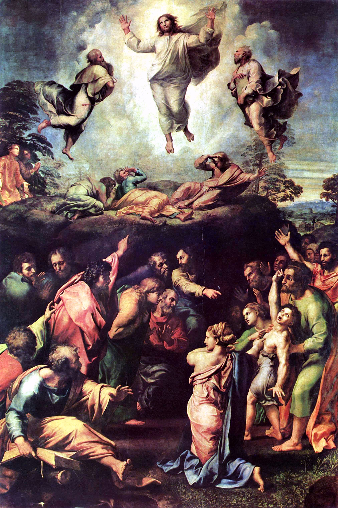

Meeting 2. - Waiting Which Is Courage
******************************************

.. tags:: content|time|Time, content|decisions|Decisions, content|discernment|Discernment, content|hope|Hope, content|seeking|Seeking, method|text-work|Text work, method|sharing-questions|Sharing questions, type|formative|Formative

Goal of the Meeting
===================

Revision of our doubts - analysis of their structure. Showing that courageous (not thought through from every angle) decisions are a better way than paralysis related to lack of decision-making. Introduction to the topic of the ability to wait for fruits.

Introduction for the animator
=============================

The meeting has a strongly sharing character. One should very consciously control the time of the meeting - **it is more important that people really share their lives than realizing even ½ of this outline**. The outline is extensive - it has 39 sharing questions (!), choose from them what will be the greatest value for Your group - do not try to ask them all. It may turn out that part of this content will be touched upon at conferences/testimonies earlier - we cannot predict how the Holy Spirit will blow - this outline is a buffer that allows adjusting the program line.

Opening prayer
===================

.. note:: ~5 minutes

Let the prayer head in the climate of openness to the Holy Spirit, but also openness to sharing. The meeting definitely has a sharing character - without creating an atmosphere of openness, trust, touching important things from the very beginning, it will not succeed. Prayer can perfectly fulfill such a "function".

Sharing the Tent of Meeting
================================

.. note:: ~10 minutes

* What was particularly important for You in this text?

* What questions did this text give birth to in You?

* How do you read it in your current place in life?

* What does this text have in common with doubts?

Introduction to the meeting
===========================

.. note:: ~10 minutes

Let's conduct a small experiment: let everyone write on three pieces of paper some spaces of life in which in Your opinion people often have doubts and put them in the middle of the table. E.g.:

#. The course of the Poland-Germany match

#. Basia's fidelity to Karol

#. Number of animals on Noah's Ark

#. Comparison of Nokia phone with Samsung

Then let everyone choose three pieces of paper (not their own) and answer the following questions for each:

* What can doubt consist of in this space?

* Is it a doubt of the type:

    * Uncertainty of historical premises?

    * Uncertainty of discerning the present?

    * Uncertainty of the future?

* (optional) Is this doubt close to You?

Let's summarize:

* Which type of doubt was the most common?

* Is it the same in Your life? How is it?

* Was anyone surprised by the “given example of doubt” for a given space? What does this testify to?

My doubts, or maybe simply lack of decision?
================================================

.. note:: ~25 minutes

Let's read the statement:

    Paul Tilisch believed that the most important border does not run between those who consider themselves believers and those who consider themselves atheists, but between the group of those who relate indifferently to the questions raised by faith – whether it concerns conventional atheists or conventional believers – and those who raise these questions – whether they are believers, for whom faith does not cease to be an "extraordinary adventure of searching", or atheists who in one way or another "wrestle with God".

    -- Fr. Tomasz Halik

* In what spheres of your life do you currently experience some doubts?

* What do you do with them?

* Do you want to get rid of them?

Doubts are certainly nothing comfortable. However, they show us that a given thing is valuable to us. If I don't care about something, I don't worry about it.

However, we have such a nature that sometimes we say/think that we are waiting for something, but really with very faint faith that we will finally live to see it ;). Let's check how it is with us - using a thought experiment:

.. note::
    A fragment of Jacek Kaczmarski's poetry reflects this well - you can quote:

    | In captivity - he cries for freedom
    | Not believing he would ever gain it,
    | So when he sees himself free
    | He splashes holy water on it.
    | He only wanted to shout safely
    | And dream about it romantically,
    | And here words became flesh
    | And God knows what may happen!

    “Według Gombrowicza narodu obrażanie” (Insulting the nation according to Gombrowicz), 1993.

* Let's assume you can ask two questions to which you receive a full and exhaustive answer on any topic - what questions do you ask? Why?

.. note:: The question is not trivial. My first thought was the question: “how to love truly?” - a moment later I felt very stupid, because I looked at the over 1000-page answer that is now lying on my desk at the time of writing this outline and which I often peek at.

Be careful that this fragment of the meeting does not become a game of “cops and robbers” - we don't want to “catch” participants on anything. For this reason, I propose that the animator exceptionally starts sharing his answer first. Additional assumption for the inquisitive: assuming that the answer will be so adapted and transmitted that you will understand it in 100%.

Choices in our life are something very important, but don't they paralyze us? Don't we have it so that we are afraid to decide due to the fact that we search for so many questions that doubts take over everything?

* What does it mean to you to be sure of your choice?

* Do you always make a decision only when you have no doubts?

Let's go down to earth strongly for a moment and look at something very “ordinary”:
One of the (important) decisions to be made related to our stay here is the choice of tomorrow's menu for Sunday breakfast! The list of possible choices seems huge (although significantly limited by the budget ;)). This causes that we may have doubts: is our choice definitely good? Someone could get so fixated on this that they would spend 2 days on the question: “scrambled eggs or boiled sausage better?”.

* Do you think such a person behaves responsibly?

* Can you point out any example of such behavior in yourself?

* What should be done?

We write down somewhere on a piece of paper:

.. centered:: Chosen = valuable

* Do you agree with this equation?

Effort related to making a decision gives value to the chosen path. It is man who gives value to his choices and spaces he comes into contact with - **every matter/thing that is chosen is a testimony of a won fight with doubts, i.e. with oneself**. Even this alone is a value!

* What things in my life, normally "ordinary", became very valuable to me thanks to my choice?

Waiting which is courage
===========================

.. note:: ~20 minutes

Let's read:

    ‘Then the kingdom of heaven will be like this. Ten bridesmaids took their lamps and went to meet the bridegroom. Five of them were foolish, and five were wise. When the foolish took their lamps, they took no oil with them; but the wise took flasks of oil with their lamps. As the bridegroom was delayed, all of them became drowsy and slept. But at midnight there was a shout, “Look! Here is the bridegroom! Come out to meet him.” Then all those bridesmaids got up and trimmed their lamps. The foolish said to the wise, “Give us some of your oil, for our lamps are going out.” But the wise replied, “No! there will not be enough for you and for us; you had better go to the dealers and buy some for yourselves.” And while they went to buy it, the bridegroom came, and those who were ready went with him into the wedding banquet; and the door was shut. Later the other bridesmaids came also, saying, “Lord, lord, open to us.” But he replied, “Truly I tell you, I do not know you.” Keep awake therefore, for you know neither the day nor the hour.

    -- Matt 25:1-13

* What decision do the women make here? (to go out to meet the bridegroom)

* What follows the decision? (waiting)

* How do you feel when you have to wait for something?

Let's try to create a list of things we are waiting for - all of them - secular, spiritual, personal, matters of the heart, etc. We write each thing on a piece of paper and put/pin it in a place visible to everyone.

* Which “waiting” do you like the least?

* Which “waiting” do you consider valuable, and which not? Why?

* What do you think about the statement: “a man who has to wait is a weak man”? (Those poor wait in line to the doctor - the rich go privately. Little ones wait at the airport for check-in - others have priority check-in. Those who don't have their Lamborghini in the garage wait for the train arrival etc.)

There is a tendency present in the world to eliminate waiting - so that everything is “instant”. We know this well: Books - only by speed reading method. Soup - powder + boiling water. One can study for 4h, but one can also have a cheat sheet. And so on.

Look at what the Church does (the animator takes out prepared cards):

#. Lent is **waiting** for the Triduum

#. Easter season is **waiting** for Pentecost

#. Advent is **waiting** for Christmas

#. With intercourse we are to **wait** until marriage

#. Living here on Earth we **wait** for the second coming of Jesus

* Why do you think **waiting** is so important?

A holiday trip to the mountains with friends, which we have been waiting for since January, is very often the adventure of a lifetime even if it rained for 90% of that time.

We add a new element on the card with the inscription “chosen = valuable”:

.. centered:: waited for = valuable

* Do you agree with this equation?

* do you have your own experience that something that was waited for tasted better?

This all sounds quite nice as a theory, but let's not be afraid to confront it with our life:

* What things are you currently waiting for out of your own choice, and not out of compulsion?

Skipping stages in one's life that one has not experienced oneself is a deception. Let's not be afraid to say it. You can't learn to play the guitar in two weeks. It is similar with spiritual life - there is a great temptation in us to “skip” the road and watch the world immediately from the summit. We want to touch the depth, simultaneously not practicing sensitivity to the breath of wind, beauty, or word. This is impossible.

.. warning:: Animator - this place of the meeting waits for Your testimony. Courageous, open, sincere testimony of Your path. I won't tell You what to talk about - I can say what I will try to talk about: that I wanted to start reading the Holy Scripture from the Apocalypse, because it seemed the most “pro” to me. I will talk about how I tried to love others bypassing the uncomfortable topic of loving myself. I will tell that I asked for epiphany gifts simultaneously never having prayed regularly every evening for three weeks before. I am convinced that for each of us Advent is some challenge.

Waiting that changes and allows us to change
==============================================

.. note:: ~15 minutes

The animator shows Raphael's painting “Transfiguration”

* Do you guess what scene this is?

* What is happening in the upper part of the painting?

* What is taking place in the lower part?

Let's read the fragment:

    Six days later, Jesus took with him Peter and James and his brother John and led them up a high mountain, by themselves. And he was transfigured before them, and his face shone like the sun, and his clothes became dazzling white. Suddenly there appeared to them Moses and Elijah, talking with him. Then Peter said to Jesus, ‘Lord, it is good for us to be here; if you wish, I will make three dwellings here, one for you, one for Moses, and one for Elijah.’ While he was still speaking, suddenly a bright cloud overshadowed them, and from the cloud a voice said, ‘This is my Son, the Beloved; with him I am well pleased; listen to him!’ When the disciples heard this, they fell to the ground and were overcome by fear. But Jesus came and touched them, saying, ‘Get up and do not be afraid.’ And when they looked up, they saw no one except Jesus himself alone.

    -- Matt 17:1-8

This is the description of the upper part of the painting - the description of the Transfiguration of the Lord. Usually reading it we focus on the extraordinary events that took place there - however, let's look a bit differently today.

* How do you think - how did the remaining 9 apostles feel, who did not go with Jesus?

* How long do you think the whole event lasted? (we know that the mountain was high ;))

* What was left for the 9 apostles to do during this time? (Wait!)

Jesus “does not worry” that the disciples will be waiting. However, what was happening during this time? We can deduce this by reading the fragment:

    When they came to the crowd, a man came to him, knelt before him, and said, ‘Lord, have mercy on my son, for he is an epileptic and he suffers terribly; he often falls into the fire and often into the water. And I brought him to your disciples, but they could not cure him.’ Jesus answered, ‘You faithless and perverse generation, how much longer must I be with you? How much longer must I put up with you? Bring him here to me.’ And Jesus rebuked the demon, and it came out of him, and the boy was cured instantly. Then the disciples came to Jesus privately and said, ‘Why could we not cast it out?’ He said to them, ‘Because of your little faith. For truly I tell you, if you have faith the size of a mustard seed, you will say to this mountain, “Move from here to there”, and it will move; and nothing will be impossible for you.’

    --  Matt 17:14-21

* Based on the description and the painting, say whether the apostles hesitated to act, or decided courageously?

* Did they make a mistake? Does Jesus criticize them for the decision?

* How do You react when after making a decision things do not go according to Your assumptions?

The apostles decided courageously (chosen = valuable) and additionally despite the difficulty, and unexpected course of the situation (they had cast out evil Spirits before!) they knew how to wait! They did not run away, did not try to hide the “failure”, did not try to scheme with words like: “actually it worked, but it will work only when Jesus comes”. Although perhaps they were touched by the fact that they were not chosen to go with Jesus to the mountain, it did not block them from acting. They waited with faith and lived to see a good ending (waited for = valuable). They accepted that it was not their time yet, that they still didn't know something - Jesus gives them very precise instructions for the future: “But this kind does not come out except by prayer and fasting”. He therefore changes their state of knowledge, the spiritual stage they are at.

.. centered:: Both they and the situation they were in changed

* Do you see any situation from your life in this image?

Application + prayer
=======================

.. note:: ~5 minutes

Let's try to name by name three matters in our life in which we try to take shortcuts, in which we are impatient in a bad way.

If the group is mature enough, let everyone give an intention related to “waiting”, and then let's all say e.g. Our Father for this intention.
