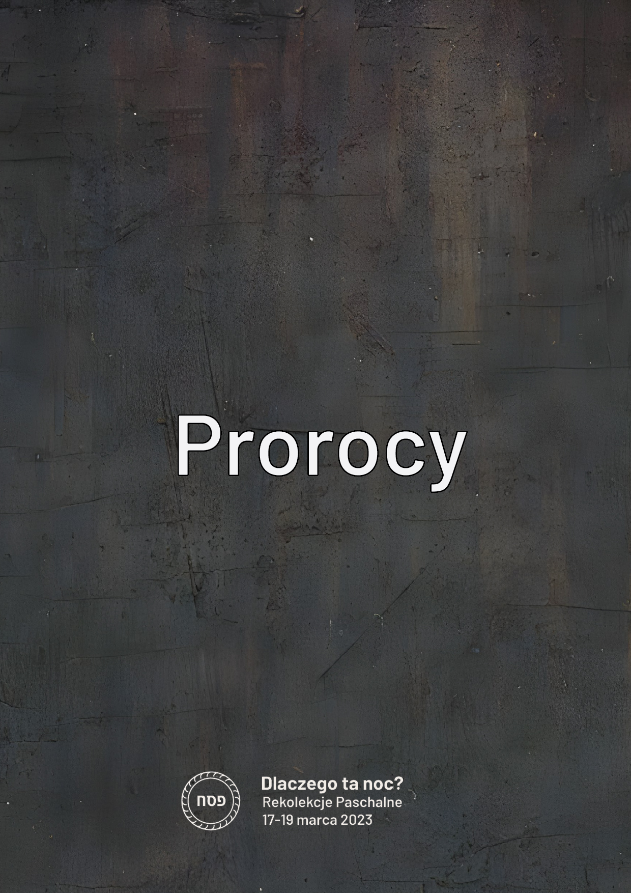

Meeting 4 — Old-New
*******************

.. tags:: content|eucharist|Eucharist, content|word-of-god|Word of God, content|church|Church, content|resurrection|Resurrection, content|mission|Mission, content|jewish-traditions|Jewish traditions, method|image-work|Image work, method|group-work|Group work, type|mystagogical|Mystagogical

Introduction for the facilitator
================================

Meeting four is one of the last points of the retreat - it therefore constitutes a place of summary. The image that we want participants to take with them from the meeting is the combination of Old and New, which is made by conscious believers. A simple dynamic serves this purpose [printing materials and "clips" will be provided for animators - at the end of the outline there are images for establishing context].

Introduction
============

Behind us is the seder evening - the peak point of the retreat. We wanted through the seder supper to experience deep connection of Eucharist and Seder. However, this was not the only "connection" that we wanted to experience! Our entire retreat orbits around three spaces.

.. note:: The animator pulls out cards with written passwords on the table: Old Testament, New Testament, Seder, Eucharist, Prophets and Apostles.

.. |d1| image:: seder.jpg
   :scale: 33%
.. |d2| image:: eucharystia.jpg
   :scale: 33%

.. |d4| image:: apostolowie.jpg
   :scale: 33%
.. |d5| image:: stary_testament.jpg
   :scale: 33%
.. |d6| image:: nowy_testament.jpg
   :scale: 33%

+------+------+------+
| |d1| | |d3| | |d5| |
+------+------+------+
| |d2| | |d4| | |d6| |
+------+------+------+

We entered this retreat awakening mindfulness and curiosity in ourselves. Let's try therefore at this meeting to "gather" what lies before us. The first space we want to consider is Seder-Eucharist.

- What in the Seder itself was alive for me?
- What value flows for me from the combination Seder-Eucharist?

Not worse than…
===============

The second space we want to consider are Prophets-Apostles.

- [Question to everyone] Where was this space noticeable at the retreat?

It's Haggadah - we told each other about the great works of our God! This is exactly what being an Apostle is. We stood all together next to Isaiah, Jeremiah, Ezekiel, Daniel, Hosea, Joel, Amos, Obadiah, Jonah, Micah, Nahum, Habakkuk, Zephaniah, Haggai, Zechariah and Malachi... next to Simon Peter, Andrew, James, John, Philip, Bartholomew, Thomas, Matthew, Simon the Zealot, James son of Alphaeus and Judas... to say that God is good!

- How did I feel in the role of telling the History of Salvation?
- How is the situation that we told in our own words different for me from reading from the Holy Scripture?

Open your notebook at the introduction. There is a declaration of the Ponad Murami diaconia there that we create this retreat with deep hope that the Good God will allow us here to connect listening to prophets and apostles, and that only through the act of connecting can we get closer to God-Community.

In the last line of the first paragraph a dot is missing, right? This is our intentional procedure. If you want, add your name there after the comma now and/or end with a dot.

.. note:: One can refer to invitations to the retreat. We placed quotes, asking if someone from the diaconia said it or someone "wise and famous" (like Benedict XVI or St. Teresa Benedicta of the Cross). It was a difficult experience for many of us to "allow ourselves" even for the possibility of thinking that someone might confuse our words with "someone so great".

- [for those who wrote in] How do you feel inscribing yourself in such a group?
- [for those who did not write in] What would have to happen for you to be able to inscribe yourself there?

Glue
====

The third space is the Old Testament and New Testament. We meditated today on the image of an old man and a young man. The Old-New relationship is very important for us. There is a temptation in it to reflexively recognize that "new is better! Why deal with what is old?"

Let us read:

    For our knowledge is imperfect and our prophecy is imperfect; but when the perfect comes, the imperfect will pass away. When I was a child, I spoke like a child, I thought like a child, I reasoned like a child; when I became a man, I gave up childish ways. For now we see in a mirror dimly, but then face to face. Now I know in part; then I shall understand fully, even as I have been fully understood. So faith, hope, love abide, these three; but the greatest of these is love.

    -- 1 Cor 13:9-13

- [To everyone] Does St. Paul suggest that being in NT everything is already discovered?
- What does this tell me?

The Old Testament is not about something completely different than the New Testament. Similarly life on earth as a pilgrim people does not consist in something drastically different than being in heaven! There are important differences that are worth being aware of - however isn't it so that there are much more similarities that "escape" us? We see and watch the same thing - only the degree to which we can do it is different (we see dimly).

- What significance does continuity in faith have for me?

Let us read:

    And he came to Nazareth, where he had been brought up; and he went to the synagogue, as his custom was, on the sabbath day. And he stood up to read; and there was given to him the book of the prophet Isaiah. He opened the book and found the place where it was written, “The Spirit of the Lord is upon me, because he has anointed me to preach good news to the poor. He has sent me to proclaim release to the captives and recovering of sight to the blind, to set at liberty those who are oppressed, to proclaim the acceptable year of the Lord.” And he closed the book, and gave it back to the attendant, and sat down; and the eyes of all in the synagogue were fixed on him. And he began to say to them, “Today this scripture has been fulfilled in your hearing.”

    -- Lk 4:16-21

- How does Jesus connect and ensure continuity?

.. note:: The animator pulls out a large clip and takes 6 cards from the table putting them in pairs together so that a "brochure" consisting of 6 cards is created. We put together two cards "inscriptions to each other" - "Old Testament" and "New Testament", then "Seder" and "Eucharist" and finally "Prophets" "Apostles". We arrange such three pairs one after another and with a large clip ["Jesus"] connect them together along the longer edge.

- What in my faith "separates" and I would like it to be connected by Jesus?

Let us read:

    Christ is the Light of nations. Because this is so, this Sacred Synod gathered together in the Holy Spirit eagerly desires, by proclaiming the Gospel to every creature, to bring the light of Christ to all men, a light brightly visible on the countenance of the Church. Since the Church is in Christ like a sacrament or as a sign and instrument both of a very closely knit union with God and of the unity of the whole human race, it desires now to unfold more fully to the faithful of the Church and to the whole world its own inner nature and universal mission. This it intends to do following faithfully the teaching of previous Councils. The present-day conditions of the world add greater urgency to this work of the Church so that all men, joined more closely today by various social, technical and cultural ties, may also attain fuller unity in Christ.

    -- Lumen Gentium 1

.. note:: The animator pulls out a second large clip ["Church"] and additionally strengthens the connection.

- Where do I see that the Church connects these spaces?

The Church is "all woven" from connection! At Mass we read Old and New Testament. The system of the Church is simultaneously hierarchical and synodal. The Church strengthens the individual and speaks of the need for a personal relationship with God, but within a broad community etc.

.. note:: The animator pulls out several small clips and distributes to each of the participants. We add them to the two existing ones.

- How do I connect things in spirituality?
- What things would I like to connect?

Immerse in death
================

Connecting is difficult! It is difficult to get rid of judging, temptation of choosing and promoting. It is hard for me to see myself both in a young man and a wise man **at once**. Perhaps all the time somewhere we feel an imperative to "take a side". What does Jesus say to this?

Let's look at the icon:

.. image:: ikona.jpg

- What does this icon present?
- Who are the people in the water of Jordan?
- What does the shape of water refer to?

Christ during baptism in Jordan connects the history of the flood [water washes away sin] with "source of living water". Jordan is both a grave and a womb. Connects the world of angels with the world of people. Connects the beginning of his mission, with death and resurrection that will come. Jesus connects life and death.

- What does it mean for me to immerse in Jesus' death?

We need this immersion. Only it can give us a chance to "see the world differently". It will push away the temptation of "arranging the world from the beginning" and can awaken the desire to understand why it is such, and not different. We must die and rise to life with Christ! "Awake, O sleeper, and arise from the dead, and Christ shall give you light" (Eph 5:14). In this spiritual poverty it seems that there is an ability to connect.

Triduum
=======

Recently a man died who wrote over 60 books, 3 encyclicals and 4 exhortations. There was a time when he probably had the greatest theological knowledge among those living on earth. His last words were:

    Jesus, I love you!

    -- Benedict XVI

This ability to simplify, to extract the essence is indispensable for us. We do not care for you to leave this retreat with 20 pages of notes. We care for you to take one sentence, but one that you heard from God.

Before us Paschal Triduum. A time where there will be unimaginably more content than during our meeting.

- Is Triduum still a source of questions for us?
- To what question of mine is Triduum the answer?
- How through my experiencing of Triduum can I love the person next to me more strongly?

Let the application from this meeting be one sentence noted today in the notebook. The author can be Isaiah, Jeremiah, Jesus - by all means.... it can also be You. Do not sign whose sentence it is. It doesn't matter that much!
