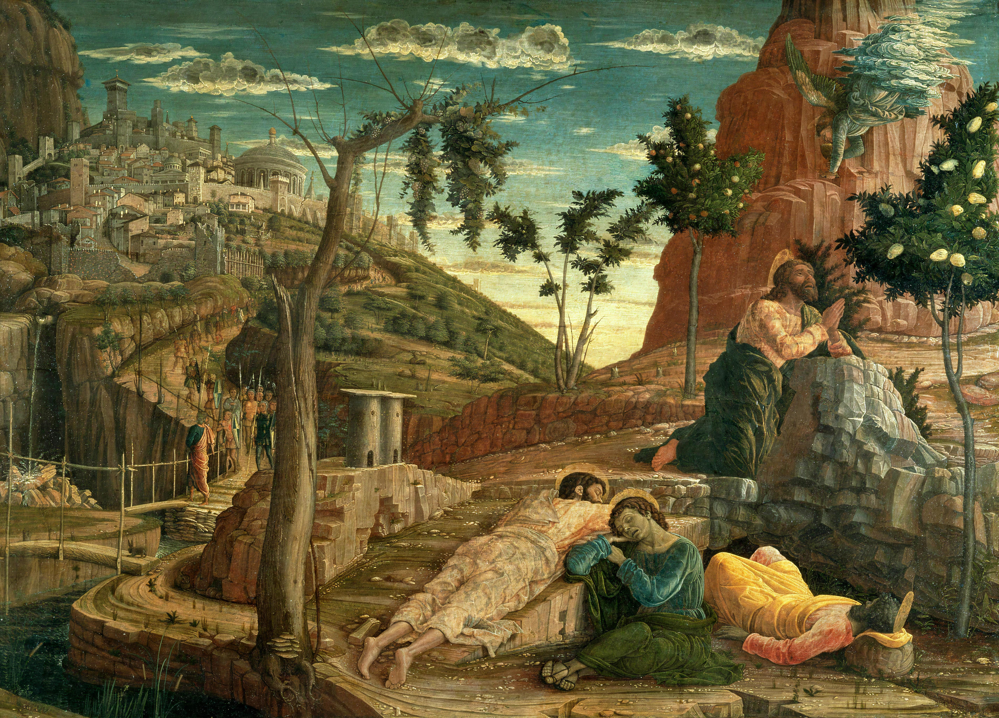

Encuentro 3. - "Quiero, pero no puedo"
**************************************

.. tags:: contenido|oracion|Oración, contenido|verdad|Verdad, contenido|madurez|Madurez, contenido|cruz|Cruz, metodo|trabajo-con-texto|Trabajo con texto, metodo|trabajo-con-imagen|Trabajo con imagen, tipo|biblico|Bíblico

Credo
=====

Hoy hemos meditado el Credo. Un texto fundamental para nuestra fe, pero al mismo tiempo quizás tratado por nosotros como "obvio", porque ¿de qué otra manera justificar que no nos encontramos comúnmente con la explicación de su significado durante la formación?

- ¿Qué preguntas me plantea el Credo?
- ¿Qué he descubierto hoy durante la meditación?

Después de la experiencia de la Última Cena, que se podría decir que fue un lugar de "aprendizaje", pasamos con San Pedro al Huerto de los Olivos y a la casa del sumo sacerdote. Es un lugar de "práctica" donde San Pedro se enfrenta a la aplicación de la Palabra escuchada en la vida.

Anuncio - Él sabe
=================

Leamos:

    Simón, Simón, mira que Satanás os ha reclamado para cribaros como trigo. Pero yo he pedido por ti, para que tu fe no se apague. Y tú, cuando te hayas convertido, confirma a tus hermanos». Él le dijo: «Señor, contigo estoy dispuesto a ir incluso a la cárcel y a la muerte». Pero él le dijo: «Te digo, Pedro, que no cantará hoy el gallo antes que tres veces hayas negado conocerme».

    -- Lc 22, 31-34

El tiempo de encarnar la luz en la vida por parte de San Pedro comienza con la experiencia de la sinceridad desarmante de Jesús hacia nosotros. Jesús sabe que el amor nos supera y que nos superará. Dios sabe que lo negaremos, y al mismo tiempo nos da la tarea de fortalecer la fe de los hermanos.

- ¿Qué elementos de la vida espiritual puede purificar este fragmento de una comprensión errónea?
- ¿En qué medida en cuestiones de fe tengo en mí el consentimiento para "no estar a la altura" del amor?

Jardín
======

.. note:: Durante este punto del encuentro, tengamos ante los ojos la imagen de la conferencia.

.. image:: Andrea_Mantegna1.jpg
   :align: center

Leamos:

    Llegaron a una propiedad llamada Getsemaní, y Jesús dijo a sus discípulos: «Sentaos aquí mientras yo hago oración». Se llevó consigo a Pedro, a Santiago y a Juan, y empezó a sentir espanto y angustia. Les dijo: «Mi alma está triste hasta la muerte. Quedaos aquí y velad». Y, adelantándose un poco, cayó en tierra y pedía que, si era posible, se alejase de él aquella hora. Decía: «¡Abba, Padre!, todo es posible para ti; aparta de mí este cáliz; pero no sea lo que yo quiero, sino lo que quieres tú». Volvió y los encontró dormidos. Dijo a Pedro: «Simón, ¿duermes?, ¿no has podido velar una hora? Velad y orad para no caer en la tentación; el espíritu está pronto, pero la carne es débil». De nuevo se apartó y oraba repitiendo las mismas palabras. Volvió y los encontró dormidos, pues tenían los ojos cargados; y no sabían qué contestarle. Volvió por tercera vez y les dijo: «Ya podéis dormir y descansar. ¡Basta! Ha llegado la hora; mirad que el Hijo del hombre va a ser entregado en manos de los pecadores. ¡Levantaos, vamos! Ya está cerca el que me entrega».

    -- Mc 14, 32-42

- ¿Qué en esta imagen resuena más actualmente con mi vida?

Muy a menudo, el fragmento anterior se interpreta en clave de perseverancia en la oración. Sin embargo, intentemos mirarlo a través del prisma de la relación con Jesús. Sabemos que Jesús sentía una enorme angustia en el Huerto. ¡Esto significa que los discípulos "no percibieron" en absoluto la tensión de Jesús, con quien después de todo compartieron la mayoría de los momentos de su vida y a quien amaban sinceramente!

- ¿Con qué frecuencia me siento "solo entre los cercanos"?

Espada
======

Leamos:

    Judas, pues, tomando la patrulla y guardias de los sumos sacerdotes y de los fariseos, entró allá con faroles, antorchas y armas. Jesús, sabiendo todo lo que le iba a suceder, se adelantó y les dijo: «¿A quién buscáis?». Le contestaron: «A Jesús, el Nazareno». Les dijo Jesús: «Yo soy». Estaba también con ellos Judas, el que lo iba a entregar. Al decirles: «Yo soy», retrocedieron y cayeron a tierra. Les preguntó de nuevo: «¿A quién buscáis?». Ellos dijeron: «A Jesús, el Nazareno». Jesús contestó: «Os he dicho que yo soy. Si me buscáis a mí, dejad marchar a estos». Y así se cumplió lo que había dicho: «No he perdido a ninguno de los que me diste». Entonces Simón Pedro, que llevaba una espada, la desenvainó e hirió al criado del sumo sacerdote, cortándole la oreja derecha. El criado se llamaba Malco. Jesús dijo a Pedro: «Mete la espada en la vaina. El cáliz que me ha dado mi Padre, ¿no lo voy a beber?».

    -- Jn 18, 3-11

Si hace un momento San Pedro cometió un "pecado de omisión" por falta de actividad, ahora cae en el otro extremo: actividad demasiado violenta y desordenada. San Pedro claramente quiere llenar el espacio que crean para él los eventos de la historia de la salvación, pero continuamente "aplica el cincel en el lugar equivocado".

- ¿Qué ideas para mi actividad en la vida he extinguido con razón, porque consideré que no era mi camino?
- ¿Qué me gustaría hacer ahora en la Iglesia para que esté en armonía conmigo?
- ¿Cómo podemos ayudarnos a evaluar si mi elección no es demasiado violenta (espada) ni demasiado pasiva ("permanecer junto a Jesús como dormir")?

Hoguera
=======

Leamos:

    Ellos lo prendieron, se lo llevaron y lo hicieron entrar en la casa del sumo sacerdote. Pedro lo seguía de lejos. Ellos encendieron fuego en medio del patio, se sentaron alrededor, y Pedro se sentó entre ellos. Una criada, al verlo sentado junto a la lumbre, se le quedó mirando y dijo: «Este también estaba con él». Pero él lo negó diciendo: «No lo conozco, mujer». Poco después lo vio otro y le dijo: «Tú también eres de ellos». Pedro dijo: «Hombre, no lo soy». Pasada como una hora, otro aseguraba: «Seguro que este también estaba con él, pues es galileo». Pedro dijo: «Hombre, no sé de qué hablas». Y enseguida, estando todavía él hablando, cantó un gallo. El Señor se volvió y miró a Pedro. Y Pedro se acordó de la palabra que el Señor le había dicho: «Antes que cante hoy el gallo, me negarás tres veces». Y, saliendo afuera, lloró amargamente.

    -- Lc 22, 54-62

- ¿De qué tengo miedo en la pertenencia a la comunidad de creyentes?

San Pedro una vez más "quiere amar, pero no puede". Esta vez no se equivoca "un poco" eligiendo el método equivocado, sino que niega directamente todo en lo que creía. Se ve toda la escena con pesar, porque casi se ve que San Pedro "no tiene oportunidad" y en un momento será hundido. Todo se desmorona.

San Pedro está solo. Separado del Maestro, separado de los discípulos. En la noche. ¿Tengo la expectativa a nivel emocional de que "mi primer papa" incluso en tales condiciones resulte ser un héroe? La tengo. Sin embargo, no sucede un "milagro de fe" sino que sucede la "consecuencia de la situación". Dios no da un Ángel de Fuego que disipe la oscuridad alrededor de San Pedro dándole una fe sobrehumana. Hay lógica, consecuencia, hay vida.

- ¿De qué manera concreta podemos ayudarnos a no encontrarnos a menudo en una situación tan difícil como San Pedro?
- ¿La fe, el amor y la luz de quién rodeo con mi cuidado en mi vida? (¡eso no significa que asuma la responsabilidad por ella!)

Notemos el extravío cada vez más profundo de San Pedro:

1. Se durmió en lugar de velar
2. Quiso luchar en lugar de perdonar
3. Quiso ser creyente, y al mismo tiempo mintió

Si como dijimos al principio, el cenáculo fue un lugar de "aprendizaje" y el Huerto de los Olivos y la casa del sumo sacerdote un lugar de "examen práctico", entonces San Pedro no aprobó este examen. Esta experiencia de no estar a la altura, de romper la imagen sobre uno mismo es una experiencia clave en la fe.

Tumba vacía
===========

Leamos:

    El primer día de la semana, María la Magdalena fue al sepulcro al amanecer, cuando aún estaba oscuro, y vio la losa quitada del sepulcro. Echó a correr y fue donde estaban Simón Pedro y el otro discípulo, a quien Jesús amaba, y les dijo: «Se han llevado del sepulcro al Señor y no sabemos dónde lo han puesto». Salieron Pedro y el otro discípulo camino del sepulcro. Los dos corrían juntos, pero el otro discípulo corría más que Pedro; se adelantó y llegó primero al sepulcro; e, inclinándose, vio los lienzos tendidos; pero no entró. Llegó también Simón Pedro detrás de él y entró en el sepulcro: vio los lienzos tendidos y el sudario con que le habían envuelto la cabeza, no con los lienzos, sino enrollado en un sitio aparte. Entonces entró también el otro discípulo, el que había llegado primero al sepulcro; vio y creyó. Pues hasta entonces no habían entendido la Escritura: que él tenía que resucitar de entre los muertos. Los discípulos entonces volvieron a casa.

    -- Jn 20, 1-10

No somos creyentes porque aprobamos el examen de Dios con honores. El cristianismo es un encuentro con el Resucitado.

- ¿Qué me sorprendió últimamente en la fe, superó el horizonte de mis imaginaciones?

La tumba vacía es confrontativa, pero de tal manera que obliga a San Pedro a unir todo lo que escuchó de Jesús en un todo. Es una apertura a la fe, que pone patas arriba la forma de pensar actual, y por lo tanto cambia el corazón.

- ¿Qué experiencia en mi espiritualidad podría ser el equivalente de la "tumba vacía"?

Esta noche compartiremos la experiencia del encuentro con el Resucitado. Por definición, trataremos de contar algo que es difícil de captar y que supera nuestras imaginaciones.

- ¿Por qué compartimos mutuamente la fe en Jesucristo? ¿Qué aporta eso?

Aplicación
==========

No queremos imponer a los participantes una aplicación de este encuentro. **Sin embargo, tenemos esta vez una petición: que durante el relato de hoy sobre el encuentro con Jesucristo por parte de cada uno de nosotros, tratemos este tiempo como un tiempo de Anuncio, y por lo tanto un tiempo espiritual/de oración. Esto significa, por ejemplo, que mientras escuchamos a alguien que cuenta, al mismo tiempo somos benévolos con él y lo encomendamos al Altísimo**.

El autor del esquema nota al mismo tiempo beneficios significativos de buscar una aplicación posible de realizar en las próximas 48 horas.
