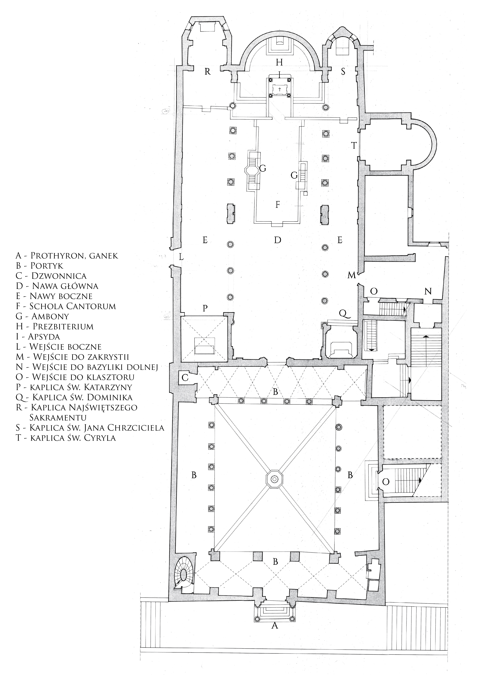

Encuentro 3 - La fe en el hogar
*******************************

.. tags:: contenido|iglesia|Iglesia, contenido|comunidad|Comunidad, contenido|palabra-de-dios|Palabra de Dios, contenido|busqueda|Búsqueda, contenido|tradiciones-judias|Tradiciones judías, metodo|trabajo-con-simbolos|Trabajo con símbolos, metodo|trabajo-con-texto|Trabajo con texto, metodo|discusion|Discusión, tipo|mistagogico|Mistagógico

Introducción para el animador
=============================

El tercer encuentro en grupos en el retiro "Esta Misma Noche" es el más largo. Queremos aprovechar este tiempo para construir una atmósfera de compartir y apertura. Es el último momento de encuentro del grupo antes de vivir el punto culminante del retiro.

El objetivo de este encuentro es la preparación para recibir el Séder como un espacio doméstico. Si el Séder es solo otro "servicio" celebrado para nosotros por un "maestro de ceremonias", no entenderemos nada del concepto judío (y por tanto cristiano) de la fe. Es clave no sucumbir a la "tentación de la profesionalización" en la espiritualidad.

Introducción
============

Estamos a la mitad de nuestro retiro. ¿Qué está pasando con nosotros? ¿Qué mueve Dios en nosotros ahora?

- ¿Qué descubrimos durante la Tienda del Encuentro sobre el Pregón Pascual (Exsultet)?
- ¿Qué sacamos para nosotros del "Camino de la Historia"?

El papel del asombro
====================

Desde ayer hablamos sobre el papel de la historia y sobre lo importante que es. Permitámonos comenzar nuestro encuentro leyendo un fragmento que es, en cierto modo, un resumen de lo que ha pasado:

    Frente a la alergia posmoderna a las "grandes narrativas", la teología –que es esencialmente una historia de este tipo– puede constituir un signo profético de que la humanidad no se las arregla muy bien sin grandes historias. Y si faltan historias verdaderamente grandes, su lugar en el imaginario humano será ocupado gustosamente por narrativas enanas, populistas e ideologizantes.

    -- P. Grzegorz Strzelczyk

Se puede sentir cierta impotencia ante la distancia actual hacia las grandes historias. ¿Cómo resucitar las grandes historias a la vida en el espacio entre nosotros? ¿Dónde tiene cada una de ellas su comienzo?

Leamos:

    Vino a mí palabra de Jehová, diciendo: Hijo de hombre, propón una figura, y compón una parábola a la casa de Israel. Y dirás: Así ha dicho Jehová el Señor: Una gran águila, de grandes alas y de largos miembros, llena de plumas de diversos colores, vino al Líbano, y tomó el cogollo del cedro. Arrancó el principal de sus renuevos y lo llevó a tierra de mercaderes, y lo puso en una ciudad de comerciantes. Tomó también de la simiente de la tierra, y la puso en un campo bueno para sembrar, la plantó junto a aguas abundantes, la puso como un sauce. Y brotó, y se hizo una vid de mucho ramaje, de baja estatura, que sus ramas miraban al águila, y sus raíces estaban debajo de ella; así que se hizo una vid, y arrojó sarmientos y echó vástagos. Había también otra gran águila, de grandes alas y de muchas plumas; y he aquí que esta vid juntó sus raíces hacia ella, y extendió hacia ella sus ramas, para que la regase, desde los surcos de su plantío. En un buen campo, junto a muchas aguas, fue plantada, para que hiciese ramas y llevase fruto, y para que fuese vid robusta. Di: Así ha dicho Jehová el Señor: ¿Prosperará? ¿No arrancará sus raíces, y destruirá su fruto, y se secará? Todas sus hojas lozanas se secarán; y no será necesaria gran fuerza ni mucho pueblo para arrancarla de sus raíces. Y he aquí, plantada está; ¿prosperará? ¿No se secará del todo cuando el viento solano la toque? En los surcos de su plantío se secará.

    -- Ez 17,1-10

¿Por qué Dios quiere dar acertijos? El acertijo intriga, sorprende, conmueve. Dios no quiere solo transmitirnos información, decirnos cómo es el mundo; Él trata de involucrarnos en el descubrimiento activo del mundo. El acertijo construye relaciones entre nosotros: conduce al diálogo.

- ¿Qué pregunta me han hecho que recuerdo hasta ahora y no quiero olvidar?
- ¿Sobre qué me gustaría ser preguntado por mis personas cercanas? ¿Qué preguntas me faltan?
- ¿Qué papel tienen las preguntas para nuestras relaciones?

Leamos un fragmento de la historia sobre la cena del Séder del rabino Dawid Szychowski:

    "Entramos deliberadamente [durante el Séder] en la situación de mojar el karpas en agua y la necesidad de lavarse las manos, para provocar asombro. Porque el asombro es la actitud del Séder de Pésaj. La pregunta permite la respuesta, y por tanto la transmisión de la tradición. Sin pregunta, sin curiosidad, es tremendamente difícil transmitir cualquier conocimiento."

- ¿De qué estoy asombrado en la espiritualidad, en la fe?
- ¿De qué manera intento que otros a mi alrededor sean "estimulados" a hacerse preguntas y a buscar?

La habilidad de estar "asombrado" con el paso del tiempo deja de ser algo obvio. Con el tiempo podemos perderla gradualmente. Nuestra vida se vuelve ordenada: se sabe dónde está algo, se sabe cómo se ve, sabemos para qué sirve. No intentamos cambiar el mundo a diario bajo la influencia de un nuevo descubrimiento sorprendente. ¿Es eso algo malo? En sí mismo no: es ir hacia la madurez. Sin embargo, se puede caer en la creencia errónea de que el "asombro" está en el otro lado del eje respecto al "orden".

La palabra "séder" significa literalmente precisamente "orden". Nos enseña que el orden no se excluye con el asombro. Tenemos un rito claramente definido de comer la cena, donde cada detalle está planeado, pero al mismo tiempo hay en él (¡y debe haber en él!) espacio para el asombro, las preguntas, el deleite y la indagación. Es una esperanza para nosotros: se puede ser maduro y al mismo tiempo ser como un niño en la apertura al mundo.

Espacios dedicados
==================

Los judíos unieron, pues, el ritual ordenado de comer la comida del séder con una historia que debe despertar asombro. Intentemos mirar esta idea desde nuestra perspectiva y ver si resuena con cómo vivimos.

.. note:: El animador saca el panel con el esquema de la Basílica de San Clemente en una hoja grande. San Clemente se convierte en una especie de leitmotiv de los encuentros grupales. Aparece por primera vez en la conferencia del sábado por la mañana. Luego en el encuentro grupal. Ahora aparece en este encuentro en relación con la casa. Aparecerá por última vez en el encuentro grupal del domingo. Material visual: https://ta-sama-noc.ponadmurami.pl/symbol/

Tenemos ante nosotros el esquema de la Basílica, pero no es tan importante para nosotros si es esta Basílica concreta en Roma; que sea para nosotros un signo de cada una de nuestras iglesias parroquiales. Manteniéndonos en una cierta alegoría y tratando de no tratar las preguntas solo literalmente, intentemos responder juntos a las preguntas:

.. note:: El animador, mientras el grupo responde, marca las áreas en el plano de la basílica con un resaltador: cada pregunta con un color distinto. Hay que recordar qué color usamos para cada una de las preguntas, por ejemplo, haciendo un punto de color junto a la pregunta en el esquema. Hay que abordar este ejercicio de manera creativa, por ejemplo, marcamos el área junto a la pared asumiendo que en las iglesias a menudo hay confesionarios allí (aunque no estén en el plano). El objetivo es notar que, por ejemplo, en la iglesia tenemos el espacio del ambón que apoya la narración. Tenemos el espacio de las capillas laterales que apoyan la meditación. Tenemos el espacio de los confesionarios donde me abro. Tenemos el banco trasero en la nave izquierda donde voy cuando estoy cansado y no quiero que nadie me vea. Tenemos el coro donde voy para que mi voz sea audible, etc. La iglesia no es una sala de conferencias uniforme donde cada m2 puede ser todo dependiendo de las necesidades. Es un espacio ordenado, dividido en zonas.

- ¿Dónde cuento o escucho historias?
- ¿Dónde medito?
- ¿A dónde voy cuando estoy cansado?
- ¿Dónde me abro?
- ¿Dónde busco la "santa paz"?
- ¿Dónde lloro?
- ¿Dónde busco consuelo?

El **orden** no tiene por qué excluirse con el **asombro**. Se ve en nuestro plano de la Iglesia, que aunque tiene "zonas" claras, en cada una de ellas es posible un encuentro vivificante que puede (¡debe!) sorprendernos.

- ¿Qué espacio en nuestra basílica es actualmente el más cercano a mí?
- ¿Qué espacio cuido más actualmente?

¿No consiste en esto también nuestra Eucaristía? Por un lado claramente definida, con un orden establecido, partes, formulario; por otro lado, siendo un diálogo dinámico, sorprendente, que provoca preguntas en nosotros.

La tentación de la profesionalización total
===========================================

Está bien que veamos la analogía, pero no estaría bien que asumiéramos de antemano que nuestra fe se nutre plenamente de esta experiencia de combinar el orden con el asombro.

Escuchemos tres historias:

Historia I (Marcos Evangelista)
    He aquí, el sembrador salió a sembrar. Y al sembrar, una parte cayó junto al camino, y vinieron las aves y la comieron. Otra parte cayó en pedregales, donde no tenía mucha tierra; y brotó pronto, porque no tenía profundidad de tierra. Pero salido el sol, se quemó; y porque no tenía raíz, se secó. Otra parte cayó entre espinos; y los espinos crecieron y la ahogaron, y no dio fruto. Pero otra parte cayó en buena tierra, y dio fruto, pues brotó y creció, y produjo a treinta, a sesenta, y a ciento por uno.

Historia II (Alina, 11 años)
    El agricultor fue a sembrar semillas. Una cayó en el camino y los pájaros se la comieron, otra cayó en las rocas y el sol la quemó, otra cayó en los arbustos que la ahogaron y no creció. Otras finalmente cayeron en la tierra y crecieron.

Historia III (Ewa, yogui, profesa el humanismo, desde hace un año intenta tocar el ukelele.)
    | Había 3 niños en la clase. De familias similares, viviendo en condiciones similares. Los tres igual de vivos, amables y alegres. Iban juntos a la escuela y volvían juntos de ella. Y aunque cada uno de ellos se sentaba igual en las clases, solo uno tenía buenas notas. ¿Por qué preguntarás querido lector? Quizás el maestro favorecía a uno de ellos. Quizás fue así, pero no en esta historia. El maestro los trataba con igual justicia. ¿Uno no tenía condiciones para estudiar y muchas obligaciones después de clase? Eso también es probable, pero no sucedió en esta historia. ¿Por qué entonces? - preguntarás.
    | El primer niño se sentaba en las clases - y cómo no - dibujando en la última página del cuaderno personajes de cuentos y películas. Soñaba despierto imaginando historias en las que sus personajes dibujados cobraban vida. Los héroes del cuaderno cuadriculado luchaban, derrotaban a enemigos cuadriculados, salvaban el mundo. No tenía buenas notas, porque no prestaba atención en las clases, por eso le era difícil responder a las preguntas cuando salía a la pizarra. Muchos años después, este niño se convirtió en creador de cómics populares, sin embargo, no lo logró gracias al aprendizaje en la escuela. Y, por cierto, esa es una historia completamente diferente.
    | El segundo niño era el más popular de la clase. A todos les caía bien. Cada niño del barrio sabía que era genial estar en su pandilla. Era precisamente este niño quien decidía que alguien era genial y alguien no, que con alguien valía la pena juntarse y con alguien no se debía mostrarse. Lo que el niño sabía con certeza era que no había que juntarse con los empollones y cualquiera junto al cual se sentara siquiera un empollón estaba quemado. Y aunque este niño era muy inteligente, se concentraba principalmente en cómo impresionar a los compañeros para ser aún más popular. Y así pasaron los años. La escuela primaria se convirtió en secundaria. El día en que el niño escuchó por última vez el timbre escolar fue el último día de su popularidad. A las compañeras dejaron de impresionarles las payasadas. Los compañeros se dispersaron a diferentes ciudades y el niño se quedó solo. Los contactos se cortaron. A veces alguien lo mencionaba a sus nuevos conocidos adultos. Normalmente estas historias comenzaban con las palabras "Un tipo de mi clase montó una escena...". El niño ya no era un niño y empezaba a entender que, a pesar de que era bastante inteligente y listo, desperdició su oportunidad y ya no habrá más historias en las que aparezca.
    | Al tercer niño le gustó mucho la escuela. Escuchaba en las clases, hacía los deberes. Rápidamente se interesó por las matemáticas y la física. Después de clase hacía tareas extra, pertenecía al círculo científico y seguía con entusiasmo todos los descubrimientos en los campos que le interesaban. Interiormente sabía que la escuela es una excelente oportunidad para aprender más sobre los temas que le interesan, para construir un buen fundamento. Es obvio que sobre un fundamento débil no se construye una casa fuerte, y el niño al fin y al cabo era inteligente y sabía tales cosas. También sabía que el conocimiento básico que adquiere en la escuela le serviría para cumplir su sueño de vida y convertirse en científico en el CERN. ¿Y adivinen qué? El niño terminó la escuela primaria, secundaria, bachillerato y la universidad. Todavía tenía hambre de conocimiento, todavía sentía que aún no sabía tanto, así que seguía aprendiendo. Y así es que el universo favorece a aquellos que quieren algo mucho y además le ayudan con su duro trabajo. El niño hoy ya no es un niño. Vive con sus hijos cerca de Ginebra y seguramente has leído sobre él en los periódicos. Se dice que será el primer nobel de física antes de los treinta.
    | Y aunque cada uno de estos niños era casi igual, decidieron aprovechar su tiempo de estudio de manera diferente. La respuesta a la pregunta de por qué un niño tenía buenas notas es simple: porque quería. La semilla que cae en tierra fértil dará fruto.

- ¿Qué une cada una de estas historias?
- ¿Qué apreciamos de único en cada una de ellas?
- ¿Cómo nos sentimos leyendo versiones "no ortodoxas" de la historia?

Buscando el orden, y por tanto la profesionalización, entregamos sucesivamente los diferentes espacios de la vida (y de la fe) a los especialistas. Los evangelistas son especialistas en contar sobre Jesús. Los sacerdotes se convirtieron (?) en especialistas en explicar la fe. Los religiosos se convirtieron en profesionales de la oración. Esto se ha vuelto tan obvio para nosotros que probablemente la mayoría de nosotros, cuando oye que alguien en alguna parroquia dirige un círculo bíblico, asumirá por defecto que el encuentro lo dirige un sacerdote, ¿verdad?

.. note:: Buen lugar para considerar por el animador un testimonio personal de vivir una fe integrada.

Solo parece que no era ese el "designio" de Dios para la Iglesia. El Catecismo nos enseña que el Bautismo incorpora a cada discípulo de Jesús en Su triple misión: sacerdotal, real y profética. Como profetas alabamos a Dios con la palabra y sobre todo con nuestra vida (cf. Mt 5,16). Como sacerdotes lo adoramos haciendo de nuestra vida una liturgia (cf. 1 Co 10, 31). La misión real (y aquí está la gran paradoja del Evangelio) significa servicio (Mt 20, 26-28).

    Los bautizados, en efecto, son consagrados como casa espiritual y sacerdocio santo por la regeneración y la unción del Espíritu Santo (1 P 2, 5). **Por el bautismo participan del sacerdocio de Cristo, de su misión profética y real**; "vosotros sois linaje elegido, sacerdocio real, nación santa, pueblo adquirido", para anunciar "las alabanzas de Aquel que os ha llamado de las tinieblas a su admirable luz" (1 P 2, 9). El Bautismo da participación en el sacerdocio común de los fieles.

    -- CIC 1268

¡Y esto significa que cada una de estas historias leídas tiene razón de ser! A cada una vale la pena crearle espacio para que resuene. Vale la pena escuchar cada una. Esto significa que nosotros mismos podríamos (**y deberíamos**) añadir a ellas una cuarta, quinta, sexta versión, tal como estamos sentados, aquí y ahora. Porque todos participamos en la misión profética.

- ¿Qué cosas aprendimos no de un "profesional", sino de una "persona común"?
- ¿En qué espacios tengo la mayor tentación de ceder el lugar y delegar la responsabilidad a personas de fuera?

Liturgia Doméstica
==================

El centro de la vida religiosa de los judíos no era el templo, sino el hogar: la mesa, las velas, la familia reunida alrededor. Eran los padres quienes transmitían la fe lo mejor que podían. Respondían a las preguntas, introducían en las oraciones. Este papel del hogar encontró su lugar en la Sagrada Escritura.

Leamos:

    Y los oficiales hablarán al pueblo, diciendo: ¿Quién ha edificado casa nueva, y no la ha estrenado? Vaya, y vuélvase a su casa, no sea que muera en la batalla, y algún otro la estrene. ¿Y quién ha plantado viña, y no ha disfrutado de ella? Vaya, y vuélvase a su casa, no sea que muera en la batalla, y algún otro la disfrute. ¿Y quién se ha desposado con mujer, y no la ha tomado? Vaya, y vuélvase a su casa, no sea que muera en la batalla, y algún otro la tome.

    -- Dt 20,5-7

Y también:

    Después Judas ordenó capitanes de tropas sobre el pueblo: jefes de mil, de cien, de cincuenta y de diez. Y dijo a los que edificaban casas, a los que se desposaban, a los que plantaban viñas y a los miedosos, que se volviesen cada uno a su casa, conforme a la Ley. Entonces el ejército partió y acampó al sur de Emaús.

    -- 1 Mac 3,55-57

- ¿Qué nos dice el hecho de que el hogar fuera más importante que la defensa del estado?
- ¿Qué es tu hogar, que debes cuidar y puedes poner tan alto?

.. note:: Vale la pena añadir que esto se dice después de unirse al ejército, ya después de la información de que hoy será la batalla, después del discurso de que no deben temer porque Dios estará con ellos, y a alguien de repente como que se le recuerda que más importante que eso es la dedicación de la casa.

En las Mezuzás los judíos colocaban una oración que dice:

    "¡Que tu casa sea santa! ¡Que tu casa no sea solo un techo, ni tampoco tu señal: que sea tu templo!"

.. note:: Mezuzá – un rollo de pergamino en un estuche colgado en el marco exterior derecho de la puerta.

De acuerdo con la tradición cultivada en muchos hogares judíos, la persona que cruza la puerta de entrada debe tocar la mezuzá con la mano. También se practica besar esa mano que tocó la mezuzá o besar los dedos con los que se va a tocar.

.. image:: bazylika_dom-02.jpg
   :align: center

El animador reparte a los participantes hojas con el plano de una casa. No es el plano de nuestras casas o apartamentos. Sin embargo, probablemente vivimos de manera bastante similar; que este plano sea un símbolo de nuestras casas. Démonos unos minutos para reflexionar sobre las preguntas:

- ¿Dónde cuento o escucho historias?
- ¿Dónde medito?
- ¿A dónde voy cuando estoy cansado?
- ¿Dónde me abro?
- ¿Dónde busco la "santa paz"?
- ¿Dónde lloro?
- ¿Dónde busco consuelo?

Marquemos en nuestras respuestas cuáles son esos lugares.

.. note:: Después de un tiempo adecuado para el trabajo individual, el animador saca la segunda hoja grande con el plano de la casa. Pasando por cada una de las preguntas recoge las respuestas del grupo y marca en el plano con el mismo color que lo hizo en el esquema de la Basílica.

- ¿Qué rituales reinan en mi casa? ¿En qué medida los elegí conscientemente?
- ¿Qué historias nos contamos?

.. note:: Animador, un puñado de inspiración: Corona de Adviento, Ir juntos a las misas de la aurora (Rorate), Calendario de Adviento, Lectura del Evangelio antes de la Nochebuena, Desayuno de Pascua, Preparación de la cesta de Pascua, Recolección de hierbas el 15 de agosto, Hacer la señal de la cruz en la frente de los niños, Paseo dominical juntos, comida juntos, café a las 17, libro en el sillón favorito, domingo en casa de la abuela.

Autonomía
=========

.. note:: Comenzamos este punto con el esquema de la basílica y el plano de la casa uno al lado del otro con las mismas marcas de color. Es un mensaje claro. Los ponemos igual uno al lado del otro para hacer visible la analogía.

Leamos:

    Y cuando tus días sean cumplidos para irte con tus padres, levantaré descendencia después de ti, a uno de entre tus hijos, y afirmaré su reino. **Él me edificará casa**, y yo confirmaré su trono eternamente.

    -- 1 Cr 17,11-12

Y también:

    Y entró el rey David y estuvo delante de Jehová, y dijo: Jehová Dios, ¿quién soy yo, y qué es mi casa, para que me hayas traído hasta este lugar? Porque tú, Dios mío, **revelaste al oído de tu siervo que le edificarías casa; por eso tu siervo ha hallado corazón para orar delante de ti**. Ahora pues, Jehová, tú eres el Dios que has hablado de tu siervo este bien. Y ahora has querido bendecir la casa de tu siervo, para que permanezca perpetuamente delante de ti; porque lo que tú, Jehová, bendices, bendito es para siempre.

    -- 1 Cr 17,16.25-27

- ¿Quién edificó casa para el Señor?
- ¿Quién edificó casa para David?

.. note:: La palabra "casa" se puede entender aquí como "linaje". Sin embargo, esta no es una información que desacredite el procedimiento en el esquema, sino más bien lo profundiza: precisamente se trata de esa comprensión amplia de la casa, y el trabajo con el plano de las habitaciones es solo el lienzo que conduce a ello.

¡Nuestras casas están hechas mutuamente la una para la otra! Conocemos la Casa del Señor, porque nosotros mismos levantamos sus paredes ("Él me edificará casa"). Conocemos también nuestra casa, porque viviendo en ella reconocemos cada fragmento suyo y sabemos qué características tiene.

La casa es el lugar de nuestra santificación. Nuestra: de todos los habitantes. Nosotros somos responsables de que cada una de sus funciones marcadas sea vivificante. No debo esperar a un profesional que me sustituya. ¡Dios bendice mi casa y a sus habitantes!

- ¿Qué historia de la Sagrada Escritura es la más cercana a mí y puedo contarla a alguien con el corazón y de memoria (y no leerla)?
- ¿Cómo me encuentro como persona que puede transmitir la oración, el conocimiento y el servicio tal como sabe, sin recurrir a un profesional externo (incluso el mejor)?
- ¿Cómo podemos apoyar a nuestro alrededor las historias (no solo la ortodoxa de San Marcos) para capacitar de esta manera a todo el Pueblo de Dios para alabar al Altísimo?

Cotidianidad
============

Leamos:

    Oye, Israel: Jehová nuestro Dios, Jehová uno es. Y amarás a Jehová tu Dios de todo tu corazón, y de toda tu alma, y con todas tus fuerzas. Y estas palabras que yo te mando hoy, estarán sobre tu corazón; y las repetirás a tus hijos, y hablarás de ellas estando en tu casa, y andando por el camino, y al acostarte, y cuando te levantes. Y las atarás como una señal en tu mano, y estarán como frontales entre tus ojos; y las escribirás en los postes de tu casa, y en tus puertas.

    -- Dt 6,4-9

- ¿Quién recibió este mandato?
- ¿Dónde está el espacio en el que debe realizarse esta transmisión?
- ¿Qué me dice esto a mí?

Verse a uno mismo en el lugar del Sacerdote durante la Santa Misa es difícil: enfatizamos fuertemente el significado del Sacramento del Orden en nuestra religión. El Sacerdote parece alguien excepcional, dedicado. Vive de manera diferente a nosotros. Está después de una formación profesional de muchos años. Está vestido de manera diferente. No tiene esposa a su lado.

La noche del séder es presidida por los padres de la casa dada. Aquellos que volvieron del trabajo, rodeados de niños, que hace un momento leían el periódico o cocinaban verduras. Los judíos no elegían de entre ellos a los mejores, listos para ser testigos de las obras de Dios. Cada uno contaba la Hagadá, cada uno dirigía el séder. Nadie les preguntaba si estaban listos: era natural.

Todo esto de lo que hemos hablado hoy es una mirada a la Iglesia de manera amplia. Es una Iglesia en la que cada uno de nosotros está listo para contar la Hagadá, porque es Dios quien bendice nuestro esfuerzo haciéndolo eficaz. Hay ciertos asuntos de los que hay que hablar susurrando; terminemos pues el encuentro con esa palabra que hay que decir en voz alta, pero no demasiado alto:

    El cristiano del futuro o será místico o no será nada.

    -- Karl Rahner SJ

Intentemos aplicar los contenidos de este encuentro en la vida ya desde ahora: durante la noche del séder recordemos cada pocos minutos que nuestra tarea no es solo escuchar obedientemente, sino ser para otros un camino hacia Dios.

Oración final basada en el fragmento:

    Así que ya no sois extranjeros ni advenedizos, sino conciudadanos de los santos, y miembros de la familia de Dios, edificados sobre el fundamento de los apóstoles y profetas, siendo la principal piedra del ángulo Jesucristo mismo, en quien todo el edificio, bien coordinado, va creciendo para ser un templo santo en el Señor; en quien vosotros también sois juntamente edificados para morada de Dios en el Espíritu.

    -- Ef 2,19-22
