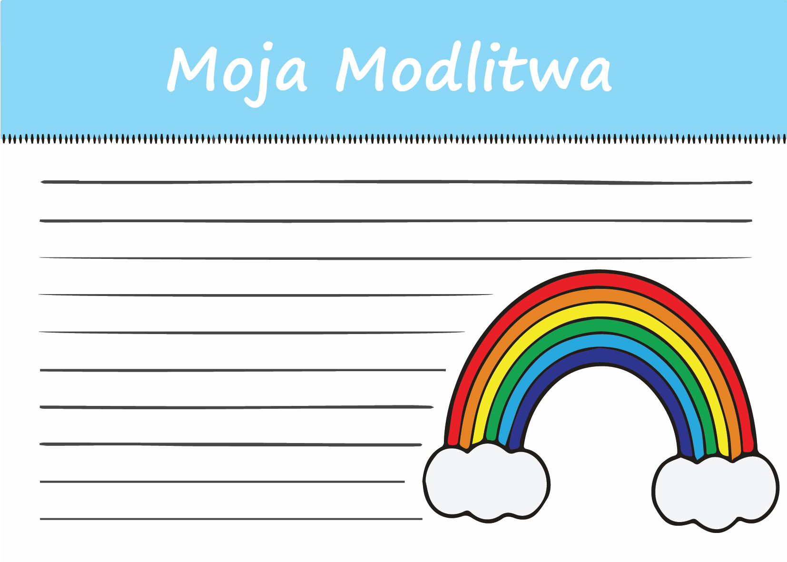

Encuentro 4 - Mi Hagadá
***********************

.. tags:: contenido|resurreccion|Resurrección, contenido|mision|Misión, contenido|palabra-de-dios|Palabra de Dios, contenido|tradiciones-judias|Tradiciones judías, metodo|trabajo-con-texto|Trabajo con texto, metodo|preguntas-para-compartir|Preguntas para compartir, metodo|trabajo-plastico|Trabajo plástico, tipo|mistagogico|Mistagógico

Introducción para el animador
=============================

Este es el último encuentro en grupos. Será un tiempo de una especie de resumen del camino del pequeño grupo. El objetivo de este encuentro es, en primer lugar, reflexionar sobre "mi hagadá": qué es lo único en mi experiencia de Dios. Las preguntas clave del encuentro: **"¿Qué me gustaría contar con mi vida? ¿Qué me gustaría que otros leyeran en mí?"** En segundo lugar, queremos inspirar a los participantes a transmitir conscientemente la historia más allá.

Introducción
============

Ayer, durante el canto Dayenu, dijimos repetidamente que "ya hubiera bastado". Esta actitud de gratitud y sensibilidad hacia el bien cautiva en los judíos. Nuestro retiro aún no ha terminado, ¿pero tal vez no nos impida notar ya algún elemento del que podríamos decir lo mismo?

- ¿Qué descubrimos durante la Tienda del Encuentro?
- ¿Qué momento de nuestros encuentros o del retiro hasta ahora me gustaría destacar? ¿Por qué?

El misterio de Esta Misma Noche
===============================

Durante la cena del Séder de ayer, en la introducción escuchamos:

    En cierto sentido, esta noche haremos un viaje en el tiempo. La tradición judía enseña que **cada uno debe mirarse a sí mismo como si hubiera sido partícipe de la salida de la esclavitud egipcia**.

¡No es sencillo! Ciertas cosas en la fe son fáciles de aceptar como a través de un cristal: entender conceptos intelectualmente, pero mirar como un observador desde fuera, sin participación propia.

- ¿Qué elementos de la fe me resulta más fácil relacionar con mi experiencia?
- ¿Qué momento del Triduo Pascual, en este momento, me parece más cercano a mi espiritualidad?

El autor de la carta a los Hebreos dirá: "Ciertamente, es viva la Palabra de Dios y eficaz, y más cortante que espada alguna de dos filos. Penetra hasta las fronteras entre el alma y el espíritu, hasta las junturas y médulas; y escruta los sentimientos y pensamientos del corazón". La Palabra de Dios seguramente es así, pero nosotros no siempre estamos predispuestos a ella de esa manera. En la fe es algo normal para nosotros funcionar sin esa plena conciencia; más bien aspiramos a ella, nos esforzamos por ella.

    ¿Qué es, pues, el tiempo? Si nadie me lo pregunta, lo sé; pero si quiero explicárselo al que me lo pregunta, no lo sé.

    -- San Agustín

- ¿Tengo la experiencia de que "se me escapa la respuesta" cuando intento explicar? ¿Qué papel juega la intuición en mi espiritualidad?
- ¿Cómo es mi aceptación de la existencia de cosas importantes que "sé, pero si me preguntan no lo sé"?

Así que, por un lado, se trata de un "viaje en el tiempo" y lo vivimos ayer durante la cena del Séder, pero al mismo tiempo incluso el propio San Agustín percibe un problema en la comprensión del concepto del tiempo como creyente. Abrirse a estos misterios parece requerir de nosotros entrar en el espacio de la intuición, del corazón, de la profundidad.

El Jueves Santo se añade una Anáfora a la Plegaria Eucarística:

    El cual, hoy, la víspera de padecer * por nuestra salvación y la de todos los hombres, **es decir, hoy**, tomó pan en sus santas y venerables manos, y elevando los ojos al cielo, * hacia ti, Dios, Padre suyo todopoderoso, * dando gracias te bendijo, * lo partió y lo dio a sus discípulos, diciendo...

Es fácil pasar por alto estas tres cortas palabras, y qué cosa tan importante nos recuerdan.

- ¿Hemos prestado atención alguna vez a esta anáfora?
- ¿Qué puede cambiar en la vivencia de nuestra fe tal interpretación "literal" de las palabras "Esta es la Misma Noche" del Pregón Pascual?

"Ahora"
=======

.. note:: Apotegma (gr. apóphthegma, ~matos – sentencia, dicho) – obra literaria corta, en verso o prosa, que presenta un dicho ingenioso, brillante y acertado de un personaje eminente (ej. un gobernante).

Hay una historia instructiva proveniente de los apotegmas de los Padres del Desierto:

    | Pues bien, sus discípulos preguntaron a uno de los padres del desierto: – Abba, ¿por qué estás siempre tan sereno, alegre y libre?
    | A lo que escucharon la siguiente respuesta: – Porque vivo el momento presente. Y eso me permite tomar de la vida a manos llenas, sin preocuparme por el pasado y el futuro.
    | Entonces los discípulos le preguntaron: – Abba, ¿y cómo lo haces?
    | Respondió: – Cuando como, como; cuando rezo, rezo; cuando trabajo, trabajo; y cuando descanso, descanso – respondió el monje.
    | – Es lo mismo que nosotros – replicaron los discípulos.
    | – ¡No! – respondió el ermitaño – Ustedes, cuando rezan, piensan en la comida; cuando comen, piensan en el trabajo; cuando trabajan, piensan en el descanso; cuando descansan, piensan en el trabajo. No vivir el momento presente, sino recordar continuamente el pasado o pensar en el futuro es la mejor receta para que la vida se nos escape entre los dedos.

- ¿Cómo es mi capacidad de vivir en el "ahora"?
- ¿De qué manera podemos ayudarnos a nosotros mismos dentro de tres semanas (¿o tal vez mejor hoy?) a ser capaces de ser participantes presentes de los misterios de la fe?

Esta sensibilidad al "ahora" es una de las lecciones más importantes con las que viene a nosotros el Salvador. El Salvador de nombre Yehoshua (Jesús), que en sí mismo significa "Yahveh es salvación", ni "fue salvación", ni "será salvación".

Leamos:

    Porque él es nuestro Dios, y nosotros el pueblo de su pasto, y ovejas de su mano. Ojalá oyeseis hoy su voz: No endurezcáis vuestro corazón, como en Meriba, como en el día de Masah en el desierto.

    -- Sal 95,7-8

Veamos qué comentario escribe al respecto el Catecismo de la Iglesia Católica:

    En algunos momentos aprendemos a orar escuchando la Palabra del Señor y participando en su Misterio Pascual, pero en todo tiempo, en los acontecimientos de cada día, su Espíritu se nos ofrece para que brote la oración. La enseñanza de Jesús sobre la oración a nuestro Padre está en la misma línea que la de la Providencia: el tiempo está en las manos del Padre; el encuentro con Él es en el presente, ni ayer ni mañana, sino hoy: "Ojalá oyerais hoy su voz: no endurezcáis vuestro corazón" (Sal 95, 7-8).

    -- CIC 2659

- ¿Qué dice Dios ahora a nuestra Iglesia? ¿Qué voz escuchamos?
- ¿Qué me dice Dios ahora a mí?
- ¿Con qué 5 palabras describiría mi "hoy"?

.. note:: El animador saca el esquema del templo y el plano de la casa de ayer. Las diferentes "zonas" marcadas con un solo color están "entrelazarlas" en él mediante cuerdas (preferiblemente de los mismos colores que cada una de las zonas) - atravesadas por el papel y cosiendo literalmente dos hojas entre sí. Las pone sobre la mesa. Es la conclusión de cierto leitmotiv: Tenemos una casa (profano) y tenemos lo sagrado (templo). En uno y otro tenemos diferentes "zonas" que responden a nuestras necesidades. Son espacios solo aparentemente diferentes; están entrelazados entre sí y no funcionan el uno sin el otro. (Pido sensibilidad a los animadores: los hogares de los ateos, por supuesto, pueden funcionar muy bien. Hablamos de los hogares de las personas creyentes).

Recurramos una vez más a las palabras de San Agustín y dejémosle comentar lo que vemos:

    Recuerda que tus momentos libres y exentos de ocupaciones están cargados con las mayores tareas y responsabilidades.

    -- San Agustín

- ¿Cómo relacionas esta frase y esta imagen (hojas cosidas) con tu vida? ¿Cómo te sientes con esto?
- ¿Qué perdemos al dividir el mundo en sagrado y profano?
- ¿Qué puedo hacer para disminuir esta división en mi vida?

Mi Hagadá
=========

Leamos:

    **Y lo contarás en aquel día a tu hijo, diciendo**: Se hace esto con motivo de **lo que Jehová hizo conmigo cuando me sacó de Egipto**. Y te será como una señal sobre tu mano, y como un memorial delante de tus ojos, para que la ley de Jehová esté en tu boca; por cuanto con mano fuerte te sacó Jehová de Egipto. Por tanto, tú guardarás este rito en su tiempo de año en año.

    -- Éx 13,8-10

Dios ordenó transmitir lo que hizo por nosotros. Es una referencia a este místico "ahora".

- "¿Qué hizo Dios por ti en el tiempo de tu salida de Egipto?" - ¿cómo te sientes con tal pregunta? ¿Cómo responderás a ella?
- ¿De qué manera en nuestra experiencia espiritual damos cabida a todos los acontecimientos de la historia de la salvación?
- ¿Qué cambia tal perspectiva?

Los acontecimientos de la hagadá de ayer no fueron en el pasado; somos sus "testigos oculares", así que podemos contarlos. Esto se realiza en el poder del Espíritu Santo, pero también en una dimensión muy práctica: ¿no hemos tenido nunca una sensación de esclavitud de la que debemos huir? ¿Nunca nos hemos olvidado de Dios de tal manera que cuando despertó en nosotros el anhelo por Él nuestra oración fue como los Salmos de lamentación?

Leamos:

    Aleluya. Alabad a Jehová, porque él es bueno; Porque para siempre es su misericordia. **¿Quién expresará las poderosas obras de Jehová? ¿Quién contará sus alabanzas?**

    -- Sal 106,1-2

Encontrar fragmentos que nos son cercanos en la Biblia es solo la primera etapa. Dios en el Libro del Éxodo dijo directamente "contarás". El salmista hace esta pregunta que resuena en el aire como un reproche: ¿Quién responderá al llamado del Señor?

- **¿Qué me gustaría contar con mi vida? ¿Qué me gustaría que otros "leyeran" en mí?**

No es solo una cuestión de nuestra decisión. En realidad, "quiera o no quiera cuento". Incluso cuando en alguna situación guardamos silencio, es un "silencio significativo". También en nuestro pequeño grupo funcionamos juntos desde hace 48h; es tiempo suficiente para que cada uno de nosotros sea una historia que los demás miembros del grupo pueden leer y relacionar consigo mismos.

- ¿Qué nos hemos contado desde el viernes? ¿Qué pensamiento de alguien del grupo, o de alguien de la diaconía, fue para mí una historia vivificante sobre el "poder del Señor, su alabanza"?

Fuente que es salvación
=======================

Conocer el valor de la historia. Saber construir relaciones íntimas en las que nos escuchamos. Interpretar incesantemente, pero no querer nunca sobreinterpretar. No dividir el mundo en sagrado y profano. No sucumbir a la "tentación de la profesionalización". Contar a alguien el Evangelio como testigo ocular de la acción de Cristo: es una recopilación de pensamientos de nuestras últimas reuniones en el grupo. Es mucho, ¿verdad? Uno puede llevarse las manos a la cabeza y doblegarse bajo el peso de aquello a lo que Jesús nos invita.

- ¿Qué de estos temas que hemos tratado juntos me parece el mayor desafío para mí personalmente?

Leamos:

    Y es necesario que el evangelio sea predicado antes a todas las naciones. Pero cuando os trajeren para entregaros, no os preocupéis por lo que habéis de decir, ni lo penséis, sino lo que os fuere dado en aquella hora, eso hablad; porque no sois vosotros los que habláis, sino el Espíritu Santo.

    -- Mc 13,10-11

Y justo después:

    Cada laico debe ser ante el mundo testigo de la resurrección y de la vida del Señor Jesús y señal del Dios vivo. Todos juntos, y cada uno de por sí, deben alimentar al mundo con frutos espirituales y difundir en él el espíritu de que están animados aquellos pobres, mansos y pacíficos, a quienes el Señor en el Evangelio proclamó bienaventurados. En una palabra: "lo que el alma es en el cuerpo, esto han de ser los cristianos en el mundo".

    -- Constitución dogmática sobre la Iglesia "Lumen Gentium", LG 38

- ¿Cuál es la fuente que nos permite llevar una historia que nos supera?
- "hablad lo que os fuere dado en aquella hora" - ¿qué significa esto para nosotros?
- ¿De qué manera basarse en la Gracia en la narración?

No intentemos ser cristianos que emprenden estar a la altura de las exigencias del Evangelio sin confiar en la bendición de Dios. La tarea que tenemos por delante es grande, pero recordemos que si es la voluntad de Jesús, Él mismo se encargará de la eficacia.

Leamos:

    En el principio era el Verbo, y el Verbo era con Dios, y el Verbo era Dios. Este era en el principio con Dios. Todas las cosas por él fueron hechas, y sin él nada de lo que ha sido hecho, fue hecho. En él estaba la vida, y la vida era la luz de los hombres. La luz en las tinieblas resplandece, y las tinieblas no prevalecieron contra ella.

    -- Jn 1,1-5

¡No hay mejor narrador en la tierra que Él, el Verbo! Jesús quiere ser nuestro narrador.

Salida
======

Volvamos a la parroquia y contemos allí lo que hemos vivido aquí. Ante nosotros el Triduo Pascual. Nuestra vivencia del retiro con el contexto judío pone en nuestro corazón un valor que podemos transmitir más allá.

.. note:: El animador reparte a los participantes tarjetas pequeñas.

.. |kudo2| image:: kudo-03.jpg
   :scale: 50%
.. |kudo3| image:: kudo-05.jpg
   :scale: 50%
.. |kudo4| image:: kudo-07.jpg
   :scale: 50%

+---------+---------+
| |kudo1| | |kudo2| |
+---------+---------+
| |kudo3| | |kudo4| |
+---------+---------+

Es una forma sencilla. Quizás incluso de alguna manera poco seria. Pero si podemos tener sin reparos, por ejemplo en la Sagrada Escritura, estampitas con oraciones compuestas, ¿por qué no escribir uno mismo una estampita así? ¿Contar uno mismo una historia corta, ponerse del lado del creador y no del receptor?

- ¿Qué tarjeta te resultaría más fácil completar y poner en tu Sagrada Escritura? ¿Por qué crees?
- ¿Qué tarjeta te resultaría más fácil completar y regalar a alguien? ¿Por qué? ¿A quién se la entregarías?

Tomemos una tarjeta e intentemos llenarla durante este encuentro.

.. note:: El animador da tiempo para que cada uno elija una tarjeta y la llene (unos 5 minutos).

- ¿Qué te dio esta experiencia? ¿Qué te dijo sobre ti mismo/a?

Que la aplicación de este encuentro sea llenar todas las tarjetas para el Triduo Pascual y la decisión de cuáles entregaremos/mostraremos a otros y cuáles guardaremos solo para nosotros.

.. centered:: **¡Que la historia continúe!**
