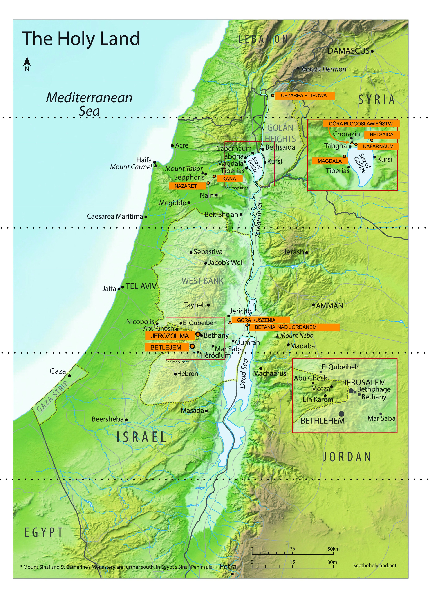

Encuentro 4. - Shavuot
**********************

.. tags:: contenido|mision|Misión, contenido|palabra-de-dios|Palabra de Dios, contenido|resurreccion|Resurrección, contenido|tradiciones-judias|Tradiciones judías, metodo|trabajo-con-musica|Trabajo con música, metodo|trabajo-en-grupos|Trabajo en grupos, metodo|trabajo-con-texto|Trabajo con texto, tipo|biblico|Bíblico

Introducción para el animador
=============================

Este encuentro es el último encuentro grupal de los retiros. Su objetivo principal es presentar la idea de "vista espiritual" y mostrar a los participantes que en la Iglesia no hay lugar para la división entre audiencia y artistas, que la transmisión de la fe, las reflexiones, compartir cómo actúa Dios en nosotros no está reservado para un grupo reducido de personas, sino que todos estamos llamados, como escribe san Pedro:

    Vosotros, en cambio, sois linaje elegido, sacerdocio real, nación santa, pueblo [de Dios] adquirido para anunciar las proezas* del que os llamó de las tinieblas a su admirable luz

    -- 1 P 2,9

Además, es precisamente la **proclamación** de las obras de Dios la que es vivificante para aquellos a quienes hablamos, pero también para nosotros mismos - con esto está relacionada la responsabilidad y la autonomía del cristiano. Profundizar la fe, cambios en la forma de pensar en el mundo, la continua metanoia deben fluir de cada uno de nosotros. Con esta idea queremos concluir los encuentros grupales.

Compartir
=========

Estamos en el momento de los retiros en que los elementos comienzan a componerse en un todo. La conferencia nos mostró que las tres fiestas, a pesar de temática, tiempo, rituales, sentido distintos, se pueden combinar entre sí. Durante la tienda de encuentro pudimos intentar en la práctica combinar no solo las fiestas, sino también momentos clave de la historia de la Iglesia.

- ¿Dónde en mi vida percibo ciertas conexiones? /vida espiritual
- ¿Qué me parece en este momento como el elemento que más me ha dado?

Vista espiritual
================

Durante nuestros retiros buscamos las raíces cristianas. Lo hicimos juntos, lo cual es siempre una gran aventura. Los retiros terminan hoy, por eso queremos hablar ahora sobre cierta habilidad que nos ayudará a buscar independientemente la profundidad y las raíces. Por eso comencemos con cierta experiencia.

.. note:: El animador divide el grupo en parejas, pero máximo en 4 grupos (si hay más de 8 personas, que algunos grupos sean de tres personas).

En un momento cada uno de nosotros recibirá su texto, con lugares para completar y un fragmento oculto. Antes de trabajar en él escucharemos juntos un fragmento musical. Cuando cada grupo termine su tarea, pone las tarjetas en el centro con una breve discusión de qué fragmento recibió y qué información completó.

.. note:: Tenemos 4 fragmentos musicales. Los primeros tres son voces individuales sucesivas de la misma obra "Ubi Caritas" de Ola Gjeilo. El fragmento 4 muestra cómo suenan todas simultáneamente. Ilustra el cambio cualitativo de ver cosas conectadas. Corta las tablas horizontalmente en 8 pares de fragmentos, y los fragmentos del lado derecho pégalos con notas post-it, para que no sean visibles para los participantes durante la primera parte de la tarea. Quita las notas en el momento indicado en el esquema.

.. important:: nos basamos en Dan Stevers "True and better"

.. list-table::
   :widths: 50 50
   :header-rows: 0

   * - La serpiente era más astuta que todos los animales terrestres que el Señor Dios había creado. Ella dijo a la mujer: «¿Realmente Dios dijo: No comáis de los frutos de todos los árboles de este jardín?» La mujer respondió a la serpiente: «Podemos comer de los frutos de los árboles del jardín, solo de los frutos del árbol que está en medio del jardín, Dios dijo: No debéis comer de él, ni siquiera tocarlo, para que no muráis». Entonces la serpiente dijo a la mujer: «¡Ciertamente no moriréis! Pero Dios sabe que cuando comáis del fruto de ese árbol, se os abrirán los ojos y seréis como Dios, conoceréis el bien y el mal». Entonces la mujer vio que el árbol tenía frutos buenos para comer, que era delicia para los ojos y que los frutos de ese árbol eran adecuados para adquirir conocimiento. Cogió de él un fruto, lo probó y se lo dio a su marido, que estaba con ella: y él lo comió.

       -- Gn 3, 1-6

       **¿En qué lugar se desarrolla la acción?**

       ...

       **¿Cuál fue la actitud de Eva y Adán?**

       ...

     - Él mismo se alejó de ellos a distancia como de un tiro de piedra, cayó de rodillas y oró con estas palabras: «Padre, si quieres, aparta de Mí este cáliz! Sin embargo, no se haga mi voluntad, sino la Tuya». Entonces se le apareció un ángel del cielo y lo fortaleció.

       -- Lc 22,41-43

       **¿En qué lugar se desarrolla la acción?**

       Jardín

       **¿Cuál fue la actitud de Jesús?**

       Obediencia

.. list-table::
   :widths: 50 50
   :header-rows: 0

   * - Les respondió: «Tomadme y echadme al mar, y cesarán las aguas que se agitan contra vosotros, porque sé que por mi causa se ha levantado esta gran tempestad contra vosotros». Estos hombres intentaron, remando, volver a tierra, pero no pudieron, porque el mar se agitaba cada vez más contra ellos. Clamaron entonces al Señor y dijeron*: «¡Oh Señor, te rogamos, no nos dejes perecer por la vida de este hombre y no nos cargues con la responsabilidad de sangre inocente, porque Tú eres el Señor, como Te place, así actúas». Y tomaron a Jonás y lo echaron al mar, y este cesó de embravecerse. Entonces sobrecogió a esos hombres el temor del Señor. Ofrecieron un sacrificio al Señor e hicieron votos.

       -- Jon 1,12-16

       El Señor envió un gran pez para que se tragara a Jonás. Y Jonás estuvo en las entrañas del pez tres días y tres noches. Desde las entrañas del pez oró Jonás al Señor su Dios.

       -- Jon 2,1-2

       **¿Por qué Jonás fue arrojado al mar?**

       ...

       **¿Cuántos días pasó Jonás en el pez?**

       ...

     - Sabéis lo que sucedió en toda Judea, comenzando desde Galilea, después del bautismo que predicó Juan. Conocéis el asunto de Jesús de Nazaret, a quien Dios ungió con el Espíritu Santo y poder. Porque Dios estaba con Él, pasó haciendo el bien y sanando a todos los que estaban bajo el poder del diablo. Y nosotros somos testigos de todo lo que hizo en la tierra judía y en Jerusalén. A Él lo mataron, colgándolo en un árbol*. Dios lo resucitó al tercer día y permitió que se apareciera no a todo el pueblo, sino a nosotros, elegidos previamente por Dios como testigos, que comimos y bebimos con Él después de Su resurrección.

       -- Hch 10, 37-41

       **¿Por qué Jesús fue puesto en el sepulcro?**

       Para salvarnos

       **¿Cuántos días pasó Jesús en el sepulcro?**

       3 días

.. list-table::
   :widths: 50 50
   :header-rows: 0

   * - Isaac se dirigió a su padre Abraham: «¡Padre mío!» Y cuando este dijo: «Aquí estoy, hijo mío» - preguntó: «Aquí está el fuego y la leña, ¿dónde está el cordero para el holocausto?» Abraham respondió: «Dios proveerá el cordero para el holocausto, hijo mío». Y ambos siguieron adelante. Y cuando llegaron al lugar que Dios indicó, Abraham construyó allí un altar, puso sobre él la leña y, atando a su hijo Isaac, lo puso sobre la leña en el altar. Luego Abraham extendió la mano para tomar el cuchillo y matar a su hijo. Pero entonces el Ángel del Señor* lo llamó desde el cielo y dijo: «¡Abraham, Abraham!» Y él dijo: «Aquí estoy». [El ángel] le dijo: «No levantes la mano sobre el muchacho y no le hagas ningún mal! Ahora he conocido que temes a Dios, porque no me negaste ni siquiera a tu hijo único». Abraham, mirando detrás de sí, vio un carnero enredado por los cuernos en los matorrales. Fue entonces, tomó el carnero y lo ofreció en holocausto en lugar de su hijo.

       -- Gn 22,7-13

       **¿Quién en esta escena debía ser la víctima y por quién ofrecida?**

       ...

     - Hijos míos, os escribo esto para que no pequéis. Pero si alguno peca, tenemos un Abogado ante el Padre - Jesucristo el justo. Él es la víctima de expiación por nuestros pecados, y no solo los nuestros, sino también por los pecados de todo el mundo.

       -- 1 Jn 2,1-2

       En esto se manifestó el amor de Dios hacia nosotros: que envió a Su Hijo Unigénito al mundo*, para que tengamos vida por Él. En esto se manifiesta el amor: que no nosotros amamos a Dios, sino que Él mismo nos amó y envió a Su Hijo como víctima de expiación por nuestros pecados*.

       -- 1 Jn 4,9-10

       **¿Quién en esta escena debía ser la víctima y por quién ofrecida?**

       Hijo ofrecido en sacrificio por el Padre.

.. list-table::
   :widths: 50 50
   :header-rows: 0

   * - Entonces todo el pueblo, oyendo los truenos y relámpagos y la voz de la trompeta y viendo el monte humeante, se asustó y tembló, y se quedó a distancia. Y dijeron a Moisés: ¡Habla tú con nosotros, y nosotros te escucharemos! Pero que Dios no nos hable, para que no muramos. Moisés dijo al pueblo: «¡No temáis! Dios ha venido para probaros y despertar en vosotros el temor ante Él, para que no pequéis». El pueblo permaneció a distancia, y Moisés se acercó a la nube oscura en la que estaba Dios.

       -- Ex 20,18-21

       Desde el fuego en el Monte habló el Señor con vosotros cara a cara. En ese tiempo yo estaba entre el Señor y vosotros, para anunciaros las palabras del Señor, cuando temíais el fuego y no subisteis al monte.

       -- Dt 5,4-5

       **¿Quién era Moisés para el pueblo en esta escena?**

       ...

     - Pero Cristo, apareciendo como sumo sacerdote de los bienes futuros, por un tabernáculo más alto y perfecto, y no hecho con mano - es decir, no de este mundo - ni por sangre de machos cabríos y novillos, sino por Su propia sangre entró una vez para siempre en el Lugar Santo, obteniendo redención eterna. Porque si la sangre de machos cabríos y novillos y la ceniza de la vaca, con la que se rocía a los contaminados*, producen purificación del cuerpo, ¡cuánto más la sangre de Cristo, que por el Espíritu eterno* se ofreció a Dios a sí mismo como víctima sin mancha, purificará vuestras conciencias de obras muertas, para que podáis servir al Dios vivo! Y por eso es mediador del Nuevo Pacto, para que por la muerte, sufrida para redención de las transgresiones cometidas bajo el primer pacto, los que son llamados a la herencia eterna alcancen el cumplimiento de la promesa.

       -- Hb 9,11-15

       **¿Quién era Jesús para el pueblo en esta escena?**

       Mediador entre Dios y el Padre.

.. list-table::
   :widths: 50 50
   :header-rows: 0

   * - Decid a toda la asamblea de Israel así: El décimo día de este mes que cada uno procure un cordero para la familia, un cordero para la casa. Si la familia fuera demasiado pequeña para consumir el cordero, que procure uno junto con su vecino que vive más cerca de su casa, para que haya el número adecuado de personas. Los contaréis para el consumo del cordero según lo que cada uno pueda consumir. El cordero será sin defecto, macho, de un año; podéis tomar un cordero o un cabrito. Lo guardaréis hasta el día catorce de este mes, y entonces toda la asamblea de Israel lo matará al anochecer*. Y tomarán la sangre del cordero y rociarán con ella los dinteles y los umbrales de la casa en la que lo consumirán. [...] Esa noche pasaré por Egipto, mataré todo primogénito en la tierra de Egipto desde el hombre hasta el ganado y ejerceré juicio sobre todos los dioses de Egipto* - Yo, el Señor. La sangre os servirá para marcar las casas en las que estaréis. Cuando vea la sangre, pasaré de largo y no habrá entre vosotros plaga destructora cuando castigue la tierra de Egipto.

       -- Ex 12,3-7.12-13

       **¿Para qué tenían que matar los israelitas el cordero?**

       ...

       **¿Qué resultó del rociar los dinteles con la sangre del cordero?**

       ...

     - Si llamáis Padre a Aquel que sin acepción de personas juzga según las obras de cada uno, pasad el tiempo de vuestra peregrinación con temor. Sabéis que de vuestro proceder malo heredado de los antepasados fuisteis redimidos no con algo perecedero, plata u oro, sino con la preciosa sangre de Cristo, como cordero sin mancha y sin defecto. Él fue ciertamente predestinado antes de la creación del mundo, pero solo en los últimos tiempos se manifestó por vosotros. Vosotros por Él creísteis en Dios, que lo resucitó de entre los muertos y le dio gloria, de modo que vuestra fe y esperanza están dirigidas a Dios.

       -- 1 P 1,17-21

       **¿Para qué fue matado Jesús?**

       Para salvar a las personas.

       **¿Qué resulta del lavado en la Sangre de Jesús?**

       Vida eterna

.. list-table::
   :widths: 50 50
   :header-rows: 0

   * - El Señor dijo a Abram: «Sal de tu tierra natal y de la casa de tu padre al país que te mostraré. Haré de ti una gran nación, te bendeciré y haré grande tu nombre: serás bendición*. Bendeciré a los que te bendigan, y a los que te maldigan, yo los maldeciré. Por ti recibirán bendición* todos los pueblos de la tierra». Abram se puso en camino, como le ordenó el Señor, y con él fue también Lot. Abram tenía setenta y cinco años cuando salió de Harán. Y Abram llevó consigo a su esposa Saray, a su sobrino Lot y todos los bienes que ambos poseían, así como la servidumbre que adquirieron en Harán, y partieron para ir a Canaán.

       -- Gn 12,1-5

       **¿Cómo cumplió Abraham la orden de Dios?**

       ...

     - Y el Verbo se hizo carne* y habitó entre nosotros. Y contemplamos Su gloria, gloria como del Unigénito del Padre, lleno de gracia y de verdad.

       -- Jn 1, 14

       Tened entre vosotros los mismos sentimientos que tuvo Cristo Jesús. Él, existiendo en forma* de Dios, no consideró como presa* el ser igual* a Dios, sino que se despojó* a sí mismo, tomando forma de siervo*, haciéndose semejante a los hombres. Y en su aspecto exterior, reconocido como hombre, se humilló a sí mismo, haciéndose obediente hasta la muerte - y muerte de cruz.

       -- Flp 2,1-8

       **¿Cómo cumplió Jesús la orden de Dios?**

       Haciéndose obediente y fundando el Nuevo Pueblo de Dios.

.. list-table::
   :widths: 50 50
   :header-rows: 0

   * - «Todos los siervos del rey y la población de los estados del reino saben que hay una sola ley para ellos, para cada hombre y cada mujer que se dirigen al rey al patio interior, y que no recibieron convocatoria: deben ser muertos, a menos que el rey extienda sobre ellos el cetro de oro, entonces permanecerán con vida. Y a mí no me convocaron para ir al rey, ya desde hace treinta días». Y se comunicaron a Mardoqueo las palabras de Ester. Entonces Mardoqueo dijo que respondieran a Ester: «No pienses en tu corazón que te salvarás en la casa del rey, única entre todos los judíos, porque si tú guardas silencio en este tiempo, la liberación y salvación para los judíos vendrá de otro lugar*, pero tú y la casa de tu padre pereceréis. ¿Y quién sabe si no precisamente por este momento alcanzaste la dignidad de reina?» Y Ester dijo que respondieran a Mardoqueo: «Ve, reúne a todos los judíos que se encuentran en Susa. Ayunad por mí, sin comer ni beber tres días, noche y día. Yo también y mis doncellas ayunaremos igualmente. Luego iré al rey, aunque esto es contrario a la ley, y si muero, moriré».

       -- Est 4,11-16

       **¿Qué arriesga Ester?**

       ...

       **¿Para qué arriesga Ester?**

       ...

     - Yo soy el buen pastor. El buen pastor da su vida por las ovejas.

       -- Jn 10,11

       Porque tanto amó Dios al mundo que dio a Su Hijo Unigénito, para que todo el que cree en Él no perezca, sino que tenga vida eterna.

       -- Jn 3,16

       **¿Qué arriesga Jesús?**

       Su vida

       **¿Para qué arriesga Jesús?**

       Para salvar a Su pueblo

| *El animador reproduce el 1. fragmento musical y reparte las primeras tarjetas de trabajo.*
| `👉 Escucha <https://konspekty.ponadmurami.pl/_static/chleb_wino_miod_1.mp3>`__

| *Ponemos las tarjetas en el centro. El animador reproduce el 2. fragmento musical y reparte las segundas tarjetas de trabajo.*
| `👉 Escucha <https://konspekty.ponadmurami.pl/_static/chleb_wino_miod_2.mp3>`__

| *El animador reproduce el 3. fragmento musical y pasamos a las preguntas.*
| `👉 Escucha <https://konspekty.ponadmurami.pl/_static/chleb_wino_miod_3.mp3>`__

Dejemos por ahora las tarjetas que hemos preparado.

- ¿Cuál de las Fiestas de Peregrinación me es intuitivamente cercana? ¿Qué me dice esto sobre mi espiritualidad?
- ¿Prefiero leer la Sagrada Escritura más bien capítulos completos o perícopas individuales?

| *El animador reproduce el 4. fragmento musical. Quitamos las notas post-it que cubren los fragmentos en las tarjetas de trabajo.*
| `👉 Escucha <https://konspekty.ponadmurami.pl/_static/chleb_wino_miod_4.mp3>`__

Después de un momento de lectura espontánea de lo que descubrimos en las tarjetas, pasamos inmediatamente a leer:

    Ese mismo día dos de ellos iban camino a una aldea llamada Emaús, distante sesenta estadios* de Jerusalén. Hablaban entre sí de todo lo que había sucedido. Mientras hablaban y discutían entre sí, el mismo Jesús se acercó y caminaba con ellos. Pero sus ojos estaban como retenidos, de modo que no lo reconocieron. Él les preguntó: «¿Qué conversaciones son estas que mantenéis entre vosotros en el camino?» Se detuvieron tristes. Y uno de ellos, llamado Cleofás, le respondió: «¿Eres tú el único que permanece en Jerusalén que no sabe lo que ha sucedido allí en estos días?» Les preguntó: «¿Qué cosa?» Le respondieron: «Lo que pasó con Jesús el Nazareno, que era un profeta poderoso en obras y palabras ante Dios y todo el pueblo; cómo los sumos sacerdotes y nuestros líderes lo entregaron a muerte y lo crucificaron. Y nosotros esperábamos que Él fuera quien liberaría a Israel. Sí, y después de todo esto hoy ya es el tercer día desde que esto sucedió. Además, algunas de nuestras mujeres nos asustaron: estuvieron por la mañana en el sepulcro, y no encontrando Su cuerpo, regresaron y contaron que habían tenido una visión de ángeles que aseguran que Él vive. Fueron algunos de los nuestros al sepulcro y encontraron todo tal como las mujeres contaron, pero a Él no lo vieron». Entonces Él les dijo: «¡Oh insensatos y tardos de corazón para creer todo lo que dijeron los profetas! ¿No era necesario que el Mesías padeciera esto para entrar en Su gloria?» Y comenzando desde Moisés y pasando por todos los profetas les explicó todo lo que en las Escrituras se refería a Él. Así se acercaron a la aldea a la que se dirigían, y Él hizo como si fuera a seguir adelante. Pero ellos le obligaron diciendo: «Quédate con nosotros, porque se hace tarde y el día ya declina». Entró entonces para quedarse con ellos. Cuando se sentó a la mesa con ellos, tomó el pan, pronunció la bendición, lo partió y se lo dio. Entonces se les abrieron los ojos y lo reconocieron, pero Él desapareció de su vista. Y se decían unos a otros: «¿No ardía nuestro corazón cuando nos hablaba en el camino y nos explicaba las Escrituras?» En esa misma hora se pusieron en camino y regresaron a Jerusalén. Allí encontraron reunidos a los Once y a otros con ellos, que les anunciaron: «El Señor realmente resucitó y se apareció a Simón». Ellos también contaron lo que les había sucedido en el camino, y cómo lo reconocieron al partir el pan

    -- Lc 24, 13-35

- ¿Qué significa para mí tal conexión de ejemplos musicales, tarjetas de trabajo y el Evangelio de los discípulos de Emaús?
- ¿Cuándo y dónde fue mi Emaús, el momento de "abrirse los ojos" cuando ciertas cosas se conectaron juntas?
- ¿Qué es difícil en ver cosas conectadas?

En Hamlet, William Shakespeare muestra una escena en la que el protagonista confiesa a Horacio que ve el fantasma de su padre muerto. A la pregunta "¿Dónde?" responde: **"Ante los ojos de mi alma"**. Para percibir la realidad oculta en la profundidad se necesita la vista espiritual. Esta es una intuición clave en la espiritualidad. Esta intuición del poeta, aunque expresada en un contexto completamente diferente, se refiere a nuestra fe:

    Cuando hacemos esto durante la celebración de la Eucaristía, tenemos ante los ojos del alma el misterio pascual.

    -- Ecclesia de Eucharistia

- ¿Qué es para mí la vista espiritual?
- ¿De qué manera cuido mi vista espiritual?

Leamos:

    Se acercaron a Él los discípulos y le preguntaron: «¿Por qué les hablas en parábolas?»* Él les respondió: «A vosotros se os ha dado conocer los misterios del reino de los cielos, pero a ellos no se les ha dado*. * Porque a quien tiene se le dará, y tendrá en abundancia; pero a quien no tiene, se le quitará incluso lo que tiene. Por eso les hablo en parábolas: porque viendo no ven y oyendo no oyen ni entienden. Así se cumple en ellos la profecía de Isaías*: Oiréis, pero no entenderéis, miraréis, pero no veréis».

    -- Mt 13,10-14

A veces podemos querer gritar "¿por qué nadie nos explicó nunca la conexión de estas fiestas?" o "¿por qué nadie me mostró de inmediato de qué se trata?".

El misterio cristiano no consiste en que exista un libro guardado, cuyo contenido conocen solo unos pocos (y por eso es un misterio). El misterio cristiano consiste en que todo "está sobre la mesa" y es manifiesto, pero pocos lo entienden. El mismo Jesús lo vio así. Para llegar al misterio hay que tener vista espiritual, hay que cuidarla, hay que entrenarla.

- ¿Cómo podemos ayudarnos mutuamente a entrenar nuestra vista espiritual?
- ¿Qué es para mí el mayor desafío en entrenar la vista espiritual?

Sería más fácil si "alguien" viniera y nos explicara todo, y nosotros lo "consumiéramos" y nos alegráramos de ello. Sin embargo, parece que no es esa la intención del Altísimo.

No hay audiencia y artista
==========================

Leamos:

    Simón Pedro, siervo y apóstol de Jesucristo, a los que por la justicia de nuestro Dios y Salvador Jesucristo recibieron una fe tan preciosa como la nuestra: ¡Gracia y paz os sean concedidas abundantemente mediante el conocimiento de Dios y de Jesús, nuestro Señor! Así mismo Su divino poder nos ha concedido todo lo que se refiere a la vida y a la piedad, mediante el conocimiento de Aquel que nos llamó por Su gloria y excelencia. Por ellas nos han sido concedidas preciosas y grandísimas promesas, para que por ellas lleguéis a ser partícipes de la naturaleza divina*, habiendo escapado de la corrupción [causada] por la concupiscencia en el mundo. Por eso mismo, poniendo toda diligencia, añadid a vuestra fe virtud, a la virtud conocimiento, al conocimiento dominio propio, al dominio propio paciencia, a la paciencia piedad, a la piedad afecto fraternal, y al afecto fraternal amor. Porque si tenéis estas cosas y en abundancia, no os harán inactivos ni infructuosos en el conocimiento de nuestro Señor Jesucristo. Porque a quien le faltan estas cosas es ciego - corto de vista y ha olvidado la purificación de sus antiguos pecados. Por eso, hermanos, esforzaos aún más* por afianzar vuestra vocación y elección! Porque haciendo esto no caeréis nunca. De esta manera se os abrirá ampliamente la entrada al reino eterno de nuestro Señor y Salvador Jesucristo.

    -- 2 P 1,1-11

Comencemos con dos preguntas rápidas:

- ¿A quién escribe san Pedro estas palabras?
- ¿Qué enfatiza al hablar del grupo receptor?

Escribe a todos los que recibieron "una fe tan preciosa como la nuestra". San Pedro, el primer papa, obispo no pone ningún muro entre su fe y la de cualquiera que haya creído.

.. note:: El siguiente fragmento se puede omitir si se presenta en forma de testimonio del animador

A veces nos parece que para dar algo a la Iglesia hay que ser alguien especial. Nos parece que en la fe existe una división entre "artistas" en el escenario, que pueden hablar, ser líderes, cambiar el mundo, marcar nuevas direcciones, influir en la realidad y la llamada "resto", que se sienta en la audiencia y solo puede pronunciarse a favor o en contra de algunas ideas. En la fe la vocación está dirigida a todos, no hay escenario y audiencia, todos estamos enviados para desarrollar nuestra relación con Dios, contemplar, discernir, discutir, y transmitir más adelante los frutos de estos procesos. No necesitamos tener un mandato para activar la vista espiritual y comenzar a conectar los puntos. Además, esto sucede no solo en situaciones como la Meditación de la Palabra de Dios, en la que exactamente hicimos esto, sino simplemente en cada esfera de la vida. Cada uno de nosotros tiene el potencial para ir en profundidad, mirar entre líneas, buscar sentido y compartir lo que descubra. Estamos enviados para ser sal de la tierra, y por lo tanto también aquellos que provocarán estas excursiones en profundidad].

- ¿Qué sentimientos despierta en mí la imagen de que no hay oposición audiencia-artista?
- ¿Qué podemos hacer para romper el sentimiento presente en nosotros de que el presbiterio es el escenario y las naves son la audiencia?
- ¿Quién tomó la responsabilidad para que yo viera el todo, y no solo partes de la fe?
- ¿Por quién tomo yo la responsabilidad para que vea el todo, y no solo partes de la fe?

Dos mares de Israel
===================

.. note:: Sacamos el mapa que muestra el curso del Jordán junto con dos mares: el Mar (lago) de Galilea y el Mar Muerto. Córtalo en tiras marcadas con líneas punteadas (el mapa debe estar preparado y cortado antes del encuentro). Luego junto con los participantes arreglad el mapa comenzando desde arriba (fuentes del Jordán) prestando atención a los puntos característicos descritos en naranja. Se trata de que los participantes vean lugares que les son familiares de varios fragmentos del Evangelio.

El animador debe recordar los siguientes lugares y fragmentos antes del encuentro:

Cesarea de Filipo
    Jesús lleva a los discípulos a Cesarea de Filipo (Mt 16, 13-20)
Cafarnaúm
    Curación del siervo del centurión de Cafarnaúm (Mt 8, 5-13), Discurso Eucarístico (Jn 6, 22-71)
Nazaret
    ciudad natal de Jesús
Betsaida
    curación del ciego (Mc 8, 22-26) + desde Betsaida Jesús llevó a los discípulos a Cesarea de Filipo, notemos qué distancia es.
Mar de Galilea
    multiplicación de los panes (Jn 6, 1-15)
Magdala
    lugar de origen de María Magdalena
Monte de las Bienaventuranzas
    Ocho Bienaventuranzas (Mt 5, 1-12)
Caná
    milagro en la boda, comienzo de la actividad pública de Jesús (Jn 2, 1-12)
Monte de la tentación
    lugar del ayuno de cuarenta días de Jesús (Lc 4, 1-13)
Betania junto al Jordán
    lugar del bautismo de Jesús (Mt 3, 13-17)
Belén
    lugar del nacimiento de Jesús (Lc 2, 4-7)
Jerusalén
    ver por ejemplo fragmentos Mt 21, enseñanza en el templo

No queremos dedicar mucho tiempo aquí, más bien recordar rápidamente que estos lugares nos son conocidos. Lo clave es más bien ver el curso del Jordán, que fluye a través del Mar (lago) de Galilea, y luego desemboca en el Mar Muerto.

Después de arreglar el mapa, teniendo ya la imagen del todo, leamos el fragmento:

    En Israel hay dos mares: el de Galilea (Kinneret) y el Muerto. Son tan diferentes como solo se puede imaginar. El Mar de Galilea está lleno de vida, y el Mar Muerto, como su nombre indica, no tiene vida en absoluto. Es extraño que ambos mares sean alimentados por el mismo río – el Jordán. ¿Cuál es la diferencia entre estos dos mares? La respuesta es que el Mar de Galilea recibe agua, pero también la entrega en el otro extremo, mientras que el Mar Muerto recibe agua, pero no la entrega.

    -- fragmento - Rabbi Lord Jonathan Sacks: To heal a fractured world, Conferencia Sinai Indaba 2015.

Ya hemos llamado la atención sobre el hecho de que todos estamos llamados a una fe fructífera, a que de nuestra vida espiritual fluyan frutos que vale la pena compartir con otros. Los dos mares son una imagen de que es precisamente la fe que recibe y transmite más adelante la que es viva y edificante, pero cuando solo recibimos y nada fluye de nosotros más adelante, podemos caer en el estancamiento.

- ¿De qué manera puedo realmente cuidar de ser más bien como el Mar de Galilea?
- ¿Qué en mi vida espiritual cayó en el Mar Muerto?

Conclusión y aplicación
==========================

Nos hemos convencido en este encuentro de que podemos entrenar nuestra vista espiritual, aprendiendo a percibir el sentido más profundo de los acontecimientos y conexiones no obvias en el mundo. Recordemos también que vale la pena transmitir más adelante lo que descubrimos.

Leamos:

    Por eso también yo, habiendo oído de vuestra fe en el Señor Jesús y del amor hacia todos los santos, no ceso de dar gracias, recordándoos en mis oraciones. [Pido en ellas] que el Dios de nuestro Señor Jesucristo, el Padre de gloria, os dé espíritu de sabiduría y revelación* en el conocimiento más profundo de Él mismo. [Que os dé] ojos iluminados del corazón para que sepáis cuál es la esperanza de vuestra vocación, cuál es la riqueza de la gloria de Su herencia entre los santos.

    -- Ef 1,15-18

- ¿Con qué esperanza regreso de estos retiros?

Como aplicación de este encuentro volvamos a la pregunta: **¿De qué manera puedo realmente cuidar de ser más bien como el Mar de Galilea?** y nuestras respuestas. Si aún no las tenemos, volvamos a esta pregunta en tiempo libre y planifiquemos pasos reales que haremos en el tiempo más cercano.
