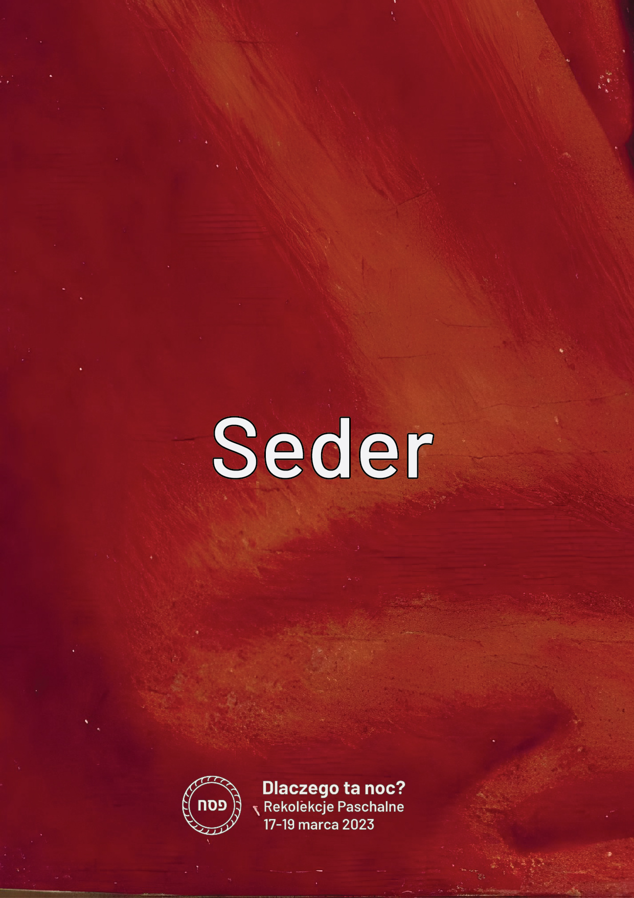
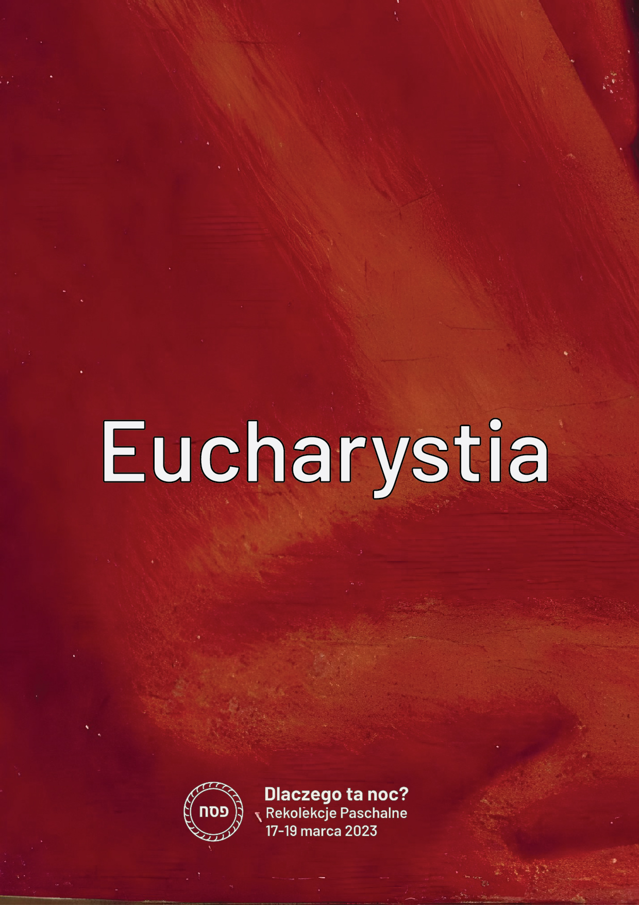
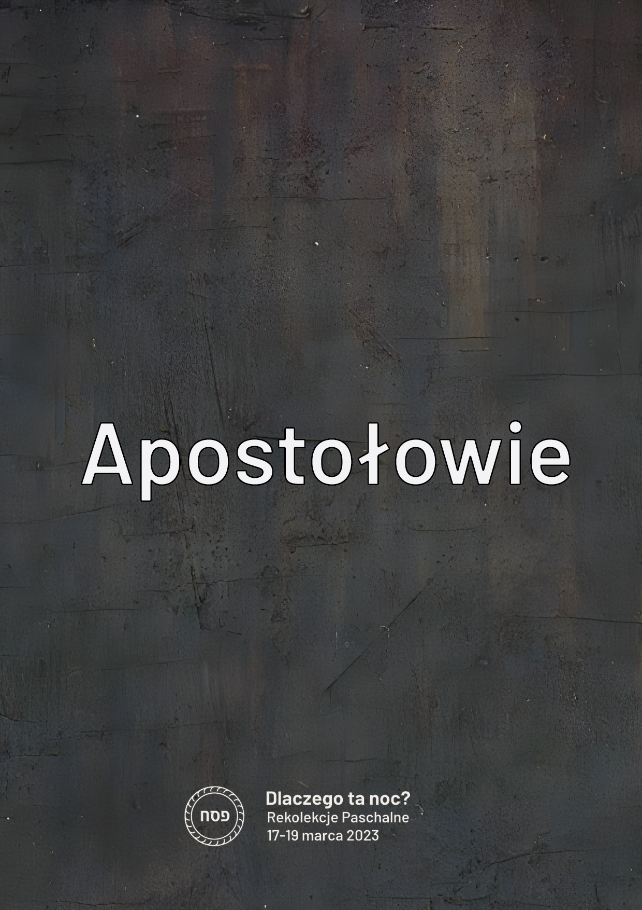
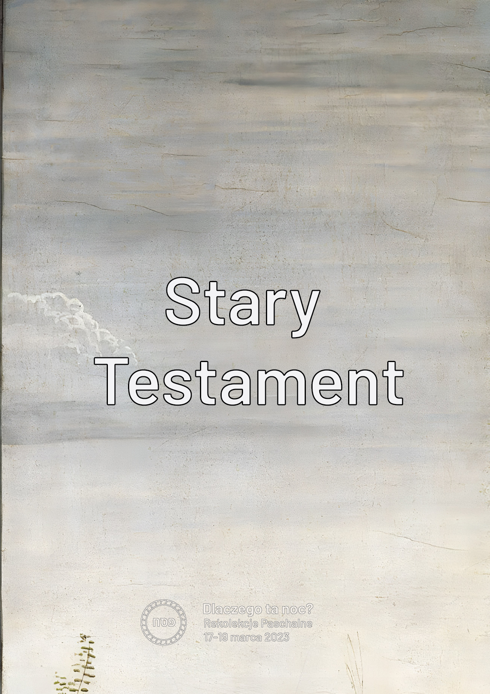

Encuentro 4. - Viejo-Nuevo
**************************

.. tags:: contenido|eucaristia|Eucaristía, contenido|palabra-de-dios|Palabra de Dios, contenido|iglesia|Iglesia, contenido|resurreccion|Resurrección, contenido|mision|Misión, contenido|tradiciones-judias|Tradiciones judías, metodo|trabajo-con-imagen|Trabajo con imagen, metodo|trabajo-en-grupos|Trabajo en grupos, tipo|mistagogico|Mistagógico

Introducción para el animador
=============================

El cuarto encuentro es uno de los últimos puntos del retiro, por lo tanto, constituye un lugar de resumen. La imagen que queremos que los participantes se lleven del encuentro es la conexión de lo Viejo y lo Nuevo, que es realizada por creyentes conscientes. Para ello sirve una dinámica simple [los materiales impresos y los "clips" serán suministrados a los animadores - al final del esquema se encuentran imágenes para establecer el contexto].

Introducción
============

Detrás de nosotros está la noche del Séder, el punto culminante del retiro. ¡Queríamos experimentar a través de la cena del Séder la profunda conexión entre la Eucaristía y el Séder! Sin embargo, ¡esa no fue la única "conexión" que queríamos vivir! Todo nuestro retiro orbita alrededor de tres espacios.

.. note:: El animador saca sobre la mesa tarjetas con las palabras escritas: Antiguo Testamento, Nuevo Testamento, Séder, Eucaristía, Profetas y Apóstoles.

.. |d3| image:: prorocy.jpg
   :scale: 33%

.. |d6| image:: nowy_testament.jpg
   :scale: 33%

+------+------+------+
| |d1| | |d3| | |d5| |
+------+------+------+
| |d2| | |d4| | |d6| |
+------+------+------+

Entramos en este retiro despertando en nosotros la atención y la curiosidad. Intentemos entonces en este encuentro "recoger" lo que yace ante nosotros. El primer espacio que queremos considerar es Séder-Eucaristía.

- ¿Qué fue vivo para mí en el propio Séder?
- ¿Qué valor fluye para mí de la conexión Séder-Eucaristía?

No peor que...
==============

El segundo espacio que queremos considerar son Profetas-Apóstoles.

- [Pregunta para todos] ¿Dónde fue notable este espacio en el retiro?

Es la Hagadá: ¡nos contábamos mutuamente las grandes obras de nuestro Dios! Eso es precisamente ser un Apóstol. Nos paramos todos juntos junto a Isaías, Jeremías, Ezequiel, Daniel, Oseas, Joel, Amós, Abdías, Jonás, Miqueas, Nahum, Habacuc, Sofonías, Hageo, Zacarías y Malaquías... junto a Simón Pedro, Andrés, Santiago, Juan, Felipe, Bartolomé, Tomás, Mateo, Simón el Zelote, Santiago hijo de Alfeo y Judas... ¡para decir que Dios es bueno!

- ¿Cómo me sentí en el papel de contar la Historia de la Salvación?
- ¿En qué se diferencia para mí la situación de que contábamos con nuestras propias palabras de leer de la Sagrada Escritura?

Abrid el cuaderno en la introducción. Allí se encuentra la declaración de la diaconía Ponad Murami de que creamos estos retiros con la profunda esperanza de que el Buen Dios nos permita aquí conectar la escucha atenta a los profetas y apóstoles, y que solo a través del acto de conectar podemos acercarnos a Dios-Comunidad.

En la última línea del primer párrafo falta un punto, ¿verdad? Es nuestro procedimiento deliberado. Si quieres, escribe allí después de la coma ahora tu nombre y/o termina con un punto.

.. note:: Se puede hacer referencia a las invitaciones al retiro. Colocábamos citas, preguntando si lo dijo alguien de la diaconía o alguien "sabio y famoso" (como Benedicto XVI o Santa Teresa de la Cruz). Fue una experiencia difícil para muchos de nosotros "permitirnos" incluso la posibilidad de pensar que alguien puede confundir nuestras palabras con "alguien tan grande".

- [para los que escribieron] ¿Cómo te sientes inscribiéndote en tal grupo?
- [para los que no escribieron] ¿Qué tendría que pasar para que pudieras inscribirte allí?

Pegamento
=========

El tercer espacio es el Antiguo Testamento y el Nuevo Testamento. Meditamos hoy la imagen del anciano y el joven. La relación Viejo-Nuevo es muy importante para nosotros. Hay en ella una tentación de reconocer reflexivamente que "¡lo nuevo es mejor! ¿Para qué ocuparse de lo que es viejo?".

Leamos:

    Porque en parte conocemos, y en parte profetizamos; mas cuando venga lo perfecto, entonces lo que es en parte se acabará. Cuando yo era niño, hablaba como niño, pensaba como niño, juzgaba como niño; mas cuando ya fui hombre, dejé lo que era de niño. Ahora vemos por espejo, oscuramente; mas entonces veremos cara a cara. Ahora conozco en parte; pero entonces conoceré como fui conocido. Y ahora permanecen la fe, la esperanza y el amor, estos tres; pero el mayor de ellos es el amor.

    -- 1 Cor 13,9-13

- [A todos] ¿Sugiere San Pablo que estando en el NT todo está ya descubierto?
- ¿Qué me dice esto?

El Antiguo Testamento no trata sobre algo completamente diferente que el Nuevo Testamento. ¡De manera similar, la vida en la tierra como pueblo peregrino no consiste en algo drásticamente diferente que estar en el cielo! Hay diferencias importantes de las que vale la pena darse cuenta: ¿no es cierto, sin embargo, que hay muchas más similitudes que se nos "escapan"? Vemos y miramos lo mismo, solo que el grado en que somos capaces de hacerlo es diferente (vemos oscuramente).

- ¿Qué significado tiene para mí la continuidad en la fe?

Leamos:

    Vino a Nazaret, donde se había criado; y en el día de reposo entró en la sinagoga, conforme a su costumbre, y se levantó a leer. Y se le dio el libro del profeta Isaías; y habiendo abierto el libro, halló el lugar donde estaba escrito: El Espíritu del Señor está sobre mí, Por cuanto me ha ungido para dar buenas nuevas a los pobres; Me ha enviado a sanar a los quebrantados de corazón; A pregonar libertad a los cautivos, Y vista a los ciegos; A poner en libertad a los oprimidos; A predicar el año agradable del Señor. Y enrollando el libro, lo dio al ministro, y se sentó; y los ojos de todos en la sinagoga estaban fijos en él. Y comenzó a decirles: Hoy se ha cumplido esta Escritura delante de vosotros.

    -- Lc 4,16-21

- ¿Cómo Jesús conecta y asegura la continuidad?

.. note:: El animador saca un clip grande y toma 6 tarjetas de la mesa juntándolas en pares de tal manera que se forme un "folleto" que consta de 6 tarjetas. Juntamos dos tarjetas "con las inscripciones hacia sí" - "Antiguo Testamento" y "Nuevo Testamento", luego "Séder" y "Eucaristía" y al final "Profetas" "Apóstoles". Colocamos tales tres pares uno tras otro y con el clip grande ["Jesús"] los conectamos a lo largo del borde más largo.

- ¿Qué en mi fe "se separa" y me gustaría que fuera conectado por Jesús?

Leamos:

    Cristo es la luz de los pueblos. Por ello, este sacrosanto Sínodo, reunido en el Espíritu Santo, desea ardientemente iluminar a todos los hombres, anunciando el Evangelio a toda criatura con la claridad de Cristo, que resplandece sobre la faz de la Iglesia. Y porque la Iglesia es en Cristo como un sacramento, o sea signo e instrumento de la unión íntima con Dios y de la unidad de todo el género humano, ella se propone presentar a sus fieles y a todo el mundo con mayor precisión su naturaleza y su misión universal, abundando en la doctrina de los concilios precedentes. Las condiciones de nuestra época hacen más urgente este deber de la Iglesia, a saber, el que todos los hombres, que hoy están más íntimamente unidos por múltiples vínculos sociales, técnicos y culturales, consigan también la plena unidad en Cristo.

    -- Lumen Gentium 1

.. note:: El animador saca un segundo clip grande ["Iglesia"] y refuerza adicionalmente la conexión.

- ¿Dónde veo que la Iglesia conecta estos espacios?

¡La Iglesia está "toda tejida" de conexión! En la Misa leemos el Antiguo y el Nuevo Testamento. La estructura de la Iglesia es simultáneamente jerárquica y sinodal. La Iglesia fortalece al individuo y habla de la necesidad de una relación personal con Dios, pero dentro de una amplia comunidad, etc.

.. note:: El animador saca varios clips pequeños y los reparte a cada uno de los participantes. Los añadimos a los dos existentes.

- ¿Cómo conecto yo las cosas en la espiritualidad?
- ¿Qué cosas me gustaría conectar?

Sumergirse en la muerte
=======================

¡Conectar es difícil! Es difícil deshacerse del juicio, de la tentación de elegir y promover. Es difícil para mí verme a mí mismo tanto en el joven como en el sabio **a la vez**. Quizás todo el tiempo sentimos en algún lugar el imperativo de "tomar partido". ¿Qué dice Jesús a esto?

Miremos el icono:

.. image:: ikona.jpg

- ¿Qué representa este icono?
- ¿Quiénes son las personas en el agua del Jordán?
- ¿A qué alude la forma del agua?

Cristo durante el bautismo en el Jordán conecta la historia del diluvio [el agua borra el pecado] con la "fuente de agua viva". El Jordán es tanto una tumba como un seno. Conecta el mundo de los ángeles con el mundo de los hombres. Conecta el comienzo de su misión, con la muerte y resurrección que vendrá. Jesús conecta la vida y la muerte.

- ¿Qué significa para mí sumergirme en la muerte de Jesús?

Necesitamos esta inmersión. Solo ella puede darnos la oportunidad de "ver el mundo de otra manera". Alejará la tentación de "organizar el mundo desde el principio" y puede despertar el deseo de comprender por qué es así y no de otra manera. ¡Debemos morir y resucitar a la vida con Cristo! "Despiértate, tú que duermes, y levántate de los muertos, y te alumbrará Cristo" (Ef 5, 14). En esta pobreza espiritual parece que está la capacidad de conectar.

Triduo
======

Recientemente murió un hombre que escribió más de 60 libros, 3 encíclicas y 4 exhortaciones. Hubo un tiempo en que probablemente tenía el mayor conocimiento teológico entre los vivos en la tierra. Sus últimas palabras fueron:

    ¡Te amo Jesús!

    -- Benedicto XVI

Esta capacidad de simplificar, de extraer la esencia es indispensable para nosotros. No nos importa que te vayas de este retiro con 20 páginas de notas. Nos importa que te lleves una frase, pero una que hayas escuchado de Dios.

Ante nosotros está el Triduo Pascual. Un tiempo donde habrá inimaginablemente más contenido que durante nuestro encuentro.

- ¿Es el Triduo todavía una fuente de preguntas para nosotros?
- ¿A qué pregunta mía es respuesta el Triduo?
- ¿Cómo a través de mi vivencia del Triduo puedo amar más fuertemente a la persona a mi lado?

Que la aplicación de este encuentro sea una frase anotada hoy en el cuaderno. El autor puede ser Isaías, Jeremías, Jesús - por supuesto... también puedes ser Tú. No firmes de quién es la frase. ¡Eso no tiene tanta importancia!
