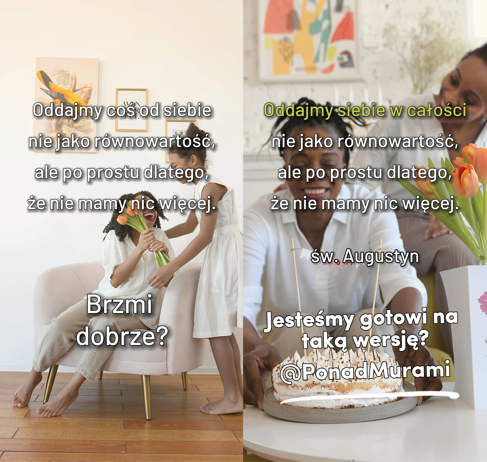
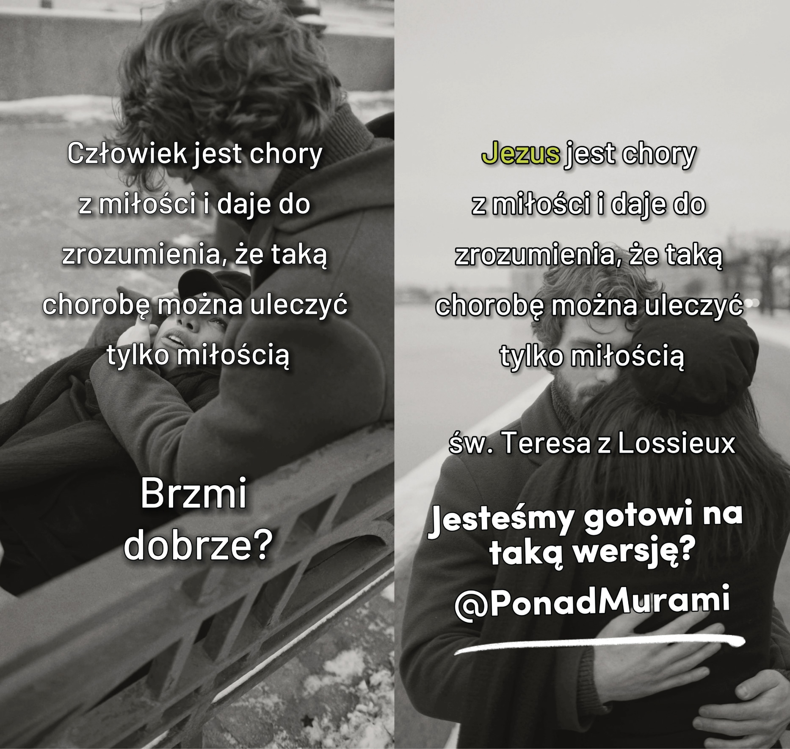

Reunión 3 - Experimentando
**************************

.. tags:: contenido|apertura|Apertura, contenido|responsabilidad|Responsabilidad, contenido|iglesia|Iglesia, contenido|eucaristia|Eucaristía, contenido|tradiciones-judias|Tradiciones judías, metodo|trabajo-con-imagen|Trabajo con imagen, metodo|trabajo-en-grupos|Trabajo en grupos, tipo|taller|Taller

Introducción para el animador
=============================

Esta es la última reunión grupal justo antes del Séder. Su objetivo es prepararnos lo mejor posible para vivirlo en unión con la Eucaristía. No queremos transmitir una reflexión intelectual sobre el significado de los gestos y palabras, sino que nos concentramos en la participación y la experiencia. El Séder y, por consiguiente, la Eucaristía, son experiencias que involucran nuestro tiempo, nuestro cuerpo, nuestros sentidos, nuestro corazón. Hay personas que, mientras desayunan, leen el periódico, responden mensajes y salen a la habitación de al lado para tender la ropa; es posible comer así. Sin embargo, no es así como se consume el Séder y la Eucaristía. Sentarse a la mesa puede ser algo envolvente, hace que todo el mundo se reduzca a este espacio aquí y ahora, el tiempo fluye de manera diferente: ¡de eso se trata! La reunión incluye hasta tres dinámicas. Esto es para practicar, experimentar más que aprender. Practiquemos, toquemos, saboreemos. No de mentira, no en forma de talleres sintéticos, sino realmente. Estas dinámicas son el contenido, y no un interludio para mantener la concentración.

Responsabilidad
===============

Acabamos de vivir el Effatá. Comencemos compartiendo nuestras reflexiones sobre este tema:

* ¿Cómo viví el servicio de Effatá? ¿Qué es para mí la apertura sobrenatural?

Somos testigos de cambios importantes en nuestra Iglesia. El Papa Francisco convocó un sínodo bajo el lema "Por una Iglesia sinodal: comunión, participación y misión". El Papa trata de transmitirnos algo importante sobre nuestra comprensión de nuestro papel en la comunidad. Lo que cuenta parece encontrar a veces resistencia y cerrazón por parte de los creyentes. Intentemos, pues, con una apertura que viene de lo alto, leer cómo el Papa nos invitaba a este camino:

    Nosotros, los pastores, caminamos con el pueblo, a veces delante, a veces en medio, a veces detrás. El buen pastor tiene que moverse así: delante para guiar, en medio para animar y no olvidar el olor del rebaño, atrás porque el pueblo tiene también "buen olfato".

    -- Papa Francisco, 18 de septiembre de 2021

* ¿Qué significa en la práctica para mí esta visión de la comunidad?
* ¿Cómo me siento con tal visión de la Iglesia?

Valor para las cosas importantes
================================

Es bueno ser guiado cuando se confía en quien guía. Sin embargo, descubrimos que esa no es nuestra única vocación. Effatá "no es para" estar más abiertos a escuchar órdenes. ¡Somos nosotros quienes asumimos la responsabilidad de elegir la dirección (sinodalidad)!

Al invitar al retiro, publicamos materiales preparados sobre la base de la comparación de dos textos: la versión modificada por nosotros y el texto original. Queríamos captar de esta manera la concentración en el cambio que puede ocurrir con la debida apertura de corazón. Volvamos a algunos de estos ejemplos.

.. note:: El animador saca las cartas y las extiende sobre la mesa.

.. |d2| image:: porownania-02.jpg
   :scale: 50%

.. |d6| image:: porownania-06.jpg
   :scale: 50%

.. |d8| image:: porownania-08.jpg
   :scale: 50%

+------+------+
| |d1| | |d2| |
+------+------+
| |d3| | |d4| |
+------+------+

+------+------+
| |d5| | |d6| |
+------+------+
| |d7| | |d8| |
+------+------+

* Si tuvieras que elegir una carta que muestre un cambio que es importante para ti, ¿cuál elegirías?

* ¿Por qué es importante para ti?

Podríamos haber sacado 100 cartas en lugar de unas pocas o elegir 10 cartas en lugar de una. No lo hicimos. ¿Hay alguna justificación para ello?

¿Qué sucede a veces cuando aumentamos las posibilidades de elección a 100?
¿Qué puede pasar cuando elegimos 10 cartas?

No se trata de que no queramos ocuparnos de 10 cosas. Se trata de que queremos ocuparnos de una con seguridad antes de ocuparnos de la décima. Se necesita valor para decidir qué es importante y aceptar que será una lista corta. De lo contrario, se producirá una **inflación de importancia**: cuando todo es importante, nada lo es. También existe el riesgo en la otra dirección, la **apatía**: no sé si he leído todas las cartas de un millón, así que hasta que no lea todas, no me decidiré por ninguna. Intentemos ayudarnos mutuamente en esta reunión a buscar un camino sabio.

Leamos:

    El pueblo santo de Dios participa también de la función profética de Cristo, difundiendo su testimonio vivo sobre todo con la vida de fe y caridad y ofreciendo a Dios el sacrificio de alabanza, que es fruto de los labios que confiesan su nombre.

    -- Lumen Gentium 12

* ¿De qué manera participo en algo que es importante para mí en la esfera espiritual?
* ¿De qué asumo la responsabilidad?

Bajo la superficie
==================

La elección por parte de cada uno de nosotros de aquello de lo que se hace responsable y de lo que es importante para él es clave para estar listos para sumergirse y tocar algo que está más profundo. Nos preparamos hoy todo el día para esto.

Hagamos otro ejercicio, y dejemos que nos introduzca a él el Arzobispo Fulton Sheen:

    Nuestro Señor tenía un sentido del humor divino, porque reveló que todo el universo es sacramental. Un sacramento, en el sentido amplio de la palabra, combina en sí dos elementos: uno visible, otro invisible; uno que se puede ver o escuchar, que se puede probar o tocar; y el segundo, invisible para los ojos. Sin embargo, hay entre estos elementos una cierta conexión o un espacio de significado común que los une. La palabra hablada es una especie de sacramento, porque hay en ella tanto algo material, que se puede captar con el oído, como algo espiritual, es decir, el significado de la palabra. Un caballo oye un chiste contado igual que un hombre. Incluso se puede asumir que oye mejor las palabras pronunciadas. La diferencia radica en que cuando un hombre oye un chiste, la mayoría de las veces se ríe, y cuando un caballo lo oye, no estalla en una risa equina. Esto se debe a que el caballo solo oye la parte material del "sacramento", es decir, el sonido, mientras que el hombre percibe también esa parte invisible o espiritual, es decir, el sentido de las palabras.

    -- Arzobispo Fulton J. Sheen "Los Sacramentos"

.. note:: El animador saca las cartas Dixit y las extiende sobre la mesa. Hay algunas más que participantes en la reunión. Luego explica las reglas de Dixit: hay que elegir mentalmente su carta e inventar para ella una asociación que no sea demasiado obvia para que todos no adivinen, pero que tampoco sea tan inusual para que nadie adivine.

Los participantes comparten la asociación y el resto intenta adivinar qué carta es.

* ¿De qué manera dar esta asociación se conecta con la introducción del Arzobispo Sheen y nuestro tema?
* ¿Qué sería en la vida de la comunidad dar una asociación demasiado simple?
* ¿Qué sería en la vida de la comunidad dar una asociación que nadie adivinará?

Dar una asociación demasiado obvia es muy probablemente perderse la profundidad, decir algo superficial. Dar una asociación que nadie adivinará no construye la comunidad como podría. Como comunidad de creyentes, estamos constantemente "extendidos" entre estos dos puntos tratando de buscar nuestro crecimiento común.

* ¿En qué lugares siento que toco algo importante y profundo? ¿Cuándo descubrí ese lugar?

Romper barreras
===============

¡Un hermoso plan se dibuja ante nosotros en la reunión: debemos estar abiertos a una nueva mirada, escuchando al Papa que nos anima a participar, eligiendo lo que es importante y profundo para nosotros! ¿Por qué, mirando por la ventana, parece que pocos de nosotros vivimos de esta manera?

Leamos:

    Como buenos administradores de la multiforme gracia de Dios, poneos al servicio los unos de los otros, cada uno según el don que ha recibido. Si alguno habla, que sean palabras como de Dios; si alguno presta un servicio, hágalo en virtud del poder que Dios concede, para que en todo sea Dios glorificado por medio de Jesucristo. ¡A él la gloria y el poder por los siglos de los siglos! Amén.

    -- 1 Pe 4,10-11

* ¿A quién habla San Pedro?
* ¿A qué te anima este fragmento?

Estamos llamados a salir a las profundidades y a convertirnos valientemente en una escalera para nuestro propio crecimiento. La fe exige maximalismo, la decisión de hacerla algo importante (realmente importante). Es una cuestión de romper barreras (o, si se prefiere, de conversión).

Leamos:

    "Jesús no quiere nada de nosotros. Él nos quiere a nosotros"

    -- P. Franciszek Blachnicki

Este es un buen resumen del cambio que la Iglesia (y Jesús) espera.

Esto puede suceder a través de un milagro. Por lo general, no sucede de esa manera, pero no hay nada de malo en ello: se puede hacer de otra manera. Salir a las profundidades y concentrarse en lo que es importante se puede practicar. Diariamente, consistentemente.

* ¿Qué me ayudaría, qué podrían hacer los otros, para no caer en la superficialidad?
* ¿Qué podemos hacer para darnos mutuamente fuerza de sustentación en la Iglesia?

Experimentando
==============

El objetivo de nuestro retiro es vivir la Eucaristía. Una "ordinaria". Es el punto culminante de nuestra reunión. Sin embargo, queremos hacerlo con la mayor apertura y conciencia posible, para que sea una experiencia real para nosotros, para descender bajo la superficie un centímetro más que hasta ahora.

    ¿Quién celebra la Santa Misa, quién celebra la Eucaristía? La respuesta parece simple: ¡el sacerdote! En nuestras iglesias vemos al sacerdote de pie junto al altar. Muchas veces alguien nos pregunta: ¿qué sacerdote celebró hoy? – y respondemos dando su nombre o apellido. Sin embargo, buscando la respuesta a la pregunta planteada, hay que referirse a la reflexión teológica sobre la liturgia. El Catecismo de la Iglesia Católica dice que la liturgia es celebrada por toda la comunidad, el Cuerpo de Cristo unido a su Cabeza, es decir, Cristo. Esto se refiere también a la Eucaristía. La celebración de la Eucaristía es también un acto de Cristo y de la Iglesia, la celebra toda la comunidad.

    -- P. Jan Miazek

* ¿En qué medida este pensamiento sobre la Eucaristía ha entrado también en mi corazón y mi mente?

Recordemos las cuatro formas de la presencia de Dios en la Eucaristía:

    | Para realizar una obra tan grande, Cristo está siempre presente en su Iglesia, sobre todo en la acción litúrgica. Está presente en el sacrificio de la Misa, sea en la persona del ministro, "ofreciéndose ahora por ministerio de los sacerdotes el mismo que entonces se ofreció en la cruz", sea sobre todo bajo las especies eucarísticas. Está presente con su fuerza en los Sacramentos, de modo que, cuando alguien bautiza, es Cristo quien bautiza. Está presente en su palabra, pues cuando se lee en la Iglesia la Sagrada Escritura, es Él quien habla. Está presente, por último, cuando la Iglesia suplica y canta salmos, el mismo que prometió: "Donde están dos o tres congregados en mi nombre, allí estoy Yo en medio de ellos" (Mt 18, 20).
    | Realmente, en esta obra tan grande por la que Dios es perfectamente glorificado y los hombres santificados, Cristo asocia siempre consigo a su amadísima Esposa la Iglesia, que invoca a su Señor y por Él tributa culto al Padre Eterno.
    | Con razón, pues, se considera la Liturgia como el ejercicio del sacerdocio de Jesucristo. En ella los signos sensibles significan y, cada uno a su manera, realizan la santificación del hombre, y así el Cuerpo Místico de Jesucristo, es decir, la Cabeza y sus miembros, ejerce el culto público íntegro.
    | En consecuencia, toda celebración litúrgica, por ser obra de Cristo sacerdote y de su Cuerpo, que es la Iglesia, es acción sagrada por excelencia, cuya eficacia, con el mismo título y en el mismo grado, no la iguala ninguna otra acción de la Iglesia.

    -- Constitución sobre la Sagrada Liturgia, pto. 7

* ¿En qué cuatro espacios está Presente Cristo durante la Eucaristía?
* ¿En cuáles de estos espacios toco con menos frecuencia de manera natural algo espiritual?
* ¿En cuáles de estos espacios toco con más frecuencia de manera natural algo espiritual?

Sensualidad
===========

Los cuatro espacios en los que encontramos realmente presente a Cristo son algo más que sistematizar el conocimiento. Es una indicación para nosotros de no "fijarnos" en un solo espacio. En cada uno de ellos está Presente Jesús, todo en Plenitud, sin embargo, la capacidad de experimentarlo en cada uno de los espacios simultáneamente abre ante nosotros nuevas conexiones posibles que se enriquecen mutuamente.

Hagamos ahora un ejercicio relacionado con esto.

.. note:: El animador saca bolsas con un objeto y entrega una a cada uno. Los participantes, sin mirar, meten la mano en ellas e intentan reconocer qué es mediante el tacto.

* ¿Qué hay en la bolsa?

.. note:: El animador pide a los participantes que cierren los ojos. Saca un aceite y libera su aroma en el aire.

* ¿Qué olor es ese?

.. note:: El animador pone un sonido desde el teléfono.

* ¿De qué es ese sonido?

.. note:: El animador pide cerrar los ojos y reparte a cada uno un pequeño caramelo.

* ¿Qué sabor es ese?

Imaginemos que nunca hemos bebido té. Alguien nos lo vierte en una taza, vemos el color del líquido vertiéndose en el recipiente. La vista nos dice algo sobre el té. Lo tomamos en las manos y lo acercamos a nosotros sintiendo su aroma; tal vez ya podamos reconocer de qué está hecho. Cuando lo llevamos a la boca, la experiencia se profundiza.

La espiritualidad es sensual. La fe es sensual. Y literalmente: afecta a todos los sentidos, y figurativamente: es multidimensional y las respuestas están en la intersección de cada una de las dimensiones.

* ¿Qué importancia tiene para la espiritualidad el sentido del tacto?
* ¿Qué importancia tiene para la espiritualidad el sentido del olfato?
* ¿Qué importancia tiene para la espiritualidad el sentido del oído?
* ¿Qué importancia tiene para la espiritualidad el sentido del gusto?

Ayudémonos hoy a vivir la Eucaristía de tal manera que no la haga "alguien más para nosotros". La Eucaristía nos invita a nosotros enteros. Se verá en el Séder, que es su prototipo. La Eucaristía tiene el sabor del vino, el sonido de la matzá al romperse, la apariencia de la luz parpadeante de la vela en las vestiduras del celebrante, el olor del incienso, el tacto de la mano cálida del signo de la paz del hermano y la hermana y el ardor de la Palabra leída. ¡Qué sensual es todo esto en el mejor sentido de la palabra, qué cercano! Dios hizo todo lo que pudo para que pudiéramos "entrar enteros sin reservas" en Su Misterio.

    El hombre que quiere comprenderse a sí mismo hasta el fondo —no según criterios y medidas de su propio ser inmediatos, parciales, a veces superficiales e incluso aparentes— debe, con su inquietud, incertidumbre e incluso con su debilidad y pecaminosidad, con su vida y con su muerte, acercarse a Cristo. Debe, por así decirlo, entrar en Él con todo su ser, debe "apropiarse" y asimilar toda la realidad de la Encarnación y de la Redención para encontrarse a sí mismo.

    -- Encíclica Redemptor Hominis, Juan Pablo II

* ¿En qué gestos/signos de la Eucaristía es para mí más "natural" que tengo participación?
* ¿Qué es para mí la inmersión en la muerte y resurrección de Cristo?

Mundos conectados
=================

Leamos:

    No penséis que he venido a abolir la Ley y los Profetas. No he venido a abolir, sino a dar cumplimiento.

    -- Mt 5,17

* ¿Por qué los contemporáneos de Jesús podían pensar que quería abolir algo?
* ¿Nos resulta cercana la tentación de querer ver las cosas sin conexión con lo que fue?

Nuestra fe no cayó del cielo. La Eucaristía no fue revelada en una tabla de piedra. Jesús no inventó la matzá y el vino. Dios entra en el mundo y crea en él nuevas conexiones. Dios solo crea, no destruye nada, esa es para muchos de nosotros su "identidad" básica: es Creador. Queremos vivir juntos hoy el Séder para crear una nueva conexión: en los corazones, el alma y la mente.

* ¿Quién de nosotros ha participado ya en un Séder?
* ¿Con qué esperanza vamos a él?
* ¿Qué nos gustaría que se conectara?

Cenaremos. Verteremos vino y romperemos el pan. Hablaremos y bromearemos. Será simple, pero no simplón. Será ordinario, pero hermosamente ordinario. Es todo el tiempo una y la misma historia de Dios con respecto a nosotros: un soplo ligero, no truenos; un establo, no palacios; un simple pescador, no un erudito; el mandamiento del amor más que 500 reglas.

Jesús nos mostró que cenar con alguien cambia el mundo. Cenemos juntos para elevarnos mutuamente y escribamos nuestra parte en esta historia del Altísimo.

Oración
=======

Comencemos la oración con:

    | ¡Ved qué dulzura, qué delicia,
    | convivir los hermanos unidos!
    | Es como ungüento precioso en la cabeza,
    | que baja por la barba,
    | <que baja por la barba de Aarón,
    | hasta la franja de su ornamento.>
    | Es como rocío del Hermón, que baja
    | sobre el monte Sión.
    | Porque allí manda el Señor
    | la bendición, la vida para siempre.

    -- Sal 133

Que las palabras del Salmo inspiren nuestra oración de intercesión.
