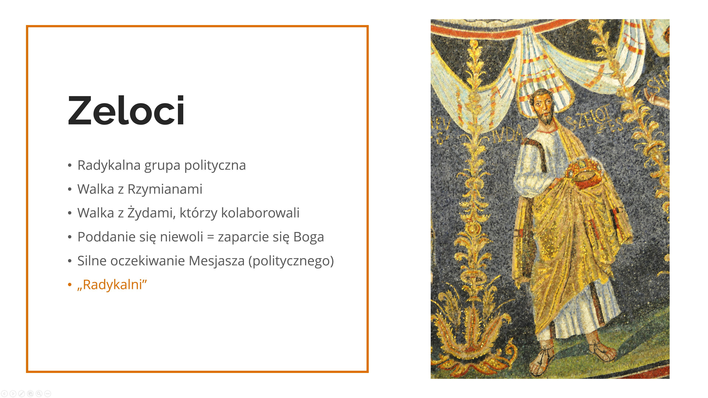

Encuentro 1. - Tal como fui conocido
*************************************

.. tags:: contenido|apertura|Apertura, contenido|iglesia|Iglesia, contenido|comunidad|Comunidad, contenido|relaciones|Relaciones, metodo|trabajo-con-imagen|Trabajo con imagen, metodo|trabajo-en-grupos|Trabajo en grupos, tipo|de-integracion|De integración

Introducción para el animador
==============================

El primer encuentro grupal cumple una función de presentación e integración, es un vínculo entre los demás puntos del viernes: profundiza los contenidos de la conferencia y prepara para la oración vespertina. Su objetivo más importante es confrontar a los participantes con lo que significa la apertura en la práctica y compartir qué desafíos conlleva este enfoque.

**¡Al final de este esquema se encuentran materiales para imprimir que serán necesarios durante el encuentro!**

Introducción
============

Comenzamos con una oración - la forma según el criterio del animador, con especial énfasis en la petición de apertura mutua. Si es necesario (participantes que no tienen experiencia de encuentros de compartir en grupos pequeños) el animador presenta brevemente la idea de los encuentros grupales y explica las reglas. Comenzamos compartiendo lo que nació en nosotros durante la escucha de la conferencia, comenzamos inmediatamente sumergiéndonos y viviendo el contenido del retiro. La apertura está relacionada con el desvelamiento y la disposición a ser herido - en el espacio del grupo pequeño es precisamente esto lo que ocurre, aún no nos conocemos, no sabemos nada unos de otros, pero queremos despertar en nosotros la apertura mutua. Al responder a las siguientes preguntas pedimos que la persona se presente, si alguien no quiere responder, que solo se presente.

* ¿Qué contenidos de la conferencia resuenan más con lo que está sucediendo últimamente en mi vida?
* ¿Qué perspectiva sobre cómo vivir este retiro me trazó lo que escuché?
* ¿Tengo en el corazón un deseo particular sobre este retiro?

Fe abierta
==========

Maciej Biskup OP en una de sus entradas explicó la etimología de la palabra "Iglesia":

    La Iglesia sin corazón es una Iglesia-fortaleza, un castillo fortificado. Literalmente esto es lo que significa en polaco la palabra "kościół", que adoptamos del checo (kostel), y el checo del latín castellum (fortaleza). Mientras tanto, del griego (ekklesia) la Iglesia significa la convocación del pueblo, que no se encierra en la fortaleza, sino que sale al mundo con el corazón abierto, para seguir convocando, como fue convocado.

    -- "La Iglesia que tiene corazón" del 24.06.2022

* ¿Cuál es mi experiencia de la Iglesia?
* ¿Qué imagen me es más cercana - la Iglesia fortaleza o la Iglesia que es convocación del pueblo que sale al mundo?

Cuando la Iglesia fue enviada por Cristo a todos los rincones del mundo, para convocar a todos a su Nombre (Mc 16,15), comenzó a encontrarse con nuevas costumbres, nuevas culturas, nuevas corrientes de pensamiento, que iban más allá del mundo interior del judaísmo de entonces, en el que nació el cristianismo. Cada encuentro era una posibilidad de encontrar puntos en común, para mostrar de la manera más simple la universalidad de Jesús ante todos (Discurso de Pablo en el Areópago - Hch 17,16-34). El ambiente se empapaba de la enseñanza de los Apóstoles, mientras que los nuevos creyentes unían en sí mismos su herencia junto con el legado de la Buena Nueva. Vemos en nuestros tiempos que la inculturación, es decir, la entrada del Evangelio en la vida de diferentes pueblos deja buenos frutos, pero requiere un trabajo intenso en "unir mundos". Como ejemplo podemos mencionar diferentes Iglesias que crearon sus propias costumbres a lo largo de los siglos:

Japón
    Los cristianos ocultos (Kakure-kirishitan) durante dos siglos de persecuciones (siglos XVII-XVIII), para mantener la tradición de vivir la Eucaristía, a pesar de la falta de presbíteros, usaban arroz y sake para celebrar la Acción de Gracias en liturgias organizadas conjuntamente. Actualmente los sacerdotes en lugar de besar el altar, se inclinan ante él como expresión del más alto respeto.

Egipto
    Los cristianos desde los primeros siglos usan el símbolo ankh como signo de vida, resurrección. Actualmente aparece en las estolas de los presbíteros y en las manos de cristianos tatuados.

Viendo la belleza de diferentes Iglesias, podemos hacernos la pregunta: ¿dónde estaba el germen de esta riqueza? Uno de los primeros protagonistas de ganar personas para Cristo fue san Pablo, llamado Apóstol de las Naciones. Navegó a todas partes y a todos, para ganar a muchos para el Evangelio. Él mismo admite que para ganar personas "se hizo todo para todos" (1 Co 9, 20-22). Para ser uno con el otro, conscientemente tomaba la decisión de adaptarse al otro, para que tuviera sensación de cercanía y del vínculo que se estaba creando.

* ¿Con qué frecuencia trato de ponerme "en los zapatos de alguien" y escuchar a la otra parte? ¿Qué es lo más difícil para mí en esto?
* ¿Has escuchado en tu vida que sabes escuchar o "has escuchado a alguien"?
* ¿Cuándo fue la última vez que te quedaste con alguien más tiempo en la parada del autobús a pesar de que no conoces tan bien a esa persona? ¿Cuándo hiciste 2000 pasos por alguien en lugar de 1000? (Mt 5,41)?

Jesús como Aquel que está abierto
==================================

Como vemos, la Iglesia desde el principio fue más diversa de lo que nos puede parecer. Diferentes movimientos, comunidades, carismas siguen penetrándose en ella y complementándose. Sin embargo, esto no es una característica solo de la Iglesia contemporánea, porque de manera similar sucedía ya con el judaísmo en el tiempo en que el Señor Jesús enseñaba. Observemos ahora brevemente los diferentes partidos judíos que existían entonces.

.. note:: El animador saca las láminas al centro, para que cada participante del encuentro las vea.

.. image:: faryzeusze.jpg
   :align: center

.. image:: essenczycy.jpg
   :align: center

Después de leer cada una de las descripciones el animador hace preguntas:

* ¿Qué reflexiones nacieron en mí después de leer las descripciones de los diferentes partidos?

* ¿Qué tomó el cristianismo de cada uno de ellos?

Los primeros cristianos, al igual que los saduceos, celebraban ellos mismos la Eucaristía, creían en la inmortalidad como los fariseos, creaban comunidades y mística siguiendo el modelo de los esenios, y reconocían la esencia de la libertad personal como los zelotes. La apertura y el tomar de otros están inscritos en nuestra fe por el mismo Jesucristo. Se supone que algunos apóstoles eran representantes de los diferentes partidos - el Evangelio nos da por ejemplo información sobre Simón, que tenía el apodo "celoso" - en griego zelotes, lo que puede indicar pertenencia a los zelotes, de manera similar Judas suele ser incluido en este grupo. Juan Bautista debido a su forma de vida eremítica por algunas fuentes es considerado esenio, igualmente sus discípulos, que más tarde siguieron a Jesús. También sabemos que Nicodemo era fariseo.

* ¿Qué semejanzas veo entre los partidos de entonces y la Iglesia de hoy?

¡El Mesías quería tener en su círculo más cercano representantes de diferentes puntos de vista! Su apertura hacia los demás se manifestaba también durante muchos encuentros descritos en las páginas del Evangelio.

Leamos ahora algunos fragmentos de ejemplo.

.. note:: Los participantes del encuentro se agrupan en parejas, cada pareja recibe uno de los siguientes fragmentos y se familiariza con él en silencio.

Primer fragmento:

    | Cuando Jesús se enteró de que había llegado a los fariseos la noticia de que congregaba más discípulos y bautizaba con más frecuencia que Juan – aunque no era Él mismo quien bautizaba, sino sus discípulos – dejó Judea y se fue de nuevo a Galilea. Tenía que pasar por Samaría. Y llegó a una ciudad samaritana llamada Sicar, cerca de la heredad que Jacob había dado a su hijo José. Allí estaba el pozo de Jacob. Jesús, cansado del camino, se sentó junto al pozo. Era alrededor de la hora sexta.
    | Llegó entonces una mujer samaritana a sacar agua. Jesús le dijo: «Dame de beber». Sus discípulos habían ido a la ciudad a comprar alimentos. La mujer le respondió: «¿Cómo tú, siendo judío, me pides de beber a mí, que soy samaritana?». Porque los judíos no se tratan con los samaritanos. Jesús le respondió: «Si conocieras el don de Dios y quién es el que te dice: "Dame de beber", tú le pedirías a él, y él te daría agua viva». La mujer le dijo: «Señor, no tienes con qué sacarla, y el pozo es hondo. ¿De dónde, pues, tienes esa agua viva? ¿Acaso eres tú mayor que nuestro padre Jacob, que nos dio este pozo, del cual bebieron él, sus hijos y sus ganados?». Jesús le respondió: «Todo el que beba de esta agua volverá a tener sed; pero el que beba del agua que yo le daré, no tendrá sed jamás; el agua que yo le daré se convertirá en él en un manantial que brota para vida eterna». La mujer le dijo: «Señor, dame esa agua, para que no tenga sed ni venga aquí a sacarla». Jesús le dijo: «Ve, llama a tu marido y ven aquí». La mujer respondió: «No tengo marido». Jesús le dijo: «Bien has dicho: "No tengo marido"; porque has tenido cinco maridos, y el que ahora tienes no es tu marido. En eso has dicho la verdad». La mujer le dijo: «Señor, veo que eres profeta. Nuestros padres adoraron en este monte, y vosotros decís que en Jerusalén es el lugar donde se debe adorar». Jesús le dijo: «Créeme, mujer, que llega la hora en que ni en este monte ni en Jerusalén adoraréis al Padre. Vosotros adoráis lo que no conocéis; nosotros adoramos lo que conocemos, porque la salvación viene de los judíos. Pero llega la hora, y ya es, en que los verdaderos adoradores adorarán al Padre en espíritu y en verdad; porque también el Padre busca a los que le adoran así. Dios es espíritu, y los que le adoran deben adorarle en espíritu y en verdad». La mujer le dijo: «Sé que ha de venir el Mesías, el llamado Cristo; cuando Él venga, nos declarará todas las cosas». Jesús le dijo: «Yo soy, el que habla contigo».

    -- Jn 4,1-26

Segundo fragmento:

    Entró en Jericó y atravesaba la ciudad. Había un hombre llamado Zaqueo, jefe de publicanos y rico, que trataba de ver quién era Jesús, pero no podía a causa de la multitud, porque era pequeño de estatura. Corriendo delante, subió a un sicómoro para verle, porque había de pasar por allí. Cuando Jesús llegó a aquel lugar, mirando hacia arriba, le dijo: «Zaqueo, baja pronto, porque hoy tengo que quedarme en tu casa». Él bajó enseguida y le recibió con alegría. Al ver esto, todos murmuraban diciendo: «Ha entrado a hospedarse en casa de un hombre pecador». Zaqueo, de pie, dijo al Señor: «Señor, voy a dar a los pobres la mitad de mis bienes, y si en algo he defraudado a alguien, le devolveré cuatro veces más». Jesús le dijo: «Hoy ha llegado la salvación a esta casa, porque también éste es hijo de Abraham. Porque el Hijo del Hombre ha venido a buscar y a salvar lo que estaba perdido».

    -- Lc 19,1-10

Tercer fragmento:

    Jesús salió de allí y se retiró a la región de Tiro y de Sidón. Y he aquí que una mujer cananea, que había salido de aquella región, comenzó a gritar diciendo: «Ten compasión de mí, Señor, Hijo de David; mi hija está terriblemente atormentada por un demonio». Pero Él no le respondió palabra. Entonces se acercaron sus discípulos y le rogaban diciendo: «Despídela, porque viene gritando detrás de nosotros». Pero Él respondió y dijo: «No he sido enviado sino a las ovejas perdidas de la casa de Israel». Pero ella vino y se postró ante Él diciendo: «¡Señor, socórreme!». Él respondió y dijo: «No está bien tomar el pan de los hijos y echarlo a los perrillos». Pero ella dijo: «Sí, Señor; pero también los perrillos comen de las migajas que caen de la mesa de sus amos». Entonces Jesús le dijo: «¡Oh mujer, grande es tu fe! Que te sea hecho como deseas». Y su hija quedó sana desde aquella hora.

    -- Mt 15,21-28

Después de leer en silencio cada pareja cuenta brevemente de qué trataba su fragmento. Luego el animador hace preguntas:

* ¿Qué une todos estos encuentros?
* ¿En qué se manifestaba la apertura de Jesús hacia estas personas?

En el contacto con otros el origen, la profesión o el género no tenían para Jesús ningún significado. Ante todo veía al ser humano, no a lo que se dedica - sin importar si alguien era pescador, publicano, centurión. Cada uno tenía en sí potencial, cada uno era para Él de alguna manera interesante, de cada uno estaba intrigado.

Apertura y curiosidad
=====================

La curiosidad está inseparablemente ligada a la apertura. Dios no solo está fascinado por cada uno de nosotros, Él mismo es Aquel que intriga - se manifiesta en la zarza ardiente, columna de fuego o nube, Jesús con su persona despierta interés y asombro.

* ¿Qué es lo que más me intriga personalmente de Dios?
* ¿Cuánta curiosidad tengo aún sobre cómo es Él?
* ¿Cuál es mi experiencia del misterio que atrae?

A veces aceptamos en nuestra fe que algo ya es tan obvio, tan escuchado, que deja de nacer en nosotros la necesidad de hacer preguntas. De manera similar con la actitud hacia las personas que nos rodean, conocemos a alguien de cabo a rabo y asumimos que ya nada nos sorprenderá, o de antemano reconocemos qué podemos esperar de alguien. La clave de la apertura es la curiosidad por la otra persona y por lo que puede aportar a nuestra vida.

* ¿Qué me ayuda a estar abierto?
* ¿Con qué frecuencia muestro a otros mi interés?
* ¿Qué es lo que más me fascina de otras personas?

Leamos al final:

    Este fragmento proviene del final del Himno del amor de san Pablo - en este momento no somos capaces ni de amar perfectamente, ni de conocer o entender completamente al otro ser humano. Sin embargo, esto no significa que no debamos esforzarnos. En un momento iremos a la oración vespertina - no asumamos de inmediato qué queremos que suceda en ella, en la medida de lo posible tratemos de deshacernos de las expectativas y simplemente tener en nosotros la apertura a lo que Dios quiere transmitirnos. Detengámonos y despertemos en nosotros la curiosidad dirigida tanto hacia Aquel ante Quien estaremos, como hacia las personas con las que oraremos. Dejémonos sorprender.

    -- 1 Co 13,12
