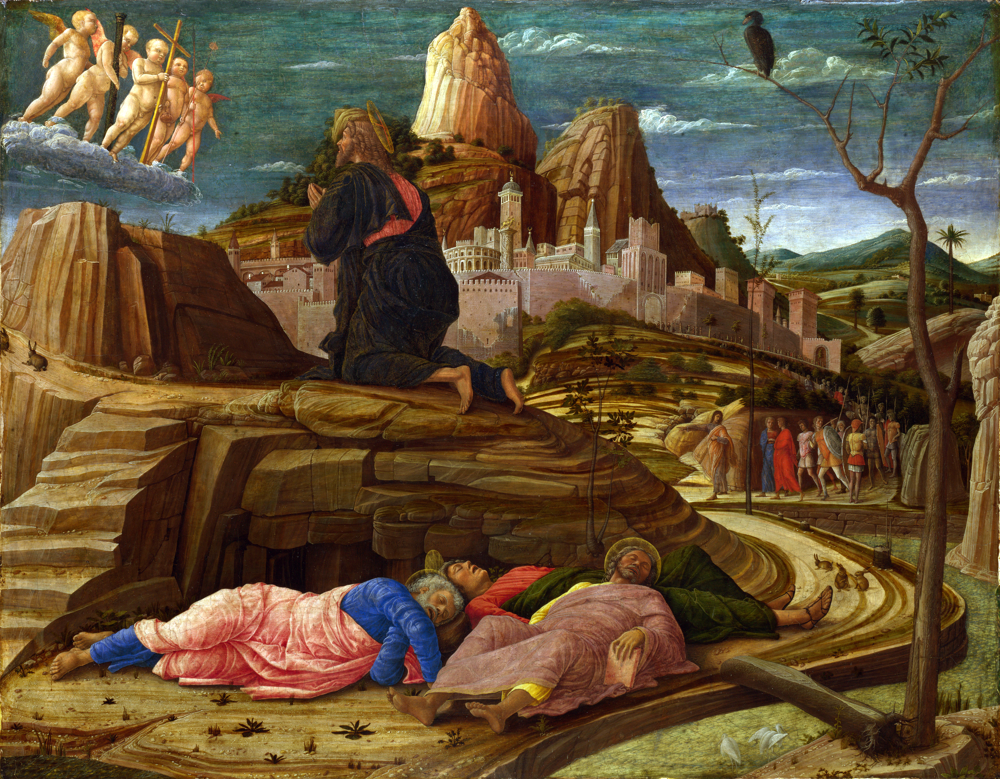

Rencontre 3. - "Je veux, mais je ne peux pas"
********************************************

.. tags:: contenu|priere|Prière, contenu|verite|Vérité, contenu|maturite|Maturité, contenu|croix|Croix, methode|travail-sur-texte|Travail sur texte, methode|travail-sur-image|Travail sur image, type|biblique|Biblique

Credo
=====

Nous avons médité aujourd'hui le Credo. Un texte fondamental pour notre foi, mais en même temps peut-être traité par nous comme "évident", car comment justifier autrement que nous ne rencontrons pas couramment l'explication de sa signification pendant la formation ?

- Quelles questions le Credo me pose-t-il ?
- Qu'ai-je découvert aujourd'hui pendant la méditation ?

Après l'expérience de la Dernière Cène, qu'on pourrait dire être un lieu d'"apprentissage", nous passons avec Saint Pierre au Jardin des Oliviers et à la maison du grand prêtre. C'est un lieu de "pratique" où Saint Pierre se confronte à l'application de la Parole entendue dans la vie.

Annonce - Il sait
=================

Lisons :

    Simon, Simon, voici que Satan vous a réclamés pour vous passer au crible comme le blé. Mais j’ai prié pour toi, afin que ta foi ne défaille pas. Toi donc, quand tu seras revenu, affermis tes frères. » Pierre lui dit : « Seigneur, avec toi, je suis prêt à aller en prison et à la mort. » Jésus reprit : « Je te le déclare, Pierre : le coq ne chantera pas aujourd’hui avant que tu n’aies nié trois fois me connaître. »

    -- Lc 22, 31-34

Le temps d'incarner la lumière dans la vie par Saint Pierre commence par l'expérience de la sincérité désarmante de Jésus envers nous. Jésus sait que l'amour nous dépasse et qu'il nous dépassera. Dieu sait que nous le renierons, et en même temps il nous donne la tâche d'affermir la foi de nos frères.

- Quels éléments de la vie spirituelle ce fragment peut-il purifier d'une compréhension erronée ?
- Dans quelle mesure, dans les questions de foi, ai-je en moi le consentement à "ne pas être à la hauteur" de l'amour ?

Jardin
======

.. note:: Pendant ce point de la rencontre, ayons sous les yeux l'image de la conférence.

.. image:: Andrea_Mantegna2.jpg
   :align: center

Lisons :

    Ils parviennent à un domaine du nom de Gethsémani. Jésus dit à ses disciples : « Asseyez-vous ici pendant que je vais prier. » Il emmène avec lui Pierre, Jacques et Jean, et commence à ressentir effroi et angoisse. Il leur dit : « Mon âme est triste à mourir. Restez ici et veillez. » Allant un peu plus loin, il tombait à terre et priait pour que, si c’était possible, cette heure passât loin de lui. Il disait : « Abba… Père, tout est possible pour toi. Éloigne de moi cette coupe. Cependant, non pas ce que je veux, mais ce que tu veux ! » Puis il revient et trouve les disciples endormis. Il dit à Pierre : « Simon, tu dors ! Tu n’as pas eu la force de veiller une seule heure ? Veillez et priez, pour ne pas entrer en tentation ; l’esprit est ardent, mais la chair est faible. » De nouveau, il s’éloigna et pria, en répétant les mêmes paroles. Et de nouveau, il vint près des disciples et les trouva endormis, car leurs yeux étaient alourdis de sommeil. Et ils ne savaient que lui répondre. Une troisième fois, il vient et leur dit : « Désormais, vous pouvez dormir et vous reposer. C’est fini ! L’heure est venue : voici que le Fils de l’homme est livré aux mains des pécheurs. Levez-vous ! Allons ! Voici qu’il est proche, celui qui me livre. »

    -- Mc 14, 32-42

- Qu'est-ce qui, dans cette image, résonne le plus actuellement avec ma vie ?

Très souvent, le fragment ci-dessus est interprété dans la clé de la persévérance dans la prière. Cependant, essayons de le regarder à travers le prisme de la relation avec Jésus. Nous savons que Jésus ressentait une énorme angoisse au Jardin. Cela signifie que les disciples n'ont absolument pas "senti" la tension de Jésus, avec qui ils ont pourtant partagé la plupart des moments de leur vie et qu'ils aimaient sincèrement !

- À quelle fréquence est-ce que je me sens "seul parmi les proches" ?

Épée
====

Lisons :

    Judas arrive donc, avec la cohorte, et des gardes envoyés par les grands prêtres et les pharisiens ; ils avaient des lanternes, des torches et des armes. Alors Jésus, sachant tout ce qui allait lui arriver, s’avança et leur dit : « Qui cherchez-vous ? » Ils lui répondirent : « Jésus le Nazaréen. » Il leur dit : « C’est moi, je le suis. » Judas, qui le livrait, se tenait avec eux. Quand Jésus leur répondit : « C’est moi, je le suis », ils reculèrent, et ils tombèrent à terre. Il leur demanda de nouveau : « Qui cherchez-vous ? » Ils dirent : « Jésus le Nazaréen. » Jésus répondit : « Je vous l’ai dit : c’est moi, je le suis. Si c’est bien moi que vous cherchez, ceux-là, laissez-les partir. » Ainsi s’accomplissait la parole qu’il avait dite : « Je n’ai perdu aucun de ceux que tu m’as donnés. » Or Simon-Pierre avait une épée ; il la tira, frappa le serviteur du grand prêtre et lui coupa l’oreille droite. Le nom de ce serviteur était Malchus. Jésus dit à Pierre : « Remets ton épée dans le fourreau. La coupe que m’a donnée le Père, vais-je refuser de la boire ? »

    -- Jn 18, 3-11

Si tout à l'heure Saint Pierre a commis un "péché d'omission" par manque d'activité, maintenant il tombe dans l'autre extrême : une activité trop violente et désordonnée. Saint Pierre veut clairement remplir l'espace que créent pour lui les événements de l'histoire du salut, mais il "applique continuellement le ciseau au mauvais endroit".

- Quelles idées pour mon activité dans la vie ai-je éteintes à juste titre, parce que j'ai considéré que ce n'était pas mon chemin ?
- Qu'est-ce que j'aimerais faire maintenant dans l'Église pour que ce soit en harmonie avec moi ?
- Comment pouvons-nous nous aider à évaluer si mon choix n'est pas trop violent (épée) ni trop passif ("rester près de Jésus comme dormir") ?

Feu
===

Lisons :

    Ils se saisirent de Jésus, l’emmenèrent et le firent entrer dans la maison du grand prêtre. Pierre suivait à distance. On avait allumé un feu au milieu de la cour, et tous étaient assis autour ; Pierre était parmi eux. Une servante le vit assis près du feu ; elle le dévisagea et dit : « Celui-là aussi était avec lui. » Mais il nia : « Femme, je ne le connais pas. » Peu après, un autre dit en le voyant : « Toi aussi, tu es l’un d’entre eux. » Pierre répondit : « Mon ami, je ne le suis pas. » Environ une heure plus tard, un autre insistait avec force : « C’est sûr : celui-là était avec lui, d’ailleurs il est Galiléen. » Pierre répondit : « Mon ami, je ne sais pas de quoi tu parles. » Et à l’instant même, comme il parlait encore, un coq chanta. Le Seigneur, se retournant, posa son regard sur Pierre. Et Pierre se rappela la parole que le Seigneur lui avait dite : « Avant que le coq chante aujourd’hui, tu m’auras renié trois fois. » Il sortit et pleura amèrement.

    -- Lc 22, 54-62

- De quoi ai-je peur dans l'appartenance à la communauté des croyants ?

Saint Pierre, une fois de plus, "veut aimer, mais ne peut pas". Cette fois, il ne se trompe pas "un peu" en choisissant la mauvaise méthode, mais il nie directement tout ce en quoi il croyait. On regarde toute la scène avec peine, car on voit presque que Saint Pierre "n'a aucune chance" et que dans un instant il sera enfoncé. Tout s'effondre.

Saint Pierre est seul. Séparé du Maître, séparé des disciples. Dans la nuit. Ai-je l'attente au niveau émotionnel que "mon premier pape", même dans de telles conditions, se révèle être un héros ? Je l'ai. Cependant, il ne se produit pas de "miracle de la foi" mais il se produit la "conséquence de la situation". Dieu ne donne pas un Ange de Feu qui dissipe les ténèbres autour de Saint Pierre en lui donnant une foi surhumaine. Il y a de la logique, de la conséquence, il y a la vie.

- De quelle manière concrète pouvons-nous nous aider à ne pas nous retrouver souvent dans une situation aussi difficile que Saint Pierre ?
- De qui la foi, l'amour et la lumière entourent-je de mon soin dans ma vie ? (cela ne signifie pas que j'en assume la responsabilité !)

Remarquons l'égarement de plus en plus profond de Saint Pierre :

1. Il s'est endormi au lieu de veiller
2. Il a voulu se battre au lieu de pardonner
3. Il a voulu être croyant, et en même temps il a menti

Si, comme nous l'avons dit au début, le Cénacle était un lieu d'"apprentissage" et le Jardin des Oliviers et la maison du grand prêtre un lieu d'"examen pratique", alors Saint Pierre n'a pas réussi cet examen. Cette expérience de ne pas être à la hauteur, de briser l'image de soi-même est une expérience clé dans la foi.

Tombeau vide
============

Lisons :

    Le premier jour de la semaine, Marie Madeleine se rend au tombeau de grand matin ; c’était encore les ténèbres. Elle s’aperçoit que la pierre a été enlevée du tombeau. Elle court donc trouver Simon-Pierre et l’autre disciple, celui que Jésus aimait, et elle leur dit : « On a enlevé le Seigneur de son tombeau, et nous ne savons pas où on l’a déposé. » Pierre partit donc avec l’autre disciple pour se rendre au tombeau. Ils couraient tous les deux ensemble, mais l’autre disciple courut plus vite que Pierre et arriva le premier au tombeau. En se penchant, il s’aperçoit que les linges sont posés à plat ; cependant il n’entre pas. Simon-Pierre, qui le suivait, arrive à son tour. Il entre dans le tombeau ; il aperçoit les linges, posés à plat, ainsi que le suaire qui avait entouré la tête de Jésus, non pas posé avec les linges, mais roulé à part à sa place. C’est alors qu’entra l’autre disciple, lui qui était arrivé le premier au tombeau. Il vit, et il crut. Jusque-là, en effet, les disciples n’avaient pas compris que, selon l’Écriture, il fallait que Jésus ressuscite d’entre les morts. Ensuite, les disciples retournèrent chez eux.

    -- Jn 20, 1-10

Nous ne sommes pas croyants parce que nous avons réussi l'examen de Dieu avec mention. Le christianisme est une rencontre avec le Ressuscité.

- Qu'est-ce qui m'a surpris dernièrement dans la foi, a dépassé l'horizon de mes imaginations ?

Le tombeau vide est conflictuel, mais de telle manière qu'il oblige Saint Pierre à relier tout ce qu'il a entendu de Jésus en un tout. C'est une ouverture à la foi, qui bouleverse la façon de penser actuelle, et change ainsi le cœur.

- Quelle expérience dans ma spiritualité pourrait être l'équivalent du "tombeau vide" ?

Ce soir, nous partagerons l'expérience de la rencontre avec le Ressuscité. Par définition, nous essaierons donc de raconter quelque chose qui est difficile à saisir et qui dépasse nos imaginations.

- Pourquoi partageons-nous mutuellement la foi en Jésus-Christ ? Qu'est-ce que cela apporte ?

Application
===========

Nous ne voulons pas imposer aux participants une application de cette rencontre. **Cependant, nous avons cette fois une demande : que pendant le récit d'aujourd'hui sur la rencontre avec Jésus-Christ par chacun de nous, nous traitions ce temps comme un temps d'Annonce, et donc un temps spirituel/de prière. Cela signifie, par exemple, que pendant que nous écoutons quelqu'un qui raconte, nous sommes en même temps bienveillants envers lui et nous le confions au Très-Haut**.

L'auteur du schéma note en même temps des avantages significatifs à chercher une application réalisable dans les prochaines 48 heures.
