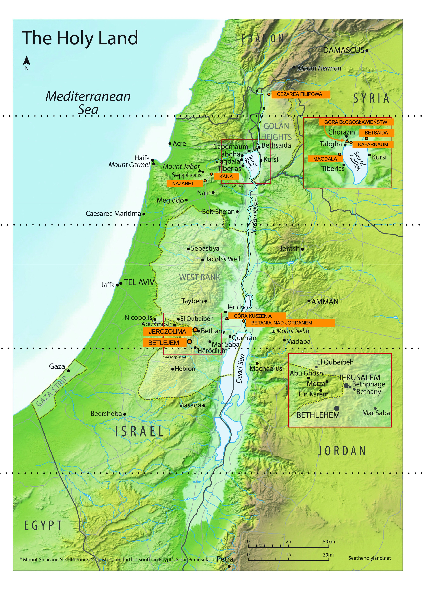

Rencontre 4. - Chavouot
***********************

.. tags:: contenu|mission|Mission, contenu|parole-de-dieu|Parole de Dieu, contenu|resurrection|Résurrection, contenu|traditions-juives|Traditions juives, methode|travail-avec-musique|Travail avec musique, methode|travail-en-groupes|Travail en groupes, methode|travail-sur-texte|Travail sur texte, type|biblique|Biblique

Introduction pour l'animateur
=============================

Cette rencontre est la dernière rencontre de groupe des retraites. Son objectif principal est de présenter l'idée de "vision spirituelle" et de montrer aux participants qu'il n'y a pas de place dans l'Église pour la division entre public et artistes, que la transmission de la foi, des réflexions, le partage de la façon dont Dieu agit en nous n'est pas réservé à un petit groupe de personnes, mais nous sommes tous appelés, comme l'écrit saint Pierre :

    Vous, au contraire, vous êtes une race élue, un sacerdoce royal, une nation sainte, un peuple acquis, afin que vous annonciez les vertus de Celui qui vous a appelés des ténèbres à son admirable lumière

    -- 1 P 2,9

De plus, c'est précisément la **proclamation** des œuvres de Dieu qui est vitale pour ceux à qui nous parlons, mais aussi pour nous-mêmes - cela implique la responsabilité et l'autonomie du chrétien. L'approfondissement de la foi, les changements de façon de penser dans le monde, la metanoia constante devraient découler de chacun de nous. C'est avec cette idée que nous voulons conclure les rencontres de groupe.

Partage
=========

Nous sommes au moment des retraites où les éléments commencent à se composer en un tout. La conférence nous a montré que les trois fêtes, malgré leurs thèmes, temps, rituels et sens distincts, peuvent être liées ensemble. Pendant la tente de rencontre, nous avons pu essayer en pratique de lier non seulement les fêtes, mais aussi les moments clés de l'histoire de l'Église.

- Où dans ma vie discerne-je certaines connexions ? /vie spirituelle
- Qu'est-ce qui me semble à l'heure actuelle comme l'élément qui m'a donné le plus ?

Vision spirituelle
==================

Au cours de nos retraites, nous cherchons les racines chrétiennes. Nous l'avons fait ensemble, ce qui est toujours une merveilleuse aventure. Les retraites se terminent aujourd'hui, c'est pourquoi nous voulons parler maintenant d'une certaine compétence qui nous aidera à chercher indépendamment la profondeur et les racines. Commençons donc par une certaine expérience.

.. note:: L'animateur divise le groupe en paires, mais au maximum en 4 groupes (s'il y a plus de 8 personnes, certaines groupes peuvent être de trois personnes).

Dans un instant, chacun de nous recevra son texte, avec des espaces à remplir et un fragment caché. Avant de travailler dessus, nous écouterons ensemble un fragment musical. Quand chaque groupe aura terminé sa tâche, il pose les cartes au centre avec une brève discussion sur quel fragment il a reçu et quelles informations il a complétées.

.. note:: Nous avons 4 fragments musicaux. Les trois premiers sont des voix individuelles successives de la même œuvre "Ubi Caritas" d'Ola Gjeilo. Le fragment 4 montre comment elles sonnent toutes simultanément. Cela illustre le changement qualitatif de vision des choses connectées. Coupe les tableaux horizontalement en 8 paires de fragments, et colle les fragments du côté droit avec des post-it, afin qu'ils ne soient pas visibles pour les participants pendant la première partie de la tâche. Détache les post-it au moment indiqué dans le schéma.

.. important:: nous nous basons sur Dan Stevers "True and better"

.. list-table::
   :widths: 50 50
   :header-rows: 0

   * - Le serpent était le plus rusé de tous les animaux des champs que l'Éternel Dieu avait faits. Il dit à la femme : « Est-ce que Dieu a vraiment dit : "Vous ne mangerez pas de tous les arbres du jardin" ? » La femme répondit au serpent : « Nous mangeons les fruits des arbres du jardin. Mais pour ce qui est du fruit de l'arbre qui est au milieu du jardin, Dieu a dit : "Vous n'en mangerez pas et vous n'y toucherez pas, sinon vous mourrez." » Le serpent dit à la femme : « Vous ne mourrez pas du tout ! Mais Dieu sait que, le jour où vous en mangerez, vos yeux s'ouvriront et vous serez comme Dieu : vous connaîtrez le bien et le mal. » La femme vit que l'arbre était bon à manger, agréable à la vue et précieux pour ouvrir l'intelligence. Elle prit de son fruit et en mangea. Elle en donna aussi à son mari qui était avec elle, et il en mangea.

       -- Gn 3, 1-6

       **Dans quel lieu se déroule l'action ?**

       ...

       **Quelle était l'attitude d'Ève et d'Adam ?**

       ...

     - Il s'éloigna d'eux à la distance d'environ un jet de pierre, se mit à genoux et pria en disant : « Père, si tu veux, éloigne de moi cette coupe ! Cependant, que ce ne soit pas ma volonté qui se fasse, mais la tienne. » Alors un ange du ciel lui apparut et le fortifia.

       -- Lc 22,41-43

       **Dans quel lieu se déroule l'action ?**

       Jardin

       **Quelle était l'attitude de Jésus ?**

       Obéissance

.. list-table::
   :widths: 50 50
   :header-rows: 0

   * - Il leur répondit : « Prenez-moi et jetez-moi à la mer, et la mer s'apaisera envers vous, car je sais que c'est à cause de moi que cette grande tempête est venue sur vous. » Ces hommes ramaient pour regagner la terre ferme, mais ils ne le purent pas, car la mer était de plus en plus déchaînée contre eux. Alors ils invoquèrent l'Éternel et dirent : « Ah ! Éternel, ne nous fais pas périr à cause de la vie de cet homme, et ne nous charge pas du sang innocent, car toi, Éternel, tu fais comme tu veux. » Ils prirent Jonas et le jetèrent à la mer, et la fureur de la mer s'arrêta. Ces hommes furent saisis d'une grande crainte de l'Éternel. Ils offrirent un sacrifice à l'Éternel et firent des vœux.

       -- Jon 1,12-16

       L'Éternel fit venir un grand poisson pour engloutir Jonas, et Jonas fut dans le ventre du poisson trois jours et trois nuits. Du ventre du poisson, Jonas pria l'Éternel, son Dieu.

       -- Jon 2,1-2

       **Pourquoi Jonas a-t-il été jeté à la mer ?**

       ...

       **Combien de jours Jonas a-t-il passé dans le poisson ?**

       ...

     - Vous savez ce qui s'est passé dans toute la Judée, depuis le commencement, après le baptême proclamé par Jean : vous avez appris comment Dieu a oint de l'Esprit Saint et de puissance Jésus de Nazareth, qui allait de lieu en lieu en faisant le bien et en guérissant tous ceux qui étaient sous le pouvoir du diable, car Dieu était avec lui. Nous sommes témoins de tout ce qu'il a fait dans le pays des Juifs et à Jérusalem. Ils l'ont fait mourir en le pendant au bois. Dieu l'a ressuscité le troisième jour et il lui a donné de se manifester, non à tout le peuple, mais aux témoins que Dieu avait choisis d'avance, à nous qui avons mangé et bu avec lui après sa résurrection d'entre les morts.

       -- Ac 10, 37-41

       **Pourquoi Jésus a-t-il été déposé dans le tombeau ?**

       Pour nous sauver

       **Combien de jours Jésus a-t-il passé dans le tombeau ?**

       3 jours

.. list-table::
   :widths: 50 50
   :header-rows: 0

   * - Isaac parla à son père Abraham et dit : « Mon père ! » Il répondit : « Me voici, mon fils. » Isaac reprit : « Voici le feu et le bois, mais où est l'agneau pour l'holocauste ? » Abraham répondit : « Mon fils, Dieu pourvoira lui-même à l'agneau pour l'holocauste. » Et ils continuèrent à marcher tous les deux ensemble. Lorsqu'ils furent arrivés au lieu que Dieu lui avait indiqué, Abraham y éleva un autel et rangea le bois. Il lia son fils Isaac et le mit sur l'autel, par-dessus le bois. Puis Abraham étendit la main et prit le couteau pour égorger son fils. Alors l'ange de l'Éternel l'appela du ciel et dit : « Abraham ! Abraham ! » Il répondit : « Me voici. » L'ange dit : « N'avance pas ta main sur l'enfant et ne lui fais rien, car je sais maintenant que tu crains Dieu et que tu ne m'as pas refusé ton fils, ton unique. » Abraham leva les yeux et vit derrière lui un bélier retenu par les cornes dans un buisson. Il alla prendre le bélier et l'offrit en holocauste à la place de son fils.

       -- Gn 22,7-13

       **Qui dans cette scène devait être la victime et par qui offerte ?**

       ...

     - Mes petits enfants, je vous écris cela pour que vous ne péchiez pas. Mais si quelqu'un a péché, nous avons un défenseur auprès du Père : Jésus-Christ le juste. Il est lui-même la victime expiatoire pour nos péchés, et non seulement pour les nôtres, mais aussi pour ceux du monde entier.

       -- 1 Jn 2,1-2

       Voici comment l'amour de Dieu s'est manifesté envers nous : Dieu a envoyé son Fils unique dans le monde afin que nous vivions par lui. Voici en quoi consiste l'amour : ce n'est pas nous qui avons aimé Dieu, mais c'est lui qui nous a aimés et qui a envoyé son Fils comme victime expiatoire pour nos péchés.

       -- 1 Jn 4,9-10

       **Qui dans cette scène devait être la victime et par qui offerte ?**

       Le Fils offert en sacrifice par le Père.

.. list-table::
   :widths: 50 50
   :header-rows: 0

   * - Tout le peuple entendait les coups de tonnerre et le son de la trompette ; il voyait les flammes de la montagne et la fumée qui s'en élevait. Le peuple tremblait et se tenait à distance. Ils dirent à Moïse : « Parle-nous toi-même, et nous écouterons ; mais que Dieu ne nous parle pas, sinon nous mourrons. » Moïse répondit au peuple : « N'ayez pas peur ! Dieu est venu pour vous mettre à l'épreuve et pour que vous ayez de la crainte devant lui, afin que vous ne péchiez pas. » Le peuple se tint à distance, mais Moïse s'approcha de la nuée où se trouvait Dieu.

       -- Ex 20,18-21

       L'Éternel vous a parlé face à face sur la montagne, du milieu du feu. Moi, je me tenais alors entre l'Éternel et vous, pour vous faire connaître la parole de l'Éternel, car vous aviez peur du feu et vous n'étiez pas montés sur la montagne.

       -- Dt 5,4-5

       **Qui était Moïse pour le peuple dans cette scène ?**

       ...

     - Mais le Christ est venu comme grand-prêtre des biens à venir. Il a traversé un tabernacle plus grand et plus parfait, qui n'est pas construit par la main de l'homme, c'est-à-dire qui n'appartient pas à cette création. Il est entré une fois pour toutes dans le lieu très saint, non pas avec le sang de boucs et de veaux, mais avec son propre sang. Il nous a ainsi obtenu un rachat éternel. En effet, si le sang des boucs et des taureaux et la cendre d'une vache, répandus sur des personnes impures, les sanctifient de manière à procurer la pureté du corps, le sang du Christ, qui s'est offert lui-même à Dieu par l'Esprit éternel comme une victime sans défaut, purifiera d'autant plus votre conscience des œuvres mortes pour que vous serviez le Dieu vivant. Voilà pourquoi il est le médiateur d'une alliance nouvelle : sa mort est intervenue pour libérer de leurs péchés ceux qui avaient transgressé la première alliance, afin que ceux qui sont appelés reçoivent l'héritage éternel promis.

       -- He 9,11-15

       **Qui était Jésus pour le peuple dans cette scène ?**

       Médiateur entre Dieu et le Père.

.. list-table::
   :widths: 50 50
   :header-rows: 0

   * - Parlez à toute l'assemblée d'Israël et dites : Le dixième jour de ce mois, que chacun prenne un agneau pour sa famille, un agneau par maison. Si la famille est trop peu nombreuse pour manger un agneau, elle le partagera avec son voisin le plus proche, selon le nombre de personnes. Vous compterez combien de personnes peuvent manger l'agneau. Vous prendrez un agneau ou un chevreau sans défaut, mâle, âgé d'un an. Vous le garderez jusqu'au quatorzième jour de ce mois, et toute l'assemblée d'Israël l'immolera entre les deux soirs. On prendra de son sang et on en mettra sur les deux poteaux et sur le linteau de la porte des maisons où on le mangera. [...] Cette nuit-là, je passerai dans le pays d'Égypte et je frapperai tous les premiers-nés du pays d'Égypte, depuis les hommes jusqu'aux animaux, et j'exercerai des jugements contre tous les dieux de l'Égypte. Je suis l'Éternel. Le sang vous servira de signe sur les maisons où vous serez : je verrai le sang et je passerai par-dessus vous, et il n'y aura pas de fléau qui vous détruise quand je frapperai le pays d'Égypte.

       -- Ex 12,3-7.12-13

       **Pourquoi les Israélites devaient-ils tuer l'agneau ?**

       ...

       **Quel était l'effet de l'aspersion des montants de porte avec le sang de l'agneau ?**

       ...

     - Si vous invoquez comme Père celui qui juge impartialement chacun selon ses œuvres, conduisez-vous avec crainte pendant le temps de votre séjour sur la terre. Vous savez que ce n'est pas par des choses périssables, par de l'argent ou de l'or, que vous avez été rachetés de la vaine manière de vivre que vous aviez héritée de vos pères, mais par le sang précieux de Christ, comme d'un agneau sans défaut et sans tache. Il a été prédestiné avant la fondation du monde, et manifesté à la fin des temps à cause de vous. Par lui, vous croyez en Dieu qui l'a ressuscité et lui a donné la gloire, de sorte que votre foi et votre espérance reposent en Dieu.

       -- 1 P 1,17-21

       **Pourquoi Jésus a-t-il été tué ?**

       Pour sauver les gens.

       **Quel est l'effet de l'aspersion dans le Sang de Jésus ?**

       La vie éternelle

.. list-table::
   :widths: 50 50
   :header-rows: 0

   * - L'Éternel dit à Abram : « Quitte ton pays, ta famille et la maison de ton père, et va dans le pays que je te montrerai. Je ferai de toi une grande nation, je te bénirai, je rendrai ton nom grand, et tu seras une source de bénédiction. Je bénirai ceux qui te béniront, et je maudirai ceux qui te maudiront. Toutes les familles de la terre seront bénies en toi. » Abram partit, comme l'Éternel le lui avait dit, et Lot partit avec lui. Abram était âgé de soixante-quinze ans lorsqu'il sortit de Charan. Abram prit Saraï, sa femme, et Lot, le fils de son frère, avec tous les biens qu'ils possédaient et les serviteurs qu'ils avaient acquis à Charan. Ils partirent pour aller dans le pays de Canaan.

       -- Gn 12,1-5

       **Comment Abraham a-t-il accompli l'ordre de Dieu ?**

       ...

     - La Parole a été faite chair, et elle a habité parmi nous, pleine de grâce et de vérité ; et nous avons contemplé sa gloire, une gloire comme celle du Fils unique venu du Père.

       -- Jn 1, 14

       Ayez en vous les sentiments qui étaient en Jésus-Christ : lui qui est de condition divine, il n'a pas considéré comme une proie à saisir d'être égal à Dieu. Mais il s'est dépouillé lui-même, en prenant une condition de serviteur, en devenant semblable aux hommes. Reconnu comme homme tout à fait, il s'est humilié lui-même en se rendant obéissant jusqu'à la mort, même jusqu'à la mort de la croix.

       -- Ph 2,1-8

       **Comment Jésus a-t-il accompli l'ordre de Dieu ?**

       En devenant obéissant et en établissant le Nouveau Peuple de Dieu.

.. list-table::
   :widths: 50 50
   :header-rows: 0

   * - « Tous les serviteurs du roi et la population des provinces du roi savent qu'il existe une loi : toute personne, homme ou femme, qui se rend auprès du roi dans la cour intérieure sans avoir été convoquée, est mise à mort. La seule exception est celle à qui le roi tend le sceptre d'or : elle a la vie sauve. Or, moi, je n'ai pas été convoquée auprès du roi depuis trente jours. » On rapporta à Mardochée les paroles d'Esther. Mardochée fit répondre à Esther : « Ne t'imagine pas que tu échapperas seule, toi qui es dans la maison du roi, alors que tous les Juifs périront. Si tu gardes le silence en ce moment, le secours et la délivrance surgiront pour les Juifs d'un autre côté, tandis que toi et la maison de ton père, vous périrez. Qui sait si ce n'est pas pour un temps comme celui-ci que tu es parvenue à la royauté ? » Esther fit répondre à Mardochée : « Va rassembler tous les Juifs qui se trouvent à Suse. Jeûnez pour moi, sans manger ni boire pendant trois jours, nuit et jour. Moi aussi, je jeûnerai de même avec mes servantes. Puis j'irai auprès du roi, même si c'est contraire à la loi. Si je dois périr, je périrai. »

       -- Est 4,11-16

       **Que risque Esther ?**

       ...

       **Pourquoi Esther prend-elle ce risque ?**

       ...

     - Moi, je suis le bon berger. Le bon berger donne sa vie pour ses brebis.

       -- Jn 10,11

       Car Dieu a tant aimé le monde qu'il a donné son Fils unique, afin que quiconque croit en lui ne périsse pas, mais qu'il ait la vie éternelle.

       -- Jn 3,16

       **Que risque Jésus ?**

       Sa vie

       **Pourquoi Jésus prend-il ce risque ?**

       Pour sauver son peuple

| *L'animateur joue le 1er fragment musical et distribue les premières cartes de travail.*
| `👉 Écoute <https://konspekty.ponadmurami.pl/_static/chleb_wino_miod_1.mp3>`__

| *Nous posons les cartes au centre. L'animateur joue le 2e fragment musical et distribue les deuxièmes cartes de travail.*
| `👉 Écoute <https://konspekty.ponadmurami.pl/_static/chleb_wino_miod_2.mp3>`__

| *L'animateur joue le 3e fragment musical et nous passons aux questions.*
| `👉 Écoute <https://konspekty.ponadmurami.pl/_static/chleb_wino_miod_3.mp3>`__

Laissons pour l'instant les cartes que nous avons préparées.

- Laquelle des Fêtes de Pèlerinage m'est intuitivement proche ? Qu'est-ce que cela me dit sur ma spiritualité ?
- Préfère-je lire l'Écriture Sainte plutôt par chapitres entiers ou par péricopes individuelles ?

| *L'animateur joue le 4e fragment musical. Nous détachons les post-it qui cachent les fragments sur les cartes de travail.*
| `👉 Écoute <https://konspekty.ponadmurami.pl/_static/chleb_wino_miod_4.mp3>`__

Après un moment de lecture spontanée de ce que nous avons découvert sur les cartes, passons immédiatement à la lecture :

    Le même jour, deux disciples se rendaient à un village appelé Emmaüs, à une douzaine de kilomètres de Jérusalem. Ils parlaient entre eux de tout ce qui s'était passé. Pendant qu'ils parlaient et discutaient, Jésus s'approcha et fit route avec eux. Mais leurs yeux étaient empêchés de le reconnaître. Il leur dit : « De quoi discutez-vous en marchant ? » Ils s'arrêtèrent, tout tristes. L'un d'eux, appelé Cléopas, lui répondit : « Tu es bien le seul de passage à Jérusalem qui ne sache pas ce qui s'y est passé ces jours-ci ! » Il leur dit : « Quoi donc ? » Ils lui répondirent : « Ce qui concerne Jésus de Nazareth, qui était un prophète puissant en œuvres et en paroles devant Dieu et devant tout le peuple. Comment les principaux sacrificateurs et nos chefs l'ont livré pour le faire condamner à mort et l'ont crucifié. Nous espérions que ce serait lui qui délivrerait Israël ; mais avec tout cela, voici le troisième jour que ces choses se sont passées. Il est vrai que quelques femmes d'entre nous nous ont fort étonnés : s'étant rendues de grand matin au tombeau et n'ayant pas trouvé son corps, elles sont venues dire que des anges leur sont apparus et ont annoncé qu'il est vivant. Quelques-uns de ceux qui étaient avec nous sont allés au tombeau et ont trouvé les choses comme les femmes l'avaient dit ; mais lui, ils ne l'ont pas vu. » Alors Jésus leur dit : « Ô hommes sans intelligence et dont le cœur est lent à croire tout ce qu'ont dit les prophètes ! Ne fallait-il pas que le Christ souffre ces choses et qu'il entre dans sa gloire ? » Et, commençant par Moïse et par tous les prophètes, il leur expliqua dans toutes les Écritures ce qui le concernait. Quand ils furent près du village où ils allaient, il parut vouloir aller plus loin. Mais ils le pressèrent en disant : « Reste avec nous, car le soir approche et le jour baisse déjà. » Il entra donc pour rester avec eux. Pendant qu'il était à table avec eux, il prit le pain, prononça la bénédiction, puis le rompit et le leur donna. Alors leurs yeux s'ouvrirent et ils le reconnurent ; mais il disparut de devant eux. Ils se dirent l'un à l'autre : « Notre cœur ne brûlait-il pas en nous, lorsqu'il nous parlait en chemin et nous expliquait les Écritures ? » Ils se levèrent au même instant et retournèrent à Jérusalem. Ils trouvèrent les onze et ceux qui étaient avec eux rassemblés. Ils disaient : « Le Seigneur est réellement ressuscité et il est apparu à Simon. » Et ils racontèrent ce qui leur était arrivé en chemin et comment ils l'avaient reconnu quand il avait rompu le pain.

    -- Lc 24, 13-35

- Que signifie pour moi une telle connexion d'exemples musicaux, de cartes de travail et de l'Évangile sur les disciples d'Emmaüs ?
- Quand et où était mon Emmaüs, le moment de "l'ouverture des yeux" quand certaines choses se sont connectées ensemble ?
- Qu'est-ce qui est difficile dans la vision des choses connectées ?

Dans Hamlet, William Shakespeare présente une scène dans laquelle le personnage principal confie à Horatio qu'il voit le fantôme de son père décédé. À la question "Où ?" il répond : **"Devant les yeux de mon âme"**. Pour percevoir la réalité cachée en profondeur, une vision spirituelle est nécessaire. C'est une intuition clé dans la spiritualité. Cette intuition du poète, bien qu'exprimée dans un contexte complètement différent, se rapporte à notre foi :

    Quand nous faisons cela pendant la célébration de l'Eucharistie, nous avons devant les yeux de notre âme le mystère pascal.

    -- Ecclesia de Eucharistia

- Qu'est-ce que la vision spirituelle pour moi ?
- De quelle manière prends-je soin de ma vision spirituelle ?

Lisons :

    Les disciples s'approchèrent et lui dirent : « Pourquoi leur parles-tu en paraboles ? » Il répondit : « Parce qu'il vous a été donné de connaître les mystères du royaume des cieux, et que cela ne leur a pas été donné. Car on donnera à celui qui a, et il sera dans l'abondance ; mais à celui qui n'a pas, on ôtera même ce qu'il a. C'est pourquoi je leur parle en paraboles, parce qu'en voyant ils ne voient point, et qu'en entendant ils n'entendent ni ne comprennent. Et pour eux s'accomplit cette prophétie d'Ésaïe : Vous entendrez de vos oreilles, et vous ne comprendrez point ; vous regarderez de vos yeux, et vous ne verrez point. »

    -- Mt 13,10-14

Parfois, nous pouvons vouloir crier "pourquoi personne ne nous a-t-il jamais expliqué la connexion de ces fêtes ?" ou "pourquoi personne ne m'a-t-il montré dès le début de quoi il s'agit ?".

Le mystère chrétien ne consiste pas en ce qu'il existe un livre gardé dont seuls quelques-uns connaissent le contenu (et c'est pourquoi c'est un mystère). Le mystère chrétien consiste en ce que tout "est sur la table" et est manifeste, mais peu le comprennent. Jésus lui-même le voyait ainsi. Pour atteindre le mystère, il faut avoir une vision spirituelle, il faut en prendre soin, il faut l'entraîner.

- Comment pouvons-nous nous aider mutuellement à entraîner notre vision spirituelle ?
- Quel est pour moi le plus grand défi dans l'entraînement de la vision spirituelle ?

Il serait plus facile si "quelqu'un" venait et nous expliquait tout, et nous le "consommerions" et nous en réjouirions. Il semble cependant que ce ne soit pas l'intention du Très-Haut.

Il n'y a pas de public et d'artiste
===================================

Lisons :

    Simon Pierre, serviteur et apôtre de Jésus-Christ, à ceux qui ont reçu en partage une foi du même prix que la nôtre, par la justice de notre Dieu et Sauveur Jésus-Christ : Que la grâce et la paix vous soient multipliées par la connaissance de Dieu et de Jésus notre Seigneur ! Comme sa divine puissance nous a donné tout ce qui contribue à la vie et à la piété, au moyen de la connaissance de celui qui nous a appelés par sa propre gloire et par sa vertu, lesquelles nous assurent de sa part les plus grandes et les plus précieuses promesses, afin que par elles vous deveniez participants de la nature divine, en fuyant la corruption qui existe dans le monde par la convoitise, à cause de cela même, faites tous vos efforts pour joindre à votre foi la vertu, à la vertu la science, à la science la tempérance, à la tempérance la patience, à la patience la piété, à la piété l'amour fraternel, à l'amour fraternel la charité. Car si ces choses sont en vous et y croissent, elles ne vous laisseront point oisifs ni stériles pour la connaissance de notre Seigneur Jésus-Christ. Mais celui en qui ces choses ne sont point est aveugle, il ne voit pas de loin, et il a mis en oubli la purification de ses anciens péchés. C'est pourquoi, frères, appliquez-vous d'autant plus à affermir votre vocation et votre élection ; car, en faisant cela, vous ne broncherez jamais. C'est ainsi que l'entrée dans le royaume éternel de notre Seigneur et Sauveur Jésus-Christ vous sera pleinement accordée.

    -- 2 P 1,1-11

Commençons par deux questions rapides :

- À qui saint Pierre écrit-il ces mots ?
- Que souligne-t-il en parlant du groupe destinataire ?

Il écrit à tous ceux qui ont reçu "une foi du même prix que la nôtre". Saint Pierre, le premier pape, évêque, ne met aucun mur entre sa foi et celle de quiconque a cru.

.. note:: Le fragment suivant peut être omis s'il est présenté sous forme de témoignage de l'animateur

Parfois, il nous semble que pour donner quelque chose à l'Église, il faut être quelqu'un de spécial. Il nous semble qu'il y a dans la foi une division entre les "artistes" sur scène, qui peuvent parler, être des leaders, changer le monde, définir de nouvelles directions, influencer la réalité, et la soi-disant "reste", qui est assise dans le public et ne peut que se prononcer pour ou contre certaines idées. Dans la foi, l'appel est adressé à tous, il n'y a pas de scène et de public, nous sommes tous envoyés pour développer notre relation avec Dieu, contempler, discerner, discuter, et transmettre plus loin les fruits de ces processus. Nous n'avons pas besoin d'avoir un mandat pour activer la vision spirituelle et commencer à connecter les points. De plus, cela se produit non seulement dans des situations telles que la Méditation de la Parole de Dieu, où nous avons fait exactement cela, mais simplement dans chaque sphère de la vie. Chacun de nous a le potentiel d'aller en profondeur, de regarder entre les lignes, de chercher le sens et de partager ce qu'il découvre. Nous sommes envoyés pour être le sel de la terre, et donc aussi ceux qui provoqueront ces excursions en profondeur.

- Quels sentiments l'image qu'il n'y a pas d'opposition public-artiste éveille-t-elle en moi ?
- Que pouvons-nous faire pour surmonter le sentiment présent en nous que le presbytère est la scène et les nefs sont le public ?
- Qui a pris la responsabilité pour que je voie l'ensemble, et pas seulement les parties de la foi ?
- Pour qui prends-je la responsabilité, pour qu'il voie l'ensemble, et pas seulement les parties de la foi ?

Les deux mers d'Israël
======================

.. note:: Nous sortons la carte représentant le cours du Jourdain avec les deux mers : la mer (lac) de Galilée et la mer Morte. Coupe-la en bandes marquées par des lignes pointillées (la carte doit être préparée et coupée avant la rencontre). Ensuite, avec les participants, assemblez la carte en commençant par le haut (les sources du Jourdain) en prêtant attention aux points caractéristiques décrits en orange. Il s'agit que les participants voient les lieux qui leur sont familiers de divers fragments de l'Évangile.

L'animateur devrait se rappeler les lieux et fragments suivants avant la rencontre :

Césarée de Philippe
    Jésus emmène les disciples à Césarée de Philippe (Mt 16, 13-20)
Capharnaüm
    guérison du serviteur du centurion de Capharnaüm (Mt 8, 5-13), Discours eucharistique (Jn 6, 22-71)
Nazareth
    ville natale de Jésus
Betsaïda
    guérison de l'aveugle (Mc 8, 22-26) + de Betsaïda Jésus a emmené les disciples à Césarée de Philippe, remarquons quelle distance c'est.
Lac de Galilée
    multiplication des pains (Jn 6, 1-15)
Magdala
    lieu d'origine de Marie-Madeleine
Mont des Béatitudes
    Huit Béatitudes (Mt 5, 1-12)
Cana
    miracle aux noces, début de l'activité publique de Jésus (Jn 2, 1-12)
Mont de la tentation
    lieu du jeûne de quarante jours de Jésus (Lc 4, 1-13)
Béthanie au-delà du Jourdain
    lieu du baptême de Jésus (Mt 3, 13-17)
Bethléem
    lieu de naissance de Jésus (Lc 2, 4-7)
Jérusalem
    voir par ex. fragments Mt 21, enseignement dans le temple

Nous ne voulons pas consacrer beaucoup de temps ici, plutôt rappeler rapidement que ces lieux nous sont connus. L'essentiel est plutôt de voir le cours du Jourdain, qui traverse la mer (lac) de Galilée, puis se jette dans la mer Morte.

Après avoir assemblé la carte, ayant déjà l'image de l'ensemble, lisons le fragment :

    En Israël, il y a deux mers : la mer de Galilée (Kinneret) et la mer Morte. Elles sont aussi différentes qu'on peut l'imaginer. La mer de Galilée est pleine de vie, et la mer Morte, comme son nom l'indique, n'a pas de vie du tout. Il est étrange que les deux mers soient alimentées par le même fleuve – le Jourdain. Quelle est la différence entre ces deux mers ? La réponse est que la mer de Galilée reçoit l'eau, mais la donne aussi à l'autre bout, tandis que la mer Morte reçoit l'eau, mais ne la donne pas.

    -- fragment - Rabbi Lord Jonathan Sacks : To heal a fractured world, Conférence Sinai Indaba 2015.

Nous avons déjà attiré l'attention sur le fait que nous sommes tous appelés à une foi féconde, à ce que de notre vie spirituelle découlent des fruits qu'il vaut la peine de partager avec les autres. Les deux mers sont une image du fait que c'est précisément la foi qui reçoit et transmet plus loin qui est vivante et édifiante, tandis que si nous recevons seulement et rien ne découle de nous plus loin, nous pouvons tomber dans la stagnation.

- De quelle manière puis-je réellement prendre soin d'être plutôt comme la mer de Galilée ?
- Qu'est-ce qui dans ma vie spirituelle est tombé dans la mer Morte ?

Conclusion et application
==========================

Nous avons été convaincus lors de cette rencontre que nous pouvons entraîner notre vision spirituelle, en apprenant à discerner le sens plus profond des événements et les connexions non évidentes dans le monde. Rappelons-nous aussi qu'il vaut la peine de transmettre plus loin ce que nous découvrons.

Lisons :

    C'est pourquoi moi aussi, ayant entendu parler de votre foi au Seigneur Jésus et de votre amour pour tous les saints, je ne cesse de rendre grâces pour vous, faisant mention de vous dans mes prières, afin que le Dieu de notre Seigneur Jésus-Christ, le Père de gloire, vous donne un esprit de sagesse et de révélation dans sa connaissance, et qu'il illumine les yeux de votre cœur, pour que vous sachiez quelle est l'espérance qui s'attache à son appel, quelle est la richesse de la gloire de son héritage qu'il réserve aux saints.

    -- Ep 1,15-18

- Avec quel espoir reviens-je de ces retraites ?

Comme application de cette rencontre, revenons à la question : **De quelle manière puis-je réellement prendre soin d'être plutôt comme la mer de Galilée ?** et à nos réponses. Si nous ne les avons pas encore, revenons à cette question en temps libre et planifions des étapes réelles que nous ferons dans un proche avenir.
