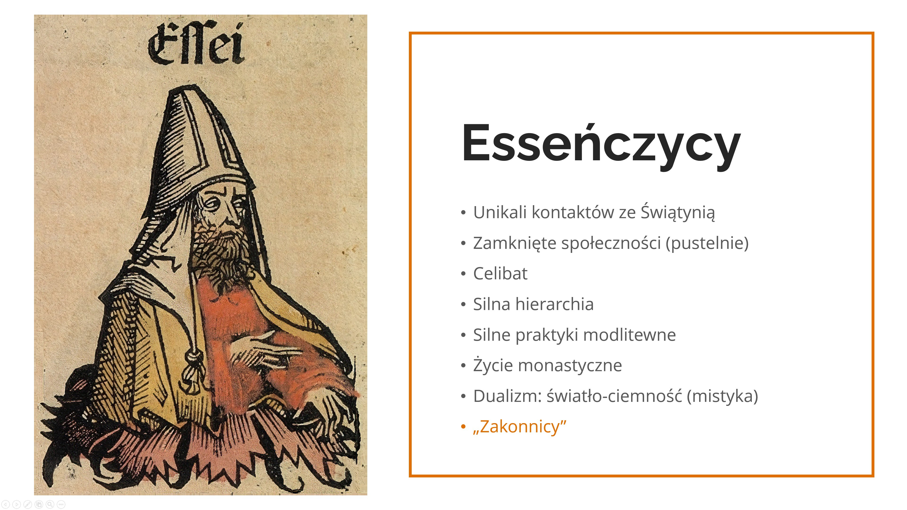

Rencontre 1 - Comme j'ai été connu
**********************************

.. tags:: contenu|ouverture|Ouverture, contenu|eglise|Église, contenu|communaute|Communauté, contenu|relations|Relations, methode|travail-avec-image|Travail avec image, methode|travail-en-groupes|Travail en groupes, type|integration|D'intégration

Introduction pour l'animateur
=============================

La première rencontre de groupe a une fonction de prise de connaissance et d'intégration, elle est le lien entre les autres points du vendredi - elle approfondit les contenus de la conférence et conduit à la prière du soir. Son objectif le plus important est de confronter les participants à ce que signifie l'ouverture dans la pratique et de partager les défis liés à une telle approche.

**À la fin de ce plan se trouvent des matériaux à imprimer qui seront nécessaires au cours de la réunion !**

Introduction
============

Nous commençons par la prière - forme à la discrétion de l'animateur, avec un accent particulier sur la demande d'ouverture les uns aux autres. Si nécessaire (participants qui n'ont pas l'expérience des réunions de partage en petit groupe), l'animateur présente brièvement le concept des réunions de groupe et discute des règles. Nous commençons par partager ce qui est né en nous en écoutant la conférence, nous commençons tout de suite par plonger et vivre le contenu de la retraite. L'ouverture est liée au dévoilement et à la disposition à être blessé - c'est ce qui se passe dans l'espace du petit groupe, nous ne nous connaissons pas encore, nous ne savons rien l'un de l'autre, mais nous voulons éveiller en nous l'ouverture les uns aux autres. En répondant aux questions ci-dessous, nous demandons à la personne de se présenter, si quelqu'un ne veut pas répondre, qu'il se présente seulement.

* Quels contenus de la conférence résonnent le plus avec ce qui se passe dernièrement dans ma vie ?
* Quelle perspective sur le vécu de cette retraite ce que j'ai entendu m'a-t-il tracée ?
* Ai-je dans le cœur un désir particulier concernant cette retraite ?

Foi ouverte
===========

Maciej Biskup OP dans l'un de ses articles a expliqué l'étymologie du mot "Église" :

    Une Église sans cœur est une Église-forteresse, un château fort. Littéralement, c'est ce que signifie en polonais le mot "kościół", que nous avons adopté du tchèque (kostel), et le tchèque du mot latin castellum (forteresse). Pendant ce temps, du grec (ekklesia), l'Église signifie la convocation du peuple, qui ne s'enferme pas dans une forteresse, mais sort vers le monde avec un cœur ouvert, pour continuer à convoquer, comme il a lui-même été convoqué.

    -- ”L'Église qui a un cœur” du 24.06.2022

* Quelle est mon expérience de l'Église ?
* Quelle image m'est la plus proche - l'Église forteresse ou l'Église qui est la convocation du peuple sortant vers le monde ?

Lorsque l'Église a été envoyée par le Christ aux quatre coins du monde pour convoquer tout le monde à son Nom (Mc 16,15), elle a commencé à entrer en contact avec de nouvelles coutumes, de nouvelles cultures, de nouveaux courants de pensée qui dépassaient le monde intérieur du judaïsme de l'époque, dans lequel le christianisme est né. Chaque rencontre était l'occasion de trouver des points communs pour montrer le plus simplement possible l'universalité de Jésus envers tous (Discours de Paul à l'Aréopage - Ac 17,16-34). L'environnement s'imprégnait de l'enseignement des Apôtres, tandis que les nouveaux croyants combinaient en eux leur héritage avec l'acquis de la Bonne Nouvelle. Nous voyons à notre époque que l'inculturation, c'est-à-dire l'entrée de l'Évangile dans la vie de différents peuples, laisse de bons fruits, mais nécessite un travail intense pour "relier les mondes". Nous pouvons citer comme exemple différentes Églises qui ont créé leurs propres coutumes au fil des siècles :

Japon
    Les chrétiens cachés (Kakure-kirishitan) pendant deux siècles de persécutions (XVIIe-XVIIIe siècles), pour maintenir la tradition de vivre l'Eucharistie, malgré l'absence de prêtres, utilisaient du riz et du saké pour célébrer l'Action de grâce lors de liturgies organisées en commun. Actuellement, les prêtres, au lieu d'embrasser l'autel, s'inclinent devant lui en signe de plus grand respect.

Égypte
    Les chrétiens dès les premiers siècles utilisent le symbole ankh comme signe de vie, de résurrection. De nos jours, il apparaît sur les étoles des prêtres et les mains des chrétiens tatoués.

Voyant la beauté des différentes Églises, nous pouvons nous poser la question : où était le germe de cette richesse ? L'un des premiers protagonistes de la conquête des gens pour le Christ était saint Paul, appelé l'Apôtre des Nations. Il allait partout et vers tous pour gagner le plus grand nombre à l'Évangile. Il avoue que pour gagner les gens, il "se faisait tout à tous" (1 Co 9, 20-22). Pour être un avec l'autre, il faisait consciemment le choix de s'adapter à l'autre, pour qu'il ait un sentiment de proximité et de lien qui se crée.

* Combien de fois j'essaie de me mettre "à la place de quelqu'un" et d'écouter l'autre partie ? Qu'est-ce qui est le plus difficile pour moi là-dedans ?
* As-tu entendu dans ta vie que tu sais écouter ou que tu as "entendu quelqu'un" ?
* Quand es-tu resté pour la dernière fois plus longtemps avec quelqu'un à l'arrêt de bus bien que tu ne connaisses pas si bien cette personne ? Quand as-tu fait pour quelqu'un 2000 pas au lieu de 1000 ? (Mt 5,41) ?

Jésus comme Celui qui est ouvert
===============================

Comme nous le voyons, l'Église dès le début était plus diverse qu'il ne peut nous sembler. Différents mouvements, communautés, charismes continuent de s'y interpénétrer et de se compléter. Ce n'est cependant pas une caractéristique propre seulement à l'Église contemporaine, car il en allait de même avec le judaïsme à l'époque où le Seigneur Jésus enseignait. Regardons maintenant brièvement les différentes factions juives qui existaient alors.

.. note:: L'animateur sort les planches au milieu, pour que chaque participant à la réunion puisse voir.

.. image:: saduceusze.jpg
   :align: center

.. image:: faryzeusze.jpg
   :align: center

.. image:: zeloci.jpg
   :align: center

Après avoir lu chacune des descriptions, l'animateur pose des questions :

* Quelles réflexions sont nées en moi après avoir lu les descriptions des différentes factions ?

* Qu'est-ce que le christianisme a repris de chacune d'elles ?

Les premiers chrétiens, tout comme les sadducéens, célébraient eux-mêmes l'Eucharistie, croyaient en l'immortalité comme les pharisiens, créaient des communautés et une mystique à l'instar des esséniens, et reconnaissaient l'essence de la liberté personnelle comme les zélotes. L'ouverture et le fait de puiser chez les autres sont inscrits dans notre foi par Jésus-Christ lui-même. On suppose que certains apôtres étaient des représentants de factions particulières - l'Évangile nous donne par exemple l'information sur Simon, qui avait le surnom de "zélé" - en grec zelotes, ce qui peut indiquer une appartenance aux zélotes, de même Judas est parfois compté dans ce groupe. Jean-Baptiste, en raison de son mode de vie érémitique, est considéré par certaines sources comme un essénien, tout comme ses disciples qui ont ensuite suivi Jésus. Nous savons également que Nicodème était pharisien.

* Quelles similitudes je vois entre les factions de l'époque et l'Église d'aujourd'hui ?

Le Messie voulait avoir dans son cercle le plus proche des représentants de différentes opinions ! Son ouverture aux autres se manifestait également lors de nombreuses rencontres décrites sur les pages de l'Évangile.

Lisons maintenant quelques fragments exemples.

.. note:: Les participants à la réunion se mettent par deux, chaque binôme reçoit l'un des fragments ci-dessous et en prend connaissance en silence.

Premier fragment :

    | Jésus apprit que les pharisiens avaient entendu dire qu’il faisait plus de disciples que Jean et qu’il baptisait davantage. – À vrai dire, Jésus lui-même ne baptisait pas, mais ses disciples. – Alors il quitta la Judée pour retourner en Galilée. Or, il lui fallait traverser la Samarie. Il arrive donc à une ville de Samarie, appelée Sykar, près de la terre que Jacob avait donnée à son fils Joseph. Là se trouvait le puits de Jacob. Jésus, fatigué par la route, s’était donc assis près de la source. C’était la sixième heure, environ midi.
    | Arrive une femme de Samarie, qui venait puiser de l’eau. Jésus lui dit : « Donne-moi à boire. » – En effet, ses disciples étaient partis à la ville pour acheter des provisions. La Samaritaine lui dit : « Comment ! Toi, un Juif, tu me demandes à boire, à moi, une Samaritaine ? » – En effet, les Juifs ne fréquentent pas les Samaritains. Jésus lui répondit : « Si tu savais le don de Dieu et qui est celui qui te dit : “Donne-moi à boire”, c’est toi qui lui aurais demandé, et il t’aurait donné de l’eau vive. » Elle lui dit : « Seigneur, tu n’as rien pour puiser, et le puits est profond. D’où as-tu donc cette eau vive ? Serais-tu plus grand que notre père Jacob qui nous a donné ce puits, et qui en a bu lui-même, avec ses fils et ses bêtes ? » Jésus lui répondit : « Quiconque boit de cette eau aura de nouveau soif ; mais celui qui boira de l’eau que moi je lui donnerai n’aura plus jamais soif ; et l’eau que je lui donnerai deviendra en lui une source d’eau jaillissant pour la vie éternelle. » La femme lui dit : « Seigneur, donne-moi de cette eau, que je n’aie plus soif, et que je n’aie plus à venir ici pour puiser. » Jésus lui dit : « Va, appelle ton mari, et reviens. » La femme répliqua : « Je n’ai pas de mari. » Jésus reprit : « Tu as raison de dire que tu n’as pas de mari : des maris, tu en as eu cinq, et celui que tu as maintenant n’est pas ton mari ; là, tu dis vrai. » La femme lui dit : « Seigneur, je vois que tu es un prophète !... Nos pères ont adoré sur cette montagne, et vous, vous dites : “C’est à Jérusalem qu’est le lieu où il faut adorer.” » Jésus lui dit : « Femme, crois-moi : l’heure vient où vous n’irez plus ni sur cette montagne ni à Jérusalem pour adorer le Père. Vous, vous adorez ce que vous ne connaissez pas ; nous, nous adorons ce que nous connaissons, car le salut vient des Juifs. Mais l’heure vient – et c’est maintenant – où les vrais adorateurs adoreront le Père en esprit et vérité : tels sont les adorateurs que recherche le Père. Dieu est esprit, et ceux qui l’adorent, c’est en esprit et vérité qu’ils doivent l’adorer. » La femme lui dit : « Je sais qu’il vient, le Messie, celui qu’on appelle Christ. Quand il viendra, c’est lui qui nous fera connaître toutes choses. » Jésus lui dit : « Je le suis, moi qui te parle. »

    -- Jn 4,1-26

Deuxième fragment :

    Jésus traversait la ville de Jéricho. Or, il y avait un homme du nom de Zachée ; il était le chef des collecteurs d’impôts, et c’était quelqu’un de riche. Il cherchait à voir qui était Jésus, mais il ne le pouvait pas à cause de la foule, car il était de petite taille. Il courut donc en avant et grimpa sur un sycomore pour voir Jésus qui devait passer par là. Arrivé à cet endroit, Jésus leva les yeux et lui dit : « Zachée, descends vite : aujourd’hui il faut que j’aille demeurer dans ta maison. » Vite, il descendit et reçut Jésus avec joie. Voyant cela, tous récriminaient : « Il est allé loger chez un homme qui est un pécheur. » Zachée, debout, s’adressa au Seigneur : « Voici, Seigneur : je fais don aux pauvres de la moitié de mes biens, et si j’ai fait du tort à quelqu’un, je vais lui rendre quatre fois plus. » Alors Jésus dit à son sujet : « Aujourd’hui, le salut est arrivé pour cette maison, car lui aussi est un fils d’Abraham. En effet, le Fils de l’homme est venu chercher et sauver ce qui était perdu. »

    -- Lc 19,1-10

Troisième fragment :

    Jésus se retira dans la région de Tyr et de Sidon. Voici qu’une Cananéenne, venue de ces territoires, disait en criant : « Prends pitié de moi, Seigneur, fils de David ! Ma fille est tourmentée par un démon. » Mais il ne lui répondit pas un mot. Les disciples s’approchèrent pour lui demander : « Renvoie-la, car elle nous poursuit de ses cris ! » Jésus répondit : « Je n’ai été envoyé qu’aux brebis perdues de la maison d’Israël. » Mais elle vint se prosterner devant lui en disant : « Seigneur, viens à mon secours ! » Il répondit : « Il n’est pas bien de prendre le pain des enfants et de le jeter aux petits chiens. » Elle reprit : « Oui, Seigneur ; mais justement, les petits chiens mangent les miettes qui tombent de la table de leurs maîtres. » Jésus répondit : « Femme, grande est ta foi, que tout se passe pour toi comme tu le veux ! » Et, à l’heure même, sa fille fut guérie.

    -- Mt 15,21-28

Après la lecture en silence, chaque binôme raconte brièvement de quoi parlait son fragment. Ensuite, l'animateur pose des questions :

* Qu'est-ce qui relie toutes ces rencontres ?
* En quoi se manifestait l'ouverture de Jésus envers ces personnes ?

Dans le contact avec les autres, l'origine, la profession ou le sexe n'avaient aucune importance pour Jésus. Il voyait avant tout l'homme, pas ce qu'il fait - peu importe que quelqu'un soit pêcheur, collecteur d'impôts, centurion. Chacun avait en soi un potentiel, chacun était pour Lui intéressant d'une certaine manière, Il était curieux de chacun.

Ouverture et curiosité
=====================

La curiosité est indissociablement liée à l'ouverture. Dieu n'est pas seulement fasciné par chacun de nous, Il est Lui-même Celui qui intrigue - il apparaît dans le buisson ardent, la colonne de feu ou la nuée, Jésus par sa personne suscite l'intérêt et l'étonnement.

* Qu'est-ce qui m'intrigue personnellement le plus en Dieu ?
* Combien y a-t-il encore en moi de curiosité sur le sujet de comment Il est ?
* Quelle est mon expérience du mystère qui attire ?

Parfois nous acceptons dans notre foi que quelque chose est déjà si évident, si entendu, que le besoin de poser des questions cesse de naître en nous. De même avec l'attitude envers les gens autour, nous connaissons quelqu'un par cœur et supposons qu'il ne nous surprendra plus par rien, ou nous reconnaissons d'avance ce à quoi nous pouvons nous attendre de quelqu'un. La clé de l'ouverture est la curiosité de l'autre personne et de ce qu'elle peut apporter par elle-même à notre vie.

* Qu'est-ce qui m'aide à être ouvert ?
* Combien de fois je montre aux autres mon intérêt ?
* Qu'est-ce qui me fascine le plus souvent chez les autres gens ?

Lisons pour finir :

    Ce fragment provient de la fin de l'Hymne à l'amour de saint Paul - pour le moment nous ne sommes capables ni d'aimer parfaitement, ni de connaître pleinement ou de comprendre l'autre homme. Cependant, cela ne signifie pas que nous ne devrions pas essayer. Dans un instant, nous irons à la prière du soir - ne supposons pas tout de suite ce que nous voulons qu'il s'y passe, dans la mesure du possible essayons de nous débarrasser des attentes et d'avoir simplement en nous l'ouverture à ce que Dieu veut nous transmettre. Arrêtons-nous et éveillons en nous la curiosité dirigée tant vers Celui devant Qui nous nous tiendrons, que vers les gens avec qui nous prierons ensemble. Laissons-nous surprendre.

    -- 1 Co 13,12
