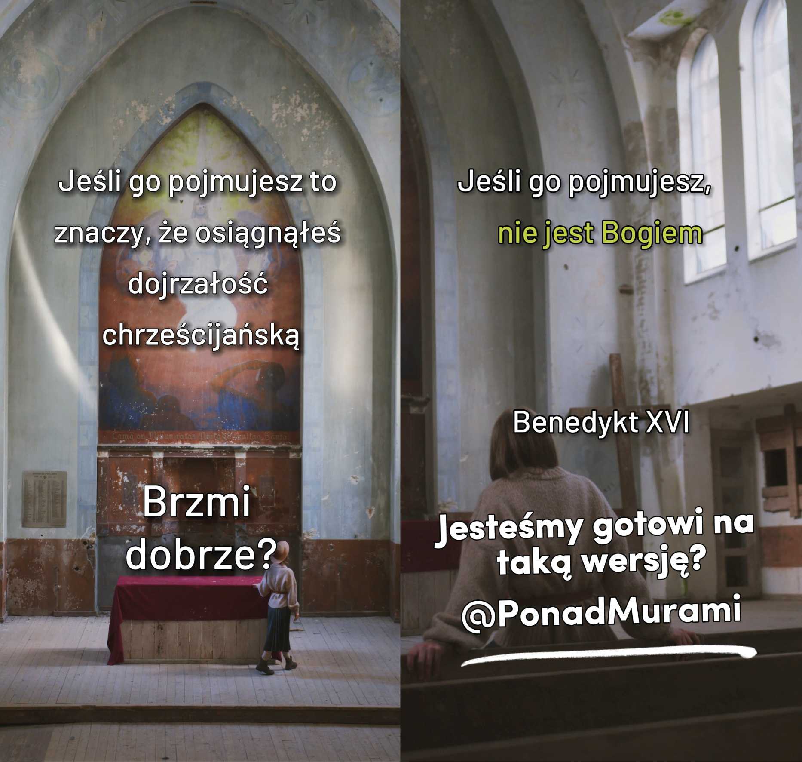

Rencontre 3 - Expérimentant
***************************

.. tags:: contenu|ouverture|Ouverture, contenu|responsabilite|Responsabilité, contenu|eglise|Église, contenu|eucharistie|Eucharistie, contenu|traditions-juives|Traditions juives, methode|travail-avec-image|Travail avec image, methode|travail-en-groupes|Travail en groupes, type|atelier|Atelier

Introduction pour l'animateur
=============================

C'est la dernière rencontre de groupe juste avant le Séder. Son but est de nous préparer au mieux à le vivre en union avec l'Eucharistie. Nous ne voulons pas transmettre une réflexion intellectuelle sur la signification des gestes et des mots - nous nous concentrons sur la participation et l'expérience. Le Séder et, par conséquent, l'Eucharistie sont engageants - notre temps, notre corps, nos sens, notre cœur. Il y a des gens qui, en prenant leur petit-déjeuner, lisent le journal, répondent aux messages et sautent dans la pièce d'à côté pour étendre le linge - il est possible de manger ainsi. Cependant, ce n'est pas ainsi que l'on consomme le Séder et l'Eucharistie. S'asseoir à table peut être engageant, faire en sorte que le monde entier se réduise à cet espace ici et maintenant, le temps s'écoule différemment - c'est de cela qu'il s'agit ! La rencontre comprend jusqu'à trois dynamiques. C'est pour s'exercer, expérimenter plus que pour apprendre. Pratiquons, touchons, goûtons. Pas pour de faux, pas sous forme d'ateliers synthétiques, mais réellement. Ces dynamiques sont le contenu, et non un interlude pour maintenir la concentration.

Responsabilité
==============

Nous venons de vivre l'Effatha. Commençons par partager nos réflexions sur ce sujet :

* Comment ai-je vécu le service de l'Effatha ? Qu'est-ce que l'ouverture surnaturelle pour moi ?

Nous sommes témoins de changements importants dans notre Église. Le pape François a convoqué un synode sous le thème "Pour une Église synodale : communion, participation et mission". Le pape essaie de nous transmettre quelque chose d'important sur notre compréhension de notre rôle dans la communauté. Ce qu'il raconte semble parfois rencontrer de la résistance et de la fermeture de la part des croyants. Essayons donc, avec une ouverture venant d'en haut, de lire comment le pape nous invitait sur ce chemin :

    Nous, les pasteurs, marchons avec le peuple, parfois devant, parfois au milieu, parfois derrière. Le bon berger doit se mouvoir ainsi : devant pour guider le troupeau, au milieu pour encourager le chemin et ne pas oublier l'odeur du troupeau, derrière parce que le peuple a aussi son "bon flair".

    -- Pape François, 18 septembre 2021

* Qu'est-ce que cette vision de la communauté signifie en pratique pour moi ?
* Comment je me sens avec une telle vision de l'Église ?

Courage pour les choses importantes
===================================

Il est bon d'être guidé quand on fait confiance à celui qui guide. Cependant, nous découvrons que ce n'est pas notre seule vocation. Effatha "n'est pas là pour" être plus ouvert à écouter des ordres. C'est nous qui prenons la responsabilité de choisir la direction (synodalité) !

En invitant à la retraite, nous avons publié des matériaux préparés sur le principe de la comparaison de deux textes - la version modifiée par nous et le texte original. Nous voulions ainsi saisir la concentration sur le changement qui peut s'opérer avec l'ouverture de cœur appropriée. Revenons à quelques-uns de ces exemples.

.. note:: L'animateur sort les cartes et les étale sur la table.

.. |d1| image:: porownania-01.jpg
   :scale: 50%

.. |d3| image:: porownania-03.jpg
   :scale: 50%
.. |d4| image:: porownania-04.jpg
   :scale: 50%
.. |d5| image:: porownania-05.jpg
   :scale: 50%
.. |d6| image:: porownania-06.jpg
   :scale: 50%
.. |d7| image:: porownania-07.jpg
   :scale: 50%

+------+------+
| |d1| | |d2| |
+------+------+
| |d3| | |d4| |
+------+------+

+------+------+
| |d5| | |d6| |
+------+------+
| |d7| | |d8| |
+------+------+

* Si tu devais choisir une carte montrant un changement qui est important pour toi, laquelle choisirais-tu ?

* Pourquoi est-ce important pour toi ?

Nous aurions pu tirer 100 cartes au lieu de quelques-unes ou choisir 10 cartes au lieu d'une. Nous ne l'avons pas fait. Y a-t-il une justification à cela ?

Que se passe-t-il parfois lorsque nous choisissons jusqu'à 100 possibilités ?
Que peut-il se passer lorsque nous choisissons 10 cartes ?

Il ne s'agit pas de ne pas vouloir s'occuper de 10 choses. Il s'agit de vouloir s'occuper d'une chose à coup sûr avant de s'occuper de la dixième. Il faut du courage pour décider ce qui est important et accepter que ce sera une liste courte. Sinon, il y aura une **inflation de l'importance** - quand tout est important, rien ne l'est. Il y a aussi un risque dans l'autre sens, l'**apathie** - je ne sais pas si j'ai lu toutes les cartes sur un million, donc tant que je ne les aurai pas toutes lues, je ne me déciderai pour aucune. Essayons de nous aider mutuellement lors de cette réunion à chercher une voie sage.

Lisons :

    Le Peuple saint de Dieu participe aussi à la fonction prophétique du Christ ; il répand son vivant témoignage avant tout par une vie de foi et de charité, il offre à Dieu un sacrifice de louange, le fruit de lèvres qui célèbrent son Nom.

    -- Lumen Gentium 12

* De quelle manière ai-je part à quelque chose qui est important pour moi dans la sphère spirituelle ?
* De quoi je prends la responsabilité ?

Sous la surface
===============

Le choix par chacun de nous de ce dont il prend la responsabilité et de ce qui est important pour lui est crucial pour être prêt à plonger et à toucher quelque chose qui est plus profond. Nous nous préparons aujourd'hui toute la journée à cela.

Faisons encore un exercice, et laissons l'archevêque Fulton Sheen nous y introduire :

    Notre Seigneur avait un sens de l'humour divin, car il a révélé que l'univers entier est sacramentel. Un sacrement, au sens large du terme, combine en soi deux éléments : l'un visible, l'autre invisible ; l'un que l'on peut voir ou entendre, que l'on peut goûter ou toucher ; et l'autre - invisible pour les yeux. Il y a cependant entre ces éléments un certain lien ou un espace de signification commun qui les unit. La parole parlée est une sorte de sacrement, car il y a en elle à la fois quelque chose de matériel, que l'on peut saisir avec l'oreille, et quelque chose de spirituel, c'est-à-dire le sens du mot. Un cheval entend une blague racontée tout comme un homme. On peut même supposer qu'il entend mieux les mots prononcés. La différence réside dans le fait que lorsqu'un homme entend une blague, le plus souvent il rit, et quand un cheval l'entend - il n'éclate pas d'un rire chevalin. C'est parce que le cheval n'entend que la partie matérielle du "sacrement", c'est-à-dire le son, tandis que l'homme perçoit aussi cette partie invisible ou spirituelle, c'est-à-dire le sens des mots.

    -- Archevêque Fulton J. Sheen "Les Sacrements"

.. note:: L'animateur sort les cartes Dixit et les étale sur la table. Il y en a quelques-unes de plus que de participants à la réunion. Ensuite, il raconte les règles du Dixit : il faut choisir mentalement sa carte et inventer pour elle une association qui ne sera pas trop évidente pour que tout le monde ne devine pas, mais pas non plus si inhabituelle que personne ne devine.

Les participants partagent l'association, et le reste essaie de deviner quelle est la carte.

* De quelle manière donner cette association se connecte-t-il avec l'introduction de l'archevêque Sheen et notre sujet ?
* Que serait dans la vie de la communauté de donner une association trop simple ?
* Que serait dans la vie de la communauté de donner une association que personne ne devinera ?

Donner une association trop évidente, c'est très probablement manquer la profondeur, dire quelque chose de superficiel. Donner une association que personne ne devinera ne construit pas la communauté comme elle le pourrait. En tant que communauté de croyants, nous sommes constamment "écartelés" entre ces deux points, essayant de chercher notre croissance commune.

* Dans quels endroits je sens que je touche quelque chose d'important et de profond ? Quand ai-je découvert cet endroit ?

Franchir le pas
===============

Un beau plan se dessine pour nous lors de la réunion - nous devons être ouverts à un nouveau regard, à l'écoute du Pape qui nous encourage à participer, choisissant ce qui est important et profond pour nous ! Pourquoi, en regardant par la fenêtre, semble-t-il que peu d'entre nous vivent de cette manière ?

Lisons :

    Mettez-vous au service les uns des autres selon le don que chacun a reçu, comme de bons intendants de la grâce de Dieu, si diverse. Si quelqu’un parle, que ce soit comme parole de Dieu ; si quelqu’un assure le service, que ce soit avec la force que Dieu dispense, afin qu’en tout, Dieu soit glorifié par Jésus Christ, à qui appartiennent la gloire et la puissance pour les siècles des siècles. Amen.

    -- 1 P 4,10-11

* À qui parle saint Pierre ?
* À quoi t'encourage ce fragment ?

Nous sommes appelés à aller en eau profonde et à devenir courageusement une échelle pour notre propre croissance. La foi exige du maximalisme, la décision d'en faire quelque chose d'important (vraiment important). C'est une question de franchir le pas (ou, si vous préférez, de conversion).

Lisons :

    "Jésus ne veut rien de nous. Il nous veut"

    -- P. Franciszek Blachnicki

C'est un bon résumé du changement que l'Église (et Jésus) attend.

Cela peut se produire par un miracle. Le plus souvent, cela ne se produit pas de cette manière, mais ce n'est pas grave - on peut faire autrement. Aller en eau profonde et se concentrer sur ce qui est important peut s'exercer. Quotidiennement, avec constance.

* Qu'est-ce qui m'aiderait, que pourraient faire les autres, pour que je ne tombe pas dans la superficialité ?
* Que pouvons-nous faire pour nous donner mutuellement une force portante dans l'Église ?

Expérimentant
=============

Le but de notre retraite est de vivre l'Eucharistie. Une "ordinaire". C'est le point culminant de notre réunion. Nous voulons cependant le faire avec la plus grande ouverture, conscience, pour que ce soit pour nous une expérience réelle, pour descendre sous la surface d'un centimètre de plus que jusqu'à présent.

    Qui célèbre la Sainte Messe, qui célèbre l'Eucharistie ? La réponse semble simple : le prêtre ! Dans nos églises, nous voyons bien le prêtre debout à l'autel. Bien souvent, quelqu'un nous demande : quel prêtre a célébré aujourd'hui ? – et nous répondons en donnant son prénom ou son nom. Cependant, en cherchant la réponse à la question posée, il faut se référer à la réflexion théologique sur la liturgie. Le Catéchisme de l'Église Catholique dit que la liturgie est célébrée par toute la communauté, le Corps du Christ uni à sa Tête, c'est-à-dire le Christ. Cela s'applique également à l'Eucharistie. La célébration de l'Eucharistie est aussi l'action du Christ et de l'Église, elle est célébrée par toute la communauté.

    -- P. Jan Miazek

* Dans quelle mesure cette pensée sur l'Eucharistie est-elle entrée aussi dans mon cœur et mon esprit ?

Rappelons-nous les quatre façons de la présence de Dieu dans l'Eucharistie :

    | Pour réaliser une si grande œuvre, le Christ est toujours là auprès de son Église, surtout dans les actions liturgiques. Il est là présent dans le sacrifice de la messe, et dans la personne du ministre, « le même offrant maintenant par le ministère des prêtres, qui s’offrit alors lui-même sur la croix » et, au plus haut point, sous les espèces eucharistiques. Il est là présent par sa puissance dans les sacrements au point que lorsque quelqu’un baptise, c’est le Christ lui-même qui baptise. Il est là présent dans sa parole, car c’est lui qui parle tandis qu’on lit dans l’Église les Saintes Écritures. Enfin il est là présent lorsque l’Église prie et chante les psaumes, lui qui a promis : « Là où deux ou trois sont rassemblés en mon nom, je suis là au milieu d’eux » (Mt 18, 20).
    | Effectivement, pour l’accomplissement de cette grande œuvre par laquelle Dieu est parfaitement glorifié et les hommes sanctifiés, le Christ s’associe toujours l’Église, son Épouse bien-aimée, qui l’invoque comme son Seigneur et qui passe par lui pour rendre son culte au Père éternel.
    | C’est donc à juste titre que la liturgie est considérée comme l’exercice de la fonction sacerdotale de Jésus Christ, exercice dans lequel la sanctification de l’homme est signifiée par des signes sensibles, est réalisée d’une manière propre à chacun d’eux, et dans lequel le culte public intégral est exercé par le Corps mystique de Jésus Christ, c’est-à-dire par le Chef et par ses membres.
    | Par suite, toute célébration liturgique, en tant qu’œuvre du Christ prêtre et de son Corps qui est l’Église, est l’action sacrée par excellence dont nulle autre action de l’Église ne peut atteindre l’efficacité au même titre et au même degré.

    -- Constitution sur la Sainte Liturgie, pt. 7

* Dans quels quatre espaces le Christ est-il Présent pendant l'Eucharistie ?
* Dans lequel de ces espaces je touche le plus rarement de manière naturelle quelque chose de spirituel ?
* Dans lequel de ces espaces je touche le plus souvent de manière naturelle quelque chose de spirituel ?

Sensualité
==========

Les quatre espaces dans lesquels nous trouvons réellement présent le Christ sont plus que la systématisation de la connaissance. C'est une indication pour nous de ne pas nous "fixer" sur un seul espace. Dans chacun d'eux, Jésus est Présent - tout entier en Plénitude, cependant la capacité de l'expérimenter dans chacun des espaces simultanément ouvre devant nous de nouvelles connexions possibles qui s'enrichissent mutuellement.

Faisons maintenant un exercice lié à cela.

.. note:: L'animateur sort des sachets avec un objet et en remet un à chacun. Les participants, sans regarder, y plongent la main et tentent de reconnaître ce que c'est à l'aide du toucher.

* Qu'est-ce qui se trouve dans le sac ?

.. note:: L'animateur demande aux participants de fermer les yeux. Il sort une huile et libère son odeur dans l'air.

* Quelle est cette odeur ?

.. note:: L'animateur lance un son depuis le téléphone

* De quoi est ce son ?

.. note:: L'animateur demande de fermer les yeux et distribue à chacun un petit bonbon

* Quel est ce goût ?

Imaginons que nous n'ayons jamais bu de thé. Quelqu'un nous en verse dans une tasse, nous voyons la couleur du liquide se déversant dans le récipient. La vue nous dit quelque chose sur le thé. Nous le prenons dans les mains et l'approchons de nous en sentant son odeur - peut-être savons-nous déjà reconnaître de quoi il est fait. Lorsque nous le portons à la bouche, l'expérience s'approfondit.

La spiritualité est sensuelle. La foi est sensuelle. Et littéralement - elle agit sur tous les sens, et figurativement - elle est multidimensionnelle et les réponses sont à l'intersection de chacune des dimensions.

* Quelle importance pour la spiritualité a le sens du toucher ?
* Quelle importance pour la spiritualité a le sens de l'odorat ?
* Quelle importance pour la spiritualité a le sens de l'ouïe ?
* Quelle importance pour la spiritualité a le sens du goût ?

Aidons-nous aujourd'hui à vivre l'Eucharistie de manière à ce que ce ne soit pas "quelqu'un d'autre pour nous" qui la fasse. L'Eucharistie nous invite tout entiers. On le verra au Séder, qui en est le prototype. L'Eucharistie a le goût du vin, le son de la matsa brisée, l'apparence de la lumière vacillante de la bougie sur les vêtements du célébrant, l'odeur de l'encens, le toucher de la main chaude du signe de paix du frère et de la sœur et l'ardeur de la Parole lue. Comme tout cela est sensuel au meilleur sens du terme, comme c'est proche ! Dieu a fait tout ce qu'il a pu pour que nous puissions "entrer entiers sans réserve" dans Son Mystère.

    L'homme qui veut se comprendre lui-même jusqu'au fond — ne pas se contenter pour son être propre de critères et de mesures qui seraient immédiats, partiels, souvent superficiels et même seulement apparents —, doit, avec son inquiétude, son incertitude et même sa faiblesse et son péché, avec sa vie et sa mort, s'approcher du Christ. Il doit, pour ainsi dire, entrer dans le Christ avec tout son être, il doit « s'approprier » et assimiler toute la réalité de l'Incarnation et de la Rédemption pour se retrouver soi-même.

    -- Encyclique Redemptor Hominis, Jean-Paul II

* Dans quels gestes/signes de l'Eucharistie est-il pour moi le plus "naturel" que j'ai une participation ?
* Qu'est-ce pour moi que l'immersion dans la mort et la résurrection du Christ ?

Mondes connectés
================

Lisons :

    Ne pensez pas que je sois venu abolir la Loi ou les Prophètes : je ne suis pas venu abolir, mais accomplir.

    -- Mt 5,17

* Pourquoi les contemporains de Jésus pouvaient-ils penser qu'il voulait abolir quelque chose ?
* Est-ce que l'envie de vouloir voir les choses sans lien avec ce qui était nous est proche ?

Notre foi n'est pas tombée du ciel. L'Eucharistie n'a pas été révélée sur une table de pierre. Jésus n'a pas inventé la matsa et le vin. Dieu entre dans le monde et y crée de nouvelles connexions. Dieu ne fait que créer, il ne détruit rien, c'est pour beaucoup d'entre nous son "identité" fondamentale - il est le Créateur. Nous voulons vivre ensemble aujourd'hui le Séder pour créer une nouvelle connexion - dans les cœurs, l'âme et l'esprit.

* Qui d'entre nous a déjà participé à un Séder ?
* Avec quel espoir y allons-nous ?
* Que voudrions-nous qui soit connecté ?

Nous dînerons. Nous verserons du vin et romprons le pain. Nous parlerons et plaisanterons. Ce sera simple, mais pas simpliste. Ce sera ordinaire, mais magnifiquement ordinaire. C'est tout le temps une seule et même histoire de Dieu à notre égard : une brise légère, et non des tonnerres ; une étable, et non des palais ; un simple pêcheur, et non un érudit ; le commandement de l'amour plus que 500 règles.

Jésus nous a montré que dîner avec quelqu'un change le monde. Dînons ensemble de manière à nous tirer mutuellement vers le haut et inscrivons-nous dans cette histoire du Très-Haut.

Prière
======

Commençons la prière par :

    | Oui, il est bon, il est doux pour des frères
    | de vivre ensemble et d'être unis !
    | On dirait un baume précieux,
    | un parfum sur la tête,
    | qui descend sur la barbe, la barbe d'Aaron,
    | qui descend sur le bord de son vêtement.
    | C'est comme la rosée de l'Hermon,
    | qui descend sur les hauteurs de Sion ;
    | là, le Seigneur a voulu la bénédiction,
    | la vie à jamais.

    -- Ps 133

Que les paroles du Psaume inspirent notre prière d'intercession.
