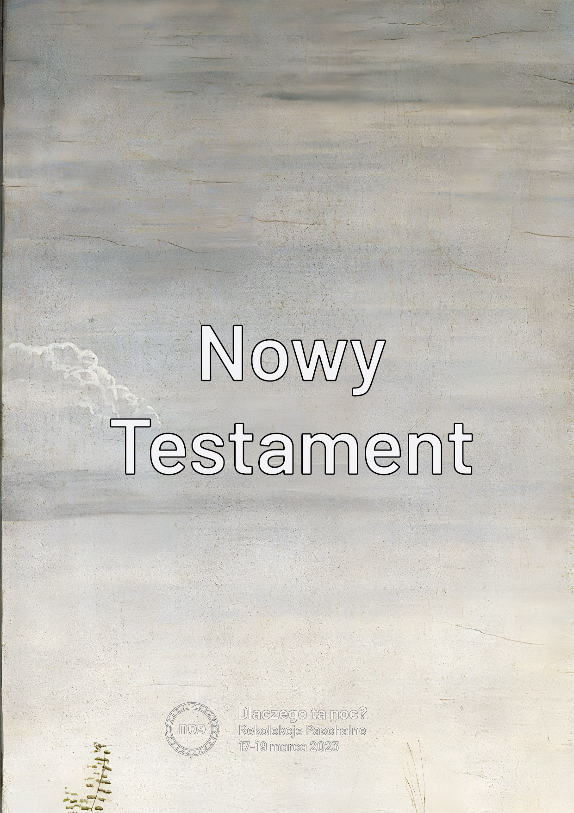

Rencontre 4. - Vieux-Nouveau
****************************

.. tags:: contenu|eucharistie|Eucharistie, contenu|parole-de-dieu|Parole de Dieu, contenu|eglise|Église, contenu|resurrection|Résurrection, contenu|mission|Mission, contenu|traditions-juives|Traditions juives, methode|travail-sur-image|Travail sur image, methode|travail-en-groupes|Travail en groupes, type|mystagogique|Mystagogique

Introduction pour l'animateur
=============================

La quatrième rencontre est l'un des derniers points de la retraite - elle constitue donc un lieu de résumé. L'image que nous voulons que les participants emportent avec eux de la rencontre est la connexion du Vieux et du Nouveau, qui est effectuée par des croyants conscients. Une dynamique simple sert à cela [les matériaux imprimés et les "clips" seront fournis aux animateurs - à la fin du schéma se trouvent des images pour établir le contexte].

Introduction
============

Derrière nous se trouve la soirée du Seder - le point culminant de la retraite. Nous voulions expérimenter à travers le repas du Seder la profonde connexion entre l'Eucharistie et le Seder. Ce n'était cependant pas la seule "connexion" que nous voulions vivre ! Toute notre retraite orbite autour de trois espaces.

.. note:: L'animateur sort sur la table des cartes avec les mots écrits : Ancien Testament, Nouveau Testament, Seder, Eucharistie, Prophètes et Apôtres.

.. |d1| image:: seder.jpg
   :scale: 33%
.. |d2| image:: eucharystia.jpg
   :scale: 33%
.. |d3| image:: prorocy.jpg
   :scale: 33%
.. |d4| image:: apostolowie.jpg
   :scale: 33%
.. |d5| image:: stary_testament.jpg
   :scale: 33%

+------+------+------+
| |d1| | |d3| | |d5| |
+------+------+------+
| |d2| | |d4| | |d6| |
+------+------+------+

Nous sommes entrés dans cette retraite en éveillant en nous l'attention et la curiosité. Essayons donc lors de cette rencontre de "rassembler" ce qui se trouve devant nous. Le premier espace que nous voulons considérer est Seder-Eucharistie.

- Qu'est-ce qui était vivant pour moi dans le Seder lui-même ?
- Quelle valeur découle pour moi de la connexion Seder-Eucharistie ?

Pas pire que...
===============

Le deuxième espace que nous voulons considérer sont Prophètes-Apôtres.

- [Question à tous] Où cet espace était-il perceptible lors de la retraite ?

C'est la Haggadah - nous nous racontions mutuellement les grandes œuvres de notre Dieu ! C'est précisément cela être un Apôtre. Nous nous sommes tenus tous ensemble aux côtés d'Isaïe, Jérémie, Ézéchiel, Daniel, Osée, Joël, Amos, Abdias, Jonas, Michée, Nahum, Habacuc, Sophonie, Aggée, Zacharie et Malachie... aux côtés de Simon Pierre, André, Jacques, Jean, Philippe, Barthélemy, Thomas, Matthieu, Simon le Zélote, Jacques fils d'Alphée et Jude... pour dire que Dieu est bon !

- Comment je me sentais dans le rôle de raconter l'Histoire du Salut ?
- En quoi diffère pour moi la situation où nous racontions avec nos propres mots de la lecture de la Sainte Écriture ?

Ouvrez le carnet à l'introduction. Il y a là une déclaration de la diaconie Ponad Murami que nous créons ces retraites avec le profond espoir que le Bon Dieu nous permettra ici de connecter l'écoute des prophètes et des apôtres, et que seulement par l'acte de connecter nous pouvons nous approcher de Dieu-Communauté.

Dans la dernière ligne du premier paragraphe, il manque un point, n'est-ce pas ? C'est notre démarche délibérée. Si tu veux, écris là après la virgule maintenant ton prénom et/ou termine par un point.

.. note:: On peut faire référence aux invitations à la retraite. Nous placions des citations, demandant si c'est quelqu'un de la diaconie qui l'a dit ou quelqu'un de "sage et célèbre" (comme Benoît XVI ou Sainte Thérèse de la Croix). C'était une expérience difficile pour beaucoup d'entre nous de "nous permettre" même la possibilité de penser que quelqu'un peut confondre nos paroles avec "quelqu'un d'aussi grand".

- [pour ceux qui ont écrit] Comment te sens-tu en t'inscrivant dans un tel groupe ?
- [pour ceux qui n'ont pas écrit] Que devrait-il se passer pour que tu puisses t'y inscrire ?

Colle
=====

Le troisième espace est l'Ancien Testament et le Nouveau Testament. Nous avons médité aujourd'hui l'image du vieillard et du jeune homme. La relation Vieux-Nouveau est très importante pour nous. Il y a en elle une tentation de reconnaître par réflexe que "le nouveau est meilleur ! Pourquoi s'occuper de ce qui est vieux ?".

Lisons :

    Car nous connaissons en partie, et nous prophétisons en partie, mais quand ce qui est parfait sera venu, ce qui est partiel disparaîtra. Lorsque j'étais enfant, je parlais comme un enfant, je pensais comme un enfant, je raisonnais comme un enfant; lorsque je suis devenu homme, j'ai fait disparaître ce qui était de l'enfant. Aujourd'hui nous voyons au moyen d'un miroir, d'une manière obscure, mais alors nous verrons face à face; aujourd'hui je connais en partie, mais alors je connaîtrai comme j'ai été connu. Maintenant donc ces trois choses demeurent: la foi, l'espérance, la charité; mais la plus grande de ces choses, c'est la charité.

    -- 1 Co 13,9-13

- [À tous] Saint Paul suggère-t-il qu'étant dans le NT tout est déjà découvert ?
- Qu'est-ce que cela me dit ?

L'Ancien Testament ne parle pas de quelque chose de complètement différent du Nouveau Testament. De même, la vie sur terre en tant que peuple pèlerin ne consiste pas en quelque chose de radicalement différent que d'être au ciel ! Il y a des différences importantes dont il vaut la peine de se rendre compte - n'est-il pas vrai cependant qu'il y a beaucoup plus de similitudes qui nous "échappent" ? Nous voyons et regardons la même chose - seulement le degré auquel nous sommes capables de le faire est différent (nous voyons obscurément).

- Quelle signification a pour moi la continuité dans la foi ?

Lisons :

    Il se rendit à Nazareth, où il avait été élevé, et, selon sa coutume, il entra dans la synagogue le jour du sabbat. Il se leva pour faire la lecture, et on lui remit le livre du prophète Ésaïe. L'ayant déroulé, il trouva l'endroit où il était écrit: L'Esprit du Seigneur est sur moi, Parce qu'il m'a oint pour annoncer une bonne nouvelle aux pauvres; Il m'a envoyé pour guérir ceux qui ont le cœur brisé, Pour proclamer aux captifs la délivrance, Et aux aveugles le recouvrement de la vue, Pour renvoyer libres les opprimés, Pour publier une année de grâce du Seigneur. Ensuite, il roula le livre, le remit au serviteur, et s'assit. Tous ceux qui se trouvaient dans la synagogue avaient les regards fixés sur lui. Alors il commença à leur dire: Aujourd'hui cette parole de l'Écriture, que vous venez d'entendre, est accomplie.

    -- Lc 4,16-21

- Comment Jésus connecte et assure la continuité ?

.. note:: L'animateur sort un grand clip et prend 6 cartes de la table en les pliant par paires de manière à former une "brochure" composée de 6 cartes. Nous plions ensemble deux cartes "inscriptions vers soi" - "Ancien Testament" et "Nouveau Testament", puis "Seder" et "Eucharistie" et à la fin "Prophètes" "Apôtres". Nous plaçons ces trois paires l'une après l'autre et avec le grand clip ["Jésus"] nous les connectons le long du bord le plus long.

- Qu'est-ce qui dans ma foi "se sépare" et j'aimerais que ce soit connecté par Jésus ?

Lisons :

    Le Christ est la lumière des peuples; réuni dans l'Esprit Saint, le saint Concile souhaite donc ardemment, en annonçant à toutes les créatures la bonne nouvelle de l'Évangile, répandre sur tous les hommes la clarté du Christ qui resplendit sur le visage de l'Église. L'Église étant, dans le Christ, en quelque sorte le sacrement, c'est-à-dire à la fois le signe et le moyen de l'union intime avec Dieu et de l'unité de tout le genre humain, elle se propose de mettre dans une plus vive lumière, pour ses fidèles et pour le monde entier, en se rattachant à l'enseignement des précédents Conciles, sa propre nature et sa mission universelle. À ce devoir qui est celui de l'Église, les conditions présentes ajoutent une nouvelle urgence: il faut que tous les hommes, désormais plus étroitement unis entre eux par les liens sociaux, techniques, culturels, réalisent également leur pleine unité dans le Christ.

    -- Lumen Gentium 1

.. note:: L'animateur sort un deuxième grand clip ["Église"] et renforce en plus la connexion.

- Où est-ce que je vois que l'Église connecte ces espaces ?

L'Église est "toute tissée" de connexion ! À la Messe, nous lisons l'Ancien et le Nouveau Testament. La structure de l'Église est simultanément hiérarchique et synodale. L'Église renforce l'individu et parle de la nécessité d'une relation personnelle avec Dieu, mais au sein d'une large communauté, etc.

.. note:: L'animateur sort quelques petits clips et les distribue à chacun des participants. Nous les ajoutons aux deux existants.

- Comment est-ce que je connecte les choses dans la spiritualité ?
- Quelles choses aimerais-je connecter ?

S'immerger dans la mort
=======================

Connecter est difficile ! Il est difficile de se débarrasser du jugement, de la tentation de choisir et de promouvoir. Il m'est difficile de me voir moi-même à la fois dans le jeune homme et dans le sage **en même temps**. Peut-être que tout le temps nous sentons quelque part l'impératif de "prendre parti". Qu'est-ce que Jésus dit à cela ?

Regardons l'icône :

.. image:: ikona.jpg

- Que représente cette icône ?
- Qui sont les personnes dans l'eau du Jourdain ?
- À quoi fait allusion la forme de l'eau ?

Le Christ lors du baptême dans le Jourdain connecte l'histoire du déluge [l'eau efface le péché] avec la "source d'eau vive". Le Jourdain est à la fois un tombeau et un sein. Il connecte le monde des anges avec le monde des hommes. Il connecte le début de sa mission, avec la mort et la résurrection qui viendra. Jésus connecte la vie et la mort.

- Qu'est-ce que cela signifie pour moi de m'immerger dans la mort de Jésus ?

Nous avons besoin de cette immersion. Elle seule peut nous donner la chance de "voir le monde autrement". Elle éloignera la tentation "d'organiser le monde depuis le début" et peut éveiller le désir de comprendre pourquoi il est ainsi et pas autrement. Nous devons mourir et ressusciter à la vie avec le Christ ! "Réveille-toi, toi qui dors, Relève-toi d'entre les morts, Et Christ t'éclairera" (Ep 5, 14). Dans cette pauvreté spirituelle, il semble qu'il y ait la capacité de connecter.

Triduum
=======

Récemment est mort un homme qui a écrit plus de 60 livres, 3 encycliques et 4 exhortations. Il fut un temps où il avait probablement la plus grande connaissance théologique parmi les vivants sur terre. Ses dernières paroles furent :

    Je t'aime Jésus !

    -- Benoît XVI

Cette capacité de simplifier, d'extraire l'essence est indispensable pour nous. Nous ne tenons pas à ce que tu partes de cette retraite avec 20 pages de notes. Nous tenons à ce que tu emportes une phrase, mais une que tu as entendue de Dieu.

Devant nous se trouve le Triduum Pascal. Un temps où il y aura inimaginablement plus de contenu que lors de notre rencontre.

- Le Triduum est-il encore pour nous une source de questions ?
- À quelle question de ma part le Triduum est-il la réponse ?
- Comment à travers mon vécu du Triduum puis-je aimer plus fort la personne à côté de moi ?

Que l'application de cette rencontre soit une phrase notée aujourd'hui dans le carnet. L'auteur peut être Isaïe, Jérémie, Jésus - bien sûr... cela peut aussi être Toi. Ne signe pas de qui est la phrase. Cela n'a pas une telle importance !
