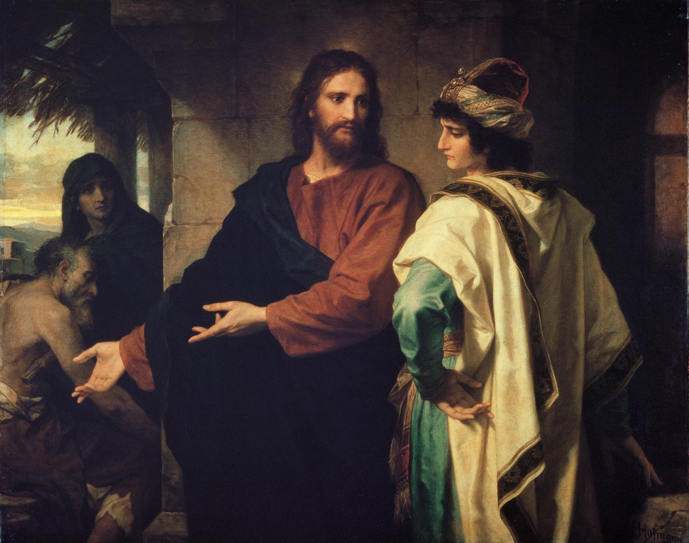

Encontro 2. - Simpatizantes ou cristãos?
****************************************

.. tags:: conteudo|decisoes|Decisões, conteudo|maturidade|Maturidade, conteudo|verdade|Verdade, metodo|trabalho-com-texto|Trabalho com texto, metodo|perguntas-para-partilha|Perguntas para partilha, metodo|discussao|Discussão, tipo|formativo|Formativo

Objetivo do Encontro
====================

1. Neste encontro o fundamental é sublinhar a questão da **fidelidade**, de que apenas o compromisso perseverante e fiel dá bons frutos.
2. Os participantes devem sair com a convicção de que não se pode ser cristão a meio gás. Ou és, ou não és.
3. O encontro conduz para a **oração da noite** e dele depende como os participantes a viverão.

Introdução para o animador
==========================

Provavelmente não será uma descoberta, mas neste encontro o momento chave deve ser o testemunho do animador. A vida nasce da vida, por isso se os participantes não virem o exemplo de alguém que trata o cristianismo a sério e se dedica completamente a ele, não os convencerão longos fragmentos da Sagrada Escritura ou outros livros sábios.

    O batismo dá uma certa hipótese, uma certa possibilidade, mas sem o esforço do homem pode permanecer no homem morto, não manifestar nenhuns efeitos.

    -- Pe. Franciszek Blachnicki

Oração inicial
==============

.. note:: ~5 minutos

Oração ao Espírito Santo por ajuda em manter a fidelidade a Deus.

Introdução ao encontro
======================

Estamos depois da conferência e da homilia, onde ouvimos que a fé não é uma questão de educação, que é a nossa decisão, na qual é preciso perseverar e pela qual é preciso lutar. Mas o que significa isso? Em que consiste o sentido do nosso "acreditar" e como cuidar deste dom que é a fé?

Paixões
=======

.. note:: ~30 minutos

Comecemos por fazer algumas perguntas:

* O que é uma paixão?

* O que caracteriza uma pessoa com paixão?

* Que paixões vocês têm? Em que se interessam? O que vos dá maior alegria e satisfação?

A maioria das pessoas tem alguma paixão. Algo com que se importa, a que dedica muito tempo, a que volta com gosto.

* Para quê? Porquê cansar-se? Para que dedicar montes de tempo a algo de que geralmente não há nenhum benefício? Quais são as razões e qual é o objetivo?

* Pode a fé ser uma paixão?

Entre as pessoas na Sagrada Escritura encontramos muitas pessoas para quem a fé era a sua maior paixão, pela qual estavam dispostas a sacrificar muito.

Leiamos:

    Noé, homem justo, distinguia-se pela sua integridade entre os seus contemporâneos; Noé andava com Deus. E gerou Noé três filhos: Sem, Cam e Jafé. A terra, porém, estava corrompida diante da face de Deus. E viu Deus a terra, e eis que estava corrompida; porque toda a carne havia corrompido o seu caminho sobre a terra. Então disse Deus a Noé: O fim de toda a carne é vindo perante a minha face; porque a terra está cheia de violência; e eis que os desfarei com a terra. Faze para ti uma arca da madeira de gofer; farás compartimentos na arca e a betumarás por dentro e por fora com betume. Porque eis que eu trago um dilúvio de águas sobre a terra, para desfazer toda a carne em que há espírito de vida debaixo dos céus; tudo o que há na terra expirará. Mas contigo estabelecerei a minha aliança; e entrarás na arca, tu e os teus filhos, tua mulher e as mulheres de teus filhos contigo. E de tudo o que vive, de toda a carne, dois de cada espécie, farás entrar na arca, para os conservar vivos contigo; macho e fêmea serão. Das aves conforme a sua espécie, e do gado conforme a sua espécie, de todo o réptil da terra conforme a sua espécie, dois de cada espécie virão a ti, para os conservar em vida. E tu toma para ti de toda a comida que se come, e ajunta-a para ti; e te será para mantimento a ti e a eles. Assim fez Noé; conforme a tudo o que Deus lhe mandou, assim o fez.

    -- Gn 6,9-14.17-22

* O que guiava Noé?

* Porque o fez?

* Quais poderiam ser as reações do seu ambiente ao facto de ele construir um enorme barco em terra seca? (riso, incompreensão, rejeição?)

Frequentemente encontramos o facto de que as nossas paixões (tanto interesses como fé) são incompreendidas pelo nosso ambiente. As pessoas não veem o sentido do que fazemos, tentam afastar-nos disso, às vezes gozam.

* Como me comporto em tal situação? (aqui devia aparecer alguma menção de dificuldades e desânimo)

* O que estou pronto a sacrificar pelo que é importante para mim? Que exemplos lembro de escolhas difíceis da minha vida, quando foi preciso renunciar a algo (prioridades vitais 'teóricas' vs. compromisso real, tempo e energia dedicados)?

Olhemos para outras figuras que estavam dispostas a sacrificar muito pelo que acreditavam.

Trabalho individual: os participantes recebem folhas com um fragmento bíblico/breve descrição da figura e perguntas sobre o texto. Cada um (também o animador) reflete sobre a pessoa dada, depois no fórum apresentamos as nossas reflexões e procuramos traços comuns. Há 4 exemplos, por isso repetir-se-ão. Lembrem-se de imprimir os textos para todos.

Pedro e João (At 4,13-21)
    Então eles, vendo a ousadia de Pedro e João, e informados de que eram homens sem letras e indoutos, maravilharam-se e reconheceram que eles haviam estado com Jesus. E, vendo estar com eles o homem que fora curado, nada tinham que dizer em contrário. Todavia, mandando-os sair fora do conselho, conferenciaram entre si, Dizendo: Que havemos de fazer a estes homens? porque a todos os que habitam em Jerusalém é manifesto que por eles foi feito um sinal notório, e não o podemos negar; Mas, para que não se divulgue mais entre o povo, ameacemo-los para que não falem mais em tal nome a homem algum. E, chamando-os, disseram-lhes que absolutamente não falassem, nem ensinassem, no nome de Jesus. Respondendo, porém, Pedro e João, lhes disseram: Julgai vós se é justo, diante de Deus, ouvir-vos antes a vós do que a Deus; Porque não podemos deixar de falar do que temos visto e ouvido. Mas eles ainda os ameaçaram mais e, não achando motivo para os castigar, deixaram-nos ir, por causa do povo; porque todos glorificavam a Deus pelo que acontecera.

Moisés (fragmento da sarça ardente)
    E apascentava Moisés o rebanho de Jetro, seu sogro, sacerdote em Midiã; e levou o rebanho atrás do deserto, e chegou ao monte de Deus, a Horebe. E apareceu-lhe o anjo do Senhor em uma chama de fogo do meio duma sarça; e olhou, e eis que a sarça ardia no fogo, e a sarça não se consumia. E Moisés disse: Agora me virarei para lá, e verei esta grande visão, porque a sarça não se queima. E vendo o Senhor que se virava para ver, bradou Deus a ele do meio da sarça, e disse: Moisés, Moisés. E ele disse: Eis-me aqui. E disse: Não te chegues para cá; tira os sapatos de teus pés; porque o lugar em que tu estás é terra santa. Disse mais: Eu sou o Deus de teu pai, o Deus de Abraão, o Deus de Isaque, e o Deus de Jacó. E Moisés encobriu o seu rosto, porque temeu olhar para Deus. E disse o Senhor: Tenho visto atentamente a aflição do meu povo, que está no Egito, e tenho ouvido o seu clamor por causa dos seus exatores, porque conheci as suas dores. Portanto desci para livrá-lo da mão dos egípcios, e para fazê-lo subir daquela terra, a uma terra boa e larga, a uma terra que mana leite e mel. E agora, eis que o clamor dos filhos de Israel é vindo a mim, e também tenho visto a opressão com que os egípcios os oprimem. Vem agora, pois, e eu te enviarei a Faraó para que tires o meu povo (os filhos de Israel) do Egito. Então Moisés disse a Deus: Quem sou eu, que vá a Faraó e tire do Egito os filhos de Israel? E disse: Certamente eu serei contigo; e isto te será por sinal de que eu te enviei: Quando houveres tirado este povo do Egito, servireis a Deus neste monte. Então disse Moisés a Deus: Eis que quando eu for aos filhos de Israel, e lhes disser: O Deus de vossos pais me enviou a vós; e eles me disserem: Qual é o seu nome? Que lhes direi? E disse Deus a Moisés: EU SOU O QUE SOU. Disse mais: Assim dirás aos filhos de Israel: EU SOU me enviou a vós. E Deus disse mais a Moisés: Assim dirás aos filhos de Israel: O Senhor Deus de vossos pais, o Deus de Abraão, o Deus de Isaque, e o Deus de Jacó, me enviou a vós; este é meu nome eternamente, e este é meu memorial de geração em geração.

Santa Teresa Benedita da Cruz (Edith Stein)
    Edith Stein nasceu numa família judaica numerosa mas abastada em Wrocław. Era a mais nova de onze filhos. O pai morreu quando ela tinha apenas dois anos, desde então a mãe ocupou-se tanto das crianças como da empresa do seu falecido marido. Apesar da fé viva de toda a família, e especialmente da mãe, aos 14 anos Edith declarou que era ateia. Estudou germanística e história na Universidade de Wrocław. A partir de 1913 estudou em Göttingen sob a orientação de Edmund Husserl. Escreveu e defendeu com ele a tese de doutoramento Sobre o problema da empatia. Por influência de um dos seus conhecidos aproximou-se mais do catolicismo. Depois da morte do seu bom amigo teria caído em apatia e dilaceração espiritual. Sob a influência da viúva do seu amigo, evangélica, começou a viver uma conversão, que finalmente se completou quando leu a biografia de santa Teresa de Ávila. A 1 de janeiro de 1922 recebeu o batismo na Igreja católica, adotando o nome de Teresa. A sua fé aprofunda-se durante o estudo nomeadamente dos trabalhos de santo Tomás de Aquino. A 13 de outubro de 1933 despediu-se da família (a sua mãe nunca se reconciliou com as decisões tanto de Edith como de outros filhos). No dia seguinte entrou no Carmelo de Colónia e adotou o nome de Teresa Benedita da Cruz. Como guias espirituais escolheu santa Teresa de Ávila e são João da Cruz. Face às crescentes perseguições dos Judeus, a 31 de dezembro de 1938 foi transferida para o carmelo de Echt na Holanda. Quatro anos mais tarde, a 2 de agosto de 1942, a Gestapo prendeu-a, juntamente com outros católicos de origem judaica, incluindo pessoas consagradas. No momento da prisão teria dito à sua irmã Rosa: Vem, vamos sofrer pelo nosso povo. Os presos foram primeiro internados no campo de trânsito de Westerbork no norte da Holanda. Foi vista pela última vez a 7 de agosto na estação principal de Wrocław durante a paragem do comboio que a levava juntamente com outros Judeus para o campo de Auschwitz. Provavelmente a 9 de agosto foi gaseada no campo de extermínio alemão KL Auschwitz II-Birkenau.

São Francisco
    Francisco veio ao mundo numa família de mercador abastado. Passou os primeiros anos da sua vida em Assis. Frequentava a escola paroquial junto à igreja de são Jorge, onde adquiriu educação básica. Aos 21 anos participou na guerra entre Assis e Perúgia. Na viragem de 1202 e 1203, como resultado da traição de um companheiro, foi preso em Perúgia. Libertado em 1204, devido a uma doença grave regressou a Assis. O ano de 1205 é o início do lento processo de conversão de Francisco. Durante a expedição militar à Apúlia, em Spoleto teve uma visão que decidiu o curso da sua vida. Devido à recaída da doença regressou novamente a Assis, onde generosamente presenteou um leproso encontrado no caminho e lhe deu um beijo de paz. Na igreja assisense de São Damião no outono do mesmo ano ouviu a voz de Cristo a falar desde o ícone da cruz, que lhe ordenou ir e reconstruir a igreja. Ao reparar a igreja vendeu o cavalo e levou da loja do pai vários fardos de pano, pelo que entrou em conflito com ele. O pai primeiro prendeu-o, e depois, em 1206, levou-o perante o tribunal episcopal (a pedido de Francisco, que considerava que nenhum outro tribunal era válido para ele). O bispo decidiu que Francisco devia devolver ao pai os custos, ao que Francisco declarou que não tem pai - tirou as roupas, ficando apenas de cilício, dobrou-as e juntamente com o dinheiro devolveu-as ao pai. Começou a vida de penitência, nomeadamente assistindo num leprosário. Na primavera de 1209 Francisco pediu em Roma a aprovação da regra religiosa escrita por ele mesmo. Em 1224 recebeu os estigmas sagrados. Atravessou-o uma dor terrível, e quando acordou viu que tinha os pés e os pulsos trespassados por pregos, e o lado aberto. Em 1225 Francisco começou a sentir cada vez mais as moléstias ligadas à doença dos olhos. Por sugestão do irmão Elias submeteu-se a tratamentos médicos infrutíferos. Os últimos meses da sua vida passou-os a viajar de cidade em cidade. No final do verão de 1226 regressou a Assis. Morreu, deitado por seu próprio desejo sem roupas sobre a terra nua, no sábado 3 de outubro de 1226.

Perguntas:

* De que se ocupava esta pessoa? Em que se manifestava a sua paixão?

* Encontrou alguma dificuldade? Quais?

* Como se comportou nessa situação?

Em que está o problema?
=======================

.. note:: ~10 minutos

Cada uma destas pessoas encontrou no seu caminho alguma adversidade, mas sempre se conseguiu de alguma maneira superá-la. A história está cheia de pessoas assim, para quem a fé era o valor mais importante na vida e que estavam dispostas a sacrificar tudo por ela. No entanto, não são super-heróis, pessoas sem nenhum defeito, que nunca duvidaram e nunca sofreram derrota. Disso fala o capítulo 11 da Carta aos Hebreus.

.. note:: Neste momento aconselho a dar aos participantes um minuto para que percorram este capítulo, vejam do que se trata, leiam alguns versículos ao acaso, para obter uma imagem geral. Não recomendo ler em voz alta, que o façam como aplicação do encontro. É importante o comentário e a interpretação do animador, por exemplo com base no texto abaixo. O animador obviamente deve ler todo este fragmento antes do encontro.

Como escreve o arcebispo Fulton Sheen:

    Quando nos assalta a tentação de cair no desespero, vale a pena olhar para o capítulo 11 da Carta aos Hebreus, que é um catálogo de santos do Antigo Testamento. Vale a pena de vez em quando percorrer esse catálogo. E depois leiamos sobre a vida destes homens e mulheres do Antigo Testamento. Todos eles eram como tições tirados do incêndio. Noé: embriagou-se depois do dilúvio. Abraão: Deus ordenou-lhe sair do país juntamente com a sua esposa Sara, e ele levou o seu sobrinho e a esposa, de cuja transladação Deus não tinha mencionado nada, e causaram-lhe problemas. Depois foi para o Egito em tempo de fome, em vez de confiar em Deus, depois pecou com Agar e dessa união nasceu Ismael. Apesar disso, Abraão num só capítulo da carta aos Hebreus é louvado até onze vezes pela sua fé. Moisés matou um homem. Sansão, adúltero, quebrou os seus votos de nazireu. Barac, general, não quis ir para a guerra a menos que se juntasse a ele uma mulher, Débora, para poder apoiar-se no seu julgamento militar. E assim por diante. No Antigo Testamento pareciam pessoas completamente diferentes. Deus escolheu-os não se guiando pelo que eram, mas pelo que podiam vir a ser. Por isso nos escolheu a nós: somos Seus instrumentos. O poder de Deus manifesta-se no que pode Ele fazer com uma cana frágil.

.. centered:: **Deus não chama os capacitados, mas capacita os chamados!**

Proponho escrever esta frase numa folha grande e pedir aos participantes as suas opiniões sobre este fragmento do encontro.

* Concordas com isto?

* Tens experiências semelhantes? Quais?

O que quero mudar? Quem quero ser?
==================================

.. note:: ~5 minutos

Nós também encontramos no nosso caminho diversas dificuldades. Cada um tem a sua maneira de lidar com elas. Não se pode no entanto desistir e reconhecer "sou desesperado, nada me corre bem, não sirvo para nada", mas encontrar a causa de que não corre bem, de que está mal.

Às vezes procuramos a causa dos nossos fracassos num lugar completamente errado. Sempre quis tocar violino, não me corre bem, porquê? Não porque tenha dedos tortos, mas talvez pratico muito pouco, desanimo muito rápido, não tenho vontade de praticar escalas, só queria tocar Vivaldi imediatamente? E talvez tenha bons dedos e até pratique muito só que o problema está em que tento tocar partes destinadas ao trompete?

Reflitamos (sem partilhar):

* Com o que tive problema ultimamente? O que não me correu bem? Porque me desanimei?

* O que pôde ser a causa disso?

* Vejo mais situações assim na minha vida?

Fidelidade
==========

.. note:: ~10 minutos

.. note:: Esta parte do encontro tem carácter de relato pelo animador. Vale a pena fazê-la em forma de conversa.

Uma das condições básicas para alcançar o sucesso e a satisfação é a fidelidade ao que se faz. Assim como não aprenderei a tocar violino sem o exercício fastidioso de escalas aborrecidas, assim não aprenderei a rezar com a Tenda do Encontro sem muitas horas sobre a Sagrada Escritura, quando me parece que não tem sentido.

A fidelidade não é fácil. É sempre mais fácil renunciar a algo que é difícil para nós, do que perseverar na nossa decisão. Este é o lugar para o testemunho sobre a fidelidade. Fidelidade à outra pessoa, fidelidade às nossas decisões, fidelidade aos nossos interesses, fidelidade ao mistério, fidelidade à oração, finalmente fidelidade ao próprio Deus.

A falta de fidelidade e perseverança leva ao amolecimento. Começamos a "saltar de flor em flor", nada nos agrada, em nada nos comprometemos a 100%, tudo parece cinzento e aborrecido. A nossa vida torna-se lentamente insípida e perde sentido.

.. warning:: Momento difícil, mas muito importante. Não o passem por causa de algumas palavras e conceitos difíceis. Em vez disso, certifiquem-se de que os participantes, especialmente os mais jovens, perceberam do que se trata. Não baixemos a fasquia. Expliquemos a todos o que é o relativismo moral e a verdade objetiva, isto é incrivelmente importante na vida de cada pessoa. E por favor não leiam estes elaborados aos participantes, apenas preparem-se bem e digam-no do coração ;).

Nos tempos atuais propagam-se opiniões de que não existe verdade objetiva, que a vida é uma escala de cinzentos, e não escolhas preto e branco. Reina o relativismo moral e a opinião de que "cada um tem a sua própria verdade". Deturpam-se os conceitos de tolerância e liberdade de expressão, quando no âmbito dessas conceções se viola a dignidade da outra pessoa. Não nos deixemos convencer de que não há bem nem mal, e que a verdade está no meio.

    Segundo a minha opinião, precisamente o relativismo moral é hoje a maior ameaça para os jovens. Muito frequentemente ouvimos que cada um tem direito à sua própria opinião. Sim, tem direito, mas com a condição de que não se baseie na falsidade. Se a pessoa "A" afirma que os vestidos vermelhos são mais bonitos que os azuis, e a pessoa "B" que é ao contrário, tudo está bem. No entanto, se a pessoa "A" afirma que 2+2=5, e a pessoa "B" que 2+2=4, então significa que a pessoa "B" tem razão, enquanto a pessoa "A" se engana. A verdade não está no meio, a pessoa "A" não tem direito à sua própria opinião. Que 2+2=4 é simplesmente uma verdade objetiva. O mesmo acontece com os valores morais. Algo é bom ou mau. O radicalismo evangélico consiste em distinguir claramente um do outro, noutras palavras em não se enganar a si mesmo.

    -- Bartek Szaraniec (http://szara.jezuici.pl/)

Leiamos:

    Vês aqui, hoje te tenho proposto a vida e o bem, e a morte e o mal; Porquanto te ordeno hoje que ames ao Senhor teu Deus, que andes nos seus caminhos, e que guardes os seus mandamentos, e os seus estatutos, e os seus juízos, para que vivas, e te multipliques, e o Senhor teu Deus te abençoe na terra a que vais para a possuíres. Porém se o teu coração se desviar, e não quiseres dar ouvidos, e fores seduzido para te inclinares a outros deuses, e os servires, Então eu vos declaro hoje que, certamente, perecereis; não prolongareis os dias na terra a que ides, passando o Jordão, para a possuirdes. Os céus e a terra tomo hoje por testemunhas contra vós, de que te tenho proposto a vida e a morte, a bênção e a maldição; escolhe pois a vida, para que vivas, tu e a tua descendência, Amando ao Senhor teu Deus, dando ouvidos à sua voz, e achegando-te a ele; pois ele é a tua vida, e o prolongamento dos teus dias; para que fiques na terra que o Senhor jurou a teus pais, a Abraão, a Isaque, e a Jacó, que lhes havia de dar.

    -- Dt 30,15-20

O próprio Deus diz que a escolha é apenas entre o bem e o mal, que não há coisas intermédias, algo como "um pouco de morte" ou "maldição leve".

.. note:: Pode-se acrescentar ainda Mt 5,37: Seja o vosso falar: Sim, sim; não, não. O que passa daqui vem do Maligno.

Simpatizantes ou cristãos?
==========================

.. note:: ~20 minutos

No Evangelho segundo são Marcos lemos a história de alguém que se deparou com uma escolha semelhante:

    E, pondo-se a caminho, correu para ele um homem, o qual se ajoelhou diante dele, e lhe perguntou: Bom Mestre, que farei para herdar a vida eterna? E Jesus lhe disse: Por que me chamas bom? Ninguém há bom senão um, que é Deus. Tu sabes os mandamentos: Não adulterarás; não matarás; não furtarás; não dirás falso testemunho; a ninguém defraudarás; honra a teu pai e a tua mãe. Ele, porém, respondendo, lhe disse: Mestre, tudo isso guardei desde a minha mocidade. E Jesus, olhando para ele, o amou e lhe disse: Falta-te uma coisa: vai, vende tudo quanto tens, e dá-o aos pobres, e terás um tesouro no céu; e vem, toma a cruz, e segue-me. Mas ele, pesaroso desta palavra, retirou-se triste; porque possuía muitas propriedades.

    -- Mc 10,17-22

Interpretemos este fragmento ajudando-nos da imagem pintada por Heinrich Hoffmann.

* Como se comporta o jovem?

* Como se comporta Jesus?

* O que acontece no fundo?

O jovem não conseguiu tomar partido por nenhum lado. É bom, guarda os mandamentos, mas falta-lhe zelo, não consegue sacrificar-se e comprometer-se plenamente.

* Como é connosco?

* O que conseguimos sacrificar pela nossa fé?

* Comprometemo-nos na fé plenamente, ou escolhemos apenas os elementos que nos convêm?

Não se pode ser "crente-não praticante" "um pouco cristão" ou "católico, mas sem exageros". Ou sou cristão, ou não sou. Não podemos ser "simpatizantes", que tratam a fé de forma frouxa e não vinculativa. Os objetivos possíveis são apenas dois: 0% ou 100%.
(Obviamente não somos perfeitos e num dado momento da nossa vida talvez só possamos 75%, mas o nosso objetivo deve ser sempre 100%. Não podemos estabelecer um objetivo de 60% e perguntar-nos porque corre mal, é cinzento e sem graça).

Só a fundo
==========

.. note:: ~5 minutos

Se cristianismo, então a fundo - só tal tem sentido

* O que significa "a fundo"? Quais são os indicadores?

Leiamos:

    | «Bem-aventurados os pobres de espírito, porque deles é o reino dos céus;
    | Bem-aventurados os que choram, porque eles serão consolados;
    | Bem-aventurados os mansos, porque eles herdarão a terra;
    | Bem-aventurados os que têm fome e sede de justiça, porque eles serão fartos;
    | Bem-aventurados os misericordiosos, porque eles alcançarão misericórdia;
    | Bem-aventurados os limpos de coração, porque eles verão a Deus;
    | Bem-aventurados os pacificadores, porque eles serão chamados filhos de Deus;
    | Bem-aventurados os que sofrem perseguição por causa da justiça, porque deles é o reino dos céus;
    | Bem-aventurados sois vós, quando vos injuriarem e perseguirem e, mentindo, disserem todo o mal contra vós por minha causa. Exultai e alegrai-vos, porque é grande o vosso galardão nos céus; porque assim perseguiram os profetas que foram antes de vós.

    -- Mt 5,3-11

Se aderes a algum clube, aceitas todas as suas regras, e não escolhes apenas as que mais te convêm (não é uma cafetaria religiosa).
Na oração da noite de hoje pediremos a graça para que o que falámos no encontro consigamos encarnar na vida. O indicador mais básico do compromisso radical a sério na fé são os 10 mandamentos. A oração de hoje será a entrega a Deus da nossa resolução de empreender a vida radical do Evangelho.

.. note:: Este é um bom momento para entregar aos participantes as folhas para a oração da noite

Conteúdo das folhas:

.. image:: kartka.*
   :align: center

Aplicação
=========

.. note:: ~1 minuto

* Lerei Hb 11 e conhecerei a história de uma pessoa lá mencionada, que não conheço (se houver tal)

* Escreverei no caderno as coisas que na vida faço a 100% e aquelas em que não quero ou não consigo comprometer-me plenamente.

Oração no final do encontro
===========================

.. note:: ~4 minutos

Oração de entrega a Deus do nosso cristianismo, pedido para que nos capacite para sermos cristãos a sério, para construir o Seu Reino em toda a parte onde nos enviar. A proposta de finalização desta oração é um fragmento do Salmo 51:

    | Cria em mim, ó Deus, um coração puro,
    | e renova em mim um espírito reto.
    | Não me lances fora da tua presença,
    | e não retires de mim o teu Espírito Santo.
    | Torna a dar-me a alegria da tua salvação,
    | e sustém-me com um espírito voluntário.
    | Então ensinarei aos transgressores os teus caminhos,
    | e os pecadores a ti se converterão.
    | Livra-me dos crimes de sangue, ó Deus, Deus da minha salvação,
    | e a minha língua louvará a tua justiça.
    | Abre, Senhor, os meus lábios,
    | e a minha boca entoará o teu louvor.

    -- Sl 51,12-17
