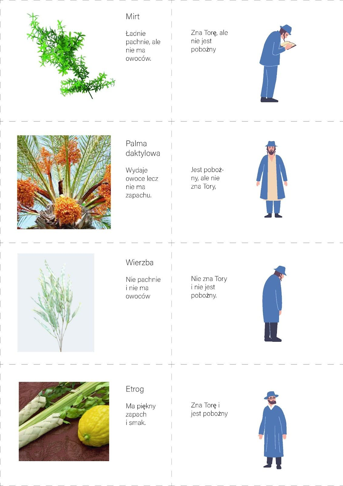

Encontro 2. - "Que venha a Mim"
****************************************

.. tags:: conteudo|abertura|Abertura, conteudo|liberdade|Liberdade, conteudo|espirito-santo|Espírito Santo, conteudo|relacionamentos|Relacionamentos, conteudo|tradicoes-judaicas|Tradições judaicas, metodo|trabalho-com-texto|Trabalho com texto, metodo|trabalho-com-imagem|Trabalho com imagem, tipo|formativo|Formativo

Introdução para o animador
==========================

Este encontro baseia-se em dois elementos importantes relacionados à celebração do Sukkot - a tradição de convidar hóspedes para a tenda, e o carregamento de água da piscina de Siloé. Queremos tratar esses costumes como ponto de partida para refletir sobre nossa própria fé e seus três aspectos - hospitalidade (fé que convida), esforço (fé que exige) e liberdade (fé que liberta). **Durante o encontro utilizaremos materiais que estão no caderno**, por isso vale a pena antes do encontro garantir que os participantes os tenham consigo. Nem todas as perguntas precisam ser feitas, mas queremos que todos os três aspectos da fé sejam abordados. Não propomos nenhuma oração específica para o início e fim do encontro, deixamos liberdade nessa questão. Acreditamos que cada animador adaptará o conteúdo deste encontro ao seu grupo, para que seja o mais frutífero possível ;)

Introdução
==========

Estamos após a experiência de construir juntos a tenda e a conversa online com convidados especiais. Compartilhemos brevemente nossas impressões:

- O que foi para mim construir a tenda? O que levo disso para mim?
- O que mais me marcou da conversa conduzida com nosso convidado?
- Se eu pudesse convidar qualquer pessoa para nossa tenda - quem seria? Por que exatamente essa pessoa?

Olhemos agora um pouco mais de perto a própria tradição de convidar hóspedes durante o Sukkot.

Fé que convida
==============

Na tradição judaica acreditava-se que a cada dia da festa do Sukkot visitam a tenda os ancestrais espirituais do povo judeu, conhecidos como Ushpizin (do aramaico: "hóspedes").

Abraão, por exemplo, deixou a casa de seu pai e foi para uma terra estrangeira por ordem de Deus. José foi vendido como escravo para o Egito. E Moisés fugiu do Egito para Midiã, onde encontrou Deus na sarça ardente. Assim como os Ushpizin abandonaram o que era conhecido e confortável, a serviço do mandamento de Deus, assim nós no Sukkot deixamos a segurança de nossas casas em favor de um abrigo temporário por ordem de Deus. Esta tradição nos ensina que a verdadeira fé é inclusiva, aberta a todos. A festa do Sukkot é projetada para que cada um se encontre nela.

A fé não é um círculo fechado destinado apenas aos escolhidos – é uma casa aberta, na qual cada um encontrará lugar. Não somos nós os anfitriões da fé, mas ela nos acolhe, nos convida e nos dá espaço para crescer. Independentemente de nossa história, fraquezas, dúvidas ou quedas, a fé nos acolhe como somos.

- Como recebo a fé? Como no espaço da minha vida descubro sua hospitalidade?
- De que maneira posso aprender a receber a fé como dom, e não como propriedade?

A festa do Sukkot para os judeus é uma festa alegre. Celebração, alegria da verdade revelada. A fonte da fé em si deve constituir um convite para todos aqueles que ainda buscam essa fé:

    Celebrarás a Festa das Tendas durante sete dias, depois de recolheres os produtos da tua eira e do teu lagar. Nesta festa te alegrarás, tu, teu filho e tua filha, teu servo e tua serva, bem como o levita, o estrangeiro, o órfão e a viúva que estão dentro das tuas portas. Durante sete dias celebrarás a festa em honra do Senhor, teu Deus, no lugar que o Senhor escolher, porque o Senhor, teu Deus, te abençoará em todas as tuas colheitas e em todo trabalho das tuas mãos, e estarás completamente alegre.

    -- Dt 16,13-15

- Qual é para mim o maior desafio, nessa forma de convidar pessoas que ainda buscam a verdade?
- O que posso fazer para transformar minha vivência da fé em Festa do Sukkot?

Um dos elementos da festa do Sukkot era a "reunião" de objetos simbólicos: o fruto do etrog, o ramo da palmeira, a murta e o salgueiro:

    No décimo quinto dia do sétimo mês, quando tiverdes recolhido os produtos da terra, celebrareis a festa do Senhor durante sete dias. O primeiro dia será de descanso solene e o oitavo dia também será de descanso solene. **No primeiro dia tomareis frutos de árvores formosas, ramos de palmeiras, ramos de árvores frondosas e salgueiros das ribeiras**. E vos alegrareis diante do Senhor, vosso Deus, durante sete dias.

    -- Lv 23,39-40

O animador mostra ilustrações preparadas dos objetos com suas características descritas e ilustrações das características das pessoas (ex. É piedoso, mas não conhece a Torá). A tarefa dos participantes é combinar o objeto com a característica que descreve a pessoa.

O rito de reunir os quatro objetos do Sukkot nos conscientiza de que cada um de nós, apesar de características, experiências e tradições únicas, é um elemento inseparável de uma comunidade maior. Isso nos lembra que a diversidade de nossas convicções e formas de vida enriquece o todo, e cada um de nós contribui de forma essencial para construir um mundo harmonioso e coerente.

- Como recebo a fé que nos acolhe como crentes como seus hóspedes – tanto os profundamente dedicados, os da tradição, instruídos mas não praticantes, quanto aqueles que se sentem distantes de Deus?

Celebrar momentos importantes e alegres em nossa vida muitas vezes faz com que queiramos celebrá-los junto com o maior número possível de pessoas. Um bom exemplo disso pode ser um casamento, para o qual geralmente convidamos a família próxima e distante, bem como amigos e conhecidos de diferentes ambientes. Todos se unem naquele dia junto com o jovem casal na alegria comum. Quanto essa perspectiva na fé pode mudar o olhar, por exemplo, sobre a própria Eucaristia, que definitivamente mais do que uma coleção de alguns rituais conhecidos apenas pelos iniciados, é antes de tudo uma festa que nos reúne em torno de uma mesa.

Fé que exige
============

.. note:: Este ponto baseia-se no capítulo 9 do Evangelho de João, que conta inteiramente uma história. Durante o próprio encontro lemos apenas os fragmentos mais importantes, mas encorajamos os líderes a lerem o todo em preparação, isso permitirá captar melhor o contexto

Um elemento importante da celebração da festa do Sukkot é também o rito de extrair água da piscina de Siloé. O sacerdote transporta um jarro cheio até o templo, para lá derramar sobre o altar, pedindo chuva e colheita - este rito tornava-se não apenas uma súplica pela abertura das portas do céu e o envio de chuvas abundantes do período de inverno, mas com o tempo, quando aumentavam os anseios por mudança de situação, quando a fome espiritual crescia entre os filhos de Israel, tornava-se um clamor pelo derramamento das fontes da salvação, Rucha ha-Kodesz, sobre a terra ressecada dos corações humanos, dos assuntos e dos destinos. O caminho que o sacerdote percorre não é fácil e agradável - a rota levava subindo e não era muito curta.

Olhemos agora para a história do Evangelho, na qual uma certa pessoa teve que percorrer esse mesmo caminho:

    Ao passar, Jesus viu um homem cego de nascença. Seus discípulos perguntaram-lhe: "Rabi, quem pecou para que este homem nascesse cego: ele ou seus pais?". Jesus respondeu: "Nem ele pecou nem seus pais, mas isso aconteceu para que nele se manifestem as obras de Deus. Enquanto é dia, é necessário que realizemos as obras daquele que me enviou. Vem a noite, e então ninguém poderá agir. Enquanto estou no mundo, sou a luz do mundo". Dizendo isso, Jesus cuspiu no chão, fez um pouco de lama com a saliva, aplicou-a nos olhos do cego e ordenou-lhe: "Vai e lava-te na piscina de Siloé" – que significa: Enviado. Ele foi, lavou-se e voltou vendo.

    -- Jo 9,1-7

A cura de uma pessoa cega de nascença é considerada pelos judeus como um dos milagres mais extraordinários, que requer a intervenção especial do próprio Deus. Jesus primeiro cria lama e a aplica nos olhos do doente, depois ordena que ele se lave na Piscina de Siloé, simbolizando o Espírito Santo, cujo envio anuncia. Jesus não tanto realiza a cura, mas recria esse homem, assim como Deus modelou Adão do pó da terra e soprou nele o sopro da vida. A cura não aconteceu imediatamente, o cego teve primeiro que percorrer o caminho até a piscina, para depois voltar transformado. Primeiro teve que experimentar a fraqueza e a total dependência dos outros, para poder enxergar. A fé exige de nós confronto com nossa própria pecaminosidade e é um caminho a percorrer, que embora emocionante e alegre, também pode ser difícil e exigente.

- De que maneira eu descreveria meu desenvolvimento espiritual? O que foi mais difícil para mim nesse caminho?
- Em quais espaços me sinto mais dependente dos outros?
- O que em mim precisa ser recriado?

A história desse cego descrita no Evangelho não termina na própria cura. Devido à grande importância que tinha e ao fato de ter sido realizada no sábado, desperta grande interesse entre os fariseus, que convocam esse homem e seus pais para interrogatório. Querem questionar a credibilidade e questionar a capacidade de Jesus de realizar um milagre tão grande, mas o interrogado declara que seu curador deve vir de Deus, caso contrário não poderia ter restaurado sua visão. Isso resulta finalmente em sua expulsão da sinagoga, e consequentemente, em sua exclusão da comunidade. Antes marginalizado devido à deficiência, agora rejeitado devido à fé em Jesus, encontra-se com ele novamente - leiamos:

    Jesus soube que o tinham expulsado. Quando o encontrou, perguntou: "Acreditas no Filho do Homem?". Ele respondeu: "Quem é ele, Senhor, para que eu acredite?". Então Jesus declarou: "É aquele que viste e que está falando contigo". Ele disse: "Creio, Senhor", e prostrou-se diante dele. E Jesus disse: "Vim a este mundo para julgar: Os que não veem, recuperarão a vista, e os que veem, ficarão cegos".

    -- Jo 9,35-39

Este é um dos poucos casos descritos no Evangelho em que Jesus encontra novamente uma pessoa que curou. O Filho do Homem não é mais para esse homem um Messias inatingível e anônimo, mas alguém que conheceu e experimentou sua ação. Agora, quando recuperou a vista, tem em si a disposição de arriscar e apostar tudo naquele que o curou.

- Quando Jesus se tornou para mim aquele que vi?
- Em quais questões é mais difícil para mim confiar em Deus?
- O que significa para mim crer?

O rito de carregar água da piscina de Siloé até o templo é repetido por sete dias consecutivos. Apesar do esforço que isso envolve, tem um caráter extremamente alegre - os rabinos, olhando para trás, diziam que quem não viu a cerimônia de extração da água, não viu em sua vida verdadeira alegria. A fé exige conversão contínua, trabalho constante sobre si mesmo e ao mesmo tempo total confiança em Deus e consciência de como somos dependentes dele. No entanto, essa perspectiva também tem algo libertador.

Fé que liberta
==============

Um momento especial durante as celebrações do Sukkot era o sétimo dia - grande louvor - Hosanna Raba, vivido com grande emoção, sendo ao mesmo tempo uma oração pela salvação dos pecados e pelo perdão. No Evangelho de João temos descrito um evento que acontecia exatamente então:

    No último e mais solene dia da festa, Jesus, de pé, exclamou em alta voz: «Se alguém tem sede, venha a mim e beba! Quem crê em mim, como diz a Escritura, do seu interior fluirão rios de água viva». Ele disse isso a respeito do Espírito, que os que nele cressem haviam de receber; pois o Espírito ainda não tinha sido dado, porque Jesus ainda não tinha sido glorificado.

    -- Jo 7,37-39

- Como a fé em Cristo liberta segundo este fragmento?

Jesus não critica a prática em si, mas indica que o ritual tradicional é apenas um anúncio daquilo que virá em plenitude em sua pessoa e através do dom do Espírito Santo. Através da metáfora da "água viva" Jesus mostra que a verdadeira bênção não vem de rituais externos, mas de uma relação profunda com Deus, que transforma a vida.

Essa reinterpretação enfatiza que a fé que liberta não consiste apenas em observar rituais, mas em abrir o coração à ação do Espírito Santo. Essa abertura traz transformação e renovação interior que ultrapassam o que os ritos tradicionais oferecem.

- Que diferenças você percebe entre a observância formal dos rituais e a experiência autêntica de transformação do coração? Quais são suas reflexões sobre isso?
- De que maneira, cuidando da observância dos rituais, posso experimentar a fé viva?
- Como você interpreta o conceito de "água viva" em sua vida?

Resumo e aplicação
==================

Passando pelas tradições judaicas encontramo-nos com três aspectos de nossa fé: hospitaleiro, exigente e libertador. A fé é um dom que recebemos. Cada um de nós vive sua fé de maneira diferente. Preparando-nos para a conferência que se aproxima, façamo-nos perguntas:

- Por qual dos aspectos sou mais grato a Deus?
- Qual aspecto da minha fé exige de mim trabalho especial?
