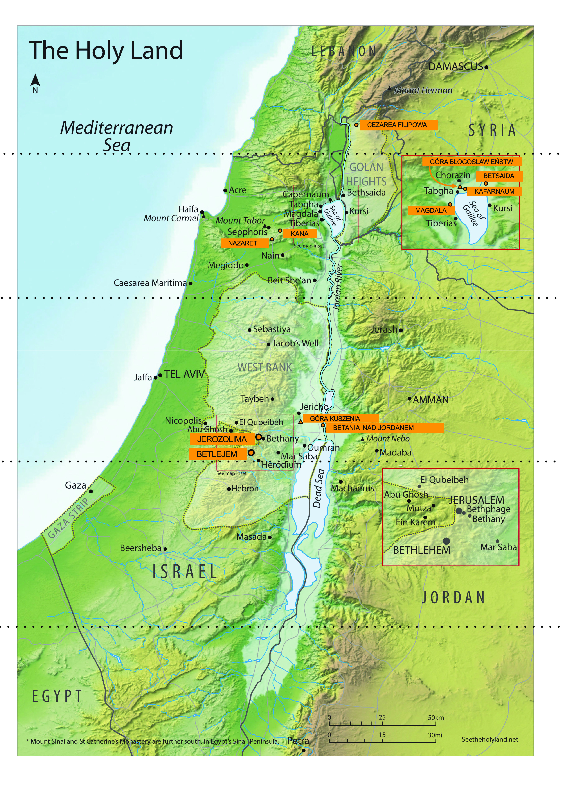

Encontro 4. - Shavuot
**********************

.. tags:: conteudo|missao|Missão, conteudo|palavra-de-deus|Palavra de Deus, conteudo|ressurreicao|Ressurreição, conteudo|tradicoes-judaicas|Tradições judaicas, metodo|trabalho-com-musica|Trabalho com música, metodo|trabalho-em-grupo|Trabalho em grupo, metodo|trabalho-com-texto|Trabalho com texto, tipo|biblico|Bíblico

Introdução para o animador
==========================

Este encontro é o último encontro em grupo dos retiros. Seu principal objetivo é apresentar a ideia de "visão espiritual" e mostrar aos participantes que na Igreja não há lugar para divisão entre plateia e artistas, que a transmissão da fé, reflexões, partilha de como Deus age em nós não é reservada para um grupo restrito de pessoas, mas todos somos chamados, como escreve São Pedro:

    Vós, porém, sois raça eleita, sacerdócio real, nação santa, povo de propriedade exclusiva de Deus, para proclamardes as grandezas* daquele que vos chamou das trevas para a sua maravilhosa luz.

    -- 1Pd 2,9

Além disso, é precisamente a **proclamação** das obras de Deus que é vivificante para aqueles a quem falamos, mas também para nós mesmos - com isso está ligada a responsabilidade e autonomia do cristão. Aprofundamento da fé, mudanças na forma de pensar no mundo, contínua metanoia devem fluir de cada um de nós. Com essa ideia queremos encerrar os encontros em grupo.

Partilha
========

Estamos no momento dos retiros em que os elementos começam a se compor em totalidade. A conferência nos mostrou que as três festas, apesar de temática, tempo, rituais, sentido distintos, podem ser conectadas. Durante a tenda de encontros pudemos tentar na prática conectar não apenas as festas, mas momentos-chave da história da Igreja.

- Onde em minha vida percebo certas conexões? /vida espiritual
- O que me parece no momento presente como elemento que me deu mais?

Visão espiritual
================

Durante nossos retiros buscamos as raízes cristãs. Fizemos isso juntos, o que é sempre uma grande aventura. Os retiros terminam hoje, por isso queremos conversar agora sobre uma certa habilidade que nos ajudará a buscar independentemente a profundidade e as raízes. Por isso comecemos com uma certa experiência.

.. note:: O animador divide o grupo em pares, mas no máximo em 4 grupos (se houver mais de 8 pessoas, que alguns grupos sejam de três pessoas).

Daqui a pouco cada um de nós receberá seu texto, com lugares para preencher e um fragmento coberto. Antes de trabalhar nele ouviremos juntos um fragmento musical. Quando cada grupo terminar sua tarefa, coloca as folhas no centro com breve discussão de qual fragmento recebeu e quais informações preencheu.

.. note:: Temos 4 fragmentos musicais. Os três primeiros são vozes individuais sucessivas da mesma obra "Ubi Caritas" de Ola Gjeilo. O fragmento 4 mostra como todas soam simultaneamente. Ilustra a mudança qualitativa de ver coisas conectadas. Corte as tabelas horizontalmente em 8 pares de fragmentos, e os fragmentos do lado direito cole com post-its, para que não sejam visíveis para os participantes durante a primeira parte da tarefa. Retire os post-its no momento indicado no esquema.

.. important:: baseamos em Dan Stevers "True and better"

.. list-table::
   :widths: 50 50
   :header-rows: 0

   * - A serpente era mais astuta que todos os animais selvagens que o Senhor Deus tinha feito. Ela disse à mulher: "É verdade que Deus disse: Não comereis de nenhuma árvore do jardim?". A mulher respondeu à serpente: "Podemos comer os frutos das árvores do jardim. Mas do fruto da árvore que está no meio do jardim, Deus disse: Não comereis dele, nem nele tocareis, para que não morrais". A serpente disse à mulher: "Não, não morrereis! Mas Deus sabe que, no dia em que comerdes dele, vossos olhos se abrirão e sereis como deuses, conhecendo o bem e o mal". A mulher viu que a árvore era boa para comer, agradável aos olhos e desejável para adquirir sabedoria. Tomou do seu fruto, comeu e deu também ao marido, que estava com ela, e ele comeu.

       -- Gn 3, 1-6

       **Em que lugar se desenrola a ação?**

       ...

       **Qual foi a atitude de Eva e Adão?**

       ...

     - Ele afastou-se deles à distância de um tiro de pedra, ajoelhou-se e orou, dizendo: "Pai, se queres, afasta de mim este cálice! Contudo, não seja feita a minha vontade, mas a tua". Então apareceu-lhe um anjo do céu para fortalecê-lo.

       -- Lc 22,41-43

       **Em que lugar se desenrola a ação?**

       Jardim

       **Qual foi a atitude de Jesus?**

       Obediência

.. list-table::
   :widths: 50 50
   :header-rows: 0

   * - Ele respondeu-lhes: "Tomai-me e lançai-me ao mar, e o mar se acalmará diante de vós, porque sei que por minha causa vos veio esta grande tempestade". Esses homens remavam para voltar à terra, mas não conseguiam, porque o mar se agitava cada vez mais contra eles. Clamaram então ao Senhor: "Ó Senhor, suplicamos-te, não nos deixes perecer por causa da vida deste homem, e não nos imputes o sangue inocente, porque tu, Senhor, fazes como queres". Pegaram Jonas e o lançaram ao mar, e o mar cessou a sua fúria. Então esses homens tiveram grande temor do Senhor, ofereceram sacrifício ao Senhor e fizeram votos.

       -- Jon 1,12-16

       O Senhor enviou um grande peixe para engolir Jonas. Jonas esteve nas entranhas do peixe três dias e três noites. Das entranhas do peixe Jonas orou ao Senhor seu Deus.

       -- Jon 2,1-2

       **Por que Jonas foi lançado ao mar?**

       ...

       **Quantos dias Jonas passou no peixe?**

       ...

     - Vós sabeis o que aconteceu em toda a Judeia, a começar pela Galileia, depois do batismo que João pregou. Conheceis Jesus de Nazaré, como Deus o ungiu com o Espírito Santo e com poder. Ele andou fazendo o bem e curando todos os oprimidos pelo diabo, porque Deus estava com ele. E nós somos testemunhas de tudo o que ele fez na terra dos judeus e em Jerusalém. Eles o mataram, pendurando-o numa cruz. Deus o ressuscitou ao terceiro dia e permitiu que ele se manifestasse, não a todo o povo, mas às testemunhas que Deus havia escolhido de antemão, a nós que comemos e bebemos com ele depois que ressuscitou dos mortos.

       -- At 10, 37-41

       **Por que Jesus foi colocado no túmulo?**

       Para nos salvar

       **Quantos dias Jesus passou no túmulo?**

       3 dias

.. list-table::
   :widths: 50 50
   :header-rows: 0

   * - Isaac disse ao seu pai Abraão: "Meu pai!". Quando ele respondeu: "Eis-me aqui, meu filho" - perguntou: "Eis aqui o fogo e a lenha, mas onde está o cordeiro para o holocausto?". Abraão respondeu: "Deus proverá para si o cordeiro para o holocausto, meu filho". E os dois continuaram caminhando juntos. Quando chegaram ao lugar que Deus indicou, Abraão construiu ali um altar, arrumou a lenha e, amarrando seu filho Isaac, deitou-o sobre a lenha, em cima do altar. Depois Abraão estendeu a mão e pegou a faca para imolar seu filho. Mas o anjo do Senhor gritou-lhe do céu: "Abraão, Abraão!". Ele respondeu: "Eis-me aqui". [O anjo] disse-lhe: "Não estendas a mão contra o menino e não lhe faças nada! Agora sei que temes a Deus, porque não me recusaste teu filho único". Abraão, olhando ao redor, viu um carneiro preso pelos chifres entre os arbustos. Foi então, pegou o carneiro e o ofereceu em holocausto em lugar de seu filho.

       -- Gn 22,7-13

       **Quem nesta cena deveria ser a vítima e por quem oferecida?**

       ...

     - Meus filhinhos, escrevo-vos isto para que não pequeis. Se, porém, alguém pecar, temos um Advogado junto ao Pai - Jesus Cristo, o Justo. Ele é a propiciação pelos nossos pecados, e não somente pelos nossos, mas também pelos pecados de todo o mundo.

       -- 1Jo 2,1-2

       Nisto se manifestou o amor de Deus para conosco: Deus enviou seu Filho unigênito ao mundo, para que vivamos por meio dele. Nisto consiste o amor: não fomos nós que amamos a Deus, mas foi ele que nos amou e enviou seu Filho como propiciação pelos nossos pecados.

       -- 1Jo 4,9-10

       **Quem nesta cena deveria ser a vítima e por quem oferecida?**

       Filho oferecido em sacrifício pelo Pai.

.. list-table::
   :widths: 50 50
   :header-rows: 0

   * - Todo o povo, ouvindo os trovões e os relâmpagos e o som da trombeta e vendo o monte fumegando, teve medo e tremeu, e ficou de longe. E disseram a Moisés: "Fala tu conosco, e nós ouviremos! Mas que Deus não fale conosco, para que não morramos!". Moisés disse ao povo: "Não tenhais medo! Deus veio para vos provar e para que o temor dele esteja diante de vós, para que não pequeis". O povo ficou de longe, mas Moisés aproximou-se da nuvem escura onde estava Deus.

       -- Ex 20,18-21

       Do fogo no monte o Senhor falou convosco face a face. Naquele tempo eu estava entre o Senhor e vós, para vos anunciar as palavras do Senhor, porque tínheis medo do fogo e não subistes ao monte.

       -- Dt 5,4-5

       **Quem era Moisés para o povo nesta cena?**

       ...

     - Mas Cristo, tendo vindo como sumo sacerdote dos bens futuros, através de um tabernáculo maior e mais perfeito, não feito por mãos humanas, isto é, não deste mundo, nem pelo sangue de bodes e bezerros, mas pelo seu próprio sangue, entrou uma vez por todas no Santo dos Santos, obtendo eterna redenção. Pois se o sangue de bodes e bezerros e a cinza de uma novilha, com que se aspergem os impuros, santificam e purificam a carne, quanto mais o sangue de Cristo, que pelo Espírito eterno se ofereceu a si mesmo sem mancha a Deus, purificará a nossa consciência das obras mortas, para servirmos ao Deus vivo. Por isso ele é mediador de uma nova aliança, para que, pela morte ocorrida para remissão das transgressões cometidas sob a primeira aliança, os que foram chamados recebam a promessa da herança eterna.

       -- Hb 9,11-15

       **Quem era Jesus para o povo nesta cena?**

       Mediador entre Deus e o Pai.

.. list-table::
   :widths: 50 50
   :header-rows: 0

   * - Dizei a toda a comunidade de Israel: No décimo dia deste mês, cada um tome um cordeiro por família, um cordeiro por casa. Se a família for pequena demais para um cordeiro, tome-o junto com o vizinho mais próximo de sua casa, conforme o número de pessoas. Calculareis o cordeiro conforme o que cada um pode comer. O cordeiro será sem defeito, macho, de um ano; podereis tomar um cordeiro ou um cabrito. Guardá-lo-eis até o décimo quarto dia deste mês, e toda a comunidade de Israel o imolará ao entardecer. Tomarão do sangue do cordeiro e o porão nos dois umbrais e na verga da porta das casas em que o comerem. [...] Nesta noite passarei pela terra do Egito e ferirei todo primogênito na terra do Egito, desde os homens até os animais, e farei justiça contra todos os deuses do Egito - Eu, o Senhor. O sangue vos servirá de sinal nas casas onde estiverdes. Quando eu vir o sangue, passarei adiante, e não haverá entre vós praga destruidora, quando eu ferir a terra do Egito.

       -- Ex 12,3-7.12-13

       **Para que os israelitas deveriam matar o cordeiro?**

       ...

       **O que resultou da aspersão dos umbrais com o sangue do cordeiro?**

       ...

     - Se invocais como Pai aquele que, sem acepção de pessoas, julga segundo as obras de cada um, vivei com temor durante o tempo da vossa peregrinação. Sabeis que não foi com coisas corruptíveis, como prata ou ouro, que fostes resgatados da vossa vã maneira de viver, recebida por tradição de vossos pais, mas com o precioso sangue de Cristo, como de um cordeiro sem defeito e sem mancha. Ele foi predestinado antes da criação do mundo, mas manifestado nestes últimos tempos por causa de vós. Por ele tendes fé em Deus, que o ressuscitou dos mortos e lhe deu glória, de modo que a vossa fé e esperança estão em Deus.

       -- 1Pd 1,17-21

       **Para que Jesus foi morto?**

       Para salvar as pessoas.

       **O que resulta da aspersão no Sangue de Jesus?**

       Vida eterna

.. list-table::
   :widths: 50 50
   :header-rows: 0

   * - O Senhor disse a Abrão: "Sai da tua terra, da tua parentela e da casa de teu pai, e vai para a terra que eu te mostrarei. Farei de ti uma grande nação, e te abençoarei, e tornarei grande o teu nome, de modo que serás uma bênção. Abençoarei os que te abençoarem e amaldiçoarei os que te amaldiçoarem; em ti serão benditas todas as famílias da terra". Abrão partiu, como o Senhor lhe ordenara, e Ló foi com ele. Abrão tinha setenta e cinco anos quando saiu de Harã. Abrão levou consigo sua mulher Sarai, seu sobrinho Ló, todos os bens que possuíam e os servos que haviam adquirido em Harã, e partiram para a terra de Canaã.

       -- Gn 12,1-5

       **Como Abraão cumpriu a ordem de Deus?**

       ...

     - E o Verbo se fez carne* e habitou entre nós. E nós vimos a sua glória, glória como do unigênito do Pai, cheio de graça e de verdade.

       -- Jo 1, 14

       Tende em vós o mesmo sentimento que houve também em Cristo Jesus. Ele, subsistindo em forma de Deus, não julgou como usurpação o ser igual a Deus, mas esvaziou-se a si mesmo, tomando a forma de servo, tornando-se semelhante aos homens. E, achado na forma de homem, humilhou-se a si mesmo, sendo obediente até a morte, e morte de cruz.

       -- Fl 2,1-8

       **Como Jesus cumpriu a ordem de Deus?**

       Tornando-se obediente e fundando o Novo Povo de Deus.

.. list-table::
   :widths: 50 50
   :header-rows: 0

   * - "Todos os servos do rei e o povo das províncias do rei sabem que há uma lei, tanto para homem quanto para mulher, que se dirigem ao rei no pátio interior sem serem chamados: devem ser mortos, a menos que o rei estenda sobre eles o cetro de ouro, então permanecerão vivos. Mas a mim não me chamaram para ir ao rei há trinta dias". E comunicaram a Mardoqueu as palavras de Ester. Então Mardoqueu disse para responderem a Ester: "Não penses no teu coração que te salvarás na casa do rei, só tu entre todos os judeus, porque se tu te calares neste tempo, livramento e socorro para os judeus virão de outro lugar*, mas tu e a casa de teu pai perecereis. E quem sabe se não foi para um tempo como este que chegaste à realeza?". E Ester disse para responderem a Mardoqueu: "Vai, reúne todos os judeus que se encontram em Susa. Jejuai por mim, não comendo nem bebendo três dias, de noite e de dia. Eu e minhas moças também jejuaremos assim. Depois irei ao rei, embora seja contra a lei, e se perecer, perecerei".

       -- Est 4,11-16

       **O que Ester arrisca?**

       ...

       **Para que Ester arrisca?**

       ...

     - Eu sou o bom pastor. O bom pastor dá a vida pelas ovelhas.

       -- Jo 10,11

       Porque Deus amou tanto o mundo, que deu o seu Filho unigênito, para que todo aquele que nele crê não pereça, mas tenha a vida eterna.

       -- Jo 3,16

       **O que Jesus arrisca?**

       Sua vida

       **Para que Jesus arrisca?**

       Para salvar seu povo

| *O animador reproduz o 1. fragmento musical e distribui as primeiras cartas de trabalho.*
| `👉 Ouça <https://konspekty.ponadmurami.pl/_static/chleb_wino_miod_1.mp3>`_

| *Colocamos as cartas no centro. O animador reproduz o 2. fragmento musical e distribui as segundas cartas de trabalho.*
| `👉 Ouça <https://konspekty.ponadmurami.pl/_static/chleb_wino_miod_2.mp3>`_

| *O animador reproduz o 3. fragmento musical e passamos às perguntas.*
| `👉 Ouça <https://konspekty.ponadmurami.pl/_static/chleb_wino_miod_3.mp3>`_

Deixemos por enquanto as folhas que preparamos.

- Qual das Festas de Peregrinação é intuitivamente próxima de mim? O que isso me diz sobre minha espiritualidade?
- Prefiro ler a Sagrada Escritura em capítulos inteiros ou em perícopes individuais?

| *O animador reproduz o 4. fragmento musical. Arrancamos os post-its que cobrem os fragmentos nas cartas de trabalho.*
| `👉 Ouça <https://konspekty.ponadmurami.pl/_static/chleb_wino_miod_4.mp3>`_

Após um momento de leitura espontânea do que revelamos nas cartas, passamos imediatamente para a leitura:

    No mesmo dia, dois deles iam para uma aldeia chamada Emaús, distante sessenta estádios* de Jerusalém. Conversavam entre si sobre tudo o que havia acontecido. Enquanto conversavam e discutiam, o próprio Jesus se aproximou e começou a caminhar com eles. Mas os olhos deles estavam como que impedidos de reconhecê-lo. Ele lhes perguntou: "Que palavras são essas que trocais entre vós pelo caminho?". Eles pararam com ar triste. Um deles, chamado Cléofas, respondeu-lhe: "És tu o único peregrino em Jerusalém que não sabe o que lá aconteceu nestes dias?". Ele perguntou: "Que foi?". Responderam-lhe: "O que aconteceu com Jesus de Nazaré, que era um profeta poderoso em obras e palavras diante de Deus e de todo o povo; como os sumos sacerdotes e nossos chefes o entregaram para ser condenado à morte e o crucificaram. Nós esperávamos que fosse ele quem havia de libertar Israel. Mas, com tudo isso, já faz três dias que essas coisas aconteceram. Além disso, algumas mulheres do nosso grupo nos assustaram: foram de madrugada ao túmulo e, não encontrando o corpo dele, voltaram dizendo que tiveram uma visão de anjos, que afirmam que ele está vivo. Alguns dos nossos foram ao túmulo e encontraram tudo como as mulheres tinham dito, mas a ele não viram". Então ele lhes disse: "Ó néscios e lentos de coração para crer em tudo o que os profetas disseram! Não era necessário que o Cristo sofresse essas coisas e entrasse na sua glória?". E, começando por Moisés e seguindo por todos os profetas, explicou-lhes o que em todas as Escrituras se referia a ele. Quando se aproximaram da aldeia para onde iam, ele fez como quem ia adiante. Mas eles o forçaram, dizendo: "Fica conosco, porque já é tarde e o dia já declina". Então entrou para ficar com eles. Quando estava à mesa com eles, tomou o pão, abençoou-o, partiu-o e lhes deu. Então os olhos deles se abriram e o reconheceram, mas ele desapareceu da vista deles. E disseram um ao outro: "Não estava o nosso coração ardendo quando ele nos falava pelo caminho e nos explicava as Escrituras?". Na mesma hora levantaram-se e voltaram para Jerusalém. Lá encontraram reunidos os Onze e os que estavam com eles, que lhes disseram: "O Senhor ressuscitou verdadeiramente e apareceu a Simão". Eles também contaram o que lhes acontecera no caminho e como o reconheceram ao partir o pão.

    -- Lc 24, 13-35

- O que significa para mim essa conexão de exemplos musicais, cartas de trabalho e Evangelho dos discípulos de Emaús?
- Quando e onde foi meu Emaús, momento de "abertura dos olhos" quando certas coisas se conectaram juntas?
- O que é difícil em ver coisas conectadas?

Em Hamlet, William Shakespeare mostra uma cena em que o protagonista confidencia a Horácio que vê o fantasma de seu pai morto. À pergunta "Onde?" responde: **"Diante dos olhos da minha alma"**. Para perceber a realidade escondida na profundidade é necessária a visão espiritual. Essa é uma intuição-chave na espiritualidade. Essa intuição do poeta, embora expressa em contexto completamente diferente, refere-se à nossa fé:

    Quando fazemos isso durante a celebração da Eucaristia, temos diante dos olhos da alma o mistério pascal.

    -- Ecclesia de Eucharistia

- O que é para mim a visão espiritual?
- De que maneira cuido da minha visão espiritual?

Leiamos:

    Os discípulos aproximaram-se dele e perguntaram: "Por que lhes falas por parábolas?".* Ele respondeu: "Porque a vós foi dado conhecer os mistérios do reino dos céus, mas a eles não foi dado*. * Pois a quem tem, será dado e terá em abundância; mas a quem não tem, será tirado até o que tem. Por isso lhes falo por parábolas, porque, vendo, não veem e, ouvindo, não ouvem nem compreendem. Neles se cumpre a profecia de Isaías*: Ouvireis e não compreendereis, olhareis e não vereis.

    -- Mt 13,10-14

Às vezes podemos querer gritar "por que ninguém nunca nos explicou a conexão dessas festas?" ou "por que ninguém me mostrou logo do que se trata?".

O mistério cristão não consiste no fato de existir um livro guardado, cujo conteúdo apenas poucos conhecem (e por isso é mistério). O mistério cristão consiste no fato de que tudo "está na mesa" e é público, mas poucos o compreendem. O próprio Jesus via assim. Para chegar ao mistério é preciso ter visão espiritual, é preciso cuidar dela, é preciso treiná-la.

- Como podemos nos ajudar mutuamente a exercitar nossa visão espiritual?
- O que é para mim o maior desafio no treinamento da visão espiritual?

Seria mais fácil se "alguém" viesse e nos explicasse tudo, e nós "consumíssemos" isso e nos alegrássemos com isso. Parece, porém, que não é essa a intenção do Altíssimo.

Não há plateia e artista
========================

Leiamos:

    Simão Pedro, servo e apóstolo de Jesus Cristo, aos que pela justiça de nosso Deus e Salvador Jesus Cristo receberam uma fé igualmente preciosa como a nossa: Graça e paz vos sejam multiplicadas pelo conhecimento de Deus e de Jesus, nosso Senhor! Assim como o seu divino poder nos deu tudo o que diz respeito à vida e à piedade, mediante o conhecimento daquele que nos chamou pela sua glória e virtude. Por meio delas nos foram dadas as preciosas e maiores promessas, para que por elas vos torneis participantes da natureza divina*, depois de vos terdes afastado da corrupção que há no mundo por causa da concupiscência. Por isso mesmo, empregai toda a diligência em juntar à vossa fé a virtude, à virtude o conhecimento, ao conhecimento a temperança, à temperança a paciência, à paciência a piedade, à piedade a fraternidade, à fraternidade o amor. Pois se essas coisas existirem e abundarem em vós, não vos deixarão ociosos nem infrutuosos no conhecimento de nosso Senhor Jesus Cristo. Pois aquele a quem faltam essas coisas é cego, míope e esqueceu-se da purificação dos seus antigos pecados. Portanto, irmãos, procurai com mais empenho confirmar a vossa vocação e eleição! Fazendo isso, nunca tropeçareis. Dessa forma vos será amplamente aberta a entrada para o reino eterno de nosso Senhor e Salvador Jesus Cristo.

    -- 2Pd 1,1-11

Comecemos com duas perguntas rápidas:

- A quem São Pedro escreve essas palavras?
- O que ele enfatiza falando sobre o grupo receptor?

Escreve a todos que receberam "fé igualmente preciosa como a nossa". São Pedro, primeiro papa, bispo não coloca nenhum muro entre sua fé e a de cada um que creu.

.. note:: O fragmento abaixo pode ser omitido se for apresentado na forma de testemunho do animador

Às vezes nos parece que para dar algo à Igreja é preciso ser alguém especial. Parece-nos que na fé existe divisão entre "artistas" no palco, que podem falar, ser líderes, mudar o mundo, definir novas direções, influenciar a realidade e a chamada "restante", que está sentada na plateia e pode apenas se posicionar a favor ou contra algumas ideias. Na fé o chamado é dirigido a todos, não há palco e plateia, todos somos enviados, para desenvolver nosso relacionamento com Deus, contemplar, discernir, discutir, e os frutos desses processos transmitir adiante. Não precisamos ter mandato para ligar a visão espiritual e começar a conectar os pontos. Mais ainda, isso acontece não apenas em situações como a Meditação da Palavra de Deus, na qual exatamente fizemos isso, mas simplesmente em cada esfera da vida. Cada um de nós tem potencial para ir em profundidade, olhar entre as linhas, buscar sentido e compartilhar o que descobrir. Somos enviados para ser sal da terra, e portanto também aqueles que provocarão essas excursões em profundidade].

- Que sentimentos desperta em mim a imagem de que não há oposição plateia-artista?
- O que podemos fazer para romper o sentimento presente em nós de que o presbitério é o palco e as naves são a plateia?
- Quem assumiu responsabilidade para que eu visse a totalidade, e não apenas partes da fé?
- Por quem eu assumo responsabilidade para que veja a totalidade, e não apenas partes da fé?

Dois mares de Israel
====================

.. note:: Retiramos um mapa mostrando o curso do Jordão junto com dois mares: o Mar (lago) da Galileia e o Mar Morto. Corte-o em tiras marcadas por linhas pontilhadas (o mapa deve ser preparado e cortado antes do encontro). Depois junto com os participantes montem o mapa começando de cima (das fontes do Jordão) prestando atenção aos pontos característicos descritos em laranja. Trata-se de que os participantes vejam lugares conhecidos por eles de vários fragmentos do Evangelho.

O animador deve relembrar os seguintes lugares e fragmentos antes do encontro:

Cesareia de Filipe
    Jesus leva os discípulos a Cesareia de Filipe (Mt 16, 13-20)
Cafarnaum
    Cura do servo do centurião de Cafarnaum (Mt 8, 5-13), Discurso Eucarístico (Jo 6, 22-71)
Nazaré
    cidade natal de Jesus
Betsaida
    cura do cego (Mc 8, 22-26) + de Betsaida Jesus levou os discípulos a Cesareia de Filipe, notemos que distância é essa.
Mar da Galileia
    multiplicação dos pães (Jo 6, 1-15)
Magdala
    lugar de origem de Maria Madalena
Monte das Bem-aventuranças
    Oito Bem-aventuranças (Mt 5, 1-12)
Caná
    milagre nas bodas, início da atividade pública de Jesus (Jo 2, 1-12)
Monte da tentação
    lugar do jejum de quarenta dias de Jesus (Lc 4, 1-13)
Betânia sobre o Jordão
    lugar do batismo de Jesus (Mt 3, 13-17)
Belém
    lugar do nascimento de Jesus (Lc 2, 4-7)
Jerusalém
    ver por exemplo fragmentos Mt 21, ensino no templo

Não queremos dedicar muito tempo aqui, mas rapidamente lembrar que esses lugares nos são conhecidos. O essencial é ver o curso do Jordão, que flui através do Mar (lago) da Galileia, depois deságua no Mar Morto.

Após montar o mapa, tendo já a imagem do todo, leiamos o fragmento:

    Em Israel há dois mares: o da Galileia (Kinneret) e o Morto. São tão diferentes quanto se pode imaginar. O Mar da Galileia está cheio de vida, e o Mar Morto, como o próprio nome indica, não tem vida alguma. É estranho que ambos os mares sejam alimentados pelo mesmo rio – o Jordão. Qual é a diferença entre esses dois mares? A resposta é que o Mar da Galileia recebe água, mas também a entrega na outra extremidade, enquanto o Mar Morto recebe água, mas não a entrega.

    -- fragmento - Rabbi Lord Jonathan Sacks: To heal a fractured world, Conferência Sinai Indaba 2015.

Já chamamos atenção para o fato de que todos somos chamados à fé frutífera, para que de nossa vida espiritual fluam frutos que valem a pena compartilhar com outros. Os dois mares são imagem de que é precisamente a fé que recebe e transmite adiante que é viva e edificante, quando porém apenas recebemos e nada flui de nós adiante, podemos cair em estagnação.

- De que maneira posso realmente cuidar para ser mais como o Mar da Galileia?
- O que em minha vida espiritual caiu no Mar Morto?

Encerramento e aplicação
=========================

Convencemo-nos neste encontro de que podemos exercitar nossa visão espiritual, aprendendo a perceber o sentido mais profundo dos eventos e conexões não óbvias no mundo. Lembremo-nos também de que vale a pena transmitir o que descobrimos adiante.

Leiamos:

    Por isso também eu, tendo ouvido falar da vossa fé no Senhor Jesus e do vosso amor para com todos os santos, não cesso de dar graças por vós, fazendo menção de vós nas minhas orações. [Peço neles] que o Deus de nosso Senhor Jesus Cristo, o Pai da glória, vos dê espírito de sabedoria e de revelação* no pleno conhecimento dele. [Que dê] aos olhos do vosso coração luz, para que saibais qual é a esperança do vosso chamado, qual a riqueza da glória da sua herança nos santos.

    -- Ef 1,15-18

- Com que esperança volto desses retiros?

Como aplicação deste encontro voltemos à pergunta: **De que maneira posso realmente cuidar para ser mais como o Mar da Galileia?** e nossas respostas. Se ainda não as temos, voltemos a essa pergunta no tempo livre e planejemos passos reais que faremos no futuro próximo.
