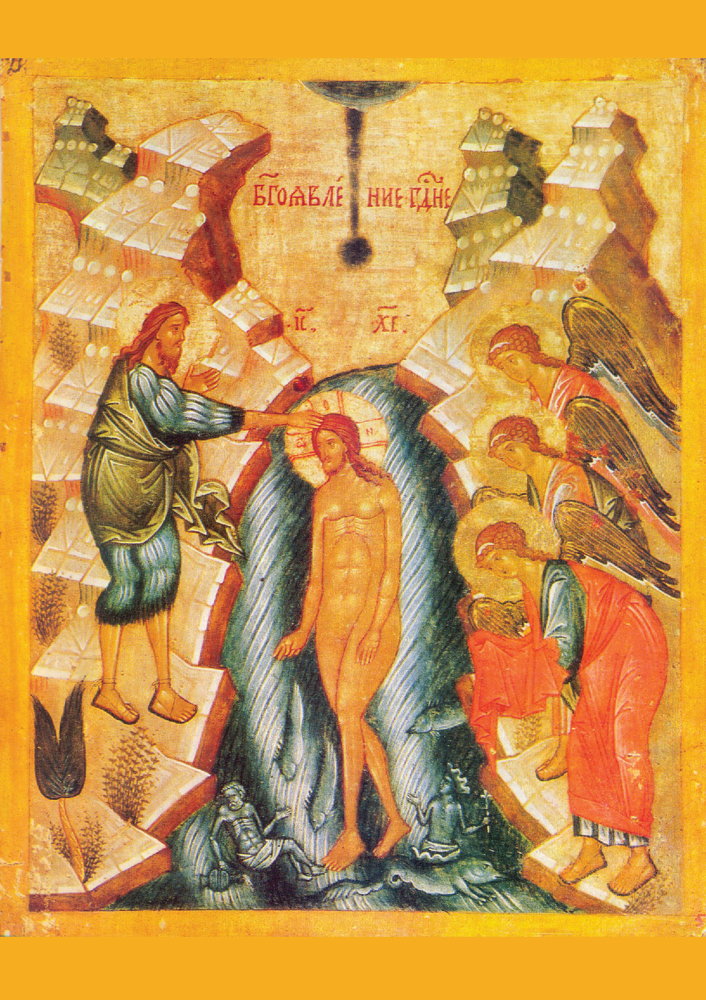

Encontro 4. - Velho-Novo
**************************

.. tags:: conteudo|eucaristia|Eucaristia, conteudo|palavra-de-deus|Palavra de Deus, conteudo|igreja|Igreja, conteudo|ressurreicao|Ressurreição, conteudo|missao|Missão, conteudo|tradicoes-judaicas|Tradições judaicas, metodo|trabalho-com-imagem|Trabalho com imagem, metodo|trabalho-em-grupo|Trabalho em grupo, tipo|mistagogico|Mistagógico

Introdução para o animador
==========================

O quarto encontro é um dos últimos pontos do retiro, portanto, constitui um lugar de resumo. A imagem que queremos que os participantes levem consigo do encontro é a conexão do Velho e do Novo, que é realizada por crentes conscientes. Para isso serve uma dinâmica simples [os materiais impressos e os "clips" serão fornecidos aos animadores - no final do esquema encontram-se imagens para estabelecer o contexto].

Introdução
==========

Atrás de nós está a noite do Sêder - o ponto culminante do retiro. Queríamos experimentar através da ceia do Sêder a profunda conexão entre a Eucaristia e o Sêder! No entanto, essa não foi a única "conexão" que queríamos viver! Todo o nosso retiro orbita em torno de três espaços.

.. note:: O animador tira sobre a mesa cartões com as palavras escritas: Antigo Testamento, Novo Testamento, Sêder, Eucaristia, Profetas e Apóstolos.

.. |d1| image:: seder.jpg
   :scale: 33%
.. |d2| image:: eucharystia.jpg
   :scale: 33%
.. |d3| image:: prorocy.jpg
   :scale: 33%
.. |d4| image:: apostolowie.jpg
   :scale: 33%
.. |d5| image:: stary_testament.jpg
   :scale: 33%
.. |d6| image:: nowy_testament.jpg
   :scale: 33%

+------+------+------+
| |d1| | |d3| | |d5| |
+------+------+------+
| |d2| | |d4| | |d6| |
+------+------+------+

Entramos neste retiro despertando em nós a atenção e a curiosidade. Tentemos então neste encontro "recolher" o que jaz diante de nós. O primeiro espaço que queremos considerar é Sêder-Eucaristia.

- O que foi vivo para mim no próprio Sêder?
- Que valor flui para mim da conexão Sêder-Eucaristia?

Não pior do que...
==================

O segundo espaço que queremos considerar são Profetas-Apóstolos.

- [Pergunta para todos] Onde foi notável este espaço no retiro?

É a Hagadá - contávamos mutuamente as grandes obras do nosso Deus! Isso é precisamente ser um Apóstolo. Paramo-nos todos juntos ao lado de Isaías, Jeremias, Ezequiel, Daniel, Oseias, Joel, Amós, Obadias, Jonas, Miqueias, Naum, Habacuque, Sofonias, Ageu, Zacarias e Malaquias... ao lado de Simão Pedro, André, Tiago, João, Filipe, Bartolomeu, Tomé, Mateus, Simão o Zelote, Tiago filho de Alfeu e Judas... para dizer que Deus é bom!

- Como me senti no papel de contar a História da Salvação?
- Em que difere para mim a situação de que contávamos com as nossas próprias palavras de ler da Sagrada Escritura?

Abram o caderno na introdução. Ali encontra-se a declaração da diaconia Ponad Murami de que criamos estes retiros com a profunda esperança de que o Bom Deus nos permita aqui conectar a escuta atenta aos profetas e apóstolos, e que apenas através do ato de conectar podemos aproximar-nos de Deus-Comunidade.

Na última linha do primeiro parágrafo falta um ponto, verdade? É o nosso procedimento deliberado. Se quiseres, escreve ali depois da vírgula agora o teu nome e/ou termina com um ponto.

.. note:: Pode-se fazer referência aos convites para o retiro. Colocávamos citações, perguntando se o disse alguém da diaconia ou alguém "sábio e famoso" (como Bento XVI ou Santa Teresa da Cruz). Foi uma experiência difícil para muitos de nós "permitir-nos" até mesmo a possibilidade de pensar que alguém pode confundir as nossas palavras com "alguém tão grande".

- [para os que escreveram] Como te sentes inscrevendo-te em tal grupo?
- [para os que não escreveram] O que teria que acontecer para que pudesses inscrever-te ali?

Cola
====

O terceiro espaço é o Antigo Testamento e o Novo Testamento. Meditamos hoje a imagem do ancião e do jovem. A relação Velho-Novo é muito importante para nós. Há nela uma tentação de reconhecer reflexivamente que "o novo é melhor! Para que ocupar-se do que é velho?".

Leiamos:

    Porque, em parte, conhecemos, e em parte profetizamos; Mas, quando vier o que é perfeito, então o que o é em parte será aniquilado. Quando eu era menino, falava como menino, sentia como menino, discorria como menino, mas, logo que cheguei a ser homem, acabei com as coisas de menino. Porque agora vemos por espelho em enigma, mas então veremos face a face; agora conheço em parte, mas então conhecerei como também sou conhecido. Agora, pois, permanecem a fé, a esperança e o amor, estes três, mas o maior destes é o amor.

    -- 1 Co 13,9-13

- [A todos] São Paulo sugere que estando no NT tudo está já descoberto?
- O que isso me diz?

O Antigo Testamento não trata sobre algo completamente diferente do Novo Testamento. De maneira semelhante, a vida na terra como povo peregrino não consiste em algo drasticamente diferente do que estar no céu! Há diferenças importantes das quais vale a pena dar-se conta - não é verdade, no entanto, que há muito mais semelhanças que nos "escapam"? Vemos e olhamos o mesmo - apenas o grau em que somos capazes de o fazer é diferente (vemos em enigma).

- Que significado tem para mim a continuidade na fé?

Leiamos:

    E, chegando a Nazaré, onde fora criado, entrou num dia de sábado, segundo o seu costume, na sinagoga, e levantou-se para ler. E foi-lhe dado o livro do profeta Isaías; e, quando abriu o livro, achou o lugar em que estava escrito: O Espírito do Senhor é sobre mim, Pois que me ungiu para evangelizar os pobres. Enviou-me a curar os quebrantados de coração, A pregar liberdade aos cativos, E restauração da vista aos cegos, A pôr em liberdade os oprimidos, A anunciar o ano aceitável do Senhor. E, cerrando o livro, e tornando-o a dar ao ministro, assentou-se; e os olhos de todos na sinagoga estavam fitos nele. Então começou a dizer-lhes: Hoje se cumpriu esta Escritura em vossos ouvidos.

    -- Lc 4,16-21

- Como Jesus conecta e assegura a continuidade?

.. note:: O animador tira um clipe grande e pega em 6 cartões da mesa juntando-os em pares de tal maneira que se forme um "folheto" que consiste em 6 cartões. Juntamos dois cartões "com as inscrições para si" - "Antigo Testamento" e "Novo Testamento", depois "Sêder" e "Eucaristia" e no final "Profetas" "Apóstolos". Colocamos tais três pares um após o outro e com o clipe grande ["Jesus"] conectamo-los ao longo da borda mais longa.

- O que na minha fé "se separa" e eu gostaria que fosse conectado por Jesus?

Leiamos:

    A luz dos povos é Cristo: por isso, este sagrado Concílio, reunido no Espírito Santo, deseja ardentemente iluminar todos os homens com a Sua claridade, que resplandece no rosto da Igreja, anunciando o Evangelho a toda a criatura. E porque a Igreja é, em Cristo, como que o sacramento, ou sinal, e o instrumento da íntima união com Deus e da unidade de todo o género humano, pretende ela, dando continuidade aos Concílios anteriores, pôr de manifesto com maior insistência, aos seus fiéis e a todo o mundo, a sua natureza e missão universal. As condições do nosso tempo tornam ainda mais urgente este dever da Igreja, para que todos os homens, hoje mais estreitamente ligados uns aos outros, pelos diversos laços sociais, técnicos e culturais, alcancem também a plena unidade em Cristo.

    -- Lumen Gentium 1

.. note:: O animador tira um segundo clipe grande ["Igreja"] e reforça adicionalmente a conexão.

- Onde vejo que a Igreja conecta estes espaços?

A Igreja é "toda tecida" de conexão! Na Missa lemos o Antigo e o Novo Testamento. A estrutura da Igreja é simultaneamente hierárquica e sinodal. A Igreja fortalece o indivíduo e fala da necessidade de uma relação pessoal com Deus, mas dentro de uma ampla comunidade, etc.

.. note:: O animador tira vários clipes pequenos e distribui-os a cada um dos participantes. Adicionamo-los aos dois existentes.

- Como conecto eu as coisas na espiritualidade?
- Que coisas gostaria de conectar?

Mergulhar na morte
==================

Conectar é difícil! É difícil livrar-se do julgamento, da tentação de escolher e promover. É difícil para mim ver-me a mim mesmo tanto no jovem como no sábio **ao mesmo tempo**. Talvez o tempo todo sintamos em algum lugar o imperativo de "tomar partido". O que diz Jesus a isto?

Olhemos para o ícone:

- O que representa este ícone?
- Quem são as pessoas na água do Jordão?
- A que alude a forma da água?

Cristo durante o batismo no Jordão conecta a história do dilúvio [a água apaga o pecado] com a "fonte de água viva". O Jordão é tanto um túmulo como um seio. Conecta o mundo dos anjos com o mundo dos homens. Conecta o início da sua missão, com a morte e ressurreição que virá. Jesus conecta a vida e a morte.

- O que significa para mim mergulhar na morte de Jesus?

Precisamos deste mergulho. Só ele pode dar-nos a oportunidade de "ver o mundo de outra maneira". Afastará a tentação de "organizar o mundo desde o início" e pode despertar o desejo de compreender por que é assim e não de outra maneira. Devemos morrer e ressuscitar para a vida com Cristo! "Desperta, tu que dormes, e levanta-te dentre os mortos, e Cristo te esclarecerá" (Ef 5, 14). Nesta pobreza espiritual parece que está a capacidade de conectar.

Tríduo
======

Recentemente morreu um homem que escreveu mais de 60 livros, 3 encíclicas e 4 exortações. Houve um tempo em que provavelmente tinha o maior conhecimento teológico entre os vivos na terra. As suas últimas palavras foram:

    Amo-te Jesus!

    -- Bento XVI

Esta capacidade de simplificar, de extrair a essência é indispensável para nós. Não nos importa que saias deste retiro com 20 páginas de notas. Importa-nos que leves uma frase, mas uma que tenhas ouvido de Deus.

Diante de nós está o Tríduo Pascal. Um tempo onde haverá inimaginavelmente mais conteúdo do que durante o nosso encontro.

- O Tríduo é ainda para nós uma fonte de perguntas?
- A que pergunta minha é resposta o Tríduo?
- Como através da minha vivência do Tríduo posso amar mais fortemente a pessoa ao meu lado?

Que a aplicação deste encontro seja uma frase anotada hoje no caderno. O autor pode ser Isaías, Jeremias, Jesus - claro... também podes ser Tu. Não assines de quem é a frase. Isso não tem tanta importância!
