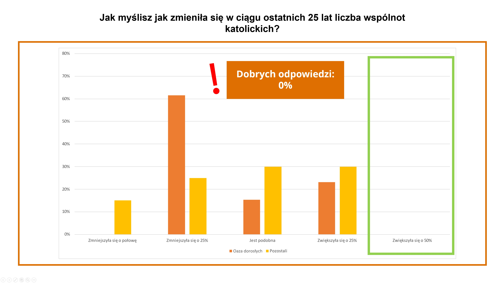

Encontro 2. - Abertura sobrenatural
************************************

.. tags:: conteudo|abertura|Abertura, conteudo|igreja|Igreja, conteudo|verdade|Verdade, conteudo|eucaristia|Eucaristia, conteudo|conversao|Conversão, metodo|trabalho-com-imagem|Trabalho com imagem, metodo|trabalho-com-texto|Trabalho com texto, tipo|oficina|Oficina

Introdução para o animador
===========================

Neste encontro queremos aprofundar o tema da abertura. Mostrar dois tipos: a abertura humanística e a abertura sobrenatural, que é o conteúdo da devoção Effatha, que viveremos hoje. O encontro tem como objetivo principal preparar os participantes para compreender e viver este momento do retiro. Neste encontro também queremos encorajar os participantes a prestar atenção ao fato de que a abertura humanística complementada com a sobrenatural formam uma totalidade, graças à qual temos a capacidade de nos alimentarmos do que já conhecemos, de contemplar mais profundamente e de perceber as coisas com uma qualidade diferente de olhar.

Introdução
==========

Atrás de nós há muitos conteúdos interessantes. Falamos sobre expandir o coração, sobre Deus que inspira, sobre a abertura de Jesus, estivemos na oração vespertina, onde pudemos em certo sentido nos encarnar em Nicodemos, ouvimos a conferência de Ariel. Compartilhemos o que até agora:

* Como a oração de ontem influenciou minha espiritualidade?
* O que me comoveu na conferência de Ariel?
* O que é para mim a abertura sobrenatural?

Ontem falamos muito sobre a abertura ao mundo, a abertura mútua, a Deus; sobre a curiosidade que vale a pena despertar uma e outra vez de novo. Hoje queremos examinar a abertura um pouco mais profundamente.

.. note:: Aqui nos referimos à abertura humana, tal como a entendemos intuitivamente, a abertura racional. Na parte seguinte do esquema discute-se a abertura sobrenatural, aquela que não flui do homem e sua vontade de ter uma atitude de abertura em relação a algo, mas de Deus, que nos abre de maneira mais profunda e completa.

Duas aberturas
==============

Inclinemo-nos sobre a abertura mais uma vez e vejamos que ela pode ser dividida (ou melhor, estendida) em dois fenômenos. O primeiro deles é a abertura humanística - ela apareceu ontem muitas vezes. Sabemos que é uma atitude que deve ser cultivada e cuidada.

.. note:: Neste momento o animador distribui aos participantes um questionário (anexado ao esquema). As perguntas do questionário provêm do Relatório sobre a Igreja (que foi publicado em 2023). As perguntas se referem a diferentes aspectos da vida da Igreja, que frequentemente são objeto de distorções, meias-verdades ou até mentiras. A realidade às vezes parece muito mais positiva do que esperaríamos. O animador deve se familiarizar com as perguntas e respostas antes de começar o encontro, para que os resultados do questionário não sejam uma surpresa para ele mesmo. Após realizar o questionário, o animador mostra as respostas verdadeiras (gráficos anexados ao esquema), que muito provavelmente no grupo de partilha também serão uma grande surpresa. Nos gráficos são mostrados os resultados de uma das comunidades em Knurow, onde o mesmo workshop foi realizado há alguns meses, e as marcas que indicam quais respostas são corretas. O objetivo deste exercício é mostrar que embora sejamos membros da Igreja, frequentemente sabemos muito pouco sobre ela, e nosso conhecimento em muitos elementos não está completo.

Como você acha que mudou nos últimos 20 anos o número de pessoas que se declaram como praticantes regulares?
    1. Aumentou em 10%
    2. Diminuiu em 20%
    3. Diminuiu em 33%
    4. Diminuiu em 50%

Como você acha que mudou nos últimos 25 anos o número de comunidades católicas na Polônia?
    1. É similar
    2. Diminuiu em 25%
    3. Diminuiu pela metade
    4. Aumentou em 50%

Quantos voluntários no país você acha que estão envolvidos em organizações eclesiais?
    1. 25%
    2. 50%
    3. 75%
    4. 90%

.. image:: praktykujacy.jpg
   :align: center

.. image:: wolontariusze.jpg
   :align: center

* O que me surpreendeu neste exercício?
* Como vejo a Igreja, que na realidade parece talvez melhor do que em minhas convicções?
* Qual espaço da minha vida precisa deste workshop atualmente?

**A abertura humanística** está estreitamente relacionada com a disposição para coisas novas, inexploradas. A pessoa aberta está preparada para "testar" continuamente suas convicções. Como pudemos observar no questionário, os aspectos de nossa vida que eram naturais para nós, bem conhecidos, nem sempre são óbvios, e nosso conhecimento com o tempo pode se tornar obsoleto e precisar de um olhar fresco.

No questionário pudemos observar apenas um dos tipos de verificação de nosso conhecimento e convicções, a saber, a transformação de nosso pessimismo e falta de paixão em um novo e fresco olhar à realidade. Quando invertemos a situação dada no questionário, notaremos que o otimismo excessivo e as expectativas excessivas (quando esperamos fogos de artifício) também podem ser verificados pela realidade de maneira bastante clara.

A vida espiritual consiste em ambos os aspectos, vale a pena que este workshop nos ajude a assimilá-lo. Para mostrar o segundo aspecto da verificação de nossas convicções, prestemos atenção à história do chefe Naamã:

Leiamos:
    Naamã, chefe do exército do rei de Aram, tinha grande importância diante de seu senhor e gozava de favor, porque por ele o Senhor causou a salvação dos arameus. Mas este homem - <valente guerreiro> - era leproso. Uma vez, durante uma incursão, as bandas de arameus tomaram da terra de Israel uma jovem, que foi destinada ao serviço da esposa de Naamã. Ela disse à sua senhora: «Oh, se meu senhor fosse ao profeta que está em Samaria! Então ele o libertaria da lepra». Naamã veio então com seus cavalos e sua carruagem, e parou diante das portas da casa de Eliseu. Eliseu fez-lhe dizer por um mensageiro: «Vá, lave-se sete vezes no Jordão, e seu corpo será como antes e ficará limpo!» Naamã se irritou e foi embora dizendo: «Pensei: Certamente ele sairá, ficará de pé, depois invocará o nome do Senhor, seu Deus, movendo a mão sobre o lugar [doente] e removerá a lepra. Será que Abana e Parpar, os rios de Damasco, não são melhores do que todas as águas de Israel? Não poderia me banhar neles e ficar limpo?» Cheio de ira, deu meia-volta para ir embora. Mas seus servos se aproximaram e lhe falaram com estas palavras: «Se o profeta te ordenasse fazer algo difícil, não o farias? Quanto mais, então, se ele te diz: Lave-se e ficará limpo?» Naamã foi então e se imergiu sete vezes no Jordão, segundo a palavra do homem de Deus, e seu corpo voltou a ser como o corpo de uma criança pequena e ficou limpo.

    -- 2 Re 5,1-4.9-14

* Quais manifestações da graça de Deus são para mim "muito comuns"? Onde me acontece esperar fogos de artifício?
* Como é minha abertura para as coisas que já conheço espiritualmente?
* Como é minha abertura em relação à Eucaristia / ao sacramento da penitência e da reconciliação?

.. note:: Este é um bom momento para um testemunho sobre ambos os aspectos da abertura ao novo conhecimento. Na vida espiritual de cada um de nós ocorreram situações em que nossas convicções se encontraram com novo conhecimento ou circunstâncias que nos enriqueceram de uma maneira que não esperávamos, ou que nos pareceu muito normal. O testemunho será um bom final deste módulo e uma transição para o seguinte.

A abertura começa com colocar-se na Verdade consigo mesmo e ver onde me encontro espiritualmente neste momento. Isso requer olhar para dentro de si mesmo, qual é minha bagagem que espiritualmente carrego comigo. Frequentemente acontece que nosso anseio se baseia em um aspecto escolhido do passado, que com o tempo adquiriu uma forma idealizada. É fácil então perder de vista onde estamos neste momento e nos fecharmos ao que está aqui e agora, ao que é verdadeiro. Este anseio também se refere à nossa cotidianidade espiritual, porque os sacramentos também podem cair vítimas da "rotina". No entanto, quando abrimos os olhos e permitimos que a cotidianidade nos enriqueça, perceberemos que a missa celebrada por um padre carismático do outro extremo do mundo é o sacramento no qual a graça e a bênção de Deus se derramam exatamente da mesma maneira que a missa celebrada por um padre em uma pequena igreja rural.

Abertura sobrenatural
=====================

Hoje participaremos da devoção Effatha, que se concentra em um tipo completamente diferente de abertura do que a que mencionamos há um momento. A devoção Effatha é um elemento de preparação para o batismo pelos catecúmenos. Durante este rito são abençoados os ouvidos (como sinal de escutar mais atentamente a Palavra de Deus) e a boca (como sinal do envio para proclamar o Evangelho) dos catecúmenos. Durante este rito lemos o fragmento do Evangelho segundo são Marcos sobre a cura do surdo-mudo.

Leiamos:

    Novamente saiu da região de Tiro e veio por Sidom ao mar da Galileia, atravessando o território da Decápole. Trouxeram-lhe um surdo-mudo e rogaram-lhe que pusesse a mão sobre ele. Ele o tomou à parte, separadamente da multidão, meteu os dedos em seus ouvidos e com saliva tocou sua língua; e olhando para o céu, suspirou e lhe disse: «Effatha», isto é: Abre-te! Imediatamente seus ouvidos se abriram, as amarras de sua língua se desataram e ele pôde falar corretamente. [Jesus] ordenou-lhes que não dissessem a ninguém. Mas quanto mais lhes ordenava, tanto mais o proclamavam. E cheios de admiração diziam: «Tudo fez bem. Até aos surdos devolve a audição e aos mudos dá a palavra».
    
    -- Mc 7,31-37

Jesus cura o surdo-mudo. Embora no fragmento apareça a expressão "aos surdos **devolve** a audição e aos mudos dá a palavra", lembremo-nos de que na realidade Jesus **introduz** o curado em um mundo completamente diferente.

Além disso, ele o faz com a delicadeza e sensibilidade que lhe são próprias, usando sensações que são a cotidianidade do surdo-mudo - o toque, o calor, o olhar, o suspiro. Além disso, ele o levou "separadamente da multidão", para um lugar que não o sobrecarregará com sons (!). Até então não existia na vida do curado a realidade dos sons, além disso, se ele não podia ouvir, o mundo da linguagem falada lhe era completamente estranho. Certamente se comunicava com seu entorno por gestos, mas estava excluído de uma parte significativa da vida que ocorria como se fosse ao seu lado. Jesus não "devolve" a audição a este homem, ele introduz em sua vida uma nova realidade - lhe concede a audição, a entrega, ensina a todo o corpo como é ouvir, introduz algo fora do mundo até então. Até então as coisas tinham cores, cheiros, sabores, agora adquiriram som. O sentido da audição nos dá orientação no espaço, ouvimos ruídos de longe, nos orientamos à distância, que algo está acontecendo, precisamente através da audição. Jesus expande a percepção do curado para coisas inimagináveis, que transcendem sua experiência. Jesus entra onde o homem não pode se abrir mais - afinal, o surdo-mudo usava todos os outros sentidos para se virar no mundo, fazia o que podia, nada mais podia fazer por si mesmo - uma nova dimensão lhe foi dada.

No entanto, este fragmento não fala apenas disso. Leiamos o comentário:

    Mas todos sabemos que o fechamento do homem, seu isolamento, não depende apenas dos órgãos dos sentidos. Existe um fechamento interior que se refere ao centro profundo da pessoa, ao que a Bíblia chama "coração". Isto é o que Jesus veio "abrir", libertar, para nos capacitar a viver plenamente a relação com Deus e com os outros. Por isso mesmo disse que esta pequena palavra "effatha - abre-te", contém em si toda a missão de Cristo. Ele se fez homem para que o homem, que se tornou interiormente surdo e mudo por causa do pecado, pudesse ouvir a voz de Deus, a voz do Amor que fala ao seu coração, e para que aprendesse assim a falar por sua parte a linguagem do amor, comunicando-se com Deus e com os outros. Por esta razão a palavra e o gesto "effatha" foram incorporados ao rito do Batismo, como um dos sinais que explicam seu significado: o sacerdote, tocando a boca e os ouvidos da pessoa recém-batizada, diz "Effatha", orando para que ela possa imediatamente ouvir a Palavra de Deus e confessar a fé. Pelo batismo a pessoa humana começa, se podemos dizer assim, a "respirar" o Espírito Santo, o mesmo que Jesus invocou do Pai com aquele profundo suspiro para curar o surdo-mudo.

    -- Bento XVI, Reflexão no Angelus (do dia 09.09.2012)

O encontro entre Jesus e o surdo-mudo ocorre continuamente. Podemos nos ver nesta situação - espiritualmente surdos e mudos por causa do pecado, podemos encontrar Jesus, que nos toma à parte, longe da multidão, se dirige a nós com a mensagem mais próxima para nós e introduz um novo espaço, uma nova qualidade, que está disponível de maneira sobrenatural, concedida por Deus, que realiza esta abertura.

* Qual espaço da minha vida foi aberto por Deus? Como foram os primeiros momentos da nova realidade?

A abertura sobrenatural complementa a abertura humanística. É também algo que nos transcende, e que como humanos não somos capazes de extrair de nós mesmos.

Effatha como pré-sacramento
============================

A intuição da Igreja é que a abertura completada desta maneira deve preceder o sacramento - o primeiro, mas também cada um seguinte. Examinemos como se apresenta a preparação direta para o sacramento do batismo de adultos e em que contexto aparece o rito Effatha.

.. note:: O animador tira cartões com os nomes de três ritos - Entrega e devolução do símbolo da fé, Effatha, Escolha do nome cristão, além da palavra "catequese" e "batismo", como início e fim do processo. Devem estar em cartões separados cortados. O animador explica brevemente em que consiste o rito dado (as descrições estão anexadas ao esquema). A tarefa dos participantes é ordená-los na sequência em que consideram que estes ritos ocorrem um após o outro. Por exemplo: catequese -> effatha -> entrega do nome -> devolução do símbolo da fé -> batismo. A ordem correta é: catequese -> devolução do símbolo da fé -> effatha -> entrega do nome -> batismo. O objetivo deste exercício é mostrar que neste processo primeiro ocorre o conhecimento racional, que requer abertura humana - Os catecúmenos primeiro conhecem o Credo, o aprendem, processam conscientemente em sua cabeça seu conteúdo, o professam durante o rito de devolução do símbolo da fé. Depois segue Effatha e a complementação com abertura sobrenatural, isso por sua vez leva à entrega do nome, e portanto a marcar uma certa mudança na identidade do homem, e finalmente ao batismo.

+----------------------+
| RITO DE DEVOLUÇÃO DO |
| SÍMBOLO DA FÉ        |
+----------------------+
| ENTREGA DO NOME      |
+----------------------+
| EFFATHA              |
+----------------------+
| CATEQUESE            |
+----------------------+
| BATISMO SANTO        |
+----------------------+

* Que pensamentos desperta em mim tal ordem destes ritos?

Quanto mais você olha, mais vê - resumo
========================================

A abertura plena (humanística complementada com a sobrenatural) é necessária para nos colocarmos na verdade com o mundo e recebê-lo plenamente. Também é necessária para podermos olhar repetidamente para o que é conhecido, ouvido e ver cada vez mais. Precisamos sair do esquema de que apenas coisas novas podem nos inspirar. Em nosso coração deveria se realizar Effatha cada vez que recebemos sacramentos tão conhecidos para nós. Mesmo o sermão mais revelador não nos dará nada se não tivermos em nós a abertura à cotidianidade de Deus. Não é o novo que deve inspirar, não a nova série, o novo produto, às vezes é melhor contemplar, mas com abertura, que nos é dada, porque quanto mais olhamos, mais vemos.

Conclusão - oração
==================

Propomos no final orar com a oração de santa Teresa:

    | Que nada te entristeça,
    | que nada te amedronte.
    | Tudo passa,
    | mas Deus é imutável.
    | Com paciência alcançarás tudo,
    | e a quem possui Deus, nada falta.
    | Só Deus basta.

Esta oração tem como objetivo enfatizar a expressão de que queremos buscar em profundidade, no conhecido - Só Deus basta, Deus é imutável.
