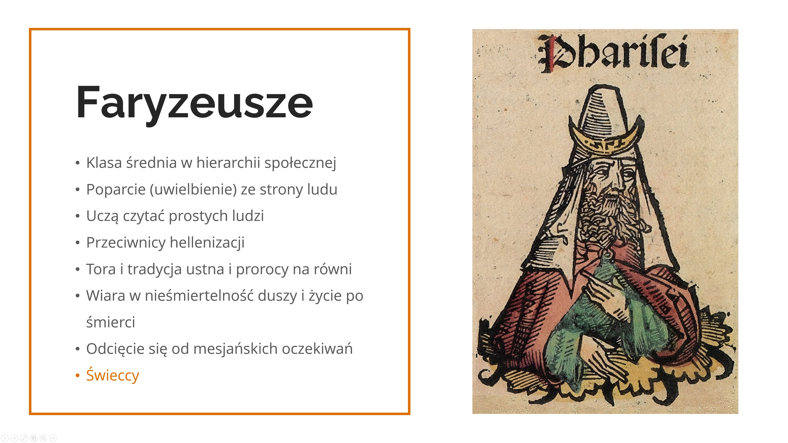

Encontro 1 - Tal como fui conhecido
***********************************

.. tags:: conteudo|abertura|Abertura, conteudo|igreja|Igreja, conteudo|comunidade|Comunidade, conteudo|relacoes|Relações, metodo|trabalho-com-imagem|Trabalho com imagem, metodo|trabalho-em-grupos|Trabalho em grupos, tipo|integracao|Integração

Introdução para o animador
==========================

O primeiro encontro de grupo tem a função de apresentação e integração, é o elo entre os outros pontos da sexta-feira - aprofunda os conteúdos da conferência e conduz à oração da noite. Seu objetivo mais importante é confrontar os participantes com o que significa a abertura na prática e compartilhar quais desafios estão associados a tal abordagem.

**No final deste esboço encontram-se os materiais para imprimir que serão necessários durante o encontro!**

Introdução
==========

Começamos com a oração - forma a critério do animador, com ênfase particular no pedido de abertura uns para com os outros. Se houver necessidade (participantes que não têm experiência de encontros de partilha em pequenos grupos), o animador apresenta brevemente o conceito dos encontros de grupo e discute as regras. Começamos compartilhando o que nasceu em nós ao ouvir a conferência, começamos imediatamente mergulhando e vivendo o conteúdo do retiro. A abertura está ligada ao desvelamento e à prontidão para ser ferido - é isso que acontece no espaço do pequeno grupo, ainda não nos conhecemos, não sabemos nada um do outro, mas queremos despertar em nós a abertura uns para com os outros. Ao responder às perguntas abaixo, pedimos que a pessoa se apresente, se alguém não quiser responder, que apenas se apresente.

* Que conteúdos da conferência ressoam mais com o que está acontecendo ultimamente na minha vida?
* Que perspectiva sobre a vivência deste retiro o que ouvi traçou para mim?
* Tenho no coração um desejo particular em relação a este retiro?

Fé aberta
=========

Maciej Biskup OP, em um de seus artigos, explicou a etimologia da palavra "Igreja" (em polonês "Kościół"):

    Uma Igreja sem coração é uma Igreja-fortaleza, um castelo fortificado. Literalmente, é isso que significa em polonês a palavra "kościół", que adotamos do tcheco (kostel), e o tcheco da palavra latina castellum (fortaleza). Enquanto isso, do grego (ekklesia), a Igreja significa a convocação do povo, que não se fecha em uma fortaleza, mas sai para o mundo com o coração aberto, para continuar a convocar, como ele mesmo foi convocado.

    -- ”A Igreja que tem coração” de 24.06.2022

* Qual é a minha experiência de Igreja?
* Que imagem me é mais próxima - a Igreja fortaleza ou a Igreja que é a convocação do povo saindo para o mundo?

Quando a Igreja foi enviada por Cristo aos quatro cantos do mundo para convocar todos ao seu Nome (Mc 16,15), começou a entrar em contato com novos costumes, novas culturas, novas correntes de pensamento que ultrapassavam o mundo interior do judaísmo da época, no qual o cristianismo nasceu. Cada encontro era uma oportunidade de encontrar pontos em comum para mostrar da forma mais simples possível a universalidade de Jesus para todos (Discurso de Paulo no Areópago - At 17,16-34). O ambiente impregnava-se do ensinamento dos Apóstolos, enquanto os novos crentes combinavam em si sua herança com o acervo da Boa Nova. Vemos em nossos tempos que a inculturação, isto é, a entrada do Evangelho na vida de diferentes povos, deixa bons frutos, mas exige um trabalho intenso para "conectar mundos". Podemos citar como exemplo diferentes Igrejas que criaram seus próprios costumes ao longo dos séculos:

Japão
    Os cristãos ocultos (Kakure-kirishitan) durante dois séculos de perseguições (séculos XVII-XVIII), para manter a tradição de viver a Eucaristia, apesar da falta de presbíteros, usavam arroz e saquê para celebrar a Ação de Graças em liturgias organizadas em comum. Atualmente, os padres, em vez de beijar o altar, curvam-se diante dele em sinal de maior respeito.

Egito
    Os cristãos desde os primeiros séculos usam o símbolo ankh como sinal de vida, de ressurreição. Nos dias de hoje, ele aparece nas estolas dos presbíteros e nas mãos dos cristãos tatuados.

Vendo a beleza das diferentes Igrejas, podemos nos perguntar: onde estava o germe dessa riqueza? Um dos primeiros protagonistas da conquista das pessoas para Cristo foi São Paulo, chamado o Apóstolo das Nações. Ele ia a toda parte e a todos para ganhar o maior número possível para o Evangelho. Ele confessa que, para ganhar as pessoas, "fez-se tudo para todos" (1 Cor 9, 20-22). Para ser um com o outro, ele fazia conscientemente a escolha de se adaptar ao outro, para que ele tivesse uma sensação de proximidade e de vínculo sendo criado.

* Com que frequência tento me colocar "no lugar de alguém" e ouvir o outro lado? O que é mais difícil para mim nisso?
* Você já ouviu em sua vida que sabe ouvir ou que "ouviu alguém"?
* Quando foi a última vez que você ficou mais tempo com alguém no ponto de ônibus, embora não conheça tão bem essa pessoa? Quando você fez por alguém 2000 passos em vez de 1000? (Mt 5,41)?

Jesus como Aquele que é aberto
==============================

Como vemos, a Igreja desde o início era mais diversa do que pode nos parecer. Diferentes movimentos, comunidades, carismas continuam a se interpenetrar e a se completar nela. No entanto, essa não é uma característica própria apenas da Igreja contemporânea, pois o mesmo acontecia com o judaísmo na época em que o Senhor Jesus ensinava. Olhemos agora brevemente para as diferentes facções judaicas que existiam então.

.. note:: O animador coloca as placas no meio, para que cada participante do encontro possa ver.

.. image:: saduceusze.jpg
   :align: center

.. image:: essenczycy.jpg
   :align: center

.. image:: zeloci.jpg
   :align: center

Após ler cada uma das descrições, o animador faz perguntas:

* Que reflexões nasceram em mim após ler as descrições das diferentes facções?

* O que o cristianismo assumiu de cada uma delas?

Os primeiros cristãos, assim como os saduceus, celebravam eles mesmos a Eucaristia, acreditavam na imortalidade como os fariseus, criavam comunidades e uma mística a exemplo dos essênios, e reconheciam a essência da liberdade pessoal como os zelotes. A abertura e o fato de beber dos outros estão inscritos em nossa fé pelo próprio Jesus Cristo. Supõe-se que alguns apóstolos eram representantes de facções particulares - o Evangelho nos dá, por exemplo, a informação sobre Simão, que tinha o apelido de "zelote" - em grego zelotes, o que pode indicar uma pertença aos zelotes, da mesma forma Judas é às vezes contado neste grupo. João Batista, devido ao seu modo de vida eremítico, é considerado por algumas fontes como um essênio, assim como seus discípulos que depois seguiram Jesus. Sabemos também que Nicodemos era fariseu.

* Que semelhanças vejo entre as facções da época e a Igreja de hoje?

O Messias queria ter em seu círculo mais próximo representantes de diferentes opiniões! Sua abertura aos outros manifestava-se também durante muitos encontros descritos nas páginas do Evangelho.

Leiamos agora alguns fragmentos de exemplo.

.. note:: Os participantes do encontro se dividem em pares, cada dupla recebe um dos fragmentos abaixo e toma conhecimento dele em silêncio.

Primeiro fragmento:

    | Jesus veio a saber que os fariseus tinham ouvido dizer que ele reunia mais discípulos e batizava mais que João. (Na verdade, não era o próprio Jesus que batizava, mas os seus discípulos.) Então Jesus deixou a Judeia e voltou para a Galileia. Precisava atravessar a Samaria. Chegou, pois, a uma cidade da Samaria, chamada Sicar, perto da propriedade que Jacó tinha dado a seu filho José. Havia ali o poço de Jacó. Jesus, cansado da viagem, sentou-se junto ao poço. Era por volta do meio-dia.
    | Veio uma mulher da Samaria tirar água. Jesus lhe disse: "Dá-me de beber". Os seus discípulos tinham ido à cidade comprar mantimentos. Disse-lhe a mulher samaritana: "Como é que tu, sendo judeu, pedes de beber a mim, que sou uma mulher samaritana?" (De fato, os judeus não se dão com os samaritanos.) Respondeu-lhe Jesus: "Se conhecesses o dom de Deus e quem é aquele que te diz: 'Dá-me de beber', tu lhe pedirias, e ele te daria água viva". Disse-lhe a mulher: "Senhor, não tens com que tirar água, e o poço é fundo. Onde tens, pois, essa água viva? Serás tu, porventura, maior que o nosso pai Jacó, que nos deu este poço, do qual ele mesmo bebeu e também os seus filhos e o seu gado?" Jesus lhe respondeu: "Todo aquele que bebe desta água terá sede de novo. Mas quem beber da água que eu lhe darei, esse nunca mais terá sede. E a água que eu lhe der se tornará nele uma fonte de água que jorra para a vida eterna". Disse-lhe a mulher: "Senhor, dá-me dessa água, para que eu não tenha mais sede, nem precise vir aqui tirá-la". Disse-lhe Jesus: "Vai chamar teu marido e volta aqui". A mulher respondeu: "Não tenho marido". Jesus lhe disse: "Disseste bem que não tens marido, pois tiveste cinco maridos, e o que tens agora não é teu marido; nisso falaste a verdade". Disse-lhe a mulher: "Senhor, vejo que és um profeta. Nossos pais adoraram neste monte, mas vós dizeis que é em Jerusalém o lugar onde se deve adorar". Jesus lhe disse: "Acredita-me, mulher: vem a hora em que nem neste monte, nem em Jerusalém adorareis o Pai. Vós adorais o que não conheceis; nós adoramos o que conhecemos, porque a salvação vem dos judeus. Mas vem a hora, e é agora, em que os verdadeiros adoradores adorarão o Pai em espírito e verdade; pois tais são os adoradores que o Pai procura. Deus é espírito, e aqueles que o adoram devem adorá-lo em espírito e verdade". A mulher lhe disse: "Sei que vem o Messias (que se chama Cristo). Quando ele vier, nos anunciará todas as coisas". Disse-lhe Jesus: "Sou eu, que falo contigo".

    -- Jo 4,1-26

Segundo fragmento:

    Tendo entrado em Jericó, Jesus atravessava a cidade. Havia ali um homem chamado Zaqueu, chefe de publicanos e rico. Procurava ver quem era Jesus, mas não podia por causa da multidão, pois era de pequena estatura. Correu então à frente e subiu num sicômoro para vê-lo, porque Jesus devia passar por ali. Quando Jesus chegou àquele lugar, levantou os olhos e disse-lhe: "Zaqueu, desce depressa, pois hoje devo ficar em tua casa". Ele desceu imediatamente e o recebeu com alegria. Aos verem isso, todos murmuravam, dizendo: "Ele foi hospedar-se na casa de um pecador!" Zaqueu, porém, de pé, disse ao Senhor: "Senhor, eis que eu dou a metade dos meus bens aos pobres, e se defraudei a alguém, restituo quatro vezes mais". Jesus lhe disse: "Hoje a salvação entrou nesta casa, porque também este é filho de Abraão. Pois o Filho do Homem veio procurar e salvar o que estava perdido".

    -- Lc 19,1-10

Terceiro fragmento:

    Partindo dali, Jesus retirou-se para a região de Tiro e Sidônia. E eis que uma mulher cananéia, vinda daqueles arredores, gritava: "Senhor, Filho de Davi, tem piedade de mim! Minha filha é cruelmente atormentada por um demônio". Mas ele não lhe respondeu palavra. Seus discípulos aproximaram-se e lhe pediram: "Manda-a embora, pois vem gritando atrás de nós". Ele respondeu: "Não fui enviado senão às ovelhas perdidas da casa de Israel". Mas ela veio prostrar-se diante dele, dizendo: "Senhor, socorre-me!" Ele respondeu: "Não é bom pegar o pão dos filhos e jogá-lo aos cachorrinhos". Ela disse: "Sim, Senhor, mas também os cachorrinhos comem as migalhas que caem da mesa de seus donos". Então Jesus lhe disse: "Ó mulher, grande é a tua fé! Seja feito como queres". E a partir daquela hora, sua filha ficou curada.

    -- Mt 15,21-28

Após a leitura em silêncio, cada dupla conta brevemente do que tratava seu fragmento. Em seguida, o animador faz perguntas:

* O que une todos esses encontros?
* Em que se manifestava a abertura de Jesus para com essas pessoas?

No contato com os outros, a origem, a profissão ou o sexo não tinham nenhuma importância para Jesus. Ele via antes de tudo o homem, não o que ele faz - não importa se alguém era pescador, cobrador de impostos, centurião. Cada um tinha em si um potencial, cada um era para Ele interessante de alguma maneira, Ele estava curioso por cada um.

Abertura e curiosidade
======================

A curiosidade está indissociavelmente ligada à abertura. Deus não está apenas fascinado por cada um de nós, Ele mesmo é Aquele que intriga - aparece na sarça ardente, na coluna de fogo ou na nuvem, Jesus por sua pessoa desperta interesse e espanto.

* O que me intriga pessoalmente mais em Deus?
* Quanto há ainda em mim de curiosidade sobre como Ele é?
* Qual é a minha experiência do mistério que atrai?

Às vezes aceitamos em nossa fé que algo já é tão óbvio, tão ouvido, que a necessidade de fazer perguntas deixa de nascer em nós. Da mesma forma com a atitude em relação às pessoas ao redor, conhecemos alguém de cor e supomos que não nos surpreenderá mais com nada, ou reconhecemos de antemão o que podemos esperar de alguém. A chave para a abertura é a curiosidade pela outra pessoa e pelo que ela pode trazer por si mesma à nossa vida.

* O que me ajuda a ser aberto?
* Com que frequência mostro aos outros meu interesse?
* O que me fascina mais frequentemente nas outras pessoas?

Leiamos para terminar:

    Este fragmento provém do final do Hino ao Amor de São Paulo - por enquanto não somos capazes nem de amar perfeitamente, nem de conhecer plenamente ou compreender o outro homem. No entanto, isso não significa que não devamos tentar. Daqui a pouco iremos para a oração da noite - não suponhamos imediatamente o que queremos que aconteça lá, na medida do possível tentemos nos livrar das expectativas e ter simplesmente em nós a abertura para o que Deus quer nos transmitir. Paremo-nos e despertemos em nós a curiosidade dirigida tanto Àquele diante de Quem estaremos, quanto às pessoas com quem rezaremos juntos. Deixemo-nos surpreender.

    -- 1 Cor 13,12
